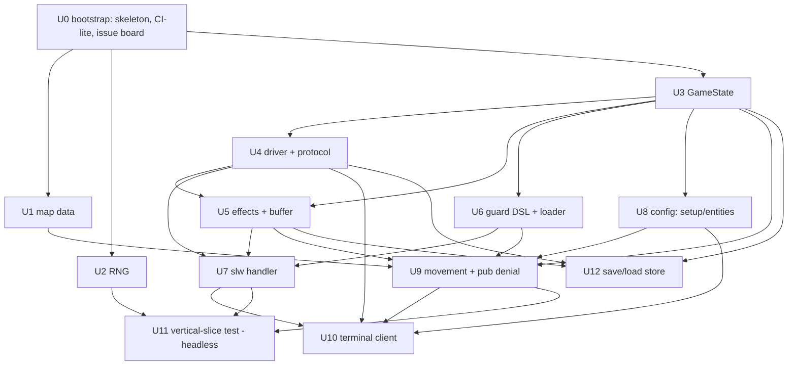

# First Vertical Slice - Plan

> **Product Contract preservation:** unchanged. The Product Contract below is the
> requirements-only artifact from `ce-brainstorm`, carried verbatim. `ce-plan` added the
> Planning Contract, Implementation Units, Verification Contract, and Definition of Done.
> One research finding since the brainstorm updates a *design note* (not product scope):
> the map decode is a **solved, reusable** task, not an open blocker — see KTD-1.

## Goal Capsule

**Objective.** Deepen `docs/design/` from a design that is "ready to build" in the large to
one that is *fully specced for the first vertical slice* — Phase 0 (core engine
contracts) + Phase 1 (playable terminal single-player slice). The slice's concrete target
is: new-game setup → map movement under the `ms` economy → enter the **slw**
(Schlupfwinkel/motel) location → its full menu → walk to **one guarded neighbor** and hit
a denied guard. This document records the design decisions that resolve the gaps blocking
that slice, so implementation does not have to re-derive game behavior or re-litigate
scope.

**Product authority.** `../research/` is the single source of truth for all game behavior
(formulas, values, decompiled BASIC). Where `docs/design/` prose disagrees with the research,
**the research wins** and `docs/design/` prose is treated as non-authoritative (see the
Corrections section). Every behavioral claim below is cited to `mf-prg.bas` line numbers.

**Open blockers.** None launch-blocking. The map-decode task the brainstorm flagged is
**solved and reusable**: `../research/tools/render_c64_assets.py::parse_screen_file()`
already byte-reverses `../research/src/karte` (the 2003-byte binary) into the exact
row-major 40×25 cell-code array. The location-placement table (41 tiles) is already
decoded in `data-structures.yaml:789–890`. U1 reuses this; it is a work unit, not a
blocker. Remaining forks are non-blocking Open Questions (cancellation mechanism,
door/street adjacency exactness).

**Stop conditions.** The slice is done when the seeded vertical-slice integration test
(Definition of Done) passes and the terminal client plays the loop end to end. Authority
order when sources conflict: `../research` (behavior) > this plan (how) > `docs/design/` prose.

---

## Product Contract

### Scope of the slice

**In scope (Phase 0 + Phase 1):**

1. **New-game setup**, faithful to BASIC `30 → gosub100/170/200/300`:
   - Inputs: end year `x9` (1928–1978), score weighting `x8` (0.1–2.0), player count `sz`
     (1–4), per-player name + gang name.
   - Per-player rolls: `kraft` / `intelligenz` / `brutalitaet` each `int(rnd*9)*5+10`
     → 10..50 in steps of 5 (`mf-prg.bas:350`); energy `en=5` (`:313`); starting cash
     `int(rnd*5)*500+5000` → **5000–7000$** (`:315`; the `peek(53247)=1 → 500000` branch is
     a debug/cheat detector, **not** normal play — do not port as gameplay).
   - Starting state: position `po=18`, rank `ra=1`, `nr=1` (`:220`); **vehicle defaults to
     index 0 = "fuesse" / on foot**, giving `ms = tr(0) = 25` per turn (never assigned at
     setup; array-zero default — port this explicitly).

2. **Map movement + `ms` economy**, faithful to BASIC `1012` and `2000–2060`:
   - `ms = tr(tm(sp))` replenished each turn (`:1012`); on foot = 25.
   - Deltas from keys `: ; @ /` → `x = -1,+1,-40,+40` (`:2015–2018`); `_` leaves (`:2019`).
   - Walkable gate: `peek(p)=156` (street); anything else blocks (`:2035`).
   - Cost: **1 ms per step** (`:2040`); **5 ms to enter a location** (`:2060`).
   - Turn ends when `ms<=0` (`:2005`, `:2060`), **and** handlers may force turn-end by
     setting `ms=0` (the plan's existing contract; e.g. `:12335`).
   - Location entry resolves `(la, ln)` from the tile via the `lc` routine (`:2050`);
     reconstruct as a data lookup (see Design notes).
   - The mid-move police interrupt (`:2041`, fires only `ra>3`) is **gated off** in the
     slice — the player starts at rank 1, so it never fires; no combat is needed.

3. **The slw location, FULL fidelity** (`mf-prg.bas:10000–10105`, entry prompt
   `'AH, EIN KUNDE! WAS WUENSCHT DER HERR?'`):
   - Menu dispatch `10005 onwgoto10010,10100` — three options: **1 rent a room**,
     **2 pay rent**, **3 leave**.
   - Option 1 guard: room free `uk(ln)=0`, else `'nichts mehr frei!'` (`:10010`).
   - Option 2 guard: you already live here `uk(ln)=sp`, else `'du wohnst hier nicht!'`
     with `nm=1` (`:10100`); tenant path re-enters the shared rent block (`:10105`).
   - Shared rent block (`:10020–10045`): quote `p=fnm(ln)`; input month count `x`;
     **`x<=0` cancels** (`nm=1: return`, `:10030`); insufficient cash `ka<x*p` → shared
     not-enough-money sub `1125` (`:10035`); else deduct `x*p`, set owner `uk(ln)=sp`,
     accrue `um(sp)+=x` (`:10040`).
   - Rent formula, verbatim: `115 deffnm(ln)=50-50*(ln=3or4)-100*(ln=1)`.

4. **Prove a denied guard** end-to-end: walk to a second location and hit an option whose
   guard fails at the slice's starting state, rendering its `on_denied` message with no
   effects committed. The *requirement* is guard-DSL + denial-path coverage, not a specific
   location — any real guarded option that denies at rank 1 satisfies it. **Concrete
   recommendation: pub recruit** (`:12100`, guards `ra>4` + owned room + gang<10; denied at
   rank 1 with `'als anfaenger kannst du noch keine eigenen leute haben!'`), because it
   composes with the tenancy slw establishes and needs no new location machinery. Only the
   *denied-guard render* is in scope; the option's handler body is Phase 2.

5. **Phase-0 contracts finalized** per `docs/design/` §8: interaction protocol + in-process
   synchronous driver; handler API contract (§5.2a); Engine↔Config contract + `engine_api`
   version (§6a); Event schema + determinism contract (§5.5).

6. **Save / load (event store), pulled into the slice** (`docs/design/` §5.5). `SaveGame`
   writes an append-only JSONL event log + latest per-turn snapshot; `LoadGame` restores the
   snapshot and fast-forwards remaining events to the exact `GameState` — including a
   suspended handler generator's position. This proves GameState + event serialization early,
   mid-slice, rather than retrofitting it in Phase 5. (Supersedes the earlier deferral; the
   determinism contract KTD-6 already made this additive.)

**Out of scope (deferred, unchanged from docs/design/):** combat and `StartCombat`; gambling
(sph) and gun shop (waf); wanted/police/jail; the remaining 9 locations and 2 map events;
WebSocket server; pygame client; codegen; second game-config.

### Decisions made in this brainstorm

- **slw fidelity = full + one guarded neighbor.** The first location proves the *real*
  machinery (multi-option menu, per-option guards, shared subroutines, cancel path,
  tenancy state), not a stub — so Phase 2 does not meet these cold. The guarded neighbor
  (pub, denied at rank 1) proves the guard DSL and denial-message path within the slice.

- **Negative rent (`fnm(ln=1) = -50$`) is authentic and reachable — port it verbatim.**
  Verified against the decoded location table: slw has a real tile at `ln=1`
  (`data-structures.yaml:842`, cell 122). So `fnm(1) = 50-0-100 = -50` *is* reachable — a
  player renting that tile is *paid* 50$/month. `fnm` is shared across locations by `ln`
  and was tuned for the non-slw cases; the negative at slw ln=1 is an original quirk. The
  behavioral-fidelity bar ("match the original's formulas exactly") requires reproducing
  it. **Carry it consciously**: record it as a documented known-quirk in the config's
  formula params, not a silent surprise. (No live-hardware run needed — the decoded
  research table already answers reachability.)

- **Cancellation mechanism: decide at driver-build time**, not now. slw's `x<=0 → nm=1:
  return` path (`:10030`) is the first concrete cancel site, so the decision is real and
  near — but it is best made with the buffer-then-commit effect semantics in front of you.
  The two candidates stand as in `docs/design/` §5.1: (a) raise `Cancelled` into the generator
  (`gen.throw`) with try/finally unwind + effect-buffer discard — recommended for
  uniformity; (b) a `CANCEL` sentinel Response the handler checks. The slice's effect model
  **must buffer per action so a cancel is atomic** regardless of which mechanism wins.

- **Map data: reconstruct the real map.** Extract and byte-reverse `src/karte.prg`
  (`screen[999-k] = file[k]`, `data-structures.yaml:17–33`) into a decoded 40×25 cell
  array; combine with the already-decoded 41-tile location table
  (`data-structures.yaml:789–890`) to resolve `(la, ln)` per door tile. This replaces the
  machine-code `sys lc` lookup (`:2050`) with plain config data. (A hand-authored stub map
  was rejected — the slice should walk the authentic city.)

- **Research is authoritative over design-doc prose.** Build behavior from `../research`;
  where `docs/design/` text conflicts, ignore the prose. The known conflicts are listed below
  so implementers recognize them; correcting the design docs is a **separate later pass**,
  not part of the slice.

### Corrections — design-doc prose that contradicts the research

These are **known** discrepancies. Research wins; do not implement the plan's wording.

1. **`x8` is a score-gain weighting (0.1–2.0), not a "difficulty multiplier" and not
   "×8".** `docs/design/` §3.6 calls it "the game's difficulty multiplier (0.1–2)"; it is
   applied only as `gf(sp) = gf(sp) + x*x8` (`:1160`). There is no separate difficulty
   input and no ×8 factor. Setup takes exactly `x9` (end year) and `x8` (score weight).

2. **slw is a 3-option menu with tenancy state, not "rent input loop, money; no combat"
   alone.** `docs/design/` §8's one-line framing undersells it: options are rent / pay-rent /
   leave, with a room-free guard, a live-here guard, shared rent subroutine, the shared
   not-enough-money sub, tenancy ownership `uk(ln)`, and months-accrued `um(sp)`.

3. **Door tile code is 160, walkable street is 156 — they are different.** slw door tiles
   carry `karte_code: 160`; movement gates on `=156` (`:2035`); the `lc` routine matches a
   location by *address*. The "step onto street 156 adjacent to a door, `lc` resolves the
   location" interplay is spread across `data-structures.yaml` and `:2035/:2050` — verify
   it as one flow when wiring entry (it is the least-consolidated behavior in the slice).

### Success criteria / acceptance signals

- A seeded single-player run: **setup → walk the real map → enter slw → rent a room
  (cash deducted, `uk`/`um` updated) → attempt pay-rent and rent-when-occupied guards →
  cancel with `0` months (no effects committed) → leave → walk to pub → recruit denied at
  rank 1** — asserting the full state trajectory and the exact interaction sequence
  (mirrors `docs/design/` §10's vertical-slice test, scoped to the slw slice).
- `fnm` unit test includes `fnm(1) == -50` as an asserted, documented value.
- Setup unit test asserts starting cash ∈ {5000,5500,6000,6500,7000}, `en=5`, stats ∈
  {10,15,…,50}, `po=18`, `ra=1`, on-foot `ms=25`.
- Guard-DSL check: slw's two guards and pub-recruit's guard are all expressible in the
  depth-2 / no-NOT condition DSL.

### Assumptions (record, revisit if wrong)

- **A1.** The negative-rent quirk has no downstream corrective (nothing clamps `fnm` to
  ≥0 before charging). BASIC `:10035/:10040` charges `x*p` directly with no floor — so a
  negative `p` credits the player. Assumed intended-as-is; port verbatim.
- **A2.** `um(sp)` (months accrued) and `nm` (abort flag) have no *consumption* inside the
  slw slice — they feed the turn/apartment economy that is out of scope. The slice sets
  them faithfully but nothing in-slice reads them; deferring their consumers is safe.
- **A3.** Gating the police interrupt (`:2041`) purely on `ra>3` is sufficient to keep the
  slice combat-free (player starts at rank 1). No other slice path can raise rank.

---


## Outstanding Questions

Non-blocking; recorded so the implementer resolves them at the right unit, not now.

- **Cancellation mechanism (a `gen.throw` vs b `CANCEL` sentinel)** — deferred to U4
  (driver). The atomic buffer-then-commit requirement is fixed regardless of which wins.
- **Door/street adjacency exactness** — the one behavior spread across files
  (Correction 3). Resolve inside U1/U9 by reading `mf-prg.bas:2035` and `:2050` together;
  likely a 1-tile adjacency between a `156` street cell and a `160` door address, but
  confirm against the decoded array.

---

## Planning Contract

This plan builds the engine spine (Phase 0) and the first playable slice (Phase 1) per
`docs/design/` §8. The engine is genre-generic; all Mafia specifics live in
`data/game_configs/mafia_1920s`. Every behavioral value ports from `../research` with a
cited `mf-prg.bas` line; the oracle skill gates any claim before porting.

### Key Technical Decisions

**KTD-1 — Map decode reuses the research tool; it is not new binary parsing.**
`../research/tools/render_c64_assets.py::parse_screen_file()` already returns the
row-major, byte-reversed 40×25 `screen_codes[1000]` array from `../research/src/karte`
(reversal `screen = data[:1000][::-1]`, verified at `render_c64_assets.py:113–119`). U1
reuses that exact reversal to emit the map as committed config data. **The decoded array
is committed into the config as a build artifact** (Open-Question resolution) so the
runtime has no binary-parsing dependency: a one-shot `tools/` script reads `src/karte`
via the same reversal and writes `content/map/city.yaml`. Combine with the decoded
41-tile location table (`data-structures.yaml:789–890`) to resolve door→`(la, ln)`.

**KTD-2 — Cancellation is a driver concern, chosen at U4, with atomic effect buffering
fixed now.** Effects apply through a per-action **buffer that commits only on clean handler
completion**; any cancel (BASIC `x=0 → return`) discards the buffer, so no partial state
lands. This buffer exists regardless of mechanism (a) `gen.throw(Cancelled)` or (b) a
`CANCEL` sentinel. Recommend (a) for uniformity; U4 finalizes. This is the single design
fact that must be right before slw's rent handler (U7) is written.

**KTD-3 — Interactions vs. Effects are separate types (`docs/design/` §5.1/§5.2).**
Interactions (`ShowMessage`, `PromptInt`, `PromptChoice`, `Confirm`) suspend the handler to
ask the client; Effects (`money_change`, `stat_change`, `flag_set`, `ms_change`, `teleport`,
…) mutate state and double as replay events. Handlers never mutate state directly. The slice
needs the four interaction types above and the effect subset the slw + movement paths touch;
`StartCombat`/`LoadSubState` are stubbed as unimplemented (combat is out of scope).

**KTD-4 — RNG is seedable and logged from U2.** One `rng.hit(a,b)` / `rng.range(n)` source;
every draw recordable. Behavioral fidelity means matching the original's *probabilities*,
not its draw order — so setup rolls and `fnm` are tested against value distributions/exact
values, not a byte-for-byte C64 trace.

**KTD-5 — Strings are externalized as `(key, params)` from the start.** Handlers emit keys
(`system.slw.no_room`, `system.slw.rent_quote`, …); the terminal client's theme resolves
them from `themes/classic/strings/`. Zero display strings in `engine/`. German source
strings from `location-dialogue.yaml` seed the classic theme verbatim.

**KTD-6 — Event schema + store both in-slice (`docs/design/` §5.5).** Effects carry a schema
`version` and are pure data; a game is `initial seed + setup + ordered Event log`. The
event store (JSONL log + snapshot) is **built in this slice** at U12, not deferred — so
GameState/event serialization is proven early. Replay = load snapshot, re-apply the log,
reproduce the exact `GameState` including a suspended handler generator's position. RNG
draws are themselves logged events, so replay does not re-roll.

**KTD-7 — Shared helpers must go through the handler API (§5.2a).** The ported BASIC
subroutines (not-enough-money `1125`, `Confirm` `1110`, key-press pause `1100`, gangster-
picker `1130`, score update `1160`) are engine helpers that handlers reach **only** via the
§5.2a surface: `yield <Interaction>`, `ctx.apply(<Effect>)`, `ctx.rng`, read-only
`ctx.state`. A helper never mutates state directly or reaches engine internals — this is
what keeps handlers portable across `engine_api` versions.

**KTD-8 — Validation ownership is fixed and single-owner.** Each input class has exactly
one validator so no layer double-validates:
- **Input type/range** (`PromptInt` bounds, non-numeric) → the **driver** re-prompts;
  handlers receive only a valid value or Cancel (§5.1).
- **Menu option availability** (guards) → the **shell/loader** (U6) evaluates guards and
  emits the `on_denied` key; handlers are never entered for a denied option.
- **Movement legality** (walkable `156`, bounds, `ms` cost) → the **turn/movement system**
  (U9), not the handler and not the client.
- **Business preconditions** (e.g. `ka<x*p`) → the **handler**, via the not-enough-money
  helper.
- The **terminal client (U10) validates nothing** — it renders and relays; the driver and
  engine own every rule.

### Sequencing

Bootstrap (U0) → foundation (U1–U6) → slice behavior (U7–U9) → headless integration proof
(U11) → client (U10) and save/load (U12). U0 sets up the workspace, CI-lite runner, and
tracking board and gates everything after it. U1 (map data) and U2 (RNG) then have no deps
beyond U0 and could run in parallel (they run serially here per § Execution Workflow); U12
(save/load) needs only U3/U4/U5 and can land any time after the effect buffer. The
interaction driver (U4) is the critical-path spine everything else depends on.
**Playability is headless:** U11 proves the full slice through the driver with no client, so
U10 is a renderer over a proven protocol, never a gate on the slice working.

### Sources & implementer notes

- **`lc` replacement (U1/U9).** Model door→location as a table keyed by cell index →
  `(la, ln)` from `data-structures.yaml:789–890`. slw tiles: 122(ln1), 180(ln2), 406(ln3),
  666(ln4), 811(ln5). Movement gates on street `156`; entry fires when the player steps onto
  a street cell adjacent to a door the table knows (confirm adjacency at `mf-prg.bas:2035`
  and `:2050` — the Open Question).
- **Shared BASIC subroutines → engine helpers (U4/U7)** (`docs/design/` §5.1): not-enough-money
  `1125`, `Confirm` `1110`, gangster-picker `1130`, score update `1160`, key-press pause
  `1100`. The slice needs at least `1125` and `1100`.
- **Map binary format** (`data-structures.yaml:17–33`): 2003 bytes = 1000 screen codes +
  1000 color + 3 tail; reversed per `screen[999-k]=file[k]`. Decode handled by KTD-1's
  reused function — do not re-derive the byte math.

### Planning assumptions

- **A4.** `../research` remains a readable sibling at `../research/` at build time (U1 reads
  `src/karte` and the pass-2 YAMLs). If the engine must be self-contained, U1's committed
  `city.yaml` + entity YAMLs make the runtime independent of `../research` after build.
- **A5.** `pytest` + `pyproject.toml` are the tooling (per `CLAUDE.md`); Python ≥3.11 for
  `Generator` typing and `match`. Confirm the exact minor at U3.

---

## High-Level Technical Design

The engine is one nested lifecycle (`docs/design/` §5.0); the driver (U4) is the spine every
runtime path flows through. Unit dependency and the runtime nesting:



Runtime nesting the slice exercises (combat level present but stubbed):

```
Game FSM  (setup → main loop, sp cycle, ms replenish)          U3, U8, U9
└─ Player turn   (ms economy; ends on ms<=0 or ms=0 forced)    U9
   └─ Location visit (map entry resolves la/ln)                U1, U6, U9
      └─ Handler generator (yields interactions, ctx.apply)    U7
         └─ Interaction ↔ one terminal screen state            U4, U10
```

---

## Unit Index

| U-ID | Title | Key files | Depends on |
|---|---|---|---|
| U0 | Project bootstrap — skeleton, CI-lite, issue board, agent conventions | `pyproject.toml`, `Makefile`, `docs/AGENTS.md`, skeleton | — |
| U1 | Decode + commit city map | `tools/decode_city_map.py`, `content/map/city.yaml` | U0 |
| U2 | Seedable logged RNG | `engine/rng.py` | U0 |
| U3 | GameState dataclasses | `engine/state/` | U0 |
| U4 | Interaction driver + protocol | `engine/interactions.py` | U3 |
| U5 | Effect API + buffer | `engine/effects.py` | U3, U4 |
| U6 | Guard DSL + shell loader | `engine/conditions.py`, `engine/locations.py` | U3 |
| U7 | slw handler + shell + strings | `engine/handlers/slw.py`, `content/locations/slw.yaml` | U4, U5, U6 |
| U8 | Config: setup/entities/api | `config.yaml`, `entities/` | U3 |
| U9 | Movement + turn + pub denial | `engine/state/`, `content/locations/pub.yaml` | U1, U3, U5, U6, U8 |
| U10 | Terminal client + strings | `clients/terminal/` | U4, U7, U8, U9 |
| U11 | Vertical-slice integration test (headless) | `tests/test_slice_integration.py` | U1–U9 |
| U12 | Save/load — event store + snapshot | `engine/persistence.py` | U3, U4, U5 |

---

## Execution Workflow

**Shape: one orchestrator, one subagent at a time (serial).** A single orchestrator agent
owns the architecture and the whole run; it implements nothing large itself. For each unit
it dispatches **one** implementation subagent, integrates the result, then dispatches the
next. Never more than one subagent in flight. This keeps the orchestrator's context spent on
the cross-cutting decisions (the interaction protocol, the effect buffer / cancellation
semantics, the handler-API boundary, the event schema) rather than on per-unit
implementation detail.

### Orchestrator responsibilities (keeps in its own context)

- The KTDs and the contracts they encode — **KTD-2** (atomic effect buffer + cancellation),
  **KTD-3** (Interactions vs. Effects), **KTD-6** (event schema/store), **KTD-7** (handler-API
  boundary), **KTD-8** (validation ownership). These are the "important architectural stuff"
  and must not be delegated.
- The dependency order and which unit is next (see Serial order below).
- Integrating each subagent's returned diff: review against the unit's `Files:` and scope,
  run the relevant tests (`make check`), fix on a green tree, and commit (conventional message
  from the unit Goal). The orchestrator owns all commits; subagents never commit.
- The tracking board (stood up in **U0**): the orchestrator reads `gh issue list` to pick the
  next unit (earliest in the serial order whose dependency issues are all closed), and closes
  a unit's issue when its commit lands green. If the remote was declined at U0, the same
  bookkeeping happens in `docs/PROGRESS.md`.
- Reconciling anything that touches a shared contract. If a subagent's work would change an
  Interaction/Effect type, the handler-API surface, `GameState` shape, or the event schema,
  the orchestrator makes that call itself and re-briefs — it does not accept a contract
  change blind.

### Subagent responsibilities (fresh context per unit)

- Receives a **bounded packet**, not the whole plan: the Goal Capsule, the target unit's
  full section (Goal/Files/Approach/Execution note/Patterns/Test scenarios/Verification),
  the KTDs that unit cites, and the relevant Verification-Contract lines. Plus the specific
  research citations the unit names (e.g. the `mf-prg.bas` line block, `parse_screen_file`
  for U1).
- Implements the unit following the plan's conventions, honoring its `Execution note`
  (proof-first where stated), writing the enumerated test scenarios plus any missing
  category coverage.
- Runs its **own** unit tests as a self-check; must **not** `git add`/commit or run the full
  suite (the orchestrator owns those).
- Returns: the file paths it changed, its verification evidence (tests added, red-before-green
  observed where applicable, run results), and any contract friction it hit so the
  orchestrator can reconcile.

### Serial order

Respects every dependency in the Unit Index; the headless slice (U11) lands as soon as its
inputs exist so the done-signal fires early, then save/load and the client follow:

```
U0 → U3 → U2 → U1 → U4 → U5 → U6 → U8 → U7 → U9 → U11 → U12 → U10
```

- **U0 first** — bootstrap the workspace, CI-lite runner, and issue board so the loop below
  has a place to run and a durable board to track against. Nothing else starts until `make
  check` is green on the skeleton and U1–U12 exist as issues.
- **U3 next** — `GameState` unblocks almost everything.
- **U4 before U5/U7** — the driver and its effect buffer are the spine; the orchestrator
  should personally settle the cancellation mechanism (KTD-2) when U4 is briefed, since U5
  and U7 inherit it.
- **U11 right after U9** — the headless vertical slice proves the loop end-to-end; treat a
  green U11 as the slice's acceptance gate.
- **U12 and U10 last** — save/load and the terminal client are additive over a proven core
  (U10 is a renderer, not a gate on playability).

### Loop

```
orchestrator: run U0 (skeleton, make check green, remote+issue board, docs/AGENTS.md)

for unit in [U3,U2,U1,U4,U5,U6,U8,U7,U9,U11,U12,U10]:
    orchestrator: pick next unit = earliest in order whose dep issues are all closed (gh issue list)
    orchestrator: assemble bounded packet (unit section + cited KTDs + research refs)
    dispatch ONE subagent  →  implement + self-test, return diff + evidence
    orchestrator: review against Files/scope → run `make check` → fix on green
    orchestrator: commit (message from unit Goal); close the unit's issue
    # next unit only after the tree is green, committed, and the issue is closed
```

Abort/adjust criteria: if a subagent's diff spills beyond its `Files:` into a shared
contract, the orchestrator stops, makes the architectural decision itself, and re-dispatches
a tightened packet rather than accepting the drift.

---

## Output Structure

Greenfield. Expected layout after the slice (per `docs/design/` §9, scoped to what these units
create):

```
engine/
├── __init__.py
├── rng.py                    # U2
├── state/                    # U3  GameState + subsystem dataclasses
│   └── __init__.py
├── effects.py                # U5  typed Effect API + buffer
├── interactions.py           # U4  Interaction/Response types + driver
├── conditions.py             # U6  guard DSL evaluator
├── locations.py              # U6  YAML shell loader + HANDLERS registry
├── persistence.py            # U12 event store (JSONL log + snapshot) + save/load
└── handlers/
    └── slw.py                # U7  slw generator handlers
clients/
└── terminal/                 # U10 thin renderer + input
    └── __init__.py
data/game_configs/mafia_1920s/
├── config.yaml               # U8  engine_api, entities, formula params
├── content/
│   ├── map/city.yaml         # U1  committed decoded 40×25 array + door table
│   ├── locations/slw.yaml    # U7  menu shell + guards
│   └── locations/pub.yaml    # U9  menu shell + one guarded option
├── entities/                 # U8  vehicles, ranks, starting-stat params
└── themes/classic/strings/   # U8  German string templates
tools/
└── decode_city_map.py        # U1  one-shot: src/karte -> city.yaml
tests/                        # U0–U12 (pytest); test_bootstrap.py from U0
pyproject.toml                # U0  Python ≥3.11, pytest config
Makefile                      # U0  make test / lint / check (CI-lite)
docs/
└── AGENTS.md                 # U0  orchestrator/subagent protocol + conventions
```

U0 also creates the `origin` GitHub remote (private, gated on user confirm) and one tracking
issue per unit U1–U12; those are workflow state, not files in the tree.

Per-unit `**Files:**` remain authoritative; the implementer may adjust layout.

---

## Implementation Units

### U0. Project bootstrap — workspace, tracking board, and agent conventions

**Goal.** Put the greenfield repo and the *repeating* execution workflow into a known,
self-onboarding state **before any feature unit runs**, so every later orchestrator/subagent
session starts from the same ground: a buildable skeleton, a uniform green-tree check, a
durable per-unit tracking board, and a written protocol a fresh agent can read to pick up the
next unit. This is a one-time setup unit; it ships no game behavior.

**Why first.** The Execution Workflow assumes a place to run (`pytest` target, package tree)
and a durable record of which of U1–U12 is done/blocked/in-progress that survives context
resets. Neither exists yet (the repo is docs-only, no `pyproject.toml`, no git remote). U0
creates both so the loop in § Execution Workflow can reference a live board instead of
re-deriving state from `git log` each session.

**Dependencies.** None. Runs before U1.

**Files.**
- `pyproject.toml` — Python ≥3.11, `pytest` config (test path `tests/`), package metadata.
  *(Moved here from U3, which now owns only `GameState`.)*
- Directory skeleton with package markers: `engine/__init__.py`, `engine/state/__init__.py`,
  `engine/handlers/__init__.py`, `clients/__init__.py`, `clients/terminal/__init__.py`,
  `tests/__init__.py`, and the config tree `data/game_configs/mafia_1920s/{content/{map,locations},entities,themes/classic/strings}/`
  (`.gitkeep` where a dir is otherwise empty). Matches the § Output Structure tree.
- `Makefile` (or `justfile`) — one-command **CI-lite** targets the orchestrator uses uniformly
  across every unit: `make test` (→ `pytest`), `make lint` (ruff or equivalent, if adopted),
  `make check` (test + lint = the green-tree gate).
- `docs/AGENTS.md` — the **agent working-conventions doc**: the one-orchestrator/one-subagent
  protocol (cross-referenced to § Execution Workflow), commit-message convention, "how to pick
  up the next unit" (read the issue board → next unblocked unit in serial order), the
  green-tree rule (never dispatch on a red tree), and the branch/worktree convention chosen
  below. A fresh session reads this file first and is oriented.
- `tests/test_bootstrap.py` — a smoke test that imports each top-level package and asserts
  `make test` has a real target to run (proves the skeleton is import-clean and the runner
  works before any real unit lands).

**Approach.**
1. **Skeleton + tooling.** Create the tree and `pyproject.toml`; confirm the exact Python
   minor (A5). `make test` must go green on the empty skeleton via `tests/test_bootstrap.py`.
2. **Branch/worktree convention.** Record it in `docs/AGENTS.md` and follow it from U1 on:
   feature branch `feat/vertical-slice` off `main` is the default; per-unit worktrees are the
   escalation if units are ever parallelized (they are serial per § Execution Workflow, so a
   single feature branch is the baseline). The orchestrator commits each unit to this branch.
3. **GitHub remote + issue board (durable tracking).** `gh` is authenticated but **no remote
   exists yet** — creating and pushing a repo is an outward-facing action.
   - **Execution-time gate (required):** pause and get explicit user confirmation before
     `gh repo create`. Default to a **private** repo (`--private`); do not publish public
     without a yes. If the user declines a remote at execution time, fall back to a committed
     `docs/PROGRESS.md` checkbox board (same unit list, same status semantics) so tracking is
     still durable — the rest of U0 is unchanged.
   - On confirm: `gh repo create <name> --private --source=. --remote=origin --push`.
   - Open **one issue per unit U1–U12** (title = the unit's U-ID + Goal one-liner). Apply
     dependency labels from the Unit Index (`dep:U3`, `dep:U4`, …) and a `unit` label. The
     issue body links to the unit's plan section. This is the orchestrator's live board:
     `gh issue list` shows what's open; the orchestrator closes an issue when that unit's
     commit lands green.
4. **Wire the loop to the board.** `docs/AGENTS.md` states the ordering rule explicitly: the
   next unit is the earliest unit in the serial order whose dependency issues are all closed.

**Test scenarios.**
- `make test` (→ `pytest`) exits green on the bare skeleton (`tests/test_bootstrap.py`).
- Every top-level package (`engine`, `engine.state`, `engine.handlers`, `clients.terminal`)
  imports without error — the skeleton is import-clean.
- `Test expectation: setup/scaffolding unit` — the GitHub-remote + issue-board steps are
  infrastructure actions verified by inspection (`git remote -v` shows `origin`;
  `gh issue list` shows 12 unit issues), not by pytest.

**Verification.** `make check` is green on the skeleton; `git remote -v` shows `origin` (or,
if the remote was declined, `docs/PROGRESS.md` holds the 12-unit board); `gh issue list`
enumerates U1–U12 with dependency labels; `docs/AGENTS.md` documents the protocol, commit
convention, branch convention, and next-unit rule.

### U1. Decode and commit the city map

**Goal.** Produce the committed 40×25 city map (walkable codes + door→`(la, ln)` table) as
config data, reusing the research decode.
**Requirements.** Advances the "reconstruct the real map" decision and R-scope item 2 (map
movement) by supplying its data.
**Dependencies.** None.
**Files.** `tools/decode_city_map.py`, `data/game_configs/mafia_1920s/content/map/city.yaml`,
`tests/test_map_decode.py`.
**Approach.** Port the reversal from `../research/tools/render_c64_assets.py:113–119`
(`data[:1000][::-1]`) to read `../research/src/karte` into a row-major 40×25 code array.
Merge the decoded 41-tile location table (`data-structures.yaml:789–890`) to emit, per door
cell, `{cell, la, ln}`. Write both into `city.yaml` (a plain array + a door lookup). Mark
walkable = code `156`; door cells carry code `160`. slw doors: cells 122/180/406/666/811 →
ln 1..5.
**Patterns to follow.** `parse_screen_file()` in the research tool — reuse its reversal and
the `SCREEN_FILE_SIZE`/`SCREEN_CODES` constants; do not re-derive the byte math.
**Test scenarios.**
- Decoded array is exactly 1000 cells; `city.yaml` round-trips to a 40×25 grid.
- The five slw door cells resolve to `la=1`, `ln ∈ {1,2,3,4,5}` respectively.
- At least one cell is code `156` (walkable) and the slw door cells are code `160`.
- Special cells 569 and 861 are present and flagged (event flows la=13/14), even though
  their handlers are out of scope.
**Verification.** `city.yaml` exists, loads, and the door lookup answers slw and pub tiles.

### U2. Seedable, logged RNG

**Goal.** The single nondeterminism source for the whole engine.
**Requirements.** KTD-4; determinism contract (KTD-6).
**Dependencies.** None.
**Files.** `engine/rng.py`, `tests/test_rng.py`.
**Approach.** `hit(a, b)` and `range(n)` over a seeded generator; every draw appended to an
in-memory log (list of draws) so replay is additive later. Match the original's
*probabilities*, not draw order.
**Test scenarios.**
- Same seed → identical draw sequence across two instances.
- `hit`/`range` outputs fall in the documented bounds over N draws.
- The draw log records every call in order.
**Verification.** Seeded determinism test passes; log length equals call count.

### U3. GameState dataclasses

**Goal.** The modular `GameState` subset the slice touches. *(Project tooling —
`pyproject.toml`, pytest, the package skeleton — is stood up in **U0**, not here.)*
**Requirements.** `docs/design/` §4 GameState; slice setup + movement + slw.
**Dependencies.** U0 (skeleton + tooling exist). U2 imported later.
**Files.** `engine/state/__init__.py`, `tests/test_state.py`.
**Approach.** Dataclasses for `Player` (ka, gf, rank/nr, po, vehicle, ms), `Gangster`
(stats), `map` (grid, tenancy `uk` per tile, `um` per player), `clock` (ja, x9, sp, sz),
`config` (x8, action costs, formula params). Apply the naming gotchas from `CLAUDE.md`:
rename debt `kr(sp)` away from the gangster `kraft` stat; keep per-player bitfields distinct
from global flags. `x8` is the **score-gain weight (0.1–2.0)**, not a difficulty ×8
(Correction 1). Combat/wanted subsystems present as empty stubs.
**Test scenarios.**
- A default `GameState` constructs with the documented starting fields.
- Debt and `kraft` are separately addressable (no name collision).
- `Test expectation: happy-path construction only` for stub subsystems.
**Verification.** `pytest` runs; `GameState` imports cleanly.

### U4. Interaction protocol + in-process synchronous driver

**Goal.** The spine: Interaction/Response types and the driver that turns `yield`s into
screen states and `.send()`s responses back. Finalize the cancellation mechanism (KTD-2).
**Requirements.** `docs/design/` §5.1; KTD-2, KTD-3.
**Dependencies.** U3.
**Files.** `engine/interactions.py`, `tests/test_driver.py`.
**Approach.** Types `ShowMessage`, `PromptInt` (driver-enforced range/type re-prompt),
`PromptChoice`, `Confirm`; `StartCombat`/`LoadSubState` declared but raise
`NotImplementedError` (out of scope). Driver advances a `Generator[Interaction, Response,
list[Event]]`, validates `PromptInt` before `.send()`, and implements the atomic
effect-buffer commit/discard (works with the effect API in U5). Pick cancellation (a) or
(b); wire the buffer discard on cancel.
**Execution note.** Start with a failing driver test for the scripted request/response
contract before implementing advance/send.
**Test scenarios.**
- Driver runs a scripted handler: emitted interaction sequence matches expectation; final
  Events returned.
- `PromptInt` re-prompts on out-of-range and non-numeric input without re-entering the
  handler.
- Cancel (0 at a cancellable `PromptInt`) unwinds the handler and commits **zero** effects
  (the atomicity check).
- `Confirm` yields bool; `PromptChoice` yields the chosen id/index.
**Verification.** Driver test suite green; cancel leaves state unchanged.

### U5. Effect API + buffered application

**Goal.** Typed, serializable Effects that mutate `GameState` and double as replay events.
**Requirements.** `docs/design/` §5.2/§5.5; KTD-3, KTD-6.
**Dependencies.** U3, U4.
**Files.** `engine/effects.py`, `tests/test_effects.py`.
**Approach.** Implement the slice subset: `money_change`, `stat_change`, `score_change`,
`flag_set`, `ms_change`, `teleport`. Each is pure data with a schema `version`; `apply` is a
pure `(state, effect) -> state`. Effects flow through the U4 buffer; `ctx.apply` enqueues.
Remaining effect types (`wanted_change`, `energy_change`, `jail`, `spawn_fighter`) are
defined but exercised later.
**Test scenarios.**
- `money_change(-x)` deducts exactly x; `apply` is pure (no aliasing).
- `ms_change` and `teleport` update position/movement as documented.
- Buffered effects commit atomically on success, discard on cancel (integration with U4).
- `Covers` the cancel-atomicity requirement jointly with U4.
**Verification.** Effect unit tests pass; buffer commit/discard proven.

### U6. Guard DSL evaluator + YAML location-shell loader

**Goal.** Evaluate menu guards and load location shells + the HANDLERS registry.
**Requirements.** `docs/design/` §5.2 guard DSL; R-scope items 3/4 (slw + guarded neighbor).
**Dependencies.** U3.
**Files.** `engine/conditions.py`, `engine/locations.py`, `tests/test_conditions.py`,
`tests/test_locations.py`.
**Approach.** DSL operators `= != >= <= > < in`; connectives `and`/`or`; nesting depth ≤2;
**no NOT**. Loader parses a location YAML (key, options with `guard`/`on_denied`/`handler`
or a flat `consequences[]`), resolves handlers by string id from a registry, and owns menu
render, guard eval, denial message, and `ms` bookkeeping.
**Test scenarios.**
- Each operator and both connectives evaluate correctly at depth 1 and 2.
- A denied guard returns the `on_denied` key and commits no effects.
- slw's two guards (`uk(ln)=0`, `uk(ln)=sp`) and pub-recruit's guard (`ra>4` and room and
  gang<10) all express in the DSL (the cross-check gate from `docs/design/` §10).
- A flat `consequences[]` option (leave: `ms_change -5`) resolves without a handler.
**Verification.** Guard + loader suites pass; the three real guards parse and evaluate.

### U7. slw location — full handler + shell + strings

**Goal.** Port slw verbatim: rent / pay-rent / leave, guards, shared rent block, cancel,
tenancy, negative rent.
**Requirements.** R-scope item 3 (full slw); Corrections 1–2; A1 (negative rent).
**Dependencies.** U4, U5, U6.
**Files.** `engine/handlers/slw.py`,
`data/game_configs/mafia_1920s/content/locations/slw.yaml`,
`data/game_configs/mafia_1920s/themes/classic/strings/slw.yaml`, `tests/test_slw.py`.
**Approach.** Port `mf-prg.bas:10000–10105`. Menu = rent(1)/pay-rent(2)/leave(3). Rent block
`10020–10045`: quote `p=fnm(ln)` where `fnm(ln)=50-50*(ln=3 or 4)-100*(ln=1)`; `PromptInt`
months; `x<=0` cancels (KTD-2); `ka<x*p` → not-enough-money helper; else
`money_change(-x*p)`, set tenant `uk(ln)`, accrue `um(sp)+=x`. Guards: rent needs
`uk(ln)=0`; pay-rent needs `uk(ln)=sp`. **`fnm(1)=-50` ports verbatim** and is recorded as a
documented known-quirk in `config.yaml` formula params (A1). Strings emit keys; German
verbatim text from `location-dialogue.yaml` seeds `strings/slw.yaml`.
**Test scenarios.**
- Rent 2 months at a positive-rent tile deducts `2*p`, sets `uk`, adds 2 to `um`.
- `fnm(1) == -50`: renting the ln=1 tile *credits* the player `-x*p` (negative deduction) —
  asserted, with the quirk noted.
- Rent when room occupied → denied via `uk(ln)=0` guard, no effects.
- Pay-rent when not resident → denied via `uk(ln)=sp` guard, no effects.
- Cancel with 0 months → returns to menu, zero effects committed.
- Insufficient cash → not-enough-money message, no deduction.
**Verification.** slw handler suite green; all four navigation paths and the negative-rent
value proven.

### U8. Config assembly: setup, entities, formula params, engine_api

**Goal.** The `mafia_1920s` config that new-game setup and slw read: starting values,
vehicles, ranks, `fnm` params, `engine_api` version.
**Requirements.** R-scope item 1 (setup); Engine↔Config contract (`docs/design/` §6a).
**Dependencies.** U3.
**Files.** `data/game_configs/mafia_1920s/config.yaml`,
`data/game_configs/mafia_1920s/entities/*.yaml`, `tests/test_setup.py`.
**Approach.** Setup ports `mf-prg.bas:100/170/200/300`: inputs `x9` (end year 1928–1978),
`x8` (0.1–2.0), player count 1–4, names; per-player rolls `int(rnd*9)*5+10` → {10..50 step
5}, energy 5, cash `int(rnd*5)*500+5000` → 5000–7000 (the `peek(53247)=1 → 500000` branch is
a debug detector — **not** ported). Start `po=18`, `ra=1`, vehicle index 0 (fuesse) → `ms`
replenish `tr(0)=25`. Vehicle table verbatim from `mf-prg.bas:50300–50305`. `config.yaml`
declares `engine_api: 1`.
**Test scenarios.**
- Setup yields cash ∈ {5000,5500,6000,6500,7000}, energy 5, each stat ∈ {10,15,…,50},
  `po=18`, `ra=1`, on-foot `ms=25`.
- **RNG pipeline exercised end-to-end:** setup drives `ctx.rng` for every stat/cash roll
  (not `random` directly). Two setups with *different* seeds produce different starting
  stats/cash; the same seed reproduces them exactly — proving the seedable/logged RNG works
  through the real setup path, not only U2's isolated tests.
- The 500000 cheat branch is absent.
- `engine_api` present; loader accepts version 1.
**Verification.** Setup test passes; a fresh game constructs a valid first player; setup
draws flow through `ctx.rng`.

### U9. Movement + turn economy + pub denial

**Goal.** Walk the real map under `ms`, enter slw, and reach pub to hit its denied guard.
**Requirements.** R-scope items 2 and 4; Correction 3 (door/street).
**Dependencies.** U1, U3, U5, U6, U8.
**Files.** `engine/state/__init__.py` (turn loop), `engine/locations.py` (entry wiring),
`data/game_configs/mafia_1920s/content/locations/pub.yaml`, `tests/test_movement.py`.
**Approach.** Port `mf-prg.bas:1010–1013` (sp cycle, `ms=tr(tm(sp))` replenish, `ms=0`
forced turn-end) and `2000–2060` (deltas `-1/+1/-40/+40`, walkable gate on `156`, 1 ms/step,
5 ms/entry, door→`(la,ln)` via U1's table). Gate off the police interrupt `2041` (fires only
`ra>3`; player is rank 1). pub.yaml carries only the one guarded option (recruit, guard
`ra>4` and room and gang<10) with its `on_denied` key; pub handler bodies are out of scope.
**Test scenarios.**
- A step onto a `156` cell costs 1 ms and moves `po` by the delta; a blocked cell does not.
- Entering slw costs 5 ms and resolves `la=1, ln=<tile>`.
- `ms` hitting 0 ends the turn; a handler setting `ms=0` also ends it.
- Walking to pub and choosing recruit at rank 1 → denied message, no effects.
- The police interrupt never fires at rank 1.
**Verification.** Movement suite green; pub denial reached by walking, not teleport.

### U10. Terminal client + theme string resolution

**Goal.** A thin renderer that drives the driver, renders screen states, resolves string
keys via the classic theme, and collects input.
**Requirements.** `docs/design/` §7 (thin client); KTD-5.
**Dependencies.** U4, U7, U8, U9.
**Files.** `clients/terminal/__init__.py`, `tests/test_terminal_client.py`.
**Approach.** No game logic, no local state. Loop: receive screen state → resolve
`(key, params)` against `themes/classic/strings/` → print → read input → send Response.
Enforces nothing the driver already enforces. Imports from `engine/` only (layering rule).
**Test scenarios.**
- A `ShowMessage(key, params)` renders the resolved template with params substituted.
- `PromptInt` input is passed through as the Response; the driver (not the client) handles
  re-prompt.
- `Test expectation: rendering + IO only` — no game-rule assertions here.
**Verification.** Client renders each interaction type; manual run reaches slw and pub.

### U11. Vertical-slice integration test

**Goal.** One seeded end-to-end test proving the whole slice trajectory — **fully headless**,
driving the engine through the interaction driver with scripted Responses and **no terminal
client**. The slice must be completable without any UI; U10 is a renderer over this same
protocol, never a dependency of playability.
**Requirements.** Success criteria; `docs/design/` §10 vertical-slice gate.
**Dependencies.** U1–U9 (not U10 — the client is explicitly excluded so headlessness is
enforced, not incidental).
**Files.** `tests/test_slice_integration.py`.
**Approach.** Seed the RNG; script setup → walk the map into slw → rent a room → hit the
rent-occupied and pay-rent-not-resident guards → cancel with 0 months → leave → walk to a
guarded neighbor → denied guard. Feed Responses directly to the driver; assert the full state
trajectory (cash, tenancy, position, ms) and the exact interaction sequence. Import nothing
from `clients/`.
**Execution note.** Write this as the failing acceptance test first; it is the slice's done
signal.
**Test scenarios.**
- The seeded run reproduces the documented final state exactly (determinism).
- Every guard denial and the cancel commit zero effects.
- Cash after renting reflects the tile's `fnm` (including the negative-rent tile if the
  path visits it).
**Verification.** The integration test passes on a fixed seed.

### U12. Save / load — event store + snapshot round-trip

**Goal.** `SaveGame`/`LoadGame` over the event log + snapshot, restoring the exact
`GameState` mid-slice (including a suspended handler generator's position).
**Requirements.** In-scope item 6; `docs/design/` §5.5; KTD-6.
**Dependencies.** U3, U4, U5.
**Files.** `engine/persistence.py`, `tests/test_persistence.py`.
**Approach.** Append-only JSONL event log (the U5 Effects are the event vocabulary) +
per-turn snapshot. `SaveGame` writes log + latest snapshot; `LoadGame` restores the snapshot
and fast-forwards remaining events. Serialize/deserialize `GameState` and the suspended
generator position so a save taken *inside* slw's rent prompt restores mid-handler. Events
carry the schema `version`; RNG draws are logged events so replay does not re-roll.
**Execution note.** Start from a failing round-trip test (`save → load → assert identical
GameState`) before writing the store.
**Test scenarios.**
- Save after setup, load into a fresh process → identical `GameState` (cash, stats, pos,
  tenancy, clock).
- Save *mid-slw-rent* (handler suspended at the month `PromptInt`), load, then send the
  response → the handler resumes and commits the same effects as an uninterrupted run.
- Replay (snapshot + event log) reproduces the seeded run's final state without re-rolling
  RNG (draws replay from the log).
- Event log is append-only and each record carries a schema `version`.
**Verification.** Round-trip and mid-handler resume tests pass; replay matches a live run.

---

## Verification Contract

- **Test command:** `make check` (→ `pytest` + lint) from the engine repo root; tooling and
  the `pyproject.toml` test path are stood up in **U0**, and `make check` green on the bare
  skeleton is U0's own gate.
- **Gates that prove the plan:**
  - Formula tests: `fnm` incl. `fnm(1)==-50`; setup roll distributions; rent charge/tenancy
    (U7, U8).
  - Driver tests: scripted interaction sequences; `PromptInt` re-prompt; **cancel commits
    zero effects** (U4, U5).
  - Guard cross-check: slw's two guards and the denied-neighbor guard all express in the
    depth-2 / no-NOT DSL (U6).
  - RNG pipeline: setup rolls flow through `ctx.rng`; different seeds → different starting
    stats, same seed reproduces them (U8).
  - **Headless slice:** the vertical-slice integration test passes on a fixed seed driving
    the engine through the driver with **no `clients/` import** (U11).
  - **Save/load round-trip:** `save → load` reproduces the exact `GameState`, including a
    save taken mid-handler; replay from snapshot + log matches a live run without re-rolling
    RNG (U12).
- **Behavioral-fidelity rule:** assert against the research-documented formulas and value
  ranges, not a byte-for-byte C64 RNG trace. Before porting any formula, gate the claim
  through the `mafia-oracle` skill (project mandate).
- **Handler-API conformance:** handlers and shared helpers touch only the §5.2a surface
  (`ctx.state` read-only, `ctx.rng`, `yield`, `ctx.apply`, named helpers) — no direct state
  mutation, no engine internals (KTD-7).
- **Validation ownership:** each input class is validated by its single owner per KTD-8
  (driver / shell / movement / handler); the terminal client validates nothing.
- **Manual end-to-end:** drive the terminal client through setup → map → slw → denied guard
  and confirm one coherent movement-and-location loop plays.
- **Layering check:** `engine/` imports nothing from `clients/`, and U11 imports nothing
  from `clients/` (grep the imports).

---

## Definition of Done

**Global.**
- The workspace is bootstrapped (U0): `make check` is green on the skeleton, `docs/AGENTS.md`
  documents the workflow, and the durable tracking board exists (GitHub issues U1–U12, or
  `docs/PROGRESS.md` if the remote was declined).
- The vertical-slice integration test (U11) passes on a fixed seed **headless** — no
  `clients/` import; the slice is fully playable without the terminal UI.
- The terminal client plays setup → walk → slw (all four paths + cancel) → denied guard.
- Save/load (U12) round-trips the exact `GameState`, including a mid-handler save, and
  replay matches a live run.
- `engine/` is import-clean of `clients/`/transport (layering rule holds).
- Handlers and shared helpers touch only the §5.2a handler API (KTD-7); each input class is
  validated by its single owner (KTD-8).
- Every ported formula cites its `mf-prg.bas` line and matches the research value; the
  negative-rent quirk is recorded in `config.yaml` formula params.
- The three plan-vs-research corrections (x8, slw scope, door/street) are respected in code;
  correcting the design docs is out of scope (a separate follow-up).
- Abandoned/experimental code from approaches that did not pan out is removed from the diff.

**Per-unit.** Each U-ID is done when its listed test scenarios pass and its verification
line holds. Feature-bearing units (U1, U2, U4–U9, U11, U12) require real test scenarios;
scaffolding-only units (U0 bootstrap, U3 stubs, U10 IO) use the stated `Test expectation`
annotations.
