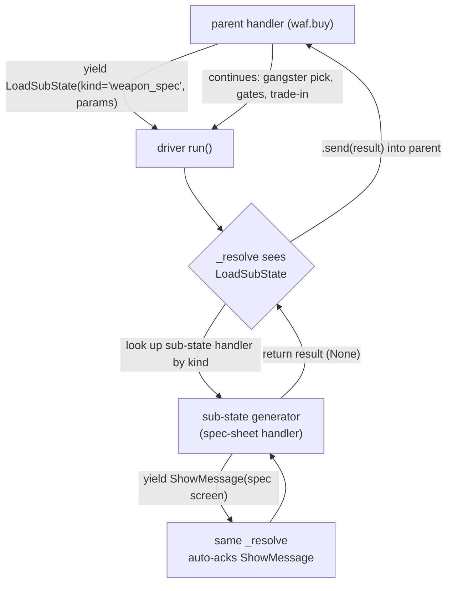
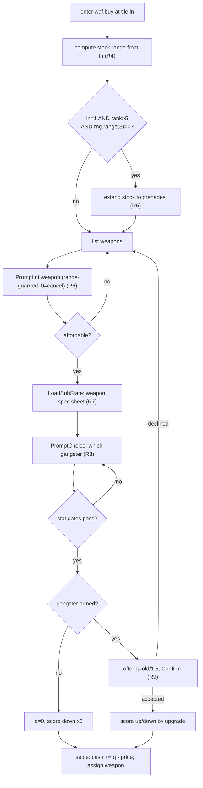

# feat: sph + waf protocol-stress content (Phase 2) - Plan

## Goal Capsule

**Objective.** Port the `sph` (casino) and `waf` (weapon shop) location handlers as config-owned game code, and build the one engine-spine feature they require but that does not yet exist: `LoadSubState` as a genuine nested sub-state machine in the driver. This is the design doc's **Phase 2 — hard protocol cases** (`docs/design/engine-architecture.md:188`). Landing it exercises the generator/interaction spine across the hard non-combat handler shapes: nested prompts, re-prompt loops, single-key choices, yes/no confirms, `ln`-dependent branching, cross-entity mutation, and RNG-gated content.

**Honesty note on the sub-state (do not oversell).** This run's *only* `LoadSubState` consumer is a **display-only** spec sheet (KTD-2) — it proves the sub-state registry, return-value threading, shared-buffer merge, and cancel-unwind *plumbing*. The prompt-bearing and sub-RNG paths of the full sub-FSM (KTD-1) have **no shipping consumer this run**; they are a deliberate forward investment for Phase-4 minigames, covered by U1 unit fixtures until the first real prompting sub-state lands. The run does not claim to prove those paths via content.

**Product authority.** No upstream brainstorm; direction is fixed by three converging sources — the active plan's "next phase" note (`docs/plans/current-action-plan.md:23`), CLAUDE.md, and the design doc's build order. Scope was confirmed interactively (full nested sub-FSM for `LoadSubState`; both `waf` options at full fidelity; run-mechanics handled separately).

**Execution profile.** Serial, one-unit-per-commit on `feat/vertical-slice`, green-tree gate (`make check`) before every commit, `ce-code-review mode:agent` pass before each commit, per `docs/AGENTS.md`. Every handler routes through `tests/helpers.py::run_pure`.

**Open blockers.** None blocking. One data-source dependency (the `ts$`/`tg$` accuracy/effect label strings for the weapon spec sheet) is resolved at implementation time from `research-data/pass-2/location-dialogue.yaml` / `game-text.yaml`; see Open Questions.

**Stop conditions.** Do not implement combat / `StartCombat` (still `NotImplementedError`), the arms-smuggling event (`la=12`), save/load (U12), or the terminal client (U10). Do not emit content-specific semantic events (`RoomRented`-style) — events stay generic and audit-only (see KTD-6).

---

## Product Contract

### Summary

Two new playable locations plus the engine feature that unblocks them. `sph` is the gentle warm-up — a wager/RNG/re-prompt handler barely past `slw` in complexity. `waf` is the real protocol stress test — the first handler to need a sub-state (its weapon spec sheet), stacked stat-gate guards, nested prompts, a single-key `get` choice, yes/no confirms, trade-in scoring, and *both* `ln`-branch surfaces (weapon stock and training stat modifiers). The run also adds the config data these need (a weapon entity table) and the effect vocabulary they emit that the slice does not yet have (a capped-stat training effect, a weapon-assignment effect, and a fused score-and-rank effect).

### Problem Frame

The vertical slice (U0–U11 + State/Event Foundation T1–T9) proved the spine on two simple handlers: `slw` (rent) and a `pub` stub. Both are single-menu, single-RNG-at-most, no-sub-state shapes. The design explicitly calls out casino gambling and weapon-shop buy/train as **Phase 2 hard protocol cases** (`engine-architecture.md:188`) precisely because they exercise the parts of the protocol the slice did not: `LoadSubState` (`engine-architecture.md:58,115`), mid-handler nested prompts, and multi-guard gating. `LoadSubState` currently raises `NotImplementedError` in the driver (`engine/interactions.py:328-332`), so the spine's own claim that it "runs nested sub-FSMs" is unproven. This run discharges that claim against real content and closes the Phase-2 gate before any client/persistence work resumes.

### Requirements

**Casino (`sph`)**
- R1. `sph` presents a 3-game menu (poker / black jack / roulette) and reads the choice; choice `0` cancels back to the menu. Ports `mf-prg.bas:16010-16016`.
- R2. `sph` reads a wager against displayed cash; wager `<= 0` aborts with no effect; wager `> cash` shows "not enough money" and aborts. Ports `mf-prg.bas:16020-16025`.
- R3. `sph` resolves the bet with a single RNG draw: win with probability `1/(1+x)` where `x` is the 1-based game index (poker x=1, blackjack x=2, roulette x=3). On win the gross payout is `int(stake * (0.5 + x))` (this already includes the returned stake); on loss the stake is gone. Ports `mf-prg.bas:16026-16040` verbatim. The negative-EV house edge is faithful and must not be "corrected."

**Weapon shop (`waf`) — buy a weapon**
- R4. `waf` buy lists the weapons purchasable at the current tile: `ln=1` → indices 3–7, `ln=2` → 1–5, `ln=3` → 1–4. Ports `mf-prg.bas:13011-13015`.
- R5. At `ln=1`, with probability 1-in-3 AND when the active player's rank `> 5`, grenades (index 8) are added to stock. Ports `mf-prg.bas:13011,13090`. RNG-gated inventory.
- R6. Weapon selection is range-guarded (re-prompt on out-of-range; `0` cancels) and affordability-checked against the model price. Ports `mf-prg.bas:13020-13025`.
- R7. Selecting a weapon shows its spec sheet (name, price, accuracy label, effect label) as a **sub-state** the player dismisses with a key. The accuracy/effect labels are **bucketed lookups**, not direct values: accuracy = `ts$[int(ts/2)]` (a 3-entry label array) and effect = `tg$[int(tg/4)+1]` (a 5-entry label array), per `mf-prg.bas:13515,13520` (arrays dimensioned at `:125`). Ports `mf-prg.bas:13500-13525`.
- R8. The player then picks which owned gangster to arm; three per-gangster stat gates apply: intelligence `>= 40` for weapons `> 5`; kraft `>= 20` for weapons 2–3; brutality `>= 40` for weapon 3 and weapons `> 6`. A failed gate shows its reason and returns to the gangster pick. Ports `mf-prg.bas:13035-13060`.
- R9. Trade-in: an unarmed gangster has no old weapon (`q=0`); otherwise the dealer offers `q = int(old_price / trade_in_divisor)` (the `1.5` is a config tunable, KTD-10), confirmed yes/no; declining returns to the weapon list. Purchase settles cash `+= q - new_price` and **assigns the weapon to the gangster** (`13075`), then scores. Score signs (settled per KTD-9, `true=+1`): a first weapon or a non-upgrade adjusts score **down** by `x8` while `gf<100` (`13065`,`13072`); an upgrade adjusts **up** by `2*x8` while `gf>0` (`13073`). Ports `mf-prg.bas:13065-13080`.

**Weapon shop (`waf`) — train a gangster**
- R10. `waf` train aborts if the player owns no gangster, else picks which gangster to train. Ports `mf-prg.bas:13100-13102`.
- R11. When rank `>= 5`, offer `(s)chiesstand` (range) vs `(t)rainingscamp` (camp) via a single-key choice; below rank 5, range only. Ports `mf-prg.bas:13103-13107`.
- R12. Range costs `800 + 200*rank`, confirmed and afford-checked, then raises stats with `ln`-dependent modifiers, each capped at 99: kraft `+5`; intelligence `+3` (only `+1` at `ln=1`); brutality `+2` (net `-1` at `ln=2`). Scores training at reward `x=1`. Ports `mf-prg.bas:13110-13130`.
- R13. Camp costs `2500 + 500*rank`, confirmed and afford-checked, then raises all three of intelligence, brutality, kraft by `fnr` (a uniform random `8..15`, capped at 99). Scores training at reward `x=2`. Ports `mf-prg.bas:13150-13175`.

**Engine spine + data + shared surface**
- R14. `LoadSubState` runs a nested sub-state to completion via the same interaction protocol and returns its result value into the parent handler. Fulfills `engine-architecture.md:58,115`; removes the driver's `NotImplementedError` for `LoadSubState`.
- R15. A weapon entity table (name, price, accuracy `ts`, damage `tg`, sound `ws`, and derived stat-requirement metadata) is loaded from config, mirroring the existing `load_vehicles`/`load_ranks` pattern. Source: `mf-prg.bas:50100-50115` (field order from `:121`).
- R16. Three mutation primitives exist that the slice lacks: (a) a **capped stat change** (`waf` training raises stats to a 99 cap); (b) a **weapon-assignment effect** that writes `Gangster.weapon` (`waf` buy persists the purchase — `13075`); (c) a **fused score-and-rank effect** that awards `x*x8` score (clamped `[0,100]`) AND recomputes rank in one step (`nr = int(gf/11.1)+1`), matching `mf-prg.bas:1160-1165`.

### Scope Boundaries

**In scope:** the two handlers (`sph`, `waf` both options), their shells and theme strings, the weapon entity table, the `LoadSubState` nested-driver feature, and the two new effect/helper additions (R16).

#### Deferred for later
- Combat / `StartCombat` (Phase 3). Neither handler needs it; it stays `NotImplementedError`.
- The arms-smuggling investment event (`mf-prg.bas:12245,31005,31050`) — a different location/event flow, not `waf`.
- Save/load (U12) and terminal client (U10) — both already deferred behind this run.
- Content-specific semantic events (e.g. a `WeaponPurchased` audit event). Events stay generic and audit-only (KTD-6); adding content events is a later, deliberate decision, not guessed here.

#### Outside this product's identity
- Any change to the win-condition/rank *formulas* beyond the faithful `nr=int(gf/11.1)+1` recompute R16 already requires.
- "Balancing" the casino's negative EV or the weapon economy — behavioral fidelity is the bar (CLAUDE.md).

**Engine-vs-config boundary for the new primitives (genre-engine identity — see KTD-10).** The new additions split cleanly: the `LoadSubState` sub-FSM + `SUBSTATES` registry and the three effect *types* (`StatChangeCapped`, `AssignWeapon`, `ScoreAndRank`) are **engine-generic mechanisms** and live in `engine/`; every game-balance *number* they consume (stat cap, rank divisor, prices, gain ranges, ratios, roll odds) lives in `config.yaml` `formula_params` and is passed in as a parameter (KTD-10). The engine effects therefore hardcode no Mafia number — a second genre title changes behavior by editing its config alone. The `[0,100]` score-domain clamp is the one documented exception (intrinsic to `gf`, reused from `ScoreChange`). This keeps "copy the config, edit its data/handlers, engine untouched" true.

---

## Planning Contract

### Key Technical Decisions

- KTD-1. **`LoadSubState` is a recursive-driver feature, built as its own engine unit before `waf`.** The chosen shape (full nested sub-FSM, confirmed): when a handler yields `LoadSubState(kind, params)`, the driver runs a registered **sub-state handler** — itself a `Generator[Interaction, Response, result]` driven by the *same* input-source machinery — to completion, then `.send()`s its return value back into the parent generator as the `LoadSubState` response. This matches `engine-architecture.md:58` ("`LoadSubState` → sub-state result") and `:115` ("running nested sub-FSMs"). **Two load-bearing design commitments (do not leave as either/or):** (1) the recursion lives in **`run()`'s loop, not `_resolve`** — `_resolve(interaction, input_source)` has no handle to `ctx` or the parent generator, so it cannot merge buffers or `.send()` into the parent; `run()` owns both. (2) The sub-state uses the **shared-buffer model**: the child appends into the *same* `ctx._buffer`/`ctx._events`, and is driven by inline loop code, **not a nested `run()` call** (a nested `run()` would return a terminal `EngineResult` and commit/discard the child's effects independently, breaking cross-boundary atomicity). A `Cancelled` thrown at a sub-state prompt then propagates up through the parent's existing `try/finally` so the single commit is never reached — one discard unwinds the whole nesting. **Rationale (corrected):** the design routes *combat* through its own `StartCombat` interaction in Phase 3 — **not** `LoadSubState`; `LoadSubState`'s design-named future consumer is Phase-4 minigames (safe-cracking, `engine-architecture.md:58`). So building the full sub-FSM now is a **deliberate forward investment for minigames**, accepted per the confirmed scope; its prompt-bearing and cancel-across-boundary paths are covered by U1 unit fixtures until the first real prompting sub-state ships (see the honesty note in the Goal Capsule and U1).
- KTD-2. **The weapon spec sheet is a display-only sub-state** — a registered sub-state handler that yields one `ShowMessage` (the resolved spec-sheet screen) and returns `None`. It exercises the R14 sub-state plumbing without needing prompts. This keeps the *first* `LoadSubState` consumer minimal while the *mechanism* is fully general (KTD-1). Do not inline it as a bare `ShowMessage` in `waf` — routing it through `LoadSubState` is the point (it proves the feature and models the original's screen push/pop at `13500`/`13525`).
- KTD-3. **Stat gates are handler branching logic, not shell guards.** The three weapon stat requirements (R8) test the *chosen gangster's* stats mid-handler, after a `PromptChoice`. The guard DSL evaluates only against the active player at option-entry (`engine/conditions.py`), so these gates live in the `waf` handler as `if`/re-prompt branches emitting `ShowMessage` reason keys — exactly as the original does at `13050-13060`. Do not attempt to express them in YAML.
- KTD-4. **Two new effects: `StatChangeCapped` and `AssignWeapon` — generic mechanisms, config supplies the numbers (KTD-10).** (a) `StatChangeCapped(stat, amount, cap, floor=0, gangster=0, player=None)` — a `StatChange` variant clamping the result to `[floor, cap]`. The **cap is a required field the handler passes in from config**, NOT a hardcoded `99` — the 99 stat ceiling is a config-owned "stat cap" tunable (config-and-content-contract.md:170), so a different genre title sets its own without editing the engine. Existing `StatChange` applies no cap by contract (`effects.py:161`); `waf` training needs the cap (`13125-13127`, `13170-13172`). Applying these effects directly to `roster[y]` **subsumes the original's `gosub 1365`** (which repacks scalar stats into the packed `ge$` string, `13130`/`13175`) — the engine stores unpacked stat fields (`engine/state/__init__.py`), so no separate write-back primitive is needed; the score effect applies *after* the stat effects (`13125→13130`). (b) `AssignWeapon(weapon, gangster, player=None)` — writes `roster[gangster].weapon = weapon`. **Required for R9 to persist a purchase:** no existing effect mutates `Gangster.weapon`, and `StatChange` only accepts the four stat names (`_STAT_NAMES`, `effects.py:43`), so without this the buy cannot complete. Both effects register in `_apply_in_place` (before the deferred branch) and in `engine/consequences.py::EFFECT_TYPES`.
- KTD-5. **New effect: `ScoreAndRank` (single fused effect, not a two-effect helper).** `waf` training calls `gosub 1160` which falls through to `1165`: it awards `gf += x*x8` (cap 100, floor 0) AND recomputes `nr = int(gf/11.1)+1` from the *clamped* `gf`. The clamp lives inside `ScoreChange.apply` (`effects.py:295`) and only exists at commit time, so a helper that emitted a separate `ScoreChange` + a rank effect could not see the post-clamp `gf` to compute `nr` — it would have to duplicate the clamp. Avoid that ordering hazard: make it **one effect**, `ScoreAndRank(amount, rank_divisor)`, whose single `apply` branch weights by `state.config.score_mult` (`x8`), reuses the intrinsic `[0,100]` `gf` clamp (the same domain invariant `ScoreChange` bakes in — KTD-10 exception), then sets `nr = int(gf/rank_divisor)+1`. Clamp and rank owned in one place. The **`rank_divisor` (11.1) is a config `formula_params` value the handler passes in** (KTD-10), not hardcoded in the engine. Handlers call it via a named config helper (KTD-7) that reads the divisor from config and passes the raw `x`. Rank target: `1165` writes `nr` (`Player.nr`), not `Player.rank` — see OQ4. **Canonical-port note:** this effect IS the port of `gosub 1160/1165`; every *future* score-awarding handler (bank, jobs, extortion) must route through it, not raw `ScoreChange`, or rank will silently drift from the original. `sph` correctly does NOT score (source `16000-16040` mutates only cash — OQ2 resolved), so only `waf` training wires it this run.
- KTD-6. **Events stay generic and audit-only.** `run_option` already appends `LocationActionCompleted`/`Cancelled` lifecycle events. Handlers do not record content-specific events (no `CasinoResolved`, no `WeaponPurchased`) — that would put non-replay data in the stream against the effects-are-the-replay-log rule (`docs/solutions/architecture-patterns/engineresult-action-spine-effects-only-mutation.md`). Casino/purchase outcomes are fully reconstructable from the committed effects + logged RNG draws.
- KTD-7. **Handler API conformance (unchanged contract).** Both handlers touch only `ctx.state` (read-only), `ctx.rng`, `yield <Interaction>`, `ctx.apply(<Effect>)`, and named config-local helpers — nothing else in `engine/` (CLAUDE.md §5.2a). They register via `@register` from `engine.locations` but import their own config helpers relatively (`from ..setup import ...`), exactly like `slw`.
- KTD-8. **RNG draws map to `rng.hit`/`rng.range` verbatim.** `sph` win roll: `int(rnd(1)*(1+x))==0` → `rng.range(1+x) == 0` (`16030`). Grenade stock: `int(rnd(1)*3)==0` → `rng.range(3) == 0` (`13011`). `fnr(0)` camp gain: `int(rnd(1)*8)+8` → `rng.hit(8, 15)` (verified `mf-prg.bas:117`). Match probabilities, not C64 draw order (design/KTD-9).
- KTD-9. **Boolean-as-integer convention: `true = +1` (settled project-wide, do not re-litigate).** Several ported formulas use the BASIC idiom `<expr> ± k*(<relational>)` where a relational multiplies a coefficient. The research's interpretation model — which this engine ports (behavioral fidelity, not raw C64 semantics) — treats a true relational as **`+1`**, not the textbook C64 `-1`. This is pinned by the already-shipped, research-verified `fnm(1) == -50`: `fnm(ln)=50-50*(ln=3 or ln=4)-100*(ln=1)` yields `-50` at `ln=1` only if `(ln=1)` contributes `+100` (i.e. `true=+1`); `true=-1` would give `+150`. Consequently every `waf` formula with a relational term (R5 grenade gate, R9 buy-score signs, R12 `ln`-modified training gains) uses the **prose** reading. The shipped `fnm` sidesteps the arithmetic via an overrides map, so it sets no *code* precedent — the convention is fixed by the documented *result*. Capture this as a `docs/solutions/` porting rule during U2/U3 so no future handler or plan re-derives it.
- KTD-10. **Game rules live in config, engine holds only generic mechanism (the core invariant).** Per `config-and-content-contract.md`: the engine owns the **effect/event catalog and application** (line 11, 64) — so the new effect *types* correctly live in `engine/effects.py` — but **formulas: score weight, costs, payout constants, stat caps, and other tunables are config-owned** (line 170), supplied via `config.yaml` `formula_params` and computed by config-owned helpers, exactly as `fnm` already is. Concretely, every game-balance *number* this run introduces goes in `formula_params`, not in engine code or handler literals: the **stat cap (99)**, the **rank divisor (11.1)** and score cap, the **training prices** (`800+200*rank`, `2500+500*rank`), the **camp-gain range** (`fnr` = 8..15), the **casino payout multiplier** (`0.5+x`) and **win-probability base**, the **trade-in ratio** (`1/1.5`), and the **grenade-roll odds** (1-in-3) / **rank gate** (>5). The engine effects (`StatChangeCapped`, `ScoreAndRank`) take these as *parameters*; the handlers read them from `ctx.state.config.formula_params` and pass them in. This is what keeps "copy the config, edit its data/handlers, engine untouched" true for a second genre title. **Exception (precedent):** the score domain clamp `[0,100]` is baked into `ScoreChange` today (`effects.py:295`) as an intrinsic `gf` property, not a tunable — `ScoreAndRank` reuses that same intrinsic clamp rather than re-parameterizing it (see KTD-5).

### Assumptions

- A1. The `waf` shell will carry `buy` and `train` as two options routing to one handler that branches on which option was chosen (mirroring how `slw`'s two rent options share `slw.rent`), OR two separate handlers (`waf.buy`, `waf.train`). Default: **two handlers** — the buy and train bodies share nothing and the original's `on w goto 13010,13100` is a clean split. Revisit if a shared entry proves cleaner during implementation.
- A2. The `ts$`/`tg$` accuracy/effect **label** arrays live as DATA read at `mf-prg.bas:125` and are captured in the research's text corpus (`research-data/pass-1/game-text.yaml`) — **not** in `location-dialogue.yaml`, which holds only the static `"treffgenauigkeit:"`/`"wirkung:"` prefixes. Port both the 3-entry `ts$` and 5-entry `tg$` label arrays plus the two prefixes into the theme at build time. If the label arrays cannot be located, the fallback is the **bucket index** (`int(ts/2)` / `int(tg/4)+1`), not the raw `ts`/`tg` value — a raw-value fallback would show the wrong number. The label gap (if any) is recorded; it does not block the unit.
- A3. `sph`'s three games are mechanically identical except for `x` (win probability and payout multiplier), so one code path parameterized by the chosen index is faithful — there is no per-game minigame in the original (verified `16030` is the sole resolver for all three).

### High-Level Technical Design

**`LoadSubState` recursive-driver flow (R14 / KTD-1):**

The sub-state is driven by the level above (design doc's nested-lifecycle model, `engine-architecture.md:27-35`). Sub-state effects/events buffer into the *parent's* `Ctx` buffers, preserving action-boundary atomicity.

**`waf.buy` control flow (R4–R9) — the protocol stress surface:**

### Sequencing

`U1 → U2 → U3 → U4 → U5 → U6 → U7`. `LoadSubState` (U1) and the data/effect additions (U2, U3) are prerequisites for `waf` (U6). `sph` (U4/U5) is independent of U1 and can land first as the warm-up.

---

## Implementation Units

### U1. `LoadSubState` nested sub-state machine in the driver

**Goal.** Replace the driver's `LoadSubState` `NotImplementedError` with a real recursive sub-state runner: on `LoadSubState(kind, params)`, look up a registered sub-state handler by `kind`, drive it to completion via the same protocol, and send its return value back into the parent. Sub-state effects/events buffer into the parent action.

**Requirements.** R14. **Dependencies.** none.
**Files.** `engine/interactions.py` (handle `LoadSubState` inside `run()`'s loop — NOT `_resolve`); a new `engine/substates.py` (a `SUBSTATES` registry + `@register_substate(kind)` decorator, mirroring `HANDLERS`/`register`); `tests/test_substate.py` (new).
**Approach.** Add the `SUBSTATES` registry + decorator. Handle `LoadSubState` **in `run()`'s while-loop**, not in `_resolve` (which lacks `ctx`/`gen` handles — KTD-1): when the parent yields `LoadSubState(kind, params)`, look up the sub-state factory by `kind`, build the child generator sharing the **same `ctx`** (so `ctx.apply`/`ctx.record` inside the sub-state append to the parent's buffers), drive the child with an **inline loop** reusing `_resolve` for its interactions, and on the child's `StopIteration` `.send()` its `.value` back into the parent generator. Do **not** drive the child via a nested `run()` (it would commit/discard independently — KTD-1). A `Cancelled` thrown inside the child propagates out of the inline loop to the parent `run()`'s existing `except Cancelled` handler, discarding the whole action atomically. Keep `StartCombat` raising `NotImplementedError` — only `LoadSubState` is implemented here. The `params` dict shape (resolved weapon record vs. a re-looked-up index) is fixed by U6's consumer; U1 treats `params` as opaque pass-through.
**Patterns to follow.** The existing `run`/`_resolve` loop (`engine/interactions.py:212-368`); the `HANDLERS`/`register` registry shape (`engine/locations.py:54-64`). Purity via `tests/helpers.py::run_pure`.
**Execution note.** Start with a failing test that drives a parent handler yielding `LoadSubState` whose sub-state yields a `ShowMessage` and returns a value; assert the parent receives the value and the effects merge.
**Test scenarios.**
- Happy path: parent yields `LoadSubState`, sub-state returns a value, parent receives it via `.send()`; assert the returned value threads through.
- Sub-state buffers an effect → it appears in the parent action's committed effects (buffer merge).
- Sub-state yields a `PromptInt` → driven by the same `input_source`, validated/re-prompted identically. (Forward-investment path per KTD-1 — no content consumer this run; fixture proves the plumbing.)
- Cancel inside a sub-state (`CANCEL` at a cancellable sub-prompt) unwinds the whole action → `status="cancelled"`, zero effects, original state (atomic across the nesting boundary). This test is the **design driver** for the shared-buffer + inline-loop choice (KTD-1): it must fail against a nested-`run()` implementation and pass against the shared-buffer one.
- Unknown `kind` → `ValueError` (config bug, raises — not an `EngineResult(error=...)`).
- `StartCombat` still raises `NotImplementedError` (unchanged).
**Verification.** `run_pure` passes for a parent+sub-state handler; the driver no longer raises for `LoadSubState`; combat still raises.

### U2. Weapon entity table + loader

**Goal.** Add a config weapon table (`entities/weapons.yaml`) and a `load_weapons` loader mirroring `load_vehicles`/`load_ranks`, carrying name, price, accuracy (`ts`), damage (`tg`), sound (`ws`), and the stat-requirement metadata `waf` needs.
**Requirements.** R15. **Dependencies.** none.
**Files.** `data/game_configs/mafia_1920s/entities/weapons.yaml` (new); `data/game_configs/mafia_1920s/setup.py` (add `load_weapons`); `tests/test_weapons_data.py` (new).
**Approach.** Port the 9 records (index 0–8) verbatim from `mf-prg.bas:50100-50115`, field order `name, price, ts, tg, ws` per `:121`: haende 0/2/2/1, messer 50/3/5/0, knueppel 100/4/3/1, schlagkette 500/4/4/4, wurfsterne 3000/2/7/0, revolver 4000/5/10/2, gewehr 4500/5/12/2, maschinenpistole 8000/6/15/10, handgranaten 10000/7/18/3. Stat requirements are *derived from the buy-guard lines*, not a DATA table — encode them as metadata: intelligence≥40 for index>5, kraft≥20 for index∈{2,3}, brutality≥40 for index=3 or index>6 (`13050-13060`). `load_weapons` returns the list indexed 0–8.
**Patterns to follow.** `data/game_configs/mafia_1920s/setup.py:53-63` (`load_vehicles`); `entities/vehicles.yaml`, `entities/ranks.yaml` shape.
**Test scenarios.**
- Loader returns 9 weapons, index 0 = haende (price 0), index 8 = handgranaten (price 10000).
- Field values match the source table exactly (assert `ts`/`tg` for revolver = 5/10, grenades = 7/18).
- Stat-requirement metadata: index 6 (maschinenpistole) requires intelligence≥40 (index>5) but NOT brutality (index 6 is not >6); index 8 requires intelligence≥40 AND brutality≥40 (index>6). Covers the exact `13050-13060` boundaries.
**Verification.** `load_weapons` returns the correct table; a boundary test pins the `>5`/`>6`/`{2,3}`/`=3` gate metadata.

### U3. New effects: `StatChangeCapped`, `AssignWeapon`, `ScoreAndRank`

**Goal.** Add the three mutation primitives `waf` needs that the slice lacks: a stat change clamped to a config-supplied cap, a weapon-assignment effect, and a single fused score-and-rank effect. Plus the named config helper handlers call to score, and the config `formula_params` block holding every game-balance number (KTD-10).
**Requirements.** R16. **Dependencies.** none.
**Files.** `engine/effects.py` (add the three GENERIC effects — cap/divisor are *parameters*, not literals — + `_apply_in_place` branches + `__all__`); `engine/consequences.py` (register all three in `EFFECT_TYPES`); `data/game_configs/mafia_1920s/config.yaml` (extend `formula_params` with the `waf`/`sph` tunables — KTD-10); a shared config helper in `data/game_configs/mafia_1920s/setup.py` that reads `formula_params` and emits `ScoreAndRank`; `tests/test_effects.py` (extend), `tests/test_score_rank.py` (new).
**Approach.**
- `StatChangeCapped(stat, amount, cap, floor=0, gangster=0, player=None)` — apply like `StatChange`, then clamp the *result* to `[floor, cap]`. **`cap` is a required parameter** the handler passes from `formula_params` (the 99 is config data, KTD-10) — the engine effect hardcodes no game number. Reuses `StatChange`'s stat-name validation (`ValueError` on unknown). Subsumes `gosub 1365` (KTD-4).
- `AssignWeapon(weapon, gangster=0, player=None)` — set `roster[gangster].weapon = weapon`; validate the gangster index like `StatChange` does (`effects.py:326`). This is the R9 purchase-persist primitive.
- `ScoreAndRank(amount, rank_divisor)` — ONE effect (KTD-5): in a single `apply` branch, compute `gf' = clamp(gf + amount*state.config.score_mult, 0, 100)` (the `[0,100]` clamp reuses `ScoreChange`'s intrinsic `gf` domain — KTD-10 exception), set `gf = gf'`, then `nr = int(gf'/rank_divisor)+1`. **`rank_divisor` is a parameter** from `formula_params` (the 11.1 is config data), not a literal. Clamp and rank owned together; no ordering hazard. Targets `Player.nr` (per `1165`; confirm against `Player.rank` — OQ4).
- All three get an `isinstance` branch *before* the deferred-effects branch in `_apply_in_place`, and a registry entry in `EFFECT_TYPES` (`"stat_change_capped"`, `"assign_weapon"`, `"score_and_rank"`).
- **`formula_params` additions (KTD-10)** — extend `config.yaml` with the game-balance numbers so no handler or effect hardcodes them: `stat_cap: 99`, `rank_divisor: 11.1`, training prices (`range_base: 800`, `range_per_rank: 200`, `camp_base: 2500`, `camp_per_rank: 500`), `camp_gain_min: 8`/`camp_gain_max: 15`, `casino_payout_offset: 0.5`, `trade_in_divisor: 1.5`, `grenade_roll: 3` (1-in-3), `grenade_rank_gate: 5`. Config-owned helpers read these.
- The **score helper** is a named function handlers call with the raw reward `x` (1 for range, 2 for camp; the buy-score deltas per KTD-9); it reads `rank_divisor` from `formula_params` and returns the `ScoreAndRank` effect to `ctx.apply`.
**Patterns to follow.** `StatChange`/`ScoreChange` in `engine/effects.py:82-168` (dispatch + validation); `EFFECT_TYPES` in `engine/consequences.py:42`; the intrinsic-clamp precedent (`ScoreChange`, `effects.py:88-95`).
**Test scenarios.**
- `StatChangeCapped`: above-99 result clamps to 99; normal raise unclamped; negative result floors at 0; unknown stat → `ValueError`; bad gangster index → `IndexError`.
- `AssignWeapon`: sets `roster[g].weapon` to the given index; out-of-range gangster → `IndexError`; targets the active player by default and an explicit `player` otherwise.
- `ScoreAndRank` (Covers 1160-1165): `gf=50, amount=2, score_mult=1.0` → `gf=52`, `nr=int(52/11.1)+1=5`. `gf=99, amount=2` → `gf=100` (cap), `nr` recomputed from 100. Negative amount drives `gf` toward 0 but not below. Rank is computed from the *clamped* gf, not the pre-clamp value (the single-effect guarantee).
- All three registered in `EFFECT_TYPES`: `effect_from_dict` round-trips each; missing/extra field → `ValueError`.
- **Config-boundary (KTD-10):** `StatChangeCapped` clamps to the cap it is *given* (pass `cap=50` → clamps at 50, proving no hardcoded 99); `ScoreAndRank` uses the `rank_divisor` it is given (pass a non-11.1 divisor → rank computed from it). Confirms the game numbers are not baked into the engine.
**Verification.** All three effects apply via `run_pure`; `ScoreAndRank` produces the exact `gf`/`nr` the source formula gives for pinned inputs, computed from clamped gf.

### U4. `sph` casino handler

**Goal.** Port the casino handler: game menu, wager, single-RNG resolve, payout. The warm-up unit — no sub-state, one RNG site.
**Requirements.** R1, R2, R3. **Dependencies.** none (independent of U1–U3).
**Files.** `data/game_configs/mafia_1920s/handlers/sph.py` (new); `tests/test_sph.py` (new).
**Approach.** Faithful port of `mf-prg.bas:16010-16040`. `PromptChoice` for the 3 games (cancellable; index 0-based → map to `x=index+1`). `ShowMessage` cash + `PromptInt` wager (cancellable; `<=0` aborts, mirrors `16020`). Affordability: `wager > ka` → `ShowMessage("system.not_enough_money")`, abort (`16025`). Resolve: `win = ctx.rng.range(1+x) == 0` (`16030`); on win `payout = int(stake*(payout_offset+x))` where `payout_offset` (0.5) is read from `formula_params` (KTD-10), `ctx.apply(MoneyChange(payout - stake))`. **Cash math verified against source:** `16026 ka(sp)=ka(sp)-p` deducts the stake up front and `16040 ka(sp)=ka(sp)+p` re-adds the gross payout on win — so the net delta is `payout - stake` on win and `-stake` on loss (loss keeps the `16026` deduction with no re-add). Emit win/loss `ShowMessage`. KTD-7 conformant; KTD-6 (no content events).
**Patterns to follow.** `data/game_configs/mafia_1920s/handlers/slw.py` (handler shape, `@register`, `ctx.apply`, `ShowMessage`/`PromptInt`); `engine/rng.py` (`range`).
**Execution note.** Implement new domain behavior test-first; assert the exact cash delta for a forced-win and forced-loss RNG.
**Test scenarios.**
- Menu cancel (choice 0) → returns, no effect.
- Wager `<= 0` → abort, no `MoneyChange`.
- Wager `> cash` → `not_enough_money` message, no `MoneyChange`.
- Forced win (seed/stub `rng.range(1+x)=0`): roulette x=3, stake 100 → payout `int(100*3.5)=350`, net cash delta `+250`; assert `MoneyChange(+250)`.
- Forced loss (`rng.range(1+x)!=0`): stake 100 → net `-100`; assert `MoneyChange(-100)`.
- Each game index maps to the right `x` (poker=1, blackjack=2, roulette=3) and thus the right win probability and multiplier.
- Determinism: same seed → same win/loss and payout.
**Verification.** `run_pure` passes; forced-win and forced-loss cash deltas match the source formula exactly.

### U5. `sph` shell + theme strings

**Goal.** The declarative shell (menu → `sph` handler, guardless entry) and the verbatim classic-theme strings.
**Requirements.** R1–R3 (surfaces the handler). **Dependencies.** U4.
**Files.** `data/game_configs/mafia_1920s/content/locations/sph.yaml` (new); `data/game_configs/mafia_1920s/themes/classic/strings/sph.yaml` (new); extend a loader/registration test if one enumerates locations.
**Approach.** One option routing to `sph` (the casino menu is *inside* the handler via `PromptChoice`, so the shell is a single entry option + a guardless `leave`, mirroring `slw`'s `leave`). Port strings verbatim from `research-data/pass-2/location-dialogue.yaml` (entry prompt, the 3 game labels, wager prompt, win/loss lines) — keys under `locations.sph.*`. `system.not_enough_money` already exists (reused).
**Patterns to follow.** `content/locations/slw.yaml`; `themes/classic/strings/slw.yaml` (verbatim German).
**Test scenarios.** `Test expectation: none` for the shell YAML beyond load-validation — covered by the loader's existing structural validation and U4's handler tests. Add one scenario: the `sph` shell loads and resolves its `sph` handler id (fails at load if unregistered).
**Verification.** Config loads with `sph` registered; strings resolve for every key `sph.py` emits.

### U6. `waf` handlers — buy + train (full fidelity)

**Goal.** Port the entire weapon shop: buy (stock/spec-sheet/gates/trade-in) and train (range/camp), full fidelity. The core stress test.
**Requirements.** R4–R13. **Dependencies.** U1 (LoadSubState), U2 (weapons), U3 (capped stat + score helper).
**Files.** `data/game_configs/mafia_1920s/handlers/waf.py` (new — `waf.buy`, `waf.train`, and the registered weapon-spec sub-state handler); `tests/test_waf_buy.py`, `tests/test_waf_train.py` (new).
**Approach.** Faithful port of `mf-prg.bas:13005-13175` + `13500-13525`. Read `ln` from the active player's `last_location` seam (as `slw` does). **All game-balance numbers come from `formula_params` (KTD-10)**, not handler literals — prices, caps, gain ranges, ratios, roll odds. **Buy** (`13010-13080`): compute stock from `ln` (R4); grenade roll `rng.range(grenade_roll)==0 and rank>grenade_rank_gate` at `ln=1` (R5, `true=+1` per KTD-9); weapon `PromptInt` (range-guarded; **`0` is a whole-buy cancel** via `cancellable=True` → the driver's atomic discard) + afford check that **loops back** to the list in-handler (R6); `yield LoadSubState("weapon_spec", {...})` for the spec sheet (R7, via U1); `PromptChoice` gangster; three stat gates as handler branches emitting reason keys, looping back on failure (R8, KTD-3); trade-in `q=int(old_price/1.5)`, `Confirm` (decline **loops back** to the weapon list in-handler, not a driver cancel), then `ctx.apply(AssignWeapon(...))` + cash `MoneyChange`, then the score adjustment (signs per KTD-9). **Cancellability rule (feasibility):** only whole-action aborts use `cancellable=True` (driver discard); every "return to an earlier menu" is an in-handler loop, since driver-cancel unwinds the *entire* handler and cannot resume at an inner menu. **Train** (`13100-13175`): no-gangster abort; gangster pick; rank≥5 → the `(s)/(t)` venue choice modeled as a 2-option `PromptChoice` (`13106`); range path `p = range_base + range_per_rank*rank`, confirm, afford, `StatChangeCapped` deltas (with the config `stat_cap`) and `ln` modifiers (R12, signs per KTD-9), score `x=1`; camp path `p = camp_base + camp_per_rank*rank`, confirm, afford, three `StatChangeCapped(rng.hit(camp_gain_min, camp_gain_max), cap=stat_cap)`, score `x=2` (R13) — all constants from `formula_params`. Stat effects apply BEFORE the score effect (mirrors `13125→13130`). All mutations via `ctx.apply` + the U3 `ScoreAndRank` helper (KTD-7); no content events (KTD-6).
**Test fixtures note.** Setup seeds each player with exactly one gangster and no recruit flow is in scope, so the gangster-pick, stat-gate, and trade-in tests must **hand-construct** multi-gangster / armed-gangster state in fixtures — do not look for an in-scope recruitment path.
**Patterns to follow.** `handlers/slw.py` (structure, `ln` seam, `ctx.apply`); U1's sub-state registration for the spec sheet; U3's helper for scoring.
**Execution note.** Land `waf.buy` first (it needs U1's sub-state + all three gates + trade-in — the widest surface), then `waf.train`. Test-first per branch; use a scripted `input_source` (the `tests/test_slice_integration.py:76` recorder pattern) to drive the nested prompts.
**Test scenarios.**
- **Buy stock by `ln`:** `ln=2` lists indices 1–5; `ln=3` lists 1–4; `ln=1` lists 3–7 (R4).
- **Grenade roll:** `ln=1`, rank>5, forced `rng.range(3)=0` → stock includes index 8; forced `!=0` → excludes; rank≤5 never includes (R5). Two RNG-forced scenarios + one rank-gated.
- **Weapon select guard:** out-of-range weapon re-prompts; `0` cancels the whole buy (R6).
- **Afford:** weapon price > cash → `not_enough_money`, back to list (R6).
- **Spec sheet (R7):** selecting a weapon yields exactly one `LoadSubState("weapon_spec", ...)` whose sub-state shows the resolved spec screen and returns; assert the parent continues to the gangster pick. Covers R14 end-to-end.
- **Stat gates (R8):** arming gangster with intelligence 39 + weapon index 6 (>5) → "zu wenig intelligenz", back to gangster pick; intelligence 40 passes. kraft 19 + weapon 2 → "zu wenig kraft". brutality 39 + weapon 3 → "nicht brutal genug". Each boundary tested at pass and fail.
- **Trade-in cash/assign (R9):** armed gangster, old price 3000 → offer `q=int(3000/1.5)=2000`, accept → cash `+= 2000 - new_price`, `AssignWeapon` sets the new weapon (and trade-in reads the OLD weapon's price *before* assignment); unarmed → `q=0`, cash `-= new_price`; decline → loops back to weapon list.
- **Trade-in score signs (R9, KTD-9 `true=+1`):** first weapon (unarmed) with `gf<100` → score **down** `x8`; non-upgrade (new index ≤ old) with `gf<100` → **down** `x8`; upgrade (new index > old) with `gf>0` → **up** `2*x8`. When the `(gf<100)`/`(gf>0)` gate is false, no score change. (Signs are settled — encode directly.)
- **Train no gangster:** abort with message (R10).
- **Train venue gate (R11):** rank 4 → range only (no `(s)/(t)` prompt); rank 5 → the two-option choice appears.
- **Range gains (R12):** `ln` default → kraft+5, int+3, brut+2; `ln=1` → int+1 (not +3); `ln=2` → brut−1 net; each capped at 99 (start at 98 → 99, not over). Score `x=1` applied.
- **Camp gains (R13):** forced `rng.hit(8,15)` at a known value → all three stats rise by it, capped 99. Cost `2500+500*rank`. Score `x=2`.
- **Cancel atomicity:** cancelling at any `waf` prompt (weapon, gangster, confirm) commits zero effects and leaves original state (via the driver's atomic discard, incl. across the sub-state boundary).
**Verification.** `run_pure` passes for both handlers; every stat/cash/score delta matches the source formulas for pinned inputs; the spec sheet round-trips through `LoadSubState`.

### U7. `waf` shell + theme strings + slice integration

**Goal.** The `waf` declarative shell (buy/train options, entry), verbatim strings, and one end-to-end integration trajectory proving `waf` composes with movement/driver like the existing slice gate.
**Requirements.** R4–R13 (surfaces handlers); integration proof. **Dependencies.** U6.
**Files.** `data/game_configs/mafia_1920s/content/locations/waf.yaml` (new); `data/game_configs/mafia_1920s/themes/classic/strings/waf.yaml` (new); `tests/test_slice_integration.py` (extend with a `waf` trajectory) or `tests/test_waf_integration.py` (new).
**Approach.** Shell: `buy` → `waf.buy`, `train` → `waf.train`, guardless `leave` (per A1, two handlers). Strings verbatim from `research-data/pass-2/location-dialogue.yaml` under `locations.waf.*` (menu labels, spec-sheet labels per A2, all the gate/trade-in/training response lines). Integration: a seeded headless trajectory that walks to `waf`, buys a weapon (through the spec-sheet sub-state and a passing stat gate), trains a gangster, and asserts the resulting effects/state — mutation-verified sound like the existing DoD gate (`test_slice_integration.py:314`).
**Patterns to follow.** `content/locations/slw.yaml`, `themes/classic/strings/slw.yaml`; `tests/test_slice_integration.py` (the recorder input_source + trajectory shape).
**Execution note.** Start with a failing integration test for the walk→waf→buy→train contract; drive nested prompts with a scripted recorder.
**Test scenarios.**
- Config loads with `waf.buy`/`waf.train` registered and all string keys present.
- Integration: seeded walk to `waf` → buy a `ln`-stocked weapon (spec sheet dismissed, gate passed, trade-in path) → weapon assigned + cash reduced; then train (range) → stats raised + capped + score/rank ticked. Assert the committed effects and final state; assert determinism (same seed → same trajectory).
- `Covers R7/R14`: the integration trajectory exercises `LoadSubState` in a real playthrough, not just a unit stub.
**Verification.** The full `waf` trajectory is playable headless and deterministic; `make check` green; no `clients` import (headlessness preserved).

---

## Verification Contract

| Gate | Command | Applies to | Done signal |
|---|---|---|---|
| Green tree | `make check` | every unit | `pytest` green + soft lint clean before each commit |
| Handler purity | `tests/helpers.py::run_pure` | U1, U4, U6 | input state never mutated; returned state fully explained by committed effects |
| Formula fidelity | unit tests with pinned inputs | U3, U4, U6 | cash/stat/score/payout deltas equal the source formula outputs exactly |
| Headlessness | `test_headless_no_clients_import` | U7 | driving `waf`/`sph` imports nothing from `clients` |
| Determinism | seeded-trajectory tests | U4, U7 | same seed → identical outcomes |
| Review | `ce-code-review mode:agent` | every unit | focused review pass before commit |

## Definition of Done

- `sph` and `waf` (both options) are playable headless through the driver, faithful to `mf-prg.bas:16010-16040` and `13005-13175`/`13500-13525` (formulas/probabilities/rewards match; representation may differ).
- `LoadSubState` runs a real nested sub-state (spec sheet) and returns its result to the parent via the shared-buffer model (cancel-across-boundary test green); combat still raises `NotImplementedError`.
- The weapon entity table and all three new effects (`StatChangeCapped`, `AssignWeapon`, `ScoreAndRank`) exist, are registered in `EFFECT_TYPES`, and are covered — a `waf` purchase persists the weapon and training ticks score+rank in one effect.
- Every handler is `run_pure`-clean and emits no content-specific events (effects + RNG draws remain the sole replay vocabulary).
- **Config boundary holds (KTD-10):** the new engine effects hardcode zero game-balance numbers (cap, divisor, prices, ratios, odds are all `formula_params`); a grep of `engine/` for the introduced constants (`99`, `11.1`, `800`, `2500`, `1.5`, etc. as game values) finds none — they live only in `data/game_configs/mafia_1920s/config.yaml`. The `[0,100]` score-domain clamp is the single documented exception (intrinsic to `gf`, matching `ScoreChange`).
- One seeded end-to-end `waf` trajectory passes, mutation-verified; `make check` green; branch `feat/vertical-slice`.

---

## Open Questions

- OQ1 (A2). Locate the `ts$` (3-entry) / `tg$` (5-entry) label arrays in `research-data/pass-1/game-text.yaml` (read at `mf-prg.bas:125`). Resolve at U6/U7 build time; if absent, fall back to the **bucket index** (`int(ts/2)` / `int(tg/4)+1`), not the raw value (non-blocking).
- OQ2 (KTD-5). **RESOLVED — confirmed.** `sph` (`mf-prg.bas:16000-16040`) never touches `gf`/`nr`/`gosub 1160`; it mutates only cash. So only `waf` training wires the score-and-rank helper this run.
- OQ3 (A1). Two `waf` handlers vs one shared entry — settle during U6 (default: two).
- OQ4. Rank target field: `1165` writes `nr`; confirm at U3 whether the engine's rank consumers read `Player.nr` or `Player.rank` and set the correct one (both exist at `engine/state/__init__.py:103-104`).
- OQ5 (R9). **RESOLVED — score signs follow the prose; the earlier "these invert" reading was wrong.** The convention is settled by a sibling formula already shipped in this engine, not left open. See KTD-9: the research's boolean-as-integer convention is **`true = +1`** (pinned by `fnm(1) == -50`), so `gf=gf-x8*(gf<100)` (`13065`,`13072`) is score **DOWN** by `x8` (first-weapon / non-upgrade) and `gf=gf+x8*2*(gf>0)` (`13073`) is score **UP** by `2*x8` (upgrade), each only while the `(gf<100)`/`(gf>0)` guard is true. The U6 trade-in score test encodes exactly these signs. A one-line oracle re-confirmation at build is welcome, but there is no `true=-1` fallback — that would inject inverted-score bugs.
- OQ6 (KTD-5/KTD-10). **RESOLVED — parameterize.** The rank divisor `11.1` is a config `formula_params` value passed into `ScoreAndRank` (config-and-content-contract.md:170 makes formula tunables config-owned; `fnm` is the precedent). The score-domain clamp `[0,100]` is the one exception — it reuses `ScoreChange`'s intrinsic `gf` clamp rather than being re-parameterized. Settled by KTD-10.

---

## Appendix — run mechanics (acted on separately, not part of the plan body)

Per `docs/AGENTS.md` and the confirmed scope, after this plan lands: open one GitHub issue per unit (U1–U7) with `dep:` labels reflecting the sequencing; confirm the working tree is green and on `feat/vertical-slice`; then dispatch unit-by-unit. These are operational steps, not implementation units.
