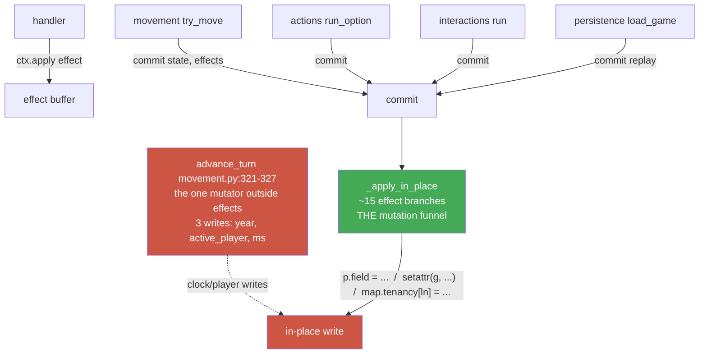

# Immutable State Graph — Plan

## Goal Capsule

**Objective.** Make the engine's `GameState` graph structurally immutable so the replay guarantee (`seed + setup + effect/RNG log = game`) cannot be silently broken by a handler writing state directly. A handler that does `ctx.state.players[sp].ka += 100` — or mutates a nested `formula_params` dict — must **raise at that line**, not corrupt the next save.

**Product authority.** The brainstorm that produced this plan (this session, 2026-07-18). Chosen mechanism: **Approach B — freeze the whole graph** (language-enforced immutability), over a read-only proxy (A) or a typed `StateView` facade (C). Deep immutability (collections too) and a behavior-parity gate were both explicitly chosen by the user.

**Open blockers.** None. All product forks were resolved in the brainstorm. Three planning-time technical questions are recorded in Open Questions (deepcopy removal, nested-update helper shape, perf sanity) — none blocks starting.

**Product Contract preservation.** No separate brainstorm file was written; this plan carries the Product Contract inline (below). It is unchanged from the confirmed brainstorm scope.

---

## Problem Frame

The replay guarantee is the engine's spine — `docs/design/engine-architecture.md` § Save/replay defines a game as `initial seed + setup + ordered effect/RNG log`, and U12 (`engine/persistence.py`) is built on exactly that. The guarantee holds **if and only if** every state mutation flows through an `Effect` committed to the log.

Today that "if and only if" is enforced by a **docstring**. `ctx.state` is documented "read-only for handlers" (`engine/interactions.py:238`; CLAUDE.md § 5.2a calls the handler API "the *only* config interface"), but nothing stops a handler from mutating the live graph directly. Because `GameState`, `Player`, `MapState`, `Clock`, `Config`, and the nested per-player dataclasses are all plain mutable `@dataclass`es (`engine/state/__init__.py:32-180`), a handler can write any field or any nested dict/list.

The failure mode is the worst shape: **silent, delayed, data-corrupting.** A config author writing `ctx.state.players[sp].ka += 100` instead of `ctx.apply(MoneyChange(...))` gets code that works perfectly in play and in manual testing, and silently produces a different result on replay/load — surfacing only when someone loads a saved game. This directly undermines the genre-engine promise ("copy `mafia_1920s`, edit handlers, engine untouched"): a config author has no mechanical signal that they broke the contract.

**Why this is tractable and elegant to fix here.** Research found the engine already funnels **every** mutation through one private function, `_apply_in_place(state, effect)` in `engine/effects.py` (~15 effect branches), plus exactly one mutation outside it — `advance_turn` at `engine/movement.py:327`. And every `commit()` caller already adopts `result.state` (movement, actions, interactions, persistence) rather than relying on in-place identity. The codebase is already written to the functional-result contract; freezing makes that contract structural instead of conventional.

---

## Product Contract

### Requirements

- **R1 — Structural immutability of the state graph.** `GameState` and its entire reachable dataclass graph (`Gangster`, `Job`, `Debt`, `Business`, `Contraband`, `Wanted`, `Player`, `MapState`, `CombatState`, `Clock`, `Config`, `Flags`) become immutable: a direct attribute write raises. A handler cannot express a state mutation that bypasses the effect log.
- **R2 — Deep immutability (collections too).** The collections held inside frozen fields are also read-only: the `dict`s (`map.tenancy`, `map.special_cells`, `config.action_costs`, `config.formula_params` and its nested int-keyed dicts) and `list`s (`players`, `roster`, `map.grid`, combat rosters/grid) cannot be mutated in place through `ctx.state`. This closes the one-level-down false floor a shallow freeze would leave.
- **R3 — Effect application preserved via functional rebuild.** The engine's own write path (`_apply_in_place` and the `apply`/`commit` wrappers) is rewritten from mutate-in-place to functional rebuild (`dataclasses.replace`-style). **No effect's semantics change** — only the mechanism. Every effect produces exactly the same resulting values it does today.
- **R4 — `advance_turn` migrated.** `advance_turn` (`engine/movement.py:327`, the last in-place mutator) is moved onto the same functional-update path. Deep-freeze *forces* this — it is required, not optional.
- **R5 — Behavior-parity gate.** The full test suite (420 tests, incl. the seeded slice trajectory `tests/test_slice_integration.py` and the fidelity assertions) stays green throughout the migration. Green tree is the contract, checked effect-by-effect.
- **R6 — Handler-boundary proof.** A test demonstrates that a direct handler-style write to `ctx.state` (top-level field, nested dataclass field, and a nested collection) raises, proving R1+R2 hold at the seam handlers actually touch.

### Scope Boundaries

**In scope:** R1–R6 above — freezing the graph, deep-freezing its collections, the functional-rebuild of `_apply_in_place`/`apply`/`commit`, the `advance_turn` migration, and the boundary-proof test.

**Deferred to Follow-Up Work (named, not built):**
- **Golden-replay determinism test** (threat #3): save a seeded game → replay the effect log → assert identical reproduction. The user chose the lighter parity gate for *this* plan; this is the natural next brick and is named so it is not lost. Belongs in a follow-up once immutability lands.
- **Explicit `StateView` config-facing contract** (Approach C): making the handler-read surface an explicit, documented, typed API. A deliberate later evolution; the frozen graph is the safe foundation it would sit on.
- **Config-conformance harness** (threat #2): a golden test a config author runs to prove their handlers are well-behaved.

**Outside this product's identity (non-goals):** the read-only proxy (Approach A) and typed facade (Approach C) as *this plan's mechanism* — B supersedes them. Combat, networking, save-format changes, and new content are untouched.

### Success Criteria

- A handler-style write `ctx.state.players[sp].ka += 100` raises (`FrozenInstanceError` or equivalent) at the write line; likewise a nested-dict write `ctx.state.config.formula_params["fnm"] = {}`.
- All 420 existing tests green; no effect's produced values changed (the parity gate).
- The replay guarantee is now **language-enforced** rather than convention-enforced: there is no in-graph object a handler can mutate to escape the effect log.

---

## Key Technical Decisions

**KTD-1 — Freeze via `@dataclass(frozen=True)` on the whole graph, not a wrapper.** This is Approach B. Attribute writes raise `FrozenInstanceError` for free — no proxy machinery to keep bulletproof. The elegance the user chose: immutability becomes a first-class property of the model. Every dataclass in `engine/state/__init__.py` gets `frozen=True`.

**KTD-2 — Deep immutability at construction, not at read.** A frozen dataclass with a `dict`/`list` field still hands out a mutable collection (the false floor). Close it by holding read-only collection types in those fields — `MappingProxyType` for dicts, `tuple` for lists — established when state is **built** (setup + effect-rebuild + persistence load), so the whole reachable graph is immutable by construction. This keeps immutability a property of the object, consistent with KTD-1, rather than reintroducing a freeze-on-read wrapper at the `ctx.state` seam (which is the thing B was chosen to avoid). *Directional; the exact read-only collection representation is an implementation choice — see Open Questions.*

**KTD-3 — One internal nested-update helper, written and tested once.** Functional rebuild of deep state (bump one player's `ka` → rebuild the `Player`, rebuild `players` with that player swapped in, `replace(state, players=…)`) is verbose and error-prone if hand-repeated across ~15 effect branches. Concentrate it in **one** small internal functional-update util (e.g. "replace field on the player at index i, return a new GameState") that every effect branch calls. Written once, tested once — the helper is itself foolproofing. This is engine-internal; it is not part of the handler API.

**KTD-4 — The migration is concentrated, not scattered.** Because all mutation already funnels through `_apply_in_place` (`engine/effects.py`) plus the single `advance_turn` site, the functional rewrite touches those two locations and the two wrappers (`apply`, `commit`) — not every effect's call site across the codebase. The ~15 effect branches change *inside* `_apply_in_place`; their callers are untouched because they already adopt `result.state`.

**KTD-5 — Parity is proven by the existing suite, effect-by-effect (R5).** The 420 tests — especially `tests/test_slice_integration.py` (seeded trajectory) and the per-effect tests (`test_effects.py`, `test_slw.py`, `test_waf_*.py`, `test_sph.py`, `test_score_rank.py`) — are the semantic guard. Migrate one effect branch, run its tests + the suite, keep green, move on. No effect's output values may change; only mutate-in-place becomes rebuild.

**KTD-6 — Persistence load is unaffected; replay flows through the new path for free.** `engine/persistence.py:_state_from_dict` already *constructs* via keyword args (`GameState(...)`, `Player(...)`) — frozen dataclasses construct identically. And `load_game` replays via `commit(save.state, save.effect_log)` (`persistence.py:310`), so it inherits the new functional path automatically. Load must build read-only collections (KTD-2) when reconstructing `map.tenancy` / `formula_params` etc. — the int-key restoration logic stays, it just yields read-only dicts.

---

## High-Level Technical Design

**The mutation funnel today (why the blast radius is small):**



**After the migration:** the two red mutation sites (`_apply_in_place` interior, `advance_turn`'s three writes) become functional rebuilds via the KTD-3 helper; `apply`/`commit` fold effects through `replace` (fold shape landed in U1; deepcopy dropped in U4). `commit`'s effect-committing callers are unchanged — they already adopt the returned state; `advance_turn`'s callers (notably the terminal turn loop) newly adopt its returned state (U5).

**Where immutability is established (KTD-2), by construction site:**

| Build site | File | Produces | Must yield read-only collections |
|---|---|---|---|
| Setup / `new_game` | `data/game_configs/mafia_1920s/setup.py` | initial `GameState` | yes (players tuple, formula_params proxy) |
| Effect rebuild | `engine/effects.py` `_apply_*` + helper | next `GameState` | yes (helper preserves read-only invariant) |
| Persistence load | `engine/persistence.py` `_state_from_dict` | restored `GameState` | yes (tenancy/special_cells/formula_params proxies) |

---

## Implementation Units

Suggested order: **U1 → U2 → U3 → U4 → U5 → U6**. U1 is the foundation everything else builds on; U5 (`advance_turn`) and U6 (boundary proof) are the closing gates. Each unit ends green (R5).

### U1. Freeze the state dataclasses + introduce the nested-update helper

**Goal.** Make every dataclass in the graph `frozen=True` (R1), introduce the single internal functional-update helper (KTD-3), and rewrite the `apply`/`commit` wrappers to fold a *state-returning* `_apply` — so the new dispatch contract has a working caller before any branch is migrated. This unit is expected to turn the tree **red** until U2–U5 migrate the writers — that is the point: the red failures enumerate every mutation site that must move to the functional path.

**Requirements.** R1, R3, KTD-1, KTD-3, KTD-4.
**Dependencies.** none.
**Files.** `engine/state/__init__.py` (add `frozen=True`), `engine/effects.py` (nested-update helper + `apply`/`commit` fold rewrite), `tests/test_state.py`, `tests/test_effects.py`.
**Approach.** Add `frozen=True` to all 13 dataclasses in `engine/state/__init__.py`. Add one small internal helper in `engine/effects.py` — a functional-update util that, given a `GameState`, a player index, and field changes, returns a new `GameState` with a rebuilt `Player` swapped into a rebuilt `players` collection (and analogous helpers for gangster-in-roster and map-dict updates as the effect branches need). Keep the helper private engine vocabulary — not exposed on the handler API. **Also rewrite `apply`/`commit`** to expect a state-returning `_apply(state, effect) -> GameState` and fold through it (`apply` returns `_apply(...)`; `commit` folds `state = _apply(state, effect)`), so the moment U2 migrates the first branch there is a coherent caller. The deepcopy-removal decision is deferred to U4 (keep the deepcopy in place for now if it keeps the transient partially-migrated dispatch simplest — it is harmless while branches still mutate a copy).
**Execution note.** Expect and welcome a red tree after freezing: run the suite and capture which tests fail and where — that failure list *is* the migration checklist for U2–U5. Do not chase green in this unit beyond the helper's own tests; U2 starts the writer migration.
**Technical design (directional, not literal).**
```
# nested functional update — written ONCE, used by every effect branch
def _with_player(state, idx, **field_changes) -> GameState:
    new_player = dataclasses.replace(state.players[idx], **field_changes)
    new_players = _tuple_replace(state.players, idx, new_player)   # read-only-preserving
    return dataclasses.replace(state, players=new_players)
```
**Patterns to follow.** The existing frozen effect/event dataclasses (`engine/effects.py`, `engine/events.py` already use `@dataclass(frozen=True)`) — mirror that exactly for the state graph.
**Test scenarios.**
- Frozen proof: constructing a `Player` / `GameState` still works via keyword args; a direct attribute write (`p.ka = 5`) raises `FrozenInstanceError`.
- Helper happy path: `_with_player(state, 0, ka=999)` returns a new state whose player 0 has `ka == 999` and whose *other* players and fields are untouched (structural sharing / equality of siblings).
- Helper purity: the input `state` is not mutated by the helper (assert the original player's `ka` is unchanged).
**Verification.** The frozen-proof and helper tests pass. The wider suite is expected red here (documented in the Execution note); it returns green by end of U5.

### U2. Migrate the scalar-field effect branches to functional rebuild

**Goal.** Rewrite the player-scalar effect branches inside `_apply_in_place` — `MoneyChange`, `ScoreChange`, `MsChange`, `SetPosition`, `SetEntryContext`, `Teleport`, `RentAccrue`, `ScoreAndRank` — from `p.field = …` to the KTD-3 helper, preserving exact semantics (R3).

**Requirements.** R3, R5, KTD-4, KTD-5.
**Dependencies.** U1.
**Files.** `engine/effects.py`, `tests/test_effects.py`, `tests/test_score_rank.py`, `tests/test_slw.py`.
**Approach.** For each listed branch, replace the in-place write with a functional rebuild via the U1 helper. Preserve every clamp/floor/cap exactly: `ScoreChange` clamps gf to [0,100] (`mf-prg.bas:1160-1161`); `MsChange` is NOT clamped (may reach ≤0 to force turn end); `ScoreAndRank` recomputes `nr` from the *clamped* gf with a config divisor. `_target_index` resolution is unchanged.

**Ordering note (why this unit can reach green).** `_apply_in_place` changes contract here — it stops returning `None`-and-mutating and starts returning a new state. For U2's own tests to pass, its callers (`apply`/`commit`) must already expect that new-return contract. **Therefore the `apply`/`commit` fold rewrite (formerly U4's first half) moves into U1** as the enabling wrapper change, so from the very first branch migrated the dispatch has a working functional caller. U2 then migrates branches against green wrappers, one at a time. (U4 retains only the *construction-site read-only-collection* work, not the wrapper rewrite — see U4.) A partially-migrated `_apply_in_place` — some branches functional, some still mutating — is the transient state during U2/U3; keep it coherent by having the dispatch return `state` from migrated branches and `_apply(state, effect)` fall through consistently. If a clean split proves awkward, the acceptable fallback is to migrate all scalar branches (U2) in one commit rather than truly one-at-a-time, still gated by the full suite.
**Execution note.** Characterization-first is already provided: these branches have direct tests (`test_effects.py`, `test_score_rank.py`). Migrate, run the suite, keep green. The enabling wrapper change lands in U1 so these tests *can* be green at U2's boundary.
**Patterns to follow.** The current branch bodies in `engine/effects.py:_apply_in_place` — preserve their exact arithmetic and clamp logic; only the write mechanism changes.
**Test scenarios.**
- Each migrated effect reproduces its existing test exactly (values identical pre/post migration) — this is the parity assertion.
- `MsChange` can still drive `ms` to 0 and below (turn-end signal preserved).
- `ScoreAndRank` produces identical `gf` and `nr` as today for a representative buy (cross-check against `test_score_rank.py`).
- Purity: applying any of these effects does not mutate the input state.
**Verification.** All effect + score-rank + slw tests green; no value changed from the pre-migration baseline.

### U3. Migrate the roster/gangster and map/dict effect branches

**Goal.** Rewrite the branches that reach one level deeper — `StatChange`, `StatChangeCapped`, `AssignWeapon` (into `player.roster[g]`), `SetTenancy` and `FlagSet` (into `map.tenancy` dict / `flags`) — onto the functional path, and establish read-only collections for `map.tenancy` / `flags` (R2, R3).

**Requirements.** R2, R3, R5, KTD-2, KTD-3.
**Dependencies.** U1.
**Files.** `engine/effects.py`, `tests/test_effects.py`, `tests/test_waf_buy.py`, `tests/test_waf_train.py`, `tests/test_slw.py`.
**Approach.** Add a roster-level helper (replace gangster at index within a player's roster tuple) and a map-dict helper (return a new read-only tenancy mapping with one key set). Preserve exact guards: `_STAT_NAMES` validation → `ValueError`; out-of-range gangster index → `IndexError`; `FlagSet` only `scope == "global"`, unknown flag → `ValueError`. `SetTenancy` writes `tenancy[ln] = target_index` (`mf-prg.bas:10040`) — now producing a new read-only dict. `AssignWeapon` sets `roster[g].weapon` via the roster helper.
**Approach note (R2 nuance).** This unit is where the false-floor closes for `map.tenancy` and `flags`. `formula_params` / `action_costs` read-only-ness lands in U4's construction-site pass since they are built at setup/load, not written by effects.
**Patterns to follow.** The current `StatChangeCapped` / `AssignWeapon` / `SetTenancy` branch bodies — preserve their guard order and error types exactly.
**Test scenarios.**
- `StatChangeCapped` reproduces its existing cap/floor behavior (config-supplied cap, not a hardcoded 99) — parity with `test_waf_train.py`.
- `AssignWeapon` sets the right gangster's weapon and leaves other gangsters/players untouched.
- `SetTenancy` records `tenancy[ln] = sp` and returns a state whose tenancy is read-only (a subsequent write attempt on the returned `tenancy` raises).
- Error paths preserved: unknown stat → `ValueError`; out-of-range gangster → `IndexError`; unknown flag → `ValueError`.
- Purity across all three: input state unmutated.
**Verification.** All effect + waf + slw tests green; guard error types unchanged; tenancy/flags now read-only.

### U4. Establish read-only collections at every construction site; resolve deepcopy

**Goal.** Ensure every *construction* site (setup, load) yields the read-only collections R2 requires for `formula_params` / `action_costs` / `grid` / `players`, and resolve whether the `apply`/`commit` deepcopy (kept through U1–U3) can now be dropped. (The `apply`/`commit` *fold* rewrite already landed in U1; this unit does the construction-site immutability and the deepcopy decision.)

**Requirements.** R2, R3, R5, KTD-2, KTD-6.
**Dependencies.** U2, U3.
**Files.** `engine/effects.py` (`apply`/`commit` deepcopy removal only — the fold shape is already in place from U1), `data/game_configs/mafia_1920s/setup.py` (construct read-only collections), `engine/persistence.py` (`_state_from_dict` yields read-only collections), `tests/test_effects.py`, `tests/test_persistence.py` (or the existing persistence test file), `tests/test_setup.py`.
**Approach.** **Resolve the deepcopy question here (Open Q1):** with an immutable graph and functional rebuild (fold already in place from U1), the up-front `copy.deepcopy` in both wrappers is no longer defending against shared-mutable aliasing — remove it and prove via the purity tests that callers' input states are still never observably mutated. At construction sites, wrap `players`/`roster`/`grid` as tuples and `formula_params`/`action_costs`/`tenancy`/`special_cells` as read-only mappings so the whole built graph satisfies R2. Persistence int-key restoration logic stays; it just yields read-only dicts. **Serialization note (Open Q3):** `MappingProxyType` is not JSON-serializable, so `save_game` must convert any read-only mapping back to a plain dict on write; the load side already rebuilds the read-only form — verify the round-trip here.
**Execution note.** This is the semantics-adjacent unit (it owns state-transition + the deepcopy removal). Lean hardest on `tests/test_slice_integration.py` (the seeded end-to-end trajectory) and the persistence round-trip test as the parity guard. If removing deepcopy surfaces any aliasing surprise, that is a real finding — record it, keep the deepcopy, and note it in the plan's Open Questions rather than forcing removal.
**Patterns to follow.** Current `apply`/`commit` structure (`engine/effects.py:459-500`) — keep the `CommitResult` shape and the "empty effects yields equal-but-distinct state" contract; `distinct` now means a new frozen object, satisfiable without deepcopy.
**Test scenarios.**
- `apply` returns a new state with one effect applied; input unmutated; no deepcopy relied upon.
- `commit` folds multiple effects in order, identical result values to today (parity vs. baseline).
- Empty-effects `commit` still returns an equal-but-distinct state.
- Persistence round-trip: `save_game` → `load_game` reproduces the same `GameState` values, and the restored graph's collections (tenancy, formula_params) are read-only.
- Setup: `new_game` produces a graph whose `players`, `formula_params`, `action_costs` are read-only (write attempts raise).
**Verification.** Full effect + persistence + setup + slice-integration suites green; wrappers no longer deepcopy (unless the Open-Q escape hatch fired, documented).

### U5. Migrate `advance_turn` to the functional path

**Goal.** Move the last in-place mutator — `advance_turn` (`engine/movement.py:321-327`, three writes: `clock.year`, `clock.active_player`, `active.ms`) — onto functional rebuild, so the frozen graph no longer breaks the turn loop (R4). This unit returns the whole tree green.

**Requirements.** R4, R5.
**Dependencies.** U1, U4.
**Files.** `engine/movement.py`, `tests/test_movement.py`, `tests/test_slice_integration.py`.
**Approach.** `advance_turn` makes **three** in-place writes today, all of which the frozen graph forces onto the functional path — migrate all three, not just `ms`:
- `engine/movement.py:321` — `clock.year += 1` (on wrap; frozen `Clock`),
- `engine/movement.py:323` — `clock.active_player = next_player` (frozen `Clock`),
- `engine/movement.py:327` — `active.ms = vehicles[active.vehicle]["tr"]` (frozen `Player`).

Rebuild a new `Clock` (year + active_player) and the new active `Player` (ms) via the U1 helper, and return the new state. **Note the known asymmetry:** `advance_turn` currently mutates in place and returns a bool (game-over hook); the frozen graph forces it to return the new state *and* the bool — return both (e.g. `(state, game_over)`) or restructure so callers adopt the new state. Thread the returned state through its callers: the terminal client's turn loop (`clients/terminal/__main__.py` calls `advance_turn(state, vehicles)` and currently discards the mutated-in-place result) and any `engine/` internal caller must now adopt the returned state. This finishes the turn-layer purity story flagged in the State/Event Foundation.
**Execution note.** Proof-first via `test_movement.py`'s existing turn-rotation tests (single-player wraps every turn, ms replenishment). Migrate, run `test_movement.py` + `test_slice_integration.py`, confirm green.
**Patterns to follow.** The pure `try_move`/`commit` pattern already in `engine/movement.py` (returns a new state via `commit`) — make `advance_turn` match that shape.
**Test scenarios.**
- Turn rotation: after `advance_turn`, the active player advances (wraps to 0 with year+1 at the last player) — values identical to today.
- ms replenishment: the new active player's `ms` equals its vehicle's `tr` (parity with `test_movement.py`).
- Year advance on wrap: when the active player wraps from last → 0, `clock.year` increments by 1 (frozen `Clock` rebuilt correctly, not just `ms`).
- Single-player wraps every turn (existing test) still passes.
- Return contract: `advance_turn` returns the new state (plus the game-over signal); the game-over-at-`end_year` hook still fires.
- Client adoption: the terminal turn loop adopts the returned state (a follow-on turn sees the replenished `ms` and rotated player) — covered by `test_slice_integration.py` and/or the terminal integration turn-over walk.
- `test_slice_integration.py` seeded trajectory (which walks to turn-over and advances) stays green end-to-end.
**Verification.** `test_movement.py` and `test_slice_integration.py` green; the full 420-test suite green (R5 fully satisfied — the tree is green again).

### U6. Handler-boundary proof test

**Goal.** Prove R1+R2 hold at the exact seam handlers touch: a direct write to `ctx.state` (top-level field, nested dataclass field, and a nested collection) raises. This is the test that demonstrates the foolproofing to a future config author (R6).

**Requirements.** R6, R1, R2.
**Dependencies.** U1, U4.
**Files.** `tests/test_handler_boundary.py` (new), or extend `tests/test_substate.py` / an existing handler-context test.
**Approach.** Build a `GameState` via `new_game`, then assert that attempting each of these writes raises: (a) top-level field (`state.players[0].ka = 999` via the frozen player), (b) nested dataclass field (`state.players[0].wanted.x5 = True`), (c) nested collection (`state.config.formula_params["fnm"] = {}` and `state.map.tenancy[1] = 0`). Frame the test as the executable statement of the handler-API read-only contract — the thing CLAUDE.md § 5.2a asserts, now enforced.
**Execution note.** Write these as the explicit contract proof; each assertion is one line of `pytest.raises`. This is the unit that makes the invisible guarantee visible and greppable.
**Patterns to follow.** Existing `pytest.raises` usage in the suite (e.g. error-path assertions in `test_effects.py`).
**Test scenarios.**
- Top-level frozen: `state.players[0].ka = 999` raises `FrozenInstanceError`.
- Nested dataclass frozen: `state.players[0].wanted.x5 = True` raises.
- Nested dict read-only: `state.config.formula_params["fnm"] = {}` raises `TypeError` (read-only mapping).
- Nested dict read-only: `state.map.tenancy[1] = 0` raises.
- List read-only: `state.players.append(...)` raises (players is a tuple/read-only).
- Positive control: reads still work — `state.players[0].ka` returns the value; a legitimate effect through `commit` still updates it.
**Verification.** All boundary-proof assertions pass; the positive control confirms reads and effect-driven writes are unaffected. Full suite green.

---

## Verification Contract

- **Test command:** `make check` (pytest + soft lint) from the repo root — must stay green at the end of every unit except U1 (which is expected red until U5 closes the writer migration; documented in U1's Execution note).
- **Gates that prove the plan:**
  - R1/R2 (structural + deep immutability): U6's boundary-proof test — writes at three depths (field, nested field, nested collection) all raise.
  - R3/R5 (semantics preserved): the full pre-existing suite stays green with **no changed effect output values** — U2/U3/U4 migrate branch-by-branch against their existing tests as the parity baseline; `tests/test_slice_integration.py` is the end-to-end guard.
  - R4 (`advance_turn`): `tests/test_movement.py` turn-rotation + ms-replenishment tests green after U5.
  - KTD-6 (persistence): the save→load round-trip test reproduces identical state and yields read-only collections.
- **Behavioral-fidelity bar:** unchanged from the project standard — assert against research-documented formulas and value ranges, not a byte-for-byte C64 RNG trace. This plan changes *mechanism*, never *values*; the fidelity assertions already in the suite are the guard.

---

## Definition of Done

- R1: every dataclass in `engine/state/__init__.py` is `frozen=True`; a direct attribute write raises.
- R2: the collections inside frozen fields (`tenancy`, `special_cells`, `action_costs`, `formula_params` + nested, `players`, `roster`, `grid`) are read-only through `ctx.state`; a nested-collection write raises.
- R3: `_apply_in_place`/`apply`/`commit` are functional; every effect produces identical values to pre-migration.
- R4: `advance_turn` no longer mutates in place; it returns the new state and callers adopt it.
- R5: `make check` is green — all 420 tests, including the seeded slice trajectory and fidelity assertions.
- R6: `tests/test_handler_boundary.py` proves the read-only contract at field, nested-field, and nested-collection depth, with a positive control for reads and effect-driven writes.
- The deepcopy question (Open Q1) is resolved one way or the other, with the decision recorded (removed, or kept with the reason).

---

## Open Questions (planning-time, non-blocking)

- **Q1 — Drop `commit()`'s deepcopy?** With an immutable graph and functional rebuild, the up-front `copy.deepcopy` in `apply`/`commit` (`engine/effects.py:470,497`) likely becomes unnecessary — there is no shared-mutable object to defend against. Resolved in U4, test-gated by the purity assertions. If removal surfaces any aliasing surprise, keep the deepcopy and record why. (Latent simplification + small perf win, but semantics-adjacent — hence gated, not assumed.)
- **Q2 — Nested-update helper shape (KTD-3).** A small hand-rolled `replace`-based util (recommended default — minimal, no dependency) vs. a lightweight lens/optics pattern. Implementation choice for U1; the default is the hand-rolled helper unless the roster/map cases prove it too verbose.
- **Q3 — Read-only collection representation (KTD-2).** `MappingProxyType` + `tuple` (recommended default — stdlib, zero-dependency, truly read-only) vs. a frozen-collection helper type. Note: `MappingProxyType` is not directly JSON-serializable, so persistence save must convert proxies back to plain dicts on write (the load side already rebuilds them) — verify in U4.
- **Q4 — Perf sanity.** Rebuild-per-effect vs. today's one deepcopy-per-commit. Almost certainly negligible at this scale (small graph, few effects per commit) and likely *faster* once the deepcopy is dropped — worth one measurement during U4, not a gate.

---

## Sources & Research

- Brainstorm dialogue (this session, 2026-07-18) — chose Approach B, deep immutability, behavior-parity gate; recorded the follow-on golden-replay/StateView/conformance-harness deferrals.
- `engine/state/__init__.py:32-180` — the 13-dataclass state graph (mutable today).
- `engine/effects.py:459-540` + `_apply_in_place` — the single mutation funnel (~15 effect branches) and the `apply`/`commit` deepcopy wrappers.
- `engine/movement.py:327` — the one mutation site outside effects (`advance_turn`).
- `engine/persistence.py:145,182,310` — construction-via-keyword-args (frozen-safe) and replay-via-`commit` (inherits the new path).
- Commit callers that already adopt `result.state`: `engine/actions.py:172`, `engine/movement.py:238,259`, `engine/interactions.py:316`, `engine/persistence.py:310`.
- `docs/solutions/architecture-patterns/engineresult-action-spine-effects-only-mutation.md` — the established effects-only-mutation / adopt-`result.state` contract this plan makes structural.
- CLAUDE.md § 5.2a — "the handler API is the only config interface"; `docs/design/engine-architecture.md` § Save/replay — the replay guarantee this plan protects.
