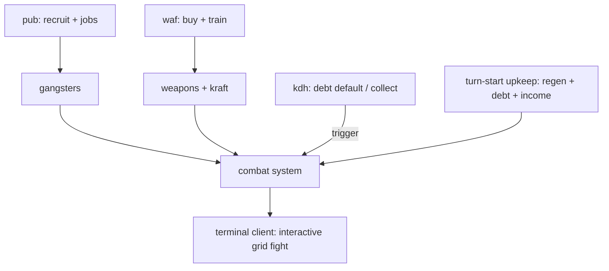
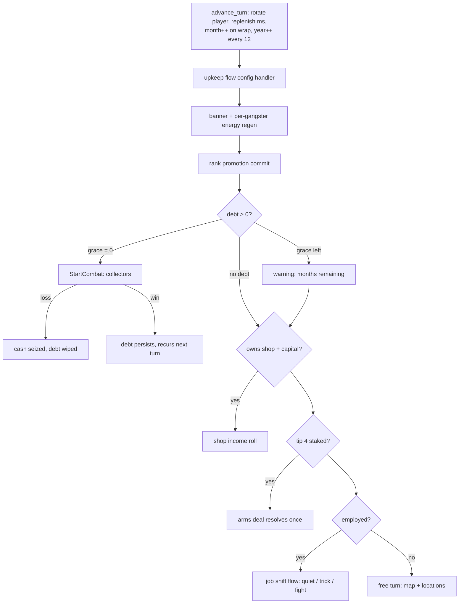
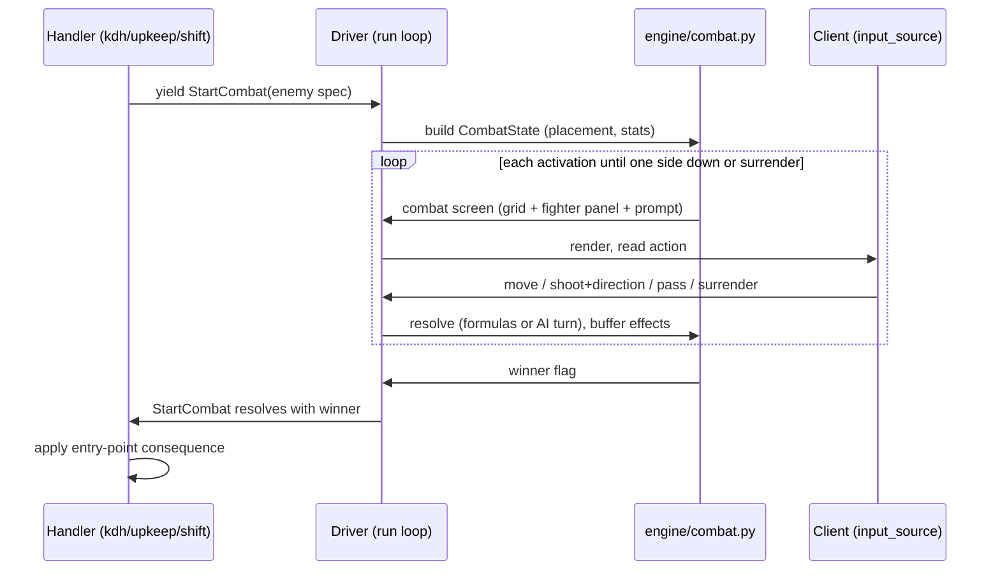

# First Slice Completion (Minimal Armed Closure) - Plan

## Goal Capsule

- **Objective:** Close the first vertical slice so that every implemented system has its final shape, every dependency of an implemented system is present, and everything is testable — automated at the driver and client level, and manually playable in the terminal client.
- **Product authority:** Game behavior comes from `../research/` (the decompiled BASIC, queried via the mafia-oracle skill) — never invented. Engine architecture comes from `docs/design/`. Scope decisions come from this Product Contract.
- **Execution profile:** Proof-first per `docs/AGENTS.md` — a feature-bearing unit starts with a failing test; `make check` must be green before any dispatch or commit.
- **Stop conditions:** A behavior that would require an out-of-scope system (wanted/police, jail application, vehicles gameplay, endings) is surfaced as a scope conflict, not silently built. A research reading that conflicts with the research interpretation layer is flagged per the relational-sign rule (see Risks), not silently resolved.
- **Open blockers:** None. The four questions the Product Contract deferred to planning are resolved in the Planning Contract; two non-blocking fidelity flags remain in Open Questions.

---

## Product Contract

Product Contract preservation: changed R4 (loss consequence resolved from research: no player elimination exists), R5 (the "drink" option is alcohol trading in the source), R6 and F3 (jobs pay a lump sum after per-turn shifts, not a monthly wage), and rewrote Dependencies/Outstanding Questions to their resolved state. All changes are research corrections under the contract's own product-authority rule; the scope cut is unchanged.

### Summary

Complete the first slice via a minimal armed closure: implement the combat system end-to-end (engine through interactive terminal play), finish the pub to its full research shape (alcohol trading, recruiting, tips, jobs with their shift system), and add `kdh` (loan shark) as the fifth location — the slice's combat trigger. Two pieces of infrastructure the requirements imply are built alongside: a turn-start upkeep flow (energy regeneration, debt check, shop income, arms-deal resolution) and month granularity on the clock. This gives gangsters, weapons, and training the purpose they exist for, without pulling in endings, the wanted system, or the remaining seven locations.

### Problem Frame

The slice as shipped is architecturally complete but not closed as a game. Weapons are buyable but unusable, gangster recruitment is a stub that raises, and `kraft` training improves a stat nothing consumes — all three exist for combat, and combat does not exist. Worse, every combat entry point in the original lives in a location the slice doesn't have (`kdh`, `aut`, `sgl`, `bhf`, `ban`) or in the two map events, so "implement combat" necessarily means adding at least one new location. The pub is also the only implemented location that falls short of its research shape: the research gives it four options; the slice implements one, as a stub.

### Key Decisions

- **Minimal armed closure over playable loop or full content.** The cut is the smallest set that makes everything implemented final-shape and reachable. The game deliberately still has no ending: "manually testable" means every system is playable, not that a game is completable.
- **`kdh` as the combat trigger, not `aut`/`sgl`/`bhf`/`ban`.** Smallest ride-along set: it activates the existing `Debt` state class and needs no wanted/police subsystem. Vehicles stay data-only as a consequence (`aut` deferred).
- **Wanted and jail effect types stay declared-but-stubbed.** Implementing their application without any in-slice trigger would create unplayable systems, violating the everything-playable bar. The combat-consumed deferred effects — gangster energy and fighter spawning — gain real application; combat cannot spawn its enemies without the latter.
- **Combat outcomes are ported faithfully, not designed.** Resolved from the research: the original has no player death or elimination. Knocked-out fighters regenerate energy every turn start; losing a fight carries only the entry point's consequence (debt default: all cash seized, debt wiped; debtor ambush: nothing). Hot-seat play always continues, so no endings work is forced in.

The closure logic in one picture:

### Requirements

**Combat system**

- R1. The tactical combat system is a faithful port of the original fight (`mf-prg.bas:30000–30520` plus the machine-code targeting routine): 40×13 grid, one-action-per-fighter activations, hit/damage/energy formulas, and NPC pursuit AI with direction memory, each cited to its research source.
- R2. The driver executes `StartCombat` as a sub-protocol over the existing generator/interaction spine — no transport dependency, no `NotImplementedError` path left.
- R3. Combat consumes the systems that exist for it: equipped weapons, gangster stats, and trained `kraft`/energy per the original formulas; the deferred gangster-energy and fighter-spawn effects gain real application, including the turn-start energy regeneration that makes knock-outs recoverable (`mf-prg.bas:4015–4025`).
- R4. Combat outcomes — victory, surrender, defeat — follow the original: no player death or elimination exists; the consequence of losing is per entry point (debt default at `mf-prg.bas:4365–4370`: all cash seized, debt wiped; collect-debts ambush: none), and hot-seat play continues for all players.

**Pub completion**

- R5. The pub implements all four research options: alcohol trading (`mf-prg.bas:12010–12075` — buy barrels at the one pub tile that sells, sell anywhere on a 50% offer, capacity-capped by vehicle), recruit gangsters (`12100–12175`, replacing the stub), buy a tip/rumour (`12200–12252`), and look for a job (`12300–12335`).
- R6. The jobs mechanic works end-to-end per `mf-prg.bas:12300–12335` and `25000–25560`: inverted rank guard (rank ≤ 3 only), availability roll, the four job types with duration and pay; every employed turn becomes a job shift (with its fights) instead of a free turn, and the wage is paid once as a lump sum when the final shift completes — a failed shift fight ends the job unpaid.

**kdh (loan shark)**

- R7. `kdh` is implemented complete — all six research options (borrow, repay, buy/sell the loan shop, adjust shop capital, collect debts, leave), plus the shop's passive monthly income in upkeep.
- R8. The debt lifecycle activates the existing `Debt` state: borrowing, repayment, the collectors fight on default (`mf-prg.bas:4300–4370`), and the collect-debts ambush (`15300–15321`) wired to real combat.

**Final-shape audit**

- R9. `slw`, `waf`, and `sph` are audited for final shape on two axes — option coverage against the research, and runtime correctness when actually played in the client — and every gap or defect found is closed. The known defect class is confirmed: the client passes `rng=None` into `run_option`, so any handler RNG draw crashes in the client while driver tests (which inject a stub RNG) stay green; `sph` gambling is the reported instance and `waf`'s buy/train rolls share the root cause. A defect whose fix would require an out-of-scope system is surfaced as a scope conflict rather than silently expanded.
- R12. The turn system gains the original's upkeep and clock semantics: a per-turn upkeep flow at each player's turn start (banner, per-gangster energy regeneration, rank promotion commit, debt check, shop income, arms-deal resolution — `mf-prg.bas:4000–4090`) running through the same interaction protocol as location handlers, and a month-granularity clock (one full player round = one month; a year is 12 rounds — `mf-prg.bas:1010`).

**Client and testability**

- R10. The terminal client renders combat and accepts interactive grid play (movement, aiming, shooting, pass, surrender) — every implemented system is reachable and manually playable in the client.
- R11. Automated coverage in the existing `make check` gate, three parts: seeded driver-level tests for combat and each new handler; terminal-client integration tests that drive at least one full interactive play-through via the client's real input loop for every implemented location — the R9 audit targets (`slw`, `waf`, `sph`) as well as the new flows; and a regression test for every defect closed under the R9 audit. Driver-level green does not imply client-runnable — the sph defect passed driver tests while erroring in the client, so the client-loop tests are the part that closes that gap class.

### Key Flows

- F1. Debt-default combat
  - **Trigger:** A player's debt grace counter reaches zero at their turn start.
  - **Steps:** While the counter runs, upkeep shows the debt warning with months remaining; at zero, the collectors fight spawns (5 eintreiber, schlagkette, 30 energy each); interactive grid combat in the client; on loss all cash is seized and the debt wiped; on win nothing changes and the fight recurs next turn until repaid or lost.
  - **Covers:** R1–R4, R8, R10, R12.
- F2. Build-a-crew loop
  - **Trigger:** Player recruits at the pub, buys weapons and trains at `waf`.
  - **Steps:** Recruit per research guards (rank, housing, crew cap); arm gangsters; train `kraft`; the crew's stats — boss included as fighter 1 — are what combat consumes.
  - **Covers:** R3, R5.
- F3. Job lifecycle
  - **Trigger:** Player takes a pub job (rank ≤ 3).
  - **Steps:** Availability roll; offer with type, duration, and pay; acceptance force-ends the turn; each following turn runs one shift (quiet day, croupier trick, or a fight) instead of a free turn; on the last successful shift the full wage is paid and the job ends; a lost shift fight ends the job unpaid with a score penalty.
  - **Covers:** R1, R6, R12.

### Success Criteria

- The defining manual session, executed end-to-end as a single sitting before the slice is declared complete: in the terminal client, a player can walk the map, trade alcohol and buy a tip at the pub, recruit gangsters, take a job and play its shifts, buy and train at `waf`, gamble at `sph`, rent at `slw`, borrow at `kdh`, buy the loan shop and collect debts, default, and fight the collectors interactively on the rendered grid — with no reachable option hitting a stub.
- Behavioral fidelity: formulas, probabilities, and outcomes in new code match their cited research lines (behavioral bar per `CLAUDE.md`, not bit-exact).
- `make check` green with the new automated coverage (R11).

### Scope Boundaries

Deferred for later (not cancelled):

- Win/lose conditions and endings (`mf-prg.bas:40000–40166`). Confirmed unreachable from combat: the endgame is entered only from the calendar limit and the rank-10-plus-win-flags check.
- The remaining seven locations: `aut`, `sgl`, `sub`, `bhf`, `ban`, `pol`, `ble`, and their combat entry points; the gang-war (`27000–27045`) and jail-brawl (`27100–27150`) fights.
- The two map-triggered event flows (cash transport cell 569, mayor hit cell 861) and their win flags. Pub tips 1/2/3/5 therefore store the tip flag and show their verbatim text only — the heists they arm stay deferred; tip 4 (arms deal) is the one tip that resolves in-slice.
- The wanted/police subsystem and jail — effect types stay declared-but-stubbed. The debt check's jail gate (`mf-prg.bas:4040`) is read-only and trivially passes in-slice.
- Vehicle gameplay (`aut` dealer, travel effects) — `vehicles.yaml` remains data-only; the pub alcohol-trade capacity read (`tk(tm(sp))`) is a data read, not vehicle gameplay.
- Upkeep lines with no in-slice system: rent seizure/eviction (`4045–4046`, `4600–4652`), bribe-months decay (`4050`), forged-papers decay (`4055–4056`).

### Dependencies / Assumptions

- The research covers every mechanic in scope with line-cited interpretations; the mafia-oracle skill is the query layer. Verified during planning for combat (`30000–30520`), upkeep (`4000–4090`), pub (`12000–12335`, `25000–25560`, `31000–31051`), and kdh (`15000–15321`, `4300–4370`).
- `Debt` (`amount`/`months` ↔ `kr(sp)`/`kz(sp)`) and `Job` (`type`/`pending_pay`/`months_left` ↔ `jo`/`jl`/`jd`) already have research-matching shapes and need activation only. `CombatState` is an empty stub needing real design (U4). `Business` needs `shop_owner: bool` replaced by a tile index — the original's `kg` array is per-player with the owned tile as value, so no tile-indexed map is required (Planning Contract).
- Hot-seat rotation exists (`engine/movement.py` `advance_turn`); it gains month semantics and the upkeep hook in this plan (R12).

---

## Planning Contract

### Resolved planning questions

The four questions the Product Contract deferred, answered from the research:

1. **Player loss/death (R4):** no elimination exists anywhere in the original — `gz` is never decremented, knocked-out fighters regenerate at turn start, and combat never routes to the endgame block. Loss consequences are per entry point only.
2. **kdh scope conflicts:** none in the six options. Option 5 needs combat (in scope); option 3 reads rival players' ownership (multiplayer state, in scope); the debt check reads jail state as a gate only (trivially true in-slice). The *pub* is where outside reads live: vehicle capacity (data read, in scope), slw tenancy (in state, in scope), tips arming deferred heists (text-only in-slice), and the arms-deal upkeep resolution (ported, self-contained).
3. **Shop ownership state:** `kg` is indexed by player and stores the owned kdh tile index (0 = none); the rival scan is a linear pass over players at buy time only (`mf-prg.bas:15107`). `Business.shop_owner: bool` becomes `shop_tile: int`; no per-tile map.
4. **Debt-default check location:** the start of the debtor's own turn, in per-turn upkeep (`1011 gosub4000` → `4040`), gated on not-jailed. Home in the port: the upkeep flow (U3/U12), not location entry.

### Key Technical Decisions

- KTD-1 **Combat is a driver sub-protocol; combat logic is engine code.** The `StartCombat` branch in `engine/interactions.py` becomes an inline driving loop modeled on the existing `_run_substate` pattern — sharing the parent `Ctx` so combat effects buffer and commit atomically with the invoking handler's. The combat rules engine (grid, activations, formulas, AI) lives in a new `engine/combat.py`: it is genre-engine machinery per `docs/design/`, not config code. Weapon combat stats (accuracy `ts`, damage `tg`) are config data next to the existing weapon prices. Mid-fight state is working memory owned by `engine/combat.py` (positions, enemy energies, direction memory), not the persistent graph: setup lands via `SpawnFighter` effects into `CombatState`, the blow-by-blow evolves in working state, and the fight's persistent consequences — roster energy/down deltas, money, score, result — are buffered as effects into the shared `Ctx`, so the handler-atomic commit contract and `run_pure`'s replay check both hold (RNG draws are logged; replaying the effect stream reproduces the post-fight graph). Combat is only ever yielded from top-level handlers this slice — the driver asserts this rather than supporting `StartCombat` inside `_run_substate`. Mid-fight save is out of scope; save points are between turns.
- KTD-2 **The interaction vocabulary gains a combat screen.** Each activation yields a new typed, JSON-serializable interaction carrying the grid snapshot, the active fighter's panel (stats, weapon), and the requested input (action or aim direction). Overloading `ShowMessage`/`PromptChoice` cannot carry a 40×13 grid; a dedicated interaction keeps the protocol network-ready and lets the terminal client (and any future client) own rendering. Combat prompts are non-cancellable: the client's quit vocabulary (EOF included) maps to surrender per KTD-9 — a mandatory fight, like the debt default, cannot be escaped through a cancel unwind.
- KTD-3 **Turn-start upkeep is a config handler driven by the engine.** A per-turn upkeep flow runs through the same generator/interaction/effect protocol as location handlers, registered by the game config and executed by the driver at each player's turn start, before the free turn (or job shift). The engine owns the coupling: one engine-level turn-start entry point runs the upkeep flow as part of starting a turn, so no transport can rotate to a free turn without upkeep having run — the client consumes that API rather than deciding to call upkeep. Order per `mf-prg.bas:4000–4090`: banner → per-gangster energy regen → rank promotion commit → debt check → shop income → arms deal. "Monthly" ticks are per-player-turn, which equals monthly because one full round is one month.
- KTD-4 **The clock gains month granularity.** `advance_turn`'s full-round wrap advances the month; the year increments every 12 rounds (original `ja=ja+1/12`, year = `int(ja)`). The current one-round-equals-one-year simplification is replaced; debt grace, job durations, and shop income all depend on it.
- KTD-5 **Job shifts replace the employed player's turn.** After upkeep, a player with an active job runs the shift flow (`25000–25560`) — no map movement, no location menu — mirroring `1012`. The shift flow is config handler code sharing the combat sub-protocol for its fights.
- KTD-6 **The boss is roster fighter 1.** Matching `mf-prg.bas:300`, each player's persona joins combat as the first fighter of their side, with stats rolled at game start (`310–315`) and energy participating in regen. Setup and state migrate so `roster[0]` is the boss rather than adding parallel player-stat fields.
- KTD-7 **New state follows the frozen-graph extension pattern.** New fields get defaults, `_coerce_readonly` for collection-typed fields, effect-only mutation via new `_apply` branches, and `json_safe`/`persistence` round-trips — per `docs/solutions/architecture-patterns/freezing-a-mutable-dataclass-graph.md`. `EnergyChange` and `SpawnFighter` gain real application; `WantedChange`/`Jail` stay stubbed.
- KTD-8 **The client gets one session-scoped RNG.** `play()` constructs a single seeded `Rng` and threads it through every `run_option` call (today `clients/terminal/__main__.py` passes `rng=None`, the root cause of the sph client crash). One session RNG, not per-call construction, preserves reproducibility.
- KTD-9 **Fidelity policies, decided once:** port from the decompiled code when it conflicts with a research interpretation (collect-debts ambush is 2/3, not the YAML's 1/3); do not port dead code (the pub `ln=5` alcohol branch); keep source-confirmed oddities (on-foot capacity 50 barrels; the win-keeps-debt recurring collectors fight); pin the debtor-ambush combat backdrop to `ks` instead of replicating the original's stale-`kf$` accident; map the original's combat keys (`:`/`;`/`@`/`/`/RETURN/SPACE/`q`) to client-appropriate keys — key bindings are presentation, formulas are not.

### High-Level Technical Design

Turn processing after this plan — every box runs through the same generator/interaction/effect protocol:

The combat sub-protocol (KTD-1/KTD-2), directional:

### Assumptions

Un-validated bets this plan proceeds on (scoping confirmation was skipped — unattended session):

- The Product Contract corrections (R4/R5/R6, F3) are accepted on the research's authority without a user round-trip; the scope cut itself is untouched.
- The upkeep deferrals (rent seizure/eviction, bribe/papers decay) are acceptable — they belong to out-of-scope systems and nothing in-slice triggers them. The pub recruit housing guard only *reads* tenancy, which exists.
- Combat backdrop walls are ported for the three in-slice backdrops only (`ks`, `kp`, `km`), derived from the research's rendered combat screens; if extraction is unreliable, an empty-arena fallback is surfaced as a fidelity deviation rather than silently shipped.
- Thirteen units is the right grain for the one-orchestrator/one-subagent execution model; the board convention (one issue per unit, `dep:` labels) applies as usual.

### Sequencing

Suggested order: U1 → U2 → U3 → U4 → U5 → U6 → U7 → U8/U9 (independent of each other) → U10 → U11 → U12 → U13. U1 is deliberately first: it fixes a live defect and builds the client-loop harness every later unit's client tests depend on.

---

## Implementation Units

| U-ID | Unit | Key files | Depends on |
|---|---|---|---|
| U1 | Client session RNG + client-loop harness + runtime audit | `clients/terminal/__main__.py`, `tests/test_client_loop.py` | — |
| U2 | State and clock groundwork | `engine/state/__init__.py`, `engine/movement.py` | — |
| U3 | Turn-start upkeep spine | `engine/upkeep.py`, `handlers/upkeep.py` | U2 |
| U4 | Combat core: state, grid, setup | `engine/combat.py`, `engine/state/__init__.py` | U2 |
| U5 | Combat loop, driver sub-protocol, outcomes | `engine/combat.py`, `engine/interactions.py` | U4 |
| U6 | Enemy AI | `engine/combat.py` | U5 |
| U7 | Client combat rendering + interactive play | `clients/terminal/renderers.py`, `clients/terminal/__main__.py` | U1, U5 |
| U8 | Pub: alcohol trade, tips, arms deal | `handlers/pub.py`, `handlers/upkeep.py` | U1, U3 |
| U9 | Pub: recruit + gangster candidates data | `handlers/pub.py`, `entities/gangsters.yaml` | U1, U2 |
| U10 | Pub: jobs + shift system | `handlers/pub.py`, `handlers/jobs.py` | U3, U5, U6, U7 |
| U11 | kdh location + shop systems | `handlers/kdh.py`, `content/locations/kdh.yaml` | U2, U3, U5, U6, U7 |
| U12 | Debt-default lifecycle | `handlers/upkeep.py` | U3, U7, U11 |
| U13 | Slice closure: full client suite + defining session | `tests/test_client_loop.py` | all |

Config-side paths are under `data/game_configs/mafia_1920s/` throughout.

### U1. Client session RNG + client-loop test harness + runtime audit

- **Goal:** Close the driver-green-vs-client-broken gap: one session RNG in the client, a harness that drives the real `play()` input loop from tests, and the `slw`/`waf`/`sph` audit finished with regressions pinned.
- **Requirements:** R9, R11.
- **Dependencies:** none.
- **Files:** `clients/terminal/__main__.py`, `clients/terminal/__init__.py`, `tests/test_client_loop.py` (new), `tests/test_terminal_integration.py`.
- **Approach:** Construct `Rng(seed)` once in `play()` and pass it through `_run_location`'s `run_option` call (currently `rng=None` — the sph root cause). Alongside the RNG work, the client gains a player-count/names option so the harness (and every later client-loop test) can construct multi-player sessions. The harness drives `play()` over piped stdin following `docs/solutions/developer-experience/driving-terminal-play-loop-over-piped-stdin.md`: blank first line for the title screen, walks derived from the live engine via `try_move` rather than hardcoded key sequences, EOF treated as quit, module-level seams for branch assertions. Audit axis 1 (option coverage vs research) is verified and recorded for all three locations; an audit gap whose fix is in-scope spawns its own board issue (files: the affected handler plus tests) sequenced before U13 rather than expanding U1, and an out-of-scope gap surfaces as a scope conflict per R9. The audit also covers a live reachable defect outside the three targets: the kdh doors already exist in `content/map/city.yaml` (cells 221/753), so walking into one today loads a nonexistent location shell and crashes the client — guard unknown/unimplemented locations gracefully until U11 lands, with a regression test. Audit axis 2 is the client play-throughs below.
- **Execution note:** Proof-first — start with a failing client-loop test reproducing the sph gambling crash before touching the client.
- **Test scenarios:**
  - Covers R9: sph gamble played through the real client input loop completes and pays out per its seeded roll (regression for the `rng=None` crash).
  - waf buy (grenade roll) and waf train played through the client — same root cause, previously untested in the client.
  - slw rent flow through the client.
  - Same seed twice → identical transcripts (session RNG determinism).
  - EOF mid-handler exits cleanly instead of spinning.
  - Walking into a kdh door before U11 shows a graceful denial instead of crashing (regression until U11 replaces it).
  - A scripted two-player session alternates turns through the client.
- **Verification:** `make check` green; the harness is importable by later units' client tests.

### U2. State and clock groundwork

- **Goal:** Extend the frozen state graph and clock with everything the closure consumes.
- **Requirements:** R12, R7 (state), R3 (boss stats), plus groundwork for U4–U12.
- **Dependencies:** none.
- **Files:** `engine/state/__init__.py`, `engine/movement.py`, `engine/effects.py`, `data/game_configs/mafia_1920s/setup.py`, `tests/test_state.py`, `tests/test_movement.py`.
- **Approach:** (a) Clock month granularity per KTD-4 — wrap advances month, year every 12; keep handler-forced turn end intact. (b) `Business.shop_owner: bool` → `shop_tile: int` (0 = none), keeping `shop_capital`; migrate the few read sites. (c) Boss-as-roster-fighter-1 per KTD-6: setup rolls boss `kraft`/`intelligenz`/`brutalitaet` per `mf-prg.bas:310–315` (10–50 in steps of 5; verify the XOR-30 quirk on intelligenz against the source), energy 5. (d) A contraband/barrel count on `Player` for `ta(sp)` if not already representable. (e) Confirm `Debt`/`Job` field semantics against `kr`/`kz`/`jo`/`jl`/`jd`. (f) Declare the effect vocabulary the later units apply — debt change/clear, shop tile and capital change, barrel count change, tip set/clear, job set/clear, roster append (names directional) — as groundwork here, with each `_apply` branch landing in the unit that activates it. (g) Enumerate and migrate the roster read sites the boss shift touches — the waf buy/train picker ranges, effect `gangster` index defaults, and roster-length checks — since inserting the boss at `roster[0]` shifts every existing index. (h) Audit month-consuming behavior for the 12× frequency change (slw tenancy durations, the year-end check) as part of the clock change. All new fields follow KTD-7.
- **Patterns to follow:** `docs/solutions/architecture-patterns/freezing-a-mutable-dataclass-graph.md`; existing `MapState.tenancy` for any mapping-typed field.
- **Test scenarios:**
  - 12 full rounds advance the year exactly once; month visible in state after each wrap.
  - Boss present as `roster[0]` with seeded stats in the rolled ranges; regen-relevant fields intact.
  - `shop_tile` and new fields survive `json_safe`/`persistence` round-trips; frozen-graph purity holds (`tests/test_handler_boundary.py` stays green).
- **Verification:** `make check` green including the existing 443 tests (targeted updates to clock-dependent tests are expected and enumerated in the commit).

### U3. Turn-start upkeep spine

- **Goal:** The per-turn upkeep flow of `mf-prg.bas:4000–4090` running through the interaction protocol, with pluggable slots for the pieces later units fill.
- **Requirements:** R12, R3 (energy regen).
- **Dependencies:** U2.
- **Files:** `engine/upkeep.py` (new — runner; exact home may merge into `engine/actions.py`), `data/game_configs/mafia_1920s/handlers/upkeep.py` (new), `data/game_configs/mafia_1920s/themes/classic/strings/upkeep.yaml` (new), `clients/terminal/__main__.py`, `tests/test_upkeep.py` (new).
- **Approach:** KTD-3. The driver runs the config's registered upkeep generator at each player's turn start; the client turn loop calls it before the free turn. This unit lands: turn banner; per-gangster energy regen `en += kraft//10 + 1` capped at `2 + kraft//4 + brutalitaet//4` (`4015–4025`) with `EnergyChange` gaining its real `_apply` branch; rank promotion commit (`ra = nr`) with the promotion screen (`4030`, `4200–4220`). Debt (U12), shop income (U11), and arms deal (U8) plug into the established order later. The job-shift seam (employed → shift flow instead of free turn) is stubbed here and implemented in U10. Deferred lines are not ported (Scope Boundaries).
- **Test scenarios:**
  - Regen formula and cap per fighter, boss included (seeded, exact values against hand-computed research cases).
  - Rank commit fires only when pending rank differs; promotion screen text keys resolve.
  - Upkeep effects commit atomically; upkeep interactions offer no cancel path — no player input can discard the flow.
  - Client shows the banner at turn start (client-loop test via U1 harness).
- **Verification:** `make check` green; upkeep runs for every player every turn in a two-player scripted session.

### U4. Combat core: state, grid, setup

- **Goal:** Real `CombatState`, the 40×13 grid model, and fight setup from a `StartCombat` payload.
- **Requirements:** R1, R3.
- **Dependencies:** U2.
- **Files:** `engine/combat.py` (new), `engine/state/__init__.py`, `engine/effects.py`, `data/game_configs/mafia_1920s/entities/weapons.yaml` (add accuracy/damage columns), `data/game_configs/mafia_1920s/content/combat/` (new — backdrop wall maps for `ks`, `kp`, `km`), `tests/test_combat_setup.py` (new).
- **Approach:** `CombatState` replaces the stub: two sides of fighters (name, weapon, energy, kraft, brutalitaet, position, down flag), per-enemy direction memory, active-side/fighter cursor, per-side losses, result flag. Grid: linear cells 0–520 **inclusive** (the original's 521-cell bound is kept — R1 fidelity); movement blocked by any occupied/scenery cell, shots blocked only by wall cells and bounds (two distinct obstruction sets, `mf-prg.bas:30145` vs `30225–30226`). Placement: side anchors 129/147 with the ten stagger offsets from `mf-prg.bas:124`. Player side built from the roster (boss first) with equipped weapons; enemy side from the `StartCombat` spec via `SpawnFighter` gaining real application — enemies carry fixed kraft/brutalitaet 30 (`30245`). `CombatState` is the serializable snapshot the combat screen renders from — populated at setup, finalized by outcome effects; the per-activation blow-by-blow lives in `engine/combat.py` working state per KTD-1. Represent the grid linearly: the kept 0–520 bound admits one cell of a partial 14th row, so strict 13-row indexing would reject a legal cell. Backdrop walls come from the research's rendered combat screens as config data.
- **Test scenarios:**
  - Placement positions match the research offset table exactly for 1–10 fighters per side.
  - Enemy setup from a spec (count, weapon, energy) with the fixed 30/30 stats.
  - Movement-vs-shot obstruction sets differ as specified; cell 520 is legally reachable.
  - `CombatState` round-trips `json_safe`; purity harness clean.
- **Verification:** `make check` green; setup consumed by U5 without rework.

### U5. Combat loop, driver sub-protocol, outcomes

- **Goal:** The full fight loop executable end-to-end at the driver level — `StartCombat` no longer raises anywhere.
- **Requirements:** R1, R2, R4.
- **Dependencies:** U4.
- **Files:** `engine/combat.py`, `engine/interactions.py`, `engine/effects.py`, `tests/test_combat_loop.py` (new).
- **Approach:** Activation loop per `mf-prg.bas:30100–30155`: victory check each activation; side 1's fighters in order, then side 2; downed fighters skipped; one action per activation — move one cell (bounds + empty check, illegal input re-prompts), shoot (aim direction; range 2/15/20 by weapon class; projectile travel; hit iff neither `int(rnd*ts)==0` nor `int(rnd*(kraft/10+1))==0`; damage `int(rnd*tg + brutalitaet/10) + 1`; energy clamps at 0 → fighter down, losses counted), pass, or surrender (flips the winner and ends — `30136`). Driver side per KTD-1/KTD-2: inline sub-protocol loop sharing the parent `Ctx`, yielding the combat-screen interaction each activation; resolves back to the handler with the winner flag. Combat prompts are non-cancellable — the driver treats quit/EOF as surrender (KTD-2). The fight's persistent consequences ride existing and new effects per KTD-1 so the replay record stays complete.
- **Technical design (directional):** the loop is a generator like any handler — `run()` drives it with the same send/yield contract, so a future network transport needs nothing new.
- **Test scenarios:**
  - Covers the debt-default acceptance case at driver level once U12 lands; here: scripted seeded fights with known transcripts (deterministic outcome, losses, winner flag).
  - Formula unit tests: hit probability factors and damage bounds against hand-computed research values per weapon id 0–8.
  - Surrender flips the winner (surrendering side records the loss consequence).
  - Victory detection the moment the last opposing fighter drops mid-round.
  - Atomicity: effects from a completed fight commit with the invoking handler's; a cancelled invoking action discards both.
- **Verification:** `make check` green; no `NotImplementedError` remains in `engine/interactions.py`.

### U6. Enemy AI

- **Goal:** The CPU side plays per the original's targeting and pursuit rules.
- **Requirements:** R1.
- **Dependencies:** U5.
- **Files:** `engine/combat.py`, `tests/test_combat_ai.py` (new).
- **Approach:** Port the machine-code targeting semantics (`mf-prg.bas:30400–30492` + the disassembled `cr` routine): nearest side-1 fighter by `dy*40 + dx`; near-adjacent (|dx| or |dy| = 1) → attack branch; otherwise move on a 50% roll or always for melee weapons; fire only along the same row/column, else close distance; movement tries horizontal then vertical toward the target, never the exact reverse of the fighter's last step (direction memory), with perpendicular fallback; step recorded on success. The port targets "the AI hunts side 1" explicitly rather than the color-RAM encoding.
- **Test scenarios:**
  - Pursuit path on an open grid converges without oscillation (direction memory honored).
  - Ranged AI holds and fires when on the target's row/column; melee AI closes to adjacency first.
  - Stub-RNG scripted decisions: the 50% move-vs-attack branch and blocked-path fallbacks.
- **Verification:** `make check` green; a full seeded AI-vs-player fight completes at driver level.

### U7. Client combat rendering + interactive play

- **Goal:** Combat is playable by a human in the terminal client.
- **Requirements:** R10, R11.
- **Dependencies:** U1, U5 (U6 for full fights).
- **Files:** `clients/terminal/renderers.py`, `clients/terminal/__init__.py`, `clients/terminal/__main__.py`, `data/game_configs/mafia_1920s/themes/classic/strings/combat.yaml` (new), `tests/test_client_loop.py`, `tests/test_terminal_renderers.py`.
- **Approach:** A 40×13 grid renderer (sides distinguished by color per the palette module's capability tiers; walls; the active fighter highlighted), the fighter panel (stats + weapon via theme keys), and key handling for move/aim/shoot/pass/surrender per KTD-9's key-mapping policy. The client consumes the combat-screen interaction from KTD-2 — no engine imports of client code.
- **Test scenarios:**
  - Covers the interactive-combat acceptance case: a scripted full fight through the real input loop (piped stdin) reaches a winner screen with per-side losses.
  - Grid renders exactly 40 columns, no wide characters (mirrors the existing map-width tests).
  - Illegal keys re-prompt without state change; surrender key ends the fight from the client.
  - EOF mid-fight surrenders and exits cleanly instead of spinning (mirrors the U1 regression).
  - Determinism: fixed seed + fixed script → identical rendered transcript.
- **Verification:** `make check` green; a human can play a fight via `python -m clients.terminal`.

### U8. Pub: alcohol trade, tips, arms deal

- **Goal:** Pub options 1 and 3 at research shape, plus the arms-deal resolution in upkeep.
- **Requirements:** R5, R12.
- **Dependencies:** U1, U3.
- **Files:** `data/game_configs/mafia_1920s/handlers/pub.py`, `content/locations/pub.yaml`, `themes/classic/strings/pub.yaml`, `handlers/upkeep.py`, `engine/effects.py` (barrel/tip effect branches), `tests/test_pub_trade.py` (new), `tests/test_pub_tips.py` (new), `tests/test_client_loop.py`.
- **Approach:** Alcohol trade per `mf-prg.bas:12010–12075`: only pub tile 4 sells (the `ln=5` branch is dead code, not ported); elsewhere 50% buy-your-barrels offer, else refusal; stock 100–299, buy price 5–9, sell price 10–29; buy quantity capped by `vehicle capacity − carried barrels` (on foot = 50, source-confirmed); settlement moves money/barrels and scores +2 via the existing score/rank effect. Tips per `12200–12252`: rank ≥ 4 guard; 2/3 nothing; price 1000/1500/2000; tip id 1–5 uniform, stored on the player, verbatim texts as theme keys; tip 4 offers the 5000 stake (decline or broke clears the tip). Arms-deal upkeep slot per `31000–31051`: tip reset first so it resolves exactly once; 1/5 total loss; else payout 5500–14999.
- **Test scenarios:**
  - Guard and branch matrix: tile-4 buy vs elsewhere 50/50 sell-or-refuse; rank guard on tips.
  - Seeded formula ranges: stock, prices, tip prices, payout — including capacity capping at the on-foot 50.
  - Broke paths route to the insufficient-funds message without state change.
  - Tip 4: staked then resolved exactly once next turn start; other tips persist unchanged.
  - Client play-through: buy barrels at tile 4 and buy a tip via the real input loop.
- **Verification:** `make check` green; `run_pure` clean for both handlers.

### U9. Pub: recruit + gangster candidates data

- **Goal:** The recruit stub replaced by the full research flow over the 30 original candidates.
- **Requirements:** R5, R3.
- **Dependencies:** U1, U2.
- **Files:** `data/game_configs/mafia_1920s/entities/gangsters.yaml` (new — from `../research/research-data/pass-1/gan-extraction.yaml`), `handlers/pub.py`, `themes/classic/strings/pub.yaml`, `engine/effects.py` (roster-append branch), `tests/test_pub_recruit.py` (new), `tests/test_client_loop.py`.
- **Approach:** Port the 30 candidates (name, weapon, kraft/intelligenz/brutalitaet, final price 2000–5500, description, the four female ids with their gendered strings) as config data. Flow per `12100–12175`: guards in order — rank ≥ 5, housing (tenancy read), crew cap (total roster length 10 *including* the boss at `roster[0]`, i.e. at most nine hires — `gz` counts the boss, `mf-prg.bas:300`, `4651`, `12105`); offer pool = unhired candidates capped at 3, then a 0..pool roll; zero or pub tile 3 → nobody available; per-candidate draw with reroll on hired and batch-duplicate guard; hire deducts the price, appends to the roster with energy 5, marks the candidate hired; the mid-batch cap quirk (`12145` re-enters the menu) is mirrored deliberately.
- **Test scenarios:**
  - Guard matrix: each guard's denial message and order.
  - Seeded offer generation: pool capping, the nobody-available roll, tile-3 emptiness, no duplicate offers.
  - Hire effects: money, roster append with energy 5, hired flag persists across turns.
  - Crew cap at total roster length 10 — the ninth hire succeeds, a tenth is denied — including the mid-batch re-entry quirk.
  - Client play-through: recruit one gangster via the real input loop.
- **Verification:** `make check` green; recruited stats match `gangsters.yaml` entries exactly.

### U10. Pub: jobs + shift system

- **Goal:** The job option and the shift system that takes over employed players' turns.
- **Requirements:** R6, R1.
- **Dependencies:** U3, U5, U6, U7 (client-loop shift-fight tests).
- **Files:** `handlers/pub.py`, `data/game_configs/mafia_1920s/handlers/jobs.py` (new — shift flow; may merge into `upkeep.py`), `themes/classic/strings/jobs.yaml` (new), `engine/effects.py` (job set/clear branches), `tests/test_pub_jobs.py` (new), `tests/test_client_loop.py`.
- **Approach:** Take-job per `12300–12335`: inverted rank guard (≤ 3); 1-in-5 nothing; four types with duration/pay tables (bouncer 3 turns 2000–2999; croupier 2 turns 1000–1499; doorman 2 turns 2000–2499; killer 1 turn 2000–2499); acceptance stores the job and force-ends the turn (`ms=0`). Shift flow per `25000–25560` on the U3 seam: bouncer/doorman share one flow (50% quiet, else one fight against one of three scripted brawlers); croupier picks a trick 1–3 with catch probability 1/(6−trick), immediate bonus on success, a fight when caught; killer fights the victim. Lost fight → job ends unpaid, score −2; successful shift decrements duration; at zero the full wage pays out once with the completion score (croupier's bonus value is a flagged Open Question — default to the research interpretation).
- **Test scenarios:**
  - Covers the job-lifecycle acceptance case: croupier job accepted, two shifts played, lump sum paid, job cleared — via driver and via the client input loop.
  - Guard inversion: rank 4+ denied with the research message.
  - Seeded type/pay rolls in range; `ms=0` ends the turn on acceptance.
  - Employed turn runs a shift instead of the free turn (no map/menu reachable).
  - Each shift branch: quiet day, each brawler variant, croupier caught vs success per trick, killer fight.
  - Failed shift fight: job cleared, no pay, score −2.
- **Verification:** `make check` green; `run_pure` clean.

### U11. kdh location + shop systems

- **Goal:** The fifth location complete: all six options plus passive shop income.
- **Requirements:** R7, R8 (borrow/repay/ambush), R12 (income slot).
- **Dependencies:** U2, U3, U5, U6, U7 (client-loop ambush-fight test).
- **Files:** `data/game_configs/mafia_1920s/content/locations/kdh.yaml` (new), `content/map/city.yaml` (verify the existing kdh door entries at cells 221 and 753 — already wired, which is why U1 must guard them), `handlers/kdh.py` (new), `themes/classic/strings/kdh.yaml` (new), `handlers/upkeep.py`, `engine/effects.py` (debt/shop effect branches), `tests/test_kdh.py` (new), `tests/test_kdh_shell.py` (new), `tests/test_client_loop.py`.
- **Approach:** Per `15000–15321`: borrow (one loan at a time, 0–5000, no interest, 6-month grace); repay (partial or full, full clears the grace counter); buy/sell the shop (guards: one shop per player, must be debt-free, rival scan over players — buy price 5000–6000 step 100 falling straight into the capital flow; sell 4500–5500 step 100); adjust capital (signed delta, bounds 0–5000, afford check on deposits, withdrawals return cash); collect debts (guard: own this shop; ambush at 2/3 when capital is nonzero — code over the YAML's 1/3, KTD-9 — one schuldner with gewehr, 35 energy, backdrop pinned `ks`; win loots 500–1499 +2 score; loss costs nothing); leave. Income slot in upkeep per `4400–4420`: 1/3 quiet month, else 10–15% of capital.
- **Test scenarios:**
  - Full guard/branch matrix per option, seeded: loan limits, second-loan denial, repay bounds, rival-scan denial naming the rival, capital bounds both directions.
  - Ambush probability honored under a scripted RNG; both fight outcomes settle correctly.
  - Income roll: quiet vs 10–15% band, only with shop + capital.
  - Shell/guard file loads; the doors reach kdh from both map cells.
  - Client play-through: borrow, buy the shop, deposit capital, collect debts into the ambush fight via the real input loop.
- **Verification:** `make check` green; `run_pure` clean; kdh reachable by walking in the client.

### U12. Debt-default lifecycle

- **Goal:** The armed closure's headline flow: warning, collectors fight, consequences, recurrence.
- **Requirements:** R8, R4, R12.
- **Dependencies:** U3, U7, U11.
- **Files:** `handlers/upkeep.py`, `themes/classic/strings/upkeep.yaml`, `tests/test_debt_default.py` (new), `tests/test_client_loop.py`.
- **Approach:** The upkeep debt slot per `4040`/`4300–4370`: while the grace counter runs, decrement and warn with months remaining; at zero, the collectors fight (5 eintreiber, schlagkette, 30 energy each, backdrop `ks`) via `StartCombat` from within upkeep; loss seizes all cash and wipes the debt; win changes nothing — the fight recurs every turn until repaid or lost (source-confirmed, kept per KTD-9). The jail gate is a read that trivially passes in-slice.
- **Test scenarios:**
  - Covers the debt-default acceptance flow end-to-end: borrow at kdh, let the grace expire, fight the collectors in the client on the rendered grid (the F1 play-through).
  - Warning text shows the correct months-remaining arithmetic each turn.
  - Grace-zero turn starts the fight before the free turn; loss zeroes cash and debt; win leaves both and re-fires next turn.
  - Repayment mid-grace stops the countdown and the fight.
- **Verification:** `make check` green; F1 passes as a scripted client-loop test.

### U13. Slice closure: full client suite + defining session

- **Goal:** The R11 bar met in `make check` and the slice declared closed.
- **Requirements:** R9, R10, R11; Success Criteria.
- **Dependencies:** all prior units.
- **Files:** `tests/test_client_loop.py`, `tests/test_terminal_integration.py`.
- **Approach:** Ensure the client-loop suite covers one full interactive play-through per implemented location (`slw`, `waf`, `sph`, `pub` — all four options, `kdh`) plus combat; sweep that every defect closed under R9 has a named regression test; run the defining manual session from Success Criteria in one sitting and fix anything it surfaces.
- **Test scenarios:** the suite itself — one play-through per location via the real input loop, the regression inventory, and a whole-session determinism check (fixed seed, scripted multi-turn two-player session, stable transcript).
- **Verification:** `make check` green; the defining manual session completes with no stub, crash, or missing string key.

---

## Verification Contract

| Gate | Command / method | Applies to |
|---|---|---|
| Full gate | `make check` (pytest + soft ruff) | every unit, green before dispatch/commit per `docs/AGENTS.md` |
| Handler purity | `run_pure` harness from `tests/helpers.py` | every new or changed handler test (U3, U8–U12) |
| Determinism | stub-RNG scripted tests (`_StubRng` idiom) asserting exact values and call sequences | combat formulas/AI (U5, U6), all economy rolls (U8–U11) |
| Client runnability | client-loop tests driving `play()` over piped stdin (U1 harness, conventions from `docs/solutions/developer-experience/driving-terminal-play-loop-over-piped-stdin.md`) | one play-through per location + combat (U1, U7–U13) |
| Fidelity | formulas/probabilities match cited `mf-prg.bas` lines; conflicts resolved per KTD-9 and the relational-sign rule in Risks | every ported behavior |
| Layering | `engine/` imports nothing from `clients/`; interactions remain JSON-serializable | U5, U7 |
| Manual | the defining session from Success Criteria, one sitting | U13, before declaring the slice closed |

---

## Definition of Done

- All thirteen units landed green on `feat/vertical-slice`, each as an atomic commit with its tests.
- No reachable stub remains: the `StartCombat` raise and the recruit stub are gone; `EnergyChange`/`SpawnFighter` have real application. `WantedChange`/`Jail` remain declared-but-stubbed by design.
- Every R9 defect has a named regression test; the client-loop suite covers every implemented location.
- The defining manual session completed end-to-end with no stub, crash, or missing string key.
- The clock, upkeep, job, debt, and combat behaviors match their cited research lines at the behavioral-fidelity bar.
- Abandoned experimental code from dead-end approaches is removed from the diff.

---

## Risks & Open Questions

**Risks**

- **Relational-sign convention conflict (fidelity landmine).** `docs/solutions/architecture-patterns/basic-relational-boolean-is-plus-one-when-porting.md` pins ported relational factors to `true = +1`, yet several source expressions only make sense with C64's `true = −1` (color `2-4*(i=2)` → 6; enemy count `3-2*(gz>5)` → 5). Both cannot hold globally. Rule for this plan: for every ported expression containing a relational factor, prefer the research interpretation layer's documented value; where undocumented, spot-check via the mafia-oracle before locking the formula. Known affected sites: the croupier completion score (Open Question below) and the debt-warning month display (`kz+1`).
- **Combat backdrop wall extraction.** Wall maps for `ks`/`kp`/`km` come from the research's rendered combat screens; if they cannot be derived reliably, the fallback (empty arena + bounds) is a visible fidelity deviation to surface, not silently ship (see Assumptions).
- **Clock semantics change touches pinned tests.** Moving one-round-per-year to one-round-per-month (U2) will require targeted updates among the 443 frozen tests; the purity/persistence contracts must stay untouched. The change also alters real frequency for anything already consuming months — slw tenancy durations and the year-end check run 12× slower per round — so U2's audit item (h) and the U1 slw play-through check month-frequency assumptions explicitly.
- **First stateful multi-turn sub-protocol.** Combat's driver loop is the first of its kind; keeping every yielded screen JSON-serializable is what preserves the future network transport (KTD-2) — a client-only rendering shortcut here would be an architecture regression.

**Open Questions** (deferred, non-blocking)

- Croupier completion score bonus: the code reads `3+3*(jo=2)`; the research interpretation says 6, strict C64 semantics say 0. Default to 6 (interpretation + project convention agree); an emulator spot-check can settle it later without replanning.
- Whether the promotion poster and turn banner warrant their own art assets in the terminal theme or plain text keys suffice this slice — presentation-only; default plain text.
- Whether the combat-screen interaction carries a schema/version marker from day one — it is the first interaction payload clients will depend on structurally; default: include a version field, revisit at transport time.
- Whether session RNG ownership moves from the client to the server/driver when the network transport lands — KTD-8 is a slice-local seeding contract with no in-slice consequence.

---

## Sources & Research

- `../research/src/decompiled_basic/mf-prg.bas` — authoritative lines cited throughout; query via the mafia-oracle skill. Key blocks: combat `30000–30520`, upkeep `4000–4090`, debt `4300–4370`, shop income `4400–4420`, pub `12000–12335`, shifts `25000–25560`, arms deal `31000–31051`, kdh `15000–15321`, clock `1010`, helpers `1110–1125`/`1160–1165`/`1300–1390`.
- `../research/research-data/pass-2/location-dialogue.yaml` (pub, kdh verbatim scripts), `pass-1/game-text.yaml` (combat strings; note `mf-prg.bas:30300`'s string is absent from the corpus — the source line is authoritative), `pass-1/gan-extraction.yaml` (the 30 recruit candidates), `pass-2/data-structures.yaml` (lc/door tables, ML targeting disassembly), `pass-2/game-logic.yaml`/`systems-analysis.yaml` (combat AI and formula interpretations).
- `engine/interactions.py` (`StartCombat` raise site, `_run_substate` precedent), `engine/effects.py` (deferred effects), `engine/movement.py` (`advance_turn`), `clients/terminal/__main__.py` (`rng=None` root cause), `tests/helpers.py` (`run_pure`).
- `docs/solutions/architecture-patterns/engineresult-action-spine-effects-only-mutation.md`, `freezing-a-mutable-dataclass-graph.md`, `basic-relational-boolean-is-plus-one-when-porting.md`, `docs/solutions/developer-experience/driving-terminal-play-loop-over-piped-stdin.md` — read before U2–U5 and U1 respectively.
- `docs/plans/2026-07-12-001-design-first-vertical-slice-deepening-plan.md` — the original slice definition this closes out.
