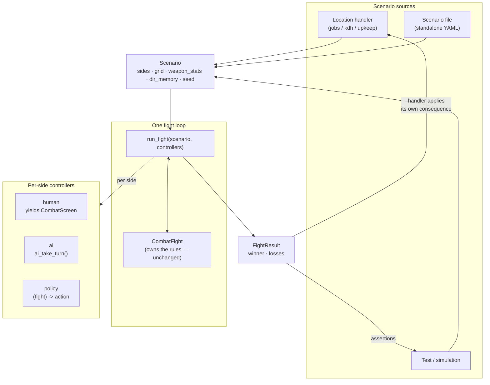

# refactor: One system instantiates every combat

> **SUPERSEDED by [`2026-07-20-003-refactor-combat-engine-foundation-plan.md`](2026-07-20-003-refactor-combat-engine-foundation-plan.md).** Do not execute.
>
> Scoped to three bug fixes before the layering problem was understood. All verified research carries forward into the successor.

## Summary

Make combat a first-class, self-contained capability: **one system instantiates
every fight in the game**, whether driven from a location handler, a standalone
scenario file, or a headless simulation. Sides become independently
controllable, so a fight can be human-vs-AI (today), AI-vs-AI, human-vs-human,
or policy-vs-AI (simulation).

This is mostly **naming and widening what already exists**, not new invention —
see Problem Frame. The genuinely new surface is per-side controllers and one
real defect fix (AI-vs-AI targets the wrong side).

Issue **#50** lands here because its fix is the same seam this plan defines.
**#45**, **#49**, and **#51** are deferred with rationale — they become cheap
once this capability exists.

---

## Problem Frame

Combat is already architecturally separable, and further along than it looks.
Verified against the tree at `9082262`:

| Fact | Location |
|---|---|
| `StartCombat` carries only `sides`/`grid`/`weapon_stats`/`dir_memory`/`cpu_sides` — **no `GameState`** | `engine/interactions.py:101` |
| `_run_combat` touches `ctx` only for `ctx.rng` and `ctx.apply` — **never `ctx.state`** | `engine/interactions.py:~594-700` |
| `CombatFight` is explicitly *"NOT a generator — this object owns the rules"* | `engine/combat.py:~490` |
| `CombatFight.losses` already tracks real `v(1)`/`v(2)` tallies | `engine/combat.py:544`, incremented `:722` |
| `render_combat_losses` already consumes a losses payload | `clients/terminal/renderers.py:334` |
| `cpu_sides` already anticipates hot-seat: *"a caller may pass an empty `cpu_sides`"* | `engine/combat.py:388` |
| All three in-game fights pass the **same five parameters** | `jobs.py:138`, `kdh.py:354`, `upkeep.py:221` |

So the capability is latent. Four things block it:

1. **`_run_combat` returns a bare `int`** and discards `fight.losses`. This is
   issue #50: the collectors fight suppresses its losses block via
   `with_losses=False` because the narration helper's per-side count is a 1v1
   shortcut that would print a wrong tally for a 5-enemy fight.

2. **AI-vs-AI is broken, not merely untested.** `AI_HUNTS_SIDE = 1` is a
   hardcoded module constant (`engine/combat.py:378`) and `ai_target`'s
   candidate loop skips only `other.down` (`:465`) — there is no
   self-exclusion. **Verified by probe:** with a side-1 CPU fighter,
   `ai_target` returns `dx=0, dy=0` (distance zero — the fighter targets
   *itself*), while side 2 correctly returns `dx=0, dy=-40`. Side 1's AI hunts
   its own side.

3. **Control is binary and global.** `cpu_sides: tuple[int, ...]` offers only
   "CPU via `ai_take_turn()`" or "prompt via `input_source`". There is no third
   option, so a policy-driven (simulation) side cannot be expressed.

4. **Scenario setup is scattered.** The same five parameters are assembled
   inline in three handlers, so there is no value a scenario file could
   produce or a simulator could consume.

### What this is not

Not a rewrite. `CombatFight` owns the rules correctly and stays as-is except
for the `ai_target` fix. The changes are at the *instantiation* and *driving*
boundary, which is exactly where the existing design already put the seam.

---

## Requirements

- **R1** One value type fully describes a fight, constructible from a handler,
  a scenario file, or a test, with no `GameState` involved.
- **R2** Every in-game fight is instantiated through that value type.
- **R3** Each side is independently controlled: human, AI, or policy.
- **R4** AI-vs-AI produces genuine hostile behavior on both sides.
- **R5** A fight's result carries the winner **and** the per-side losses.
- **R6** Combat is drivable headlessly to completion with no client and no
  scripted RNG draw-ordering.
- **R7** A custom scenario is playable from the terminal client.
- **R8** No fidelity regression: in-game fights behave exactly as today.
  **Cross-cutting — traced to no single unit by design.** Every unit carries a
  fidelity-guard test scenario asserting `cpu_sides=(2,)` behavior is unchanged
  (U1 six call sites, U2 characterization-first, U3 byte-identical setup, U4
  human-vs-AI unchanged). The Verification Contract enforces it globally.

---

## Key Technical Decisions

### KTD-1 — Scenario describes the fight only, never its consequences

A `Scenario` carries the fight setup. Rewards, penalties, and narration stay
with the calling handler.

**Why:** mirrors the existing split where `_run_combat` never reads
`ctx.state`. Putting consequences in the scenario would pull game rules into
the combat layer and break the handler boundary the codebase's own KTD-1
(`engine/combat.py:1`) already establishes.

> **Numbering note.** This plan's KTD-1..KTD-5 are plan-local. The codebase has
> its own KTD numbering in `engine/` docstrings (KTD-1 combat core, KTD-2
> non-cancellable combat prompts, KTD-3 frozen state graph). Where this plan
> cites a codebase KTD, it names the file.

### KTD-2 — `FightResult` frozen dataclass, mirroring `CommitResult`

`_run_combat` returns a frozen dataclass with `winner` and `losses` rather
than a bare `int`.

**Why:** the codebase has a consistent convention for this — `EngineResult`
(`engine/actions.py:49`), `HandlerResult` (`:67`), `DeniedResult` (`:73`),
`CommitResult` (`engine/effects.py:876`). A `FightResult` fits it exactly and
leaves room for later fields without another breaking change.

### KTD-3 — Per-side controllers supersede `cpu_sides`

`controllers: Mapping[int, Controller]` replaces the binary `cpu_sides`, which
remains as a compatibility shorthand.

**Why:** `cpu_sides` is already a degenerate per-side control map. Widening it
is the smallest change that expresses all four fight shapes. **Note:** there is
no existing multi-controller precedent in this codebase — the nearest
structural analog is `input_source`'s threading through
`run`/`_resolve`/`_run_substate`/`_run_combat`. This is genuinely new design
surface; do not expect a pattern to copy.

**Counter-argument, recorded honestly.** Review flagged this as speculative
generality: the shipping game uses exactly ONE fight shape (human-vs-AI), so
three of the four shapes have no current consumer, and minimally extending
`cpu_sides` would close #50 and the AI defect without any new abstraction.
That objection is correct on the code as it stands today.

It is accepted anyway, because the capability — not the bug fix — is the
stated goal: headless simulation (U5) and custom-scenario play (U6) are the
reason this plan exists, and both need a non-human side-1 controller that
`cpu_sides` cannot express.

**The falsifiable test:** if **U5** is cut, KTD-3 loses its justification and
U4 should shrink back to extending `cpu_sides`. U5 alone is sufficient —
a headless policy-driven side-1 controller is a real consumer, so the
abstraction is earned whether or not U6 lands. U1 and U2 stand on their own
either way. See Scope Boundaries' two cut lines.

### KTD-4 — `ai_target` becomes side-relative

`AI_HUNTS_SIDE` is replaced by deriving the hostile side from the active side,
plus explicit self-exclusion.

**Why:** required by R4, and a real defect regardless of this plan. Fidelity is
preserved because in the original only side 2 is ever CPU, so side-relative
targeting is identical to `AI_HUNTS_SIDE = 1` for every fight the original can
produce.

### KTD-5 — Scenario fights are ephemeral by default

A standalone scenario's effects buffer and are discarded, not committed to any
roster.

**Why:** `SpawnFighter` is registered in `engine/persistence.py:108` but
**never applied in production** — `GameState.combat` never evolves during real
gameplay, and `_run_combat` passes `sides` as plain data straight into
`CombatFight`. A prior `SpawnFighter` save/load corruption (commit `9df2091`)
lived in exactly this seam. Keeping scenario fights ephemeral avoids
re-opening that class of bug. Persisting scenario outcomes is a deferred
question, not a default.

---

## High-Level Technical Design

The fight loop is identical in all cases. Only two things vary: who supplies
the `Scenario`, and which controller answers for each side.

---

## Implementation Units

### U1. `FightResult` — carry losses out of the fight

**Goal:** `_run_combat` returns winner **and** per-side losses. Closes #50.

**Requirements:** R5

**Dependencies:** none — this is the foundation unit.

**Files:**
- `engine/interactions.py` (modify — `_run_combat` return, `_finish`)
- `engine/combat.py` (modify — export the result type, or a new sibling module)
- `data/game_configs/mafia_1920s/handlers/jobs.py` (modify — 1 literal site + 3 `_fight` wrappers)
- `data/game_configs/mafia_1920s/handlers/kdh.py` (modify — 1 site)
- `data/game_configs/mafia_1920s/handlers/upkeep.py` (modify — 1 site; drop `with_losses=False`)
- `data/game_configs/mafia_1920s/setup.py` (modify — `narrate_combat_outcome` takes real tallies, drop the `with_losses` parameter)
- `tests/test_combat_loop.py`, `tests/test_upkeep.py`, `tests/test_kdh.py`, `tests/test_pub_jobs.py` (modify)
- `tests/test_debt_default.py` (modify — see the #49 guard below)

**#49 guard — do not leave the collectors path unprotected.** U1 changes the
collectors narration, and the only tests nominally covering that path
(`test_win_changes_nothing_and_the_fight_recurs_next_turn` and
`test_the_fight_actually_re_fires_on_the_following_turn`) are the vacuous pair
filed as #49: they build `_StubRng()` with zero values, the fight never
resolves, and they pass because nothing happened. Landing U1 without touching
them means the code U1 modifies is guarded by tests that cannot fail.

U1 must therefore add **one** new test that drives the collectors fight to a
real resolution and asserts the losses block — enough to make U1's own change
falsifiable. The full #49 fix (rewriting both vacuous tests to drive genuine
wins) still waits for U5's simulator, but U1 does not ship an unfalsifiable
change. If U5 never lands, this guard is what remains.

**Call sites — exact count:** 3 literal `yield StartCombat` (`jobs.py:146`,
`kdh.py:362`, `upkeep.py:230`) plus 3 `yield from _fight(...)` wrappers
(`jobs.py:194,204,218`). Six expressions, three literal yields.

**Approach:** frozen dataclass per KTD-2. `_finish` already diffs `pre_energie`
to buffer `EnergyChange`; extend it to read `fight.losses` and build the
result. `narrate_combat_outcome` takes the real tallies, so the `with_losses`
escape hatch and its 1v1 `0 if winner else 1` shortcut both disappear.

**Execution note:** the collectors narration is currently suppressed by a
documented known deviation. Land the plumbing first and verify the losses block
appears for the 5-enemy fight with a *correct* tally before deleting the
`with_losses` parameter — the deviation is the proof target.

**Patterns to follow:** `CommitResult` (`engine/effects.py:876-886`) for shape;
`_finish`'s existing `pre_energie` diff for where to compute.

**Test scenarios:**
- A won 1v1 job-shift fight yields `losses == (0, 1)` and narrates the block.
- A lost 1v1 fight yields `losses == (1, 0)`.
- A won collectors fight (5 enemies) narrates a losses block whose enemy count
  equals the number actually downed — **not** a hardcoded 1.
- `narrate_combat_outcome` emits `combat.losses_heading` plus exactly one
  `combat.losses_line` per side, for every fight including collectors.
- A surrender before any shot yields `losses == (0, 0)` and buffers no
  `EnergyChange` (the existing no-op-fight guarantee).
- All six call sites compile against the new return and assert on `.winner`.

**Verification:** the collectors fight prints a real losses block; no
`with_losses` parameter remains in the tree; 854+ tests green.

---

### U2. Side-relative AI targeting

**Goal:** the AI hunts the opposing side, whichever side it is driving. Fixes
the confirmed AI-vs-AI defect.

**Requirements:** R4

**Dependencies:** none (independent of U1)

**Files:**
- `engine/combat.py` (modify — `ai_target`, retire `AI_HUNTS_SIDE`)
- `tests/test_combat_ai.py` (modify)

**Approach:** derive the hostile side from `fight.active_side` instead of the
`AI_HUNTS_SIDE = 1` constant, and exclude the active fighter from its own
candidate list. Both are required: side-relative targeting alone still lets a
fighter target a teammate; self-exclusion alone still hunts the wrong side.

**Execution note:** characterization-first. Pin the *current* side-2 behavior
before touching `ai_target` — every existing AI test exercises only side 2, so
that path must come out bit-identical. The defect is verified by probe:
side-1-active returns `dx=0, dy=0` (self-target, distance zero) while
side-2-active returns `dx=0, dy=-40`. Reproduce that as a failing test first.

**Patterns to follow:** `ai_target`'s existing `AiTarget` construction and the
`other.down` skip at `engine/combat.py:465`.

**Test scenarios:**
- **Characterization:** every existing side-2 targeting case produces an
  identical `AiTarget` before and after the change.
- A side-1 CPU fighter targets a **side-2** fighter, not itself
  (`dx, dy != (0, 0)`).
- A side-1 CPU fighter with a living teammate targets the enemy, not the
  teammate.
- The active fighter is never its own target on either side.
- Downed fighters remain excluded on both sides.
- Fidelity guard: with `cpu_sides=(2,)` — every fight the original can produce
  — behavior is unchanged.

**Verification:** an AI-vs-AI fight resolves with both sides having dealt
damage; the characterization suite is unchanged.

---

### U3. `Scenario` — one value type describes a fight

**Goal:** a plain-data scenario, constructible without a `GameState`.

**Requirements:** R1, R2

**Dependencies:** U1

**Files:**
- `engine/combat.py` or a new `engine/scenario.py` (create)
- `data/game_configs/mafia_1920s/handlers/jobs.py`, `kdh.py`, `upkeep.py` (modify)
- `tests/test_scenario.py` (create)

**Approach:** a frozen dataclass carrying what `setup_combat` needs plus what
`StartCombat` carries. Two construction paths: explicit sides, or the
five-parameter procedural form the three handlers already use
(`enemy_count`/`enemy_weapon`/`enemy_energie`/`enemy_name`/`grid`). Per KTD-1
it carries no consequences.

**Patterns to follow:** `setup_combat` (`engine/combat.py:245`) is the existing
procedural constructor — the scenario's procedural path should produce the same
`CombatState`. `weapon_stats_by_id` and `load_combat_backdrop`
(`data/game_configs/mafia_1920s/setup.py:114-137`) load standalone from two
small YAML files with no `load_game_config`.

**Test scenarios:**
- A scenario built from the five procedural params produces a `CombatState`
  identical to today's `setup_combat` call for each of the three in-game fights.
- A scenario built from explicit `Fighter` tuples needs no YAML at all
  (precedent: `tests/test_driver.py:191-193` hand-builds fighters).
- Round-trip: scenario → fight → result, with no `GameState` constructed.
- Each of the three handlers produces a byte-identical fight setup before and
  after migrating to `Scenario`.

**Verification:** the three handlers construct fights through `Scenario`; no
in-game fight behavior changes.

---

### U4. Per-side controllers

**Goal:** each side is driven by human, AI, or policy.

**Requirements:** R3, R6

**Dependencies:** U2, U3

**Files:**
- `engine/interactions.py` (modify — `_run_combat` loop, `StartCombat`)
- `engine/combat.py` (modify — `cpu_sides` compatibility)
- `tests/test_combat_loop.py`, `tests/test_driver.py` (modify)
- `tests/helpers.py` (modify — a policy controller for tests)

**Approach:** replace the `if fight.active_side in cpu_sides` branch with a
controller lookup. The human controller is the existing yield/`.send()` path;
the AI controller is `ai_take_turn()`; the policy controller is a callable
returning an action. `cpu_sides` maps onto the new form so existing callers are
unaffected.

**Execution note:** the human controller must stay the generator protocol — it
suspends the whole driver, which a plain callable cannot express. Do not force
all three into one signature if that costs the suspend semantics; a tagged
union is acceptable and preferable to breaking the protocol.

**Deferred to implementation:** the exact policy-controller signature.
`(fight) -> (action, argument)` is the obvious shape but should be fixed only
after one real policy exists.

**Patterns to follow:** `input_source`'s threading through
`run`/`_resolve`/`_run_substate`/`_run_combat`
(`engine/interactions.py:337, 462, 528, 590`) is the nearest structural
precedent for a caller-supplied callable.

**Test scenarios:**
- Human-vs-AI (`cpu_sides=(2,)`) behaves exactly as today — the fidelity guard.
- AI-vs-AI resolves to a winner with both sides acting (needs U2).
- Human-vs-human (`cpu_sides=()`) prompts for both sides — the hot-seat case
  the existing docstring already promises.
- Policy-vs-AI resolves headlessly with no `input_source` at all.
- An exhausted or invalid controller response fails loudly, not silently.
- Surrender semantics preserved: quit/EOF from a human controller still
  surrenders. (This is the *codebase's* KTD-2 — "Combat prompts are
  non-cancellable", `engine/interactions.py:171` — not this plan's KTD-2.)

**Verification:** all four fight shapes resolve; in-game fights unchanged.

---

### U5. Headless simulation entry point

**Goal:** drive a fight to completion with no client, no generator, and no
scripted RNG draw-ordering.

**Requirements:** R6

**Dependencies:** U4

**Files:**
- `engine/scenario.py` or `engine/combat.py` (modify — `simulate()`)
- `tests/test_simulation.py` (create)
- `tests/helpers.py` (modify)

**Approach:** a function taking a `Scenario`, per-side controllers, and an RNG,
returning a `FightResult`. This is what makes the deferred #49 trivial: a test
can drive a real 1-vs-5 collectors fight to a genuine win without scripting a
single draw.

**Execution note:** the motivating failure is #49, where two tests scripted an
RNG with zero values, the fight never resolved, and both passed vacuously. The
whole point of this unit is that a simulated fight makes draw-order scripting
unnecessary. **Do not** build the simulator on a fixed queue of RNG values —
that reproduces the original defect.

**Open question for implementation:** whether the boss survives five collectors
firing back is **unverified**. Determine it empirically here rather than
assuming a player win is reachable.

**Test scenarios:**
- A simulated fight terminates and returns a winner for every controller
  combination.
- A seeded run is reproducible: same seed, same `FightResult`.
- `losses` sums correctly — the losing side's tally equals its downed count.
- A 1-vs-5 fight resolves (whichever way) without scripting draws.
- The simulator never yields an interaction — no client in the loop.

**Verification:** a headless 1-vs-5 fight resolves deterministically under a
seed.

---

### U6. Standalone scenario entry point

**Goal:** a custom fight is playable from the terminal client.

**Requirements:** R7

**Dependencies:** U5

**Files:**
- `clients/terminal/__main__.py` (modify — a scenario entry path)
- `data/game_configs/mafia_1920s/content/scenarios/` (create — an example)
- `tests/test_scenario_client.py` (create)

**Approach:** load a scenario from data, run it through the same loop with a
human controller, render with the existing combat renderers. Per KTD-5 the
fight is ephemeral — effects buffer and are discarded, no roster is touched.

**Deferred to implementation:** the invocation shape (subcommand vs. flag vs.
menu entry). All are thin over U5; pick whichever matches the client's existing
argument handling.

**Patterns to follow:** `play(seed, players)` in `clients/terminal/__main__.py`
for session setup; `render_combat_losses`
(`clients/terminal/renderers.py:334`) already renders the result.

**Test scenarios:**
- A scenario file loads and produces a runnable `Scenario`.
- A scenario fight renders combat screens and resolves via scripted stdin.
- A scenario fight leaves no persistent state — no roster mutation, nothing
  written.
- A malformed scenario file fails with a clear error, not a crash.

**Verification:** a custom fight is playable end to end and touches no save
state.

---

## Scope Boundaries

### In scope
Unified instantiation, per-side controllers, the AI targeting fix, `FightResult`
(closing #50), headless simulation, and a standalone scenario entry point.

### Deferred to Follow-Up Work

- **#49** — `test_debt_default`'s two vacuous "win" tests. Both build a scripted
  RNG with zero values, so the fight never resolves and the assertions hold
  because nothing happened. **Becomes trivial after U5:** the tests drive a real
  collectors fight to a genuine win instead of scripting draws. Fixing it before
  U5 would mean building a throwaway fixture that U5 immediately replaces.

- **#51** — `test_eof_during_sph_wager_prompt` never reaches sph; the EOF fires
  at the map loop, so the mid-handler EOF path is uncovered. Unrelated to
  combat — a client input-consumption bug. **The issue body's stated hypothesis
  is disproven:** it theorises the walk lands adjacent to the door or the
  splash-ack count differs, but the EOF test and its passing sibling use the
  *identical* walk and the same `["", "0"]` prefix; only the trailing keys
  differ. Whoever picks this up must probe where input is actually consumed
  before editing keys.

- **#45** — no observation frame between AI activations. **Not a defect.** The
  original's `:30110` CPU path (`ifks(s)=0thengosub30400:goto30105`) has no key
  read, so narrating nothing is faithful. Adding a frame is a deliberate
  presentation-only deviation needing a product call. The payload and loop
  already support it, and U4's controller abstraction makes it easier — an
  observation frame becomes a property of the AI controller.

- **#45 rider** — `dir_memory` is keyed 0-based while the source's `ri(i)` is
  1-based. Harmless today; matters only if persistence serializes `dir_memory`.

- **Persisting scenario outcomes.** KTD-5 makes scenario fights ephemeral. A
  scenario that *does* affect your roster reopens the `SpawnFighter` save/load
  seam (commit `9df2091`) and needs its own design.

- **Wiring `SpawnFighter` into the live driver.** It is registered in
  `engine/persistence.py:108` and fully tested, but **never applied in
  production** — `_run_combat` passes `sides` as plain data and `GameState.combat`
  never evolves during real gameplay. Routing combat setup through effects for
  replay fidelity is a real option this plan deliberately does not take.

### Minimum viable cut

**U1 + U2 alone are a coherent, shippable increment** and introduce no new
abstraction. Together they close #50 (real losses tallies) and fix a confirmed
AI defect (side 1 targeting itself), touching only existing types.

**There are two cut lines, not one:**

1. **After U2** — ship the bug fixes alone. No new abstraction, no new types.
2. **After U5** — ship the full engine capability. U5 alone satisfies KTD-3's
   justification: a headless policy-driven side-1 controller is a real,
   non-speculative consumer of per-side controllers, so the abstraction is
   earned whether or not U6 lands.

**U6 is severable.** It is the only unit whose deliverable is player-facing
(a client entry point plus a `content/scenarios/` directory) rather than an
engine seam. If it grows — the invocation shape is still an open question —
split it into its own plan rather than stretching this one.

Do not cut in the middle. Cutting U5 while keeping U4 would leave a general
mechanism serving one consumer, which is exactly the objection KTD-3's
counter-argument concedes.

### Out of scope
Combat rule changes, new weapons or enemy types, balance tuning, network
transport.

---

## Risks

| Risk | Mitigation |
|---|---|
| Fidelity regression in the three in-game fights | Every unit carries a fidelity-guard scenario asserting `cpu_sides=(2,)` behavior is unchanged. U2 is characterization-first. |
| The `ai_target` fix changes side-2 behavior | Pin current side-2 targeting as characterization tests *before* editing. Side-relative targeting is provably identical to `AI_HUNTS_SIDE = 1` when only side 2 is CPU. |
| Controller abstraction breaks the suspend semantics | The human controller stays the generator protocol; U4's execution note forbids collapsing it into a plain callable if that costs suspension. |
| A 1-vs-5 player win may be unreachable | Unverified. U5 determines it empirically rather than assuming. If unreachable, #49's eventual fix asserts a *loss* outcome instead. |
| Six call sites change signature at once | U1 is the foundation unit and lands alone, before any controller work. |

---

## Open Questions

- **Policy-controller signature.** `(fight) -> (action, argument)` is the
  obvious shape; fix it after one real policy exists (U4).
- **Scenario file format.** YAML matching the existing `content/` convention is
  the default; confirm at U6.
- **Does the boss survive five collectors?** Determined empirically in U5.
- **Scenario invocation shape** (subcommand vs. flag vs. menu). Thin either
  way; pick to match the client's existing argument handling.

---

## Verification Contract

- `make check` green at every unit boundary — never dispatch or commit on red.
- The three in-game fights behave identically: same outcomes, same narration,
  same effects, for the same seed.
- The collectors fight prints a losses block with a **real** tally.
- All four fight shapes (human-vs-AI, AI-vs-AI, human-vs-human, policy-vs-AI)
  resolve to a winner.
- A headless fight resolves with no scripted RNG draw-ordering.
- A scenario fight touches no persistent state.
- No test asserts something that cannot fail — every new test must be verified
  by breaking the feature and watching it go red
  (`docs/solutions/developer-experience/tests-that-cannot-fail.md`).

---

## Definition of Done

1. One `Scenario` type instantiates every fight in the game.
2. Each side is independently controllable.
3. AI-vs-AI produces genuine hostile behavior on both sides.
4. `FightResult` carries winner and losses; #50 closed and `with_losses` gone.
5. A fight is drivable headlessly with no client and no draw scripting.
6. A custom scenario is playable from the terminal client.
7. No fidelity regression; `make check` green.
8. #45, #49, #51 documented as deferred with rationale.

---

## Sources & Research

All claims verified against the tree at `9082262`:

- `engine/interactions.py:101` (`StartCombat` fields), `:146` (`cpu_sides`),
  `:~594-700` (`_run_combat`), `:337, 462, 528, 590` (`input_source` threading)
- `engine/combat.py:245` (`setup_combat`), `:378` (`AI_HUNTS_SIDE`), `:388`
  (`DEFAULT_CPU_SIDES` + hot-seat docstring), `:434-482` (`ai_target`), `:465`
  (`down`-only skip), `:490` (`CombatFight` docstring), `:544` (`losses`),
  `:722` (`v(x)=v(x)+1`, `mf-prg.bas:30310`)
- `engine/actions.py:49, 67, 73`; `engine/effects.py:876` (result-object convention)
- `engine/persistence.py:108` (`SpawnFighter` registered, never applied)
- `clients/terminal/renderers.py:334` (`render_combat_losses`)
- `data/game_configs/mafia_1920s/setup.py:114-137` (standalone loaders), `:180`
  (`narrate_combat_outcome`)
- Handler call sites: `jobs.py:138, 146, 194, 204, 218`; `kdh.py:354, 362`;
  `upkeep.py:221, 230`
- `mf-prg.bas:30110` (CPU path, no key read — the #45 fidelity basis);
  `:30500-30515` (unconditional losses block — the #50 basis)
- Prior art: commit `9df2091` (`SpawnFighter` save/load corruption)
- `docs/solutions/developer-experience/tests-that-cannot-fail.md` (the #49
  failure mode and the break-it verification technique)

**Empirical probes run during planning:**
- `ai_target` with side 1 active returns `dx=0, dy=0` (self-target); side 2
  returns `dx=0, dy=-40`. Confirms the AI-vs-AI defect.
- The #51 EOF test and its passing sibling use the identical walk and `["", "0"]`
  prefix, yet only the sibling reaches the wager prompt. Disproves the issue
  body's hypothesis.
