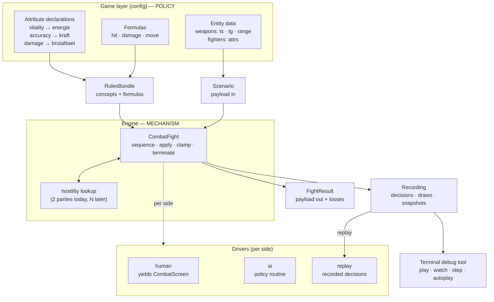

# refactor: Attribute-agnostic combat engine, scenarios, replay, and a debug tool

> **SUPERSEDED by [`2026-07-20-003-refactor-combat-engine-foundation-plan.md`](2026-07-20-003-refactor-combat-engine-foundation-plan.md).** Do not execute.
>
> Correct in substance but structurally damaged by iterative edits: a fragmented evidence table, and superseded entity-model framing left beside its replacement. All verified research carries forward into the successor.

## Summary

Make combat a genuine genre-engine capability: the engine owns **mechanism**
(sequencing, applying, clamping, detecting termination) and the game supplies
**policy** (which attributes exist, what the formulas are, how far a weapon
shoots). On that foundation, build scenario-driven fights, per-side control,
full replay, and a terminal debug tool.

Eight units, four cut lines. Each cut leaves the tree green and nothing
half-built — but only three of the four deliver something externally visible:

| Units | Delivers | Externally visible? |
|---|---|---|
| U1–U2 | The genre engine actually works — no game-specific names in `engine/` | **No** — pure refactor |
| U3–U4 | #50 closed, confirmed AI defect fixed | Yes |
| U5–U6 | Scenario payload-in/payload-out, per-side control, simulator | Yes |
| U7–U8 | Recording, replay, terminal debug tool | Yes |

**Read that first row honestly.** Stopping after U2 means two units spent with
no bug closed and nothing a stakeholder can point to. It is the *foundation*,
not an increment — U3–U8 all depend on its shape. If the arc is likely to be
interrupted early, run **U3–U4 first** (they depend only on U2 for the attribute
map, and can be reordered ahead of it at the cost of touching the call sites
twice) or do not start.

**Supersedes** `2026-07-20-001`. That plan's verified research carries forward;
its premise (combat is nearly free of the game loop) turned out to be true but
incomplete — combat is free of `GameState`, yet the *engine* is not free of this
game's vocabulary.

---

## Problem Frame

### The layering violation

`CLAUDE.md` states the engine is a **genre engine**: a new game copies
`data/game_configs/mafia_1920s`, edits its data and handlers, and `engine/` is
untouched. That is currently false.

| Evidence | Location |
|---|---|
| `Gangster` — the game's entity — is defined in the engine | `engine/state/__init__.py:124` |
| `Fighter` hardcodes `energie`, `kraft`, `brutalitaet` | `engine/state/__init__.py:274` |
| `_STAT_NAMES` enumerates four German stat names | `engine/effects.py:43` |
| `is_hit(rng, *, ts, kraft)` names this game's stat | `engine/combat.py:319` |
| `damage_roll(rng, *, tg, brutalitaet)` names this game's stat | `engine/combat.py:347` |
| `shot_range` hardcodes this game's weapon ids (`w>3`, `w=6 or w=7`) | `engine/combat.py:348` |

39 references to game-specific stat names live inside `engine/`.

**`Fighter` is the engine's blueprint; `Gangster` is the game's filling of it.**
Compare the fields (`engine/state/__init__.py:124` and `:274`):

| | `Gangster` | `Fighter` |
|---|---|---|
| `name`, `weapon`, `energie`, `kraft`, `brutalitaet` | ✓ | ✓ |
| `intelligenz` | ✓ | — (combat never reads it: 0 references in `combat.py`) |
| `position`, `down` | — | ✓ (combat-context state) |

`build_player_side` (`engine/combat.py:195`) copies field-by-field from one to
the other, and types its parameter `roster: Any` — the signature is already
written as if the engine does not know what a `Gangster` is.

**Each layer already constructs its own.** `Gangster` is built by the game
(`data/.../handlers/pub.py:428` when recruiting, `data/.../setup.py:291` at new
game); `Fighter` is built by the engine (`engine/combat.py:197`, `:229`). The
division of responsibility is correct in practice.

**The defect is that both class definitions live in `engine/state/`.** The
engine defines the game's entity alongside its own blueprint. It does not merely
know this game's *stat* names — it names the game's *entity*. A game with no
gangsters cannot use this engine.

**The correction:** the engine keeps a blueprint (`Combatant` — opaque `attrs`
plus engine-named `vitality`/`position`); the game's `Gangster` moves to the
config as the concrete filling of it. `intelligenz` becomes an ordinary
attribute the blueprint has no opinion about — verified, the engine never reads
it. `_STAT_NAMES` stops being a second problem: it is the same attribute
declaration, applied to roster edits instead of combat.

A game without
a stat called `kraft` cannot use this engine.

**But the computational surface is small.** The engine actually *computes* with
a game stat in exactly five lines: `is_hit`'s two factors, `damage_roll`'s two,
and the energy subtraction in `shoot`. Everything else is docstrings,
construction, or pass-through. The fix is surgical, not a rewrite.

### The three-way split

Rules attach at three different levels, and the current code flattens them:

| Rule | Level | Today |
|---|---|---|
| `ts` accuracy, `tg` damage rating | **weapon attribute** — varies per entity | already data ✓ |
| shot range | **weapon attribute** — varies per entity | hardcoded function ✗ |
| `int(draw + bt/10) + 1` — how `tg` becomes damage | **game formula** — uniform across entities | engine function ✗ |
| damage reduces vitality, clamp at 0, zero means down | **engine mechanism** — true of any tactical fight | engine ✓ |

**The rule:** varies per entity → attribute. Uniform across entities → game
formula. True of any tactical fight → engine mechanism.

`shot_range` is the instructive case. It looks like a formula but only ever
reads a weapon id, so it is a lookup table pretending to be a rule. Its real
values:

```
{0: 2, 1: 2, 2: 2, 3: 2, 4: 15, 5: 15, 6: 20, 7: 20, 8: 15}
```

Note **weapon 8 is 15, not 20** — the `w>3` widening applies but the
`w=6 or w=7` test does not. Exactly the edge a hand-written migration gets
wrong, which is why U1 requires differential proof.

### What blocks the rest

Beyond layering, four things block the capability:

1. **`_run_combat` returns a bare `int`**, discarding `fight.losses` — issue
   #50. The collectors fight suppresses its losses block via `with_losses=False`
   because the narration helper's per-side count is a 1v1 shortcut.
2. **AI-vs-AI is broken.** `AI_HUNTS_SIDE = 1` is hardcoded
   (`engine/combat.py:378`) and `ai_target`'s loop skips only `other.down`
   (`:465`) — no self-exclusion. **Verified by probe:** side-1-active returns
   `dx=0, dy=0` (the fighter targets *itself*); side-2-active returns
   `dx=0, dy=-40`.
3. **Control is binary and global.** `cpu_sides` offers only "CPU" or "prompt".
   No policy-driven side, no per-side assignment.
4. **No recording.** Fights cannot be replayed, stepped through, or observed
   after the fact.

### Why now, and not just the two bug fixes

The honest counterfactual: **ship U3+U4 alone.** They close #50 and fix the AI
defect, touch no new abstraction, and take a fraction of the effort. There is
exactly one game in this repo and no second game scheduled, so the layering
violation has no current external consumer. On those facts alone, "architectural
purity, deferred" would be the right call.

It is rejected for one reason: **the simulator and custom-scenario play are the
goal, not a side effect.** The requirements that make U1–U2 load-bearing are
R5/R6 (combat takes a payload and returns a payload; a scenario can invent
entities that do not exist in the game) and R14 (a debug tool where every
variable is observable). Neither is reachable while `Fighter` hardcodes four
German stat names — an invented entity must still fit that exact shape, and a
tool cannot show "every variable" when the engine defines which variables exist.

So the layering fix is not purity. It is the precondition for the capability,
and doing it after U5–U8 would mean designing `Scenario`, the recording format,
and the tool twice.

**If R5/R6/R14 are not actually wanted, this plan is wrong** and U3+U4 is the
correct scope. That is the fork; it is a product decision, not a technical one.

### What is already right

`CombatFight` is explicitly *"NOT a generator — this object owns the rules"*
(`engine/combat.py:~490`). It never suspends; you call a method and get a value.
`shoot(direction)` resolves an entire attack — travel, collision, hit check,
damage, down flag, loss counter — and returns a plain dict. The driver owns
yield/send.

That separation is what makes everything here a thin layer rather than a
parallel implementation. It stays.

---

## Requirements

- **R1** No game-specific attribute name appears in `engine/`.
- **R2** Combatants carry attributes as data; the game declares which attribute
  fills which engine role.
- **R2a** The engine defines a combatant **blueprint**; the game defines its
  concrete combatant. `Gangster` moves out of `engine/state/` into the config
  as the game's filling of that blueprint.
- **R3** Formulas are supplied by the game to engine operations, not owned by
  the engine.
- **R4** Per-entity rules are entity attributes, not functions.
- **R5** Combat receives entities as a payload and returns a transformed
  payload; it never reads config assets.
- **R6** A scenario can invent weapons and fighters that do not exist in the
  game.
- **R7** A fight's result carries the winner and per-side losses.
- **R8** AI-vs-AI produces genuine hostile behavior on both sides.
- **R9** Gang, controlling player, and driver are three distinct concepts.
- **R10** Control may be assigned at setup or handed off mid-fight.
- **R11** A fight is fully recordable and replayable, observable at every step.
- **R12** All combat tests drive fights through the shared framework.
- **R13** Test determinism comes from tweaking inputs, never from rigging the
  RNG.
- **R14** A terminal tool plays, watches, and replays fights with every variable
  observable.
- **R15** Nothing built here blocks fights with more than two parties.
- **R16** No fidelity regression: in-game fights behave exactly as today.
  **Cross-cutting — traced to no single unit by design.** Every unit carries a
  fidelity-guard scenario; the Verification Contract enforces it globally.

---

## Key Technical Decisions

> **Numbering note.** This plan's KTD-1..KTD-10 are plan-local. The codebase has
> its own KTD numbering in `engine/` docstrings (KTD-1 combat core, KTD-2
> non-cancellable combat prompts, KTD-3 frozen state graph). Where this plan
> cites a codebase KTD, it names the file.

### KTD-1 — The engine owns concept slots and the machinery over them

The engine provides **concepts** (vitality, position, plus whatever the game
supplies) and **operations** over them. Each operation is called *with the
formula that shapes it*.

The engine owns *"damage reduces vitality, clamped at zero, and zero means
down"*. The game owns *"damage = `int(draw + bt/10) + 1`"*. The engine owns
*"a move changes position subject to obstruction"*. The game owns whether a move
is one cell or a jump.

**Why:** this is the mechanism/policy split that makes a genre engine real. It
is also exactly what R5/R6 need — a scenario cannot invent entities while the
engine hardcodes four German stat names.

**Vitality is named engine-side** because the win condition depends on it: the
engine must know when a fighter is out to detect termination. Position is named
for the same reason — the grid is engine geometry. Everything else is opaque.

### KTD-2 — A rules bundle passed at construction

The game assembles one object carrying its concept declarations and every
formula, and passes it into the fight — exactly as `weapon_stats` is passed
today.

**Why:** no global registry (two differently-ruled fights must coexist for the
simulator). Scenarios override a single formula by replacing one field, which
is how KTD-5's zero-variance weapon is built.

### KTD-3 — Per-entity rules become entity data

`shot_range` stops being a function and becomes a `range` field on each weapon,
beside `ts` and `tg`.

**Why:** it varies per entity, so by the three-way split it is an attribute.
The function only ever reads a weapon id — it is a lookup table in disguise.

### KTD-4 — Gang, controller, and driver are three things

- **Gang** — the roster of fighters. The entity that wins or loses.
- **Controlling player** — who owns that gang (human or computer).
- **Driver** — what decides each move right now (human input, AI policy, replay
  script).

A human-owned gang may be driven by AI; two human-owned gangs may both delegate
to AI for one fight. Ownership and driving are independent.

**Why:** R9/R10 require it. `cpu_sides` conflates all three into one boolean.

### KTD-5 — Determinism comes from inputs, never from rigging the RNG

To force a testable outcome, tweak the *ingoing* values — a weapon whose
accuracy attribute admits no variance — rather than scripting RNG draws.

**Why:** scripted draw sequences encode assumptions about call ordering. When
the ordering shifts, the script silently misaligns and the test stops reaching
the code it claims to cover. That is the documented cause of #49 and of four
other vacuous tests
(`docs/solutions/developer-experience/tests-that-cannot-fail.md`). A
zero-variance weapon cannot misalign.

### KTD-6 — Recordings carry decisions and draws; calculations always recompute

A recording holds every decision, every RNG draw, and every calculation input —
not computed results. Replay re-runs the real formulas against recorded inputs.

**Why:** a recording stays valid as state shapes evolve, because it regenerates
whatever the current shape is. It also makes replay a **fidelity-regression
detector**: replay a recording against changed formulas and any divergence
names the formula that moved. Given this project found six sign-inverted tests,
that is a live safety net.

**Consequence:** formulas are config callables, so a recording cannot embed the
function. It embeds the inputs and draws. Full state snapshots are *also*
recorded (see KTD-7) so the tool can jump to any step without recomputing.

### KTD-7 — Full state snapshots are recorded

Measured: a typical collectors fight is ~90 activations; full snapshots cost
~62 KB per fight, decisions alone ~5 KB. Storage is not a constraint.

**Why:** the terminal tool must show the complete board at any step instantly.
Snapshots make step-through and seeking trivial.

**The staleness rule — snapshots are a cache, the decision log is the source of
truth.** Snapshots record what state *was*, so a recording made before `Fighter`
gains a field has snapshots missing it. Resolution: a recording carries a
**shape version**. On load, if the snapshot shape does not match the current
one, the tool **discards the snapshots and rebuilds them by replaying the
decision log**. Seeking gets slower for old recordings; nothing fails and
nothing renders stale.

This is what makes carrying both principled rather than indecisive: the
decision log can always regenerate the snapshots, so the snapshots never need
migrating. U7 tests this path explicitly.

### KTD-8 — Control handoff is a recorded event

A mid-fight control change is itself a log entry.

**Why:** R10 allows delegation mid-fight. If control changes are not recorded,
a replay reproduces the moves but not who was driving — losing the distinction
KTD-4 exists to make.

### KTD-9 — `Fighter` is the engine's blueprint; `Gangster` is the game's filling of it

Not two views of one entity, and not a merge. **One abstract shape defined by
the engine, one concrete instantiation defined by the game.**

The construction sites already say so:

| Type | Constructed by | Where |
|---|---|---|
| `Gangster` | **the game** | `data/.../handlers/pub.py:428` (recruiting), `data/.../setup.py:291` (new game) |
| `Fighter` | **the engine** | `engine/combat.py:197`, `:229` (`build_player_side`, `build_enemy_side`) |

Each layer builds its own already. Two further confirmations:

- `build_player_side(roster: Any)` (`engine/combat.py:185`) types the roster as
  `Any` — the signature is *already written as if* the engine does not know what
  a `Gangster` is.
- The engine never reads `intelligenz` (0 references outside `state`/`effects`'
  name list). It is a game-only attribute the blueprint has no opinion about.

**The actual defect is location, not duplication.** Both class definitions live
in `engine/state/__init__.py` (`:124` and `:274`). The engine is defining the
game's entity alongside its own blueprint. That is the whole violation.

**The shape:**

```
# ENGINE — the blueprint. Knows only what any tactical fight needs.
Combatant
  identity  : str               # opaque label; engine never interprets it
  attrs     : Mapping[str,int]  # opaque; kraft/brutalitaet/intelligenz live here
  vitality  : int               # ENGINE-NAMED — termination depends on it
  position  : int | None        # ENGINE-NAMED — grid geometry; None when off-grid
  down      : bool              # derived: vitality == 0
  equipment : Any               # opaque handle the rules bundle interprets

# GAME (data/game_configs/mafia_1920s/) — the filling.
Gangster = the config's combatant: which attrs exist (kraft, intelligenz,
brutalitaet), what they are called, what they mean. Defined in the CONFIG,
not in engine/state/.
```

**Why `vitality` and `position` are engine-named while everything else is
opaque:** the engine must detect termination (someone is out) and enforce
geometry (movement, line of fire). Both are universal to the genre. It needs no
opinion about anything else — including `intelligenz`, which under an attribute
map is simply a key nothing looks up.

**Why `position` is nullable:** a combatant not currently in a fight has no
cell. `None` states that directly, and lets one type serve both contexts without
a conversion step. `build_player_side` stops copying field-by-field and instead
attaches `position`/`down` to the combatant the game already built.

**Migration is by re-export, not a mass rename.** The config defines `Gangster` in terms of
the engine's `Combatant`, so the 113 existing `Gangster` references in `tests/`
and 6 in `data/` keep working. Only the engine's 17 references change. No mass
test rewrite.

### KTD-10 — Hostility is a lookup, not a toggle

`_opposing(side) -> int` becomes a hostility lookup returning *which sides are
hostile to this one*. Today it returns exactly the other side, so behavior is
bit-identical.

**Why:** R15. Targeting and win conditions then ask "who is hostile to me"
rather than "the other side", so N-party later is a data change, not a rewrite.
This plan ships two-party behavior only.

---

## High-Level Technical Design



The engine never sees the word `kraft`. It asks the rules bundle for the
accuracy roll and applies the result to vitality.

---

## Implementation Units

### U1. Per-entity rules become entity data

**Goal:** `shot_range` stops being a function; weapons carry a `range`
attribute.

**Requirements:** R4

**Dependencies:** none

**Files:**
- `data/game_configs/mafia_1920s/entities/weapons.yaml` (modify — add `range`)
- `engine/combat.py` (modify — delete `shot_range`, read the attribute)
- `data/game_configs/mafia_1920s/setup.py` (modify — carry `range` through the loader)
- `tests/test_weapons_data.py`, `tests/test_combat_loop.py` (modify)

**Approach:** add `range` to all nine weapon entries with the values the current
function produces, then delete the function and read the attribute.

**Execution note:** differential proof, then delete. Assert
`old_shot_range(w) == weapons[w]["range"]` for **every** weapon id 0–8 before
removing the function. Weapon 8 is the trap: it is 15, not 20, because `w>3`
widens it but the `w=6 or w=7` test does not fire. A hand-written table gets
this wrong.

**Patterns to follow:** `weapons.yaml`'s existing per-weapon stat fields
(`ts`, `tg`, `ws`) and their loader in `setup.py`.

**Test scenarios:**
- Differential: for every weapon id 0–8, the data value equals the old
  function's output. **This test is written and passing before the function is
  deleted.**
- Weapon 8 specifically resolves to 15 (regression guard for the widening edge).
- A shot's travel distance is unchanged for every weapon in a real fight.
- A scenario supplying an invented weapon with an arbitrary `range` fires that
  far.

**Verification:** `shot_range` no longer exists; every fight's shot travel is
unchanged.

---

### U2. Attribute-agnostic engine

**Goal:** no game-specific attribute name in `engine/`. Fighters carry
attributes as data; the game declares role mappings and supplies formulas.

**Requirements:** R1, R2, R2a, R3, R5, R6

**Dependencies:** U1

**Blast radius (measured):** `Gangster` has 17 references in `engine/`, 6 in
`data/`, and **113 in `tests/`**. The re-export in step 6 is what keeps that 113
from becoming a mass rewrite — do not skip it in favor of a global rename.

**Files:**
- `engine/state/__init__.py` (modify — `Fighter` carries an attribute map plus named `vitality`/`position`)
- `engine/combat.py` (modify — `is_hit`/`damage_roll` move out; `shoot` calls the bundle)
- `engine/interactions.py` (modify — **`_finish` reads `f.energie` four times**
  at `:659`, `:666`, `:669`, `:670` to diff pre/post energy and build
  `EnergyChange`. Renaming the field to `vitality` breaks these. Easy to miss:
  the driver is not otherwise part of this unit.)
- `engine/effects.py` (modify — `_STAT_NAMES` becomes config-supplied)
- `engine/persistence.py` (modify — serialize the attribute map at **both**
  reconstruction sites, see below)
- `data/game_configs/mafia_1920s/setup.py` (modify — declare roles, supply formulas)
- `data/game_configs/mafia_1920s/combat_rules.py` (create — this game's formulas)
- `tests/test_combat_loop.py`, `tests/test_combat_ai.py`, `tests/test_state.py`, `tests/test_effects.py`, `tests/test_persistence.py` (modify)

**Approach:** the engine keeps a combatant **blueprint** — `Combatant`, carrying
an opaque attribute map plus the engine-named `vitality` and `position` (KTD-9).
The game's `Gangster` moves out of `engine/state/` into the config as the
concrete filling of that blueprint, re-exported so existing call sites keep
resolving. The game declares `vitality → energie` and supplies
`hit`/`damage`/`move` formulas in a rules bundle passed at fight construction.

**The rules bundle, concretely:**

```
RulesBundle
  roles    : {"vitality": "energie",       # which attr the engine depletes
              "accuracy": "kraft",         # which attr the hit roll reads
              "damage":   "brutalitaet"}   # which attr the damage roll reads
  hit      : (attacker, equipment, rng) -> bool
  damage   : (attacker, equipment, rng) -> int
  move     : (combatant, direction, grid) -> int | None   # None = blocked
  equipment_stats : (handle) -> Mapping[str, int]         # ts/tg/range lookup
```

Passed to `CombatFight.__init__` beside `rng`, exactly as `weapon_stats` is
today. A scenario overrides one field to build KTD-5's zero-variance weapon.

**What moves where:**

| Today | After |
|---|---|
| `engine/combat.py:319` `is_hit(rng, *, ts, kraft)` | `combat_rules.py` `hit(attacker, equipment, rng)` — reads the accuracy role |
| `engine/combat.py:347` `damage_roll(rng, *, tg, brutalitaet)` | `combat_rules.py` `damage(...)` — reads the damage role |
| `engine/combat.py:717` `max(0, target.energie - damage)` | stays in the engine — clamping vitality is mechanism |
| `engine/effects.py:43` `_STAT_NAMES` | config-declared attribute names |
| `engine/state/__init__.py:124` `Gangster` | moves to the config as the blueprint's filling |

**Internal ordering — U2 is seven changes; do them in this order so the tree
stays green throughout.** The unit-level "green at every boundary" gate does not
help mid-unit, and several of these break each other if reordered:

1. **Create `combat_rules.py`** with `hit`/`damage` **copied** (not moved) from
   `engine/combat.py`, reading roles instead of named kwargs. Nothing calls
   them; green.
2. **Write the differential tests** — copied formulas vs. engine originals
   across the bounded domain (below). Green, and equivalence is proven *before*
   anything moves.
3. **Add `attrs` to `Gangster` and `Fighter` alongside** the existing named
   fields, both populated from the same source. Nothing reads `attrs` yet;
   green. Persistence still round-trips the named fields.
4. **Update both reconstruction sites** (`persistence.py:108` nested-effect and
   `:214` live) to carry `attrs`; green. Both round-trip tests pass here.
5. **Switch readers to the map**: `shoot` (`combat.py:711,715,717`) and
   `_finish` (`interactions.py:659,666,669,670`) read through the rules bundle
   and `attrs` rather than named fields; green.
6. **Move `Gangster` across the layer boundary.** `Combatant` (the blueprint)
   stays in `engine/state/`; `Gangster` (the game's filling) moves to
   `data/game_configs/mafia_1920s/`, re-exported so the 113 test references and
   6 config references keep resolving. `build_player_side` (`combat.py:195`)
   stops copying field-by-field and instead attaches `position`/`down` to the
   combatant the game already built. Its `roster: Any` signature becomes
   `roster: Sequence[Combatant]` — a tightening, since it never knew about
   `Gangster` anyway.
7. **Delete** the engine-side formulas and the now-unused named fields. Step 2's
   differential tests are the proof this is safe.
8. **Generalize `_STAT_NAMES`** to config-declared attribute names and update
   the affected tests.

Steps 1–4 are additive and individually committable — the tree does not depend
on the new shape until step 5. **Step 6 is the riskiest**; land steps 1–5 and
confirm green before starting it.

**Execution note:** differential proof, then delete — the same standard as U1,
applied per formula. For `is_hit`, assert old and new agree across every
`ts` × `kraft` pair under a fixed seed. For `damage_roll`, every
`tg` × `brutalitaet` pair.

**The domain, stated concretely** (the stats are typed `int` with no enforced
range, so "full domain" needs a bound): `ts` and `tg` take only the values
present in `weapons.yaml` (9 weapons, ~7 distinct values each). `kraft` and
`brutalitaet` are rolled 10–50 at setup and capped at 99 by config, so
**0–99 inclusive** covers every reachable value with margin. That is ~700 pairs
per formula — exhaustible in milliseconds. Only then delete the engine-side function. Relocate
each formula **verbatim with its BASIC citation intact** — the citation is the
fidelity trail.

**Deferred to implementation:** whether `_STAT_NAMES` validation moves to the
config wholesale or the engine keeps a "declared attributes" check. Both
satisfy R1.

**Patterns to follow:** `weapon_stats` is already passed into `CombatFight`
rather than imported — the rules bundle extends that established shape.

**Test scenarios:**
- Differential: `is_hit` old vs. new across the full `ts` × `kraft` domain under
  a fixed seed, identical results.
- Differential: `damage_roll` old vs. new across the full `tg` × `brutalitaet`
  domain, identical results.
- Grep guard: no occurrence of `kraft`, `brutalitaet`, `energie`,
  `intelligenz`, or `Gangster` in `engine/**/*.py` outside docstrings citing the
  source. **Include `Gangster`** — it is the game's entity name and currently
  sits in `engine/state/__init__.py:124`.
- **Layer boundary:** `Gangster` is no longer defined in `engine/`. Importing
  the engine without any game config succeeds and exposes `Combatant` but no
  `Gangster`.
- `build_player_side` no longer copies field-by-field; a roster combatant
  entering a fight is the same object with `position`/`down` attached.
- `intelligenz` survives a fight round-trip untouched — an attribute the engine
  never reads, and the map must not drop unread keys.
- Existing `Gangster` call sites in `data/` and `tests/` construct successfully
  without edits (the re-export holds).
- A **second, invented** config defines a combatant with entirely different
  attributes (`aim`, `grit`, no `intelligenz`) and fights correctly — the
  genre-engine claim, tested rather than asserted.
- A fighter with **invented** attributes (`aim`, `grit`) fights correctly when
  the rules bundle maps those roles.
- Round-trip via the **live** path: a `Fighter` with an attribute map survives
  save/load unchanged (`engine/persistence.py:214`, `_combat_from_dict`'s
  `Fighter(**f)`).
- Round-trip via the **nested-effect** path: a `SpawnFighter` effect carrying a
  `Fighter` survives serialization and reconstructs with its attribute map
  intact (`engine/persistence.py:108`, `_NESTED_EFFECT_FIELDS`).
  **This is the path that actually broke in `9df2091`** — the live path worked
  while the nested path silently flattened `Fighter` into a plain dict, and the
  failure surfaced far from its cause as an `AttributeError` on the first
  `.name`/`.position` read. Two reconstruction sites, two tests.
- All three in-game fights produce identical outcomes for the same seed.
- Vitality reaching zero still marks a fighter down and increments the loss
  counter.

**Verification:** the grep guard passes; all three in-game fights are
bit-identical for a fixed seed.

---

### U3. `FightResult` — carry losses out of the fight

**Goal:** `_run_combat` returns winner **and** per-side losses. Closes #50.

**Requirements:** R7

**Dependencies:** U2

**Files:**
- `engine/interactions.py` (modify — `_run_combat` return, `_finish`)
- `engine/combat.py` (modify — export the result type)
- `data/game_configs/mafia_1920s/handlers/jobs.py` (modify — 1 literal site + 3 `_fight` wrappers)
- `data/game_configs/mafia_1920s/handlers/kdh.py` (modify — 1 site)
- `data/game_configs/mafia_1920s/handlers/upkeep.py` (modify — 1 site; drop `with_losses=False`)
- `data/game_configs/mafia_1920s/setup.py` (modify — `narrate_combat_outcome` takes real tallies)
- `tests/test_combat_loop.py`, `tests/test_upkeep.py`, `tests/test_kdh.py`, `tests/test_pub_jobs.py`, `tests/test_debt_default.py` (modify)

**Call sites — exact count:** 3 literal `yield StartCombat` (`jobs.py:146`,
`kdh.py:362`, `upkeep.py:230`) plus 3 `yield from _fight(...)` wrappers
(`jobs.py:194,204,218`). Six expressions, three literal yields.

**Approach:** `CombatFight.losses` (`engine/combat.py:544`) already tracks real
`v(1)`/`v(2)` tallies, incremented at `:722`. **U3 does not touch `CombatFight`
at all** — the only engine change is `_finish`'s return value.

**The result type** — mirror `CommitResult` (`engine/effects.py:876`) and
`EngineResult` (`engine/actions.py:49`): flat, frozen, no methods.

```
@dataclass(frozen=True)
class FightResult:
    winner: int              # 1 or 2 — unchanged from fight.finish()/surrender()
    losses: tuple[int, int]  # (side1, side2) at the moment the fight ended
```

Keep it exactly this small. `EngineResult` already carries
`events`/`effects`/`status` at the handler layer; `FightResult` is the
combat-internal value `_run_combat` sends back into the yielding handler, not a
second copy of that bundle. **Do not add `state` or `sides`** — U5 owns
"payload out" at the `Scenario` level; R7 is precisely "winner and per-side
losses."

**`_finish`'s change** (`engine/interactions.py:661`; `pre_energie` is at
`:659`, one line above the `def`):

```
# before                          # after
def _finish(winner: int) -> int:  def _finish(winner: int) -> FightResult:
    ...energy diff loop...            ...energy diff loop, unchanged...
    return winner                     return FightResult(winner, fight.losses)
```

`fight.losses` is read **inside** `_finish`, which every call site already
invokes as `_finish(fight.finish(...))` or `_finish(fight.surrender())`
(`:680`, `:692`, `:711`, `:726`) — so the tallies are final by then. No ordering
change needed. `_run_combat`'s annotation (`:589`) becomes `-> FightResult`.

**The six call sites — only three actually change.** `_fight`
(`jobs.py:146-163`) returns a bare `winner` at `:163`, so its three callers
(`jobs.py:194,204,218`, each doing `won = winner == 1`) need **no edit** — the
shape change is fully absorbed inside `_fight`. That is deliberate: `_fight`'s
contract to `job_shift` does not need to widen.

| Site | Change |
|---|---|
| `jobs.py:146` | `winner = yield …` → `result = yield …`; narrate from `result.*`; still `return result.winner` |
| `jobs.py:194,204,218` | **none** — `_fight` still returns an int |
| `kdh.py:362` | `result = yield …`; `:372` narrate and `:375` `if winner == 2` become `result.winner` |
| `upkeep.py:230` | same, **and** delete `with_losses=False` (`:251`) plus the known-deviation comment block (`:240-246`) |

**`narrate_combat_outcome`'s new signature**
(`data/game_configs/mafia_1920s/setup.py:180`): replace `with_losses: bool` with
`player_losses: int, enemy_losses: int`, and delete the internal
`0 if side == winner else 1` shortcut (`:213`) that is only correct for 1v1.
`with_losses` is **deleted, not defaulted to `True` and left dead** — the source
prints the block unconditionally (`mf-prg.bas:30510`, `:30515`, no conditional
around either line). The 1v1 fights still yield `(0,1)`/`(1,0)`; that now falls
out of the real tally rather than a special case.

**#49 guard — do not leave the collectors path unprotected.** U3 changes the
collectors narration, and the only tests nominally covering it are the vacuous
pair filed as #49: they build `_StubRng()` with zero values, the fight never
resolves, and they pass because nothing happened. U3 must add **one** test
driving the collectors fight to a real resolution and asserting the losses
block, so U3's own change is falsifiable. The full #49 fix waits for U6's
simulator; this guard is what remains if U6 never lands.

**Write the guard outcome-agnostically — use the surrender path.** Whether a
boss can survive five collectors is unverified until U6, so do not build the
guard on a win.

Drive the collectors fight with `_scripted("surrender")` — a pattern
`tests/test_debt_default.py` already uses at `:217`, `:225`, `:237`, `:281`. A
surrender resolves the fight immediately and deterministically, **regardless of
whether the fight is winnable**, with zero shots fired. Then assert the emitted
`combat.losses_line` messages carry `count=0` for **both** sides.

**Why that has teeth:** the old `0 if side == winner else 1` shortcut would
print `count=1` for the loser even on a zero-shot surrender. So this assertion
distinguishes a real tally from the shortcut — it fails if the shortcut is
restored. Confirm that by reverting `narrate_combat_outcome` and watching it go
red before considering the test done (Verification Contract: no test may assert
something that cannot fail).

Name it something like `test_collectors_fight_narrates_real_per_side_tallies`,
in `tests/test_debt_default.py` beside the two vacuous tests it does **not**
repair.

**Patterns to follow:** `CommitResult` (`engine/effects.py:876-886`) for shape;
`_finish`'s existing `pre_energie` diff for placement.

**Test scenarios:**
- A won 1v1 job-shift fight yields `losses == (0, 1)` and narrates the block.
- A lost 1v1 fight yields `losses == (1, 0)`.
- A won collectors fight (5 enemies) narrates a tally equal to the number
  actually downed — **not** a hardcoded 1.
- `narrate_combat_outcome` emits `combat.losses_heading` plus one
  `combat.losses_line` per side, for every fight including collectors.
- A surrender before any shot yields `losses == (0, 0)` and buffers no
  `EnergyChange`.
- All six call sites read `.winner`.

**Verification:** the collectors fight prints a real losses block; no
`with_losses` parameter remains.

---

### U4. Side-relative targeting and hostility lookup

**Goal:** the AI hunts whoever is hostile to it, whichever side it drives.
Fixes the confirmed AI-vs-AI defect and generalizes the seam for N-party.

**Requirements:** R8, R15

**Dependencies:** U2

**Files:**
- `engine/combat.py` (modify — `ai_target`, `_opposing` → hostility lookup, retire `AI_HUNTS_SIDE`)
- `tests/test_combat_ai.py` (modify)

**⚠ FIDELITY TRAP — read before touching `ai_target`.** `AI_HUNTS_SIDE = 1` is
**not** simply a bug. In the original, the CPU genuinely always hunts side 1:
`mf-prg.bas:30010`'s `pokefr+kp(i,j),2-4*(i=2)` paints side 1 with colour 2, and
the `cr` machine-code routine scans for colour 2. Verified via oracle.

`tests/test_combat_ai.py:128` (`test_the_ai_hunts_side_one_even_when_side_two_acts_second`)
is therefore **pinning correct, source-verified behavior — do not "fix" it.**

The defect is narrower: **what happens when side 1 itself is CPU-driven** — a
shape the original never produces (side 1 is always the human roster) but which
this engine's `cpu_sides` parameter already lets a caller request. In that case
`ai_target` re-scans side 1 and self-targets. Fix that case; leave the
side-2-hunts-side-1 path bit-identical.

**Approach:** replace `_opposing(side) -> int` with
`hostile_to(side) -> tuple[int, ...]`, returning the sides hostile to a given
one — today `(2,)` for side 1 and `(1,)` for side 2, so behavior is identical.
`ai_target` derives its candidate pool from `hostile_to(fight.active_side)`
instead of the constant.

**Self-exclusion falls out of the derivation — do not bolt on an identity
check.** Once the hostile side is derived from `active_side`, the active
fighter's own side is never in the candidate pool, because a side is never
hostile to itself. An identity-only check (`other is not fight.active`) would
still let a *teammate* be targeted; deriving the side correctly prevents both.
One change, two failure modes closed.

**`_opposing` has four call sites, not one** (verified):

| Site | Today | After |
|---|---|---|
| `engine/combat.py:599` `advance_activation` | `self._opposing(self.active_side)` | `self.hostile_to(self.active_side)[0]` |
| `:620` `winner()` | `other = self._opposing(side)` | `other = self.hostile_to(side)[0]` |
| `:691` `shoot()` | `enemy_side = self._opposing(...)` | `enemy_side = self.hostile_to(...)[0]` |
| `:915` `surrender()` | `self._result_flag = self._opposing(...)` | `self.hostile_to(...)[0]` |

`_opposing` is deleted once all four migrate — it is private with only these
internal callers, so unlike U2's `Gangster` no re-export period is needed.

**Retire `AI_HUNTS_SIDE`, but keep its docstring.** The comment block at
`engine/combat.py:367-378` explaining the `cr` colour-2 hardcode is valuable
fidelity documentation. Move it to `hostile_to`'s docstring, noting that in the
original "hostile" reduces to the colour-2/side-1 hardcode because only two
fixed sides ever exist — that historical fact is *why* the two-party default is
`(2,)`/`(1,)` rather than a general graph.

**Execution note — the five-step characterization sequence:**

1. Run the existing `tests/test_combat_ai.py` suite and confirm green. **That
   suite is the characterization pin** — every case uses `active=(2,1)` (the
   module `_fight` helper's default at `tests/test_combat_ai.py:63`), which is
   the only side the original ever puts under AI control.
2. Add **one failing test first**: build a fight with `active=(1,1)` (side 1
   CPU-driven — a shape the file never constructs), one side-1 fighter, one
   side-2 fighter at a distinct cell. Assert `ai_target(fight).side == 2` and
   `(x, y) != (0, 0)`. Confirm RED — the current code returns `side=1, x=0, y=0`.
3. Make the `hostile_to`/`ai_target` change.
4. Re-run the existing suite **unedited**. Every assertion must pass verbatim.
   *If any existing test needs an edit to stay green, the change altered side-2
   behavior and is wrong* — that is the gate, not a nuisance.
5. Confirm the new side-1 test passes.

Probe values for step 2 (verified against HEAD): `active=(1,1)` yields
`AiTarget(side=1, index=0, x=0, y=0)` — self-target. `active=(2,1)` yields
`AiTarget(side=1, index=0, x=0, y=-40)` — correct.

**Test scenarios:**
- Characterization: every existing side-2 targeting case yields an identical
  `AiTarget` before and after.
- A side-1 CPU fighter targets a side-2 fighter, not itself (`dx, dy != (0, 0)`).
- A side-1 CPU fighter with a living teammate targets the enemy, not the
  teammate.
- The active fighter is never its own target, on either side.
- Downed fighters remain excluded on both sides.
- The hostility lookup returns exactly the other side for both sides
  (two-party behavior preserved).
- Fidelity guard: with only side 2 CPU-driven, behavior is unchanged.

**Verification:** an AI-vs-AI fight resolves with both sides dealing damage; the
characterization suite is unedited.

---

### U5. `Scenario` — payload in, payload out

**Goal:** one value type describes a fight, constructible without a
`GameState`, carrying invented entities if it wants.

**Requirements:** R5, R6

**Dependencies:** U3, U4

**Files:**
- `engine/scenario.py` (create)
- `data/game_configs/mafia_1920s/handlers/jobs.py`, `kdh.py`, `upkeep.py` (modify)
- `tests/test_scenario.py` (create)

**Approach:** a frozen dataclass with two construction paths converging on one
shape, so a consumer never needs to know which path built it.

```
@dataclass(frozen=True)
class Scenario:
    sides: tuple[tuple[Combatant, ...], tuple[Combatant, ...]] | None = None
    grid: tuple[int, ...] = ()
    rules: RulesBundle | None = None      # U2's bundle (was weapon_stats)
    dir_memory: Mapping[int, int] | None = None
    seed: int | None = None

    @classmethod
    def from_roster(cls, roster, *, enemy_count, enemy_weapon, enemy_energie,
                    enemy_name="", grid=(), rules=None, seed=None) -> "Scenario":
        """The five-parameter procedural form the three handlers share."""
        # thin wrapper over the EXISTING setup_combat — do not reimplement it
```

**Path 1 — explicit combatants.** Precedent already exists:
`tests/test_driver.py:191-193` hand-builds fighter tuples with no `GameState`
and no YAML. `Scenario` only names what handlers already pass to `StartCombat`.

**Path 2 — procedural.** `from_roster` calls the existing `setup_combat`
(`engine/combat.py:245`, unchanged by this unit) and repackages its output.
`setup_combat` already does `build_player_side` + `build_enemy_side` +
`dir_memory` init — U5 must **not** duplicate that logic.

**Scope boundary — `StartCombat` is NOT changed by U5.** The handler still
unpacks the scenario into the same `StartCombat` kwargs it always passed; only
the intermediate value changes from a bare `CombatState` to a `Scenario`.
Widening `StartCombat` to accept a `Scenario` directly belongs to U6, which
already touches that dataclass for drivers. Doing it here means editing the same
signature twice.

**"Payload out" is U3's `FightResult`, not `Scenario`.** Be precise so an
implementer does not try to make `Scenario` carry the result too. What U5 adds
is that the payload-in half becomes a **named, inspectable value**: today it is
an ephemeral set of kwargs passed straight from `setup_combat` into
`StartCombat` with nothing a test or tool can hold. After U5 a caller can build
one `Scenario` and (a) yield it through a handler, (b) hand it to `CombatFight`
directly with no driver (as `tests/helpers.py:297` `build_fight` does by hand
today), or (c) hand it to U6's `simulate()`.

**Inventing entities needs no new machinery.** `CombatFight.weapon_stats()`
(`engine/combat.py:567`) is a plain dict lookup with a `(0,0)` fallback and no
awareness of the real config — "passed in rather than imported" by design
(`:507-510`). So a scenario supplies `Combatant(weapon=250, …)` alongside its
own stats entry for weapon 250, and the fight resolves. That is why the stats
live *on* `Scenario` rather than being fetched from config.

**Test scenarios:**
- A scenario from the five procedural params produces a `CombatState` identical
  to today's `setup_combat` call, for each of the three in-game fights.
- A scenario from explicit fighters needs no YAML at all (precedent:
  `tests/test_driver.py:191-193` hand-builds fighters).
- A scenario with an **invented** weapon (attributes the game does not define)
  runs correctly.
- Round-trip: scenario → fight → result, with no `GameState` constructed.
- Each handler produces a byte-identical fight setup before and after migrating.

**Verification:** all three handlers construct fights through `Scenario`; no
in-game fight behavior changes.

---

### U6. Per-side control and headless simulation

**Goal:** each side is driven by human, AI, or policy; fights run headlessly to
completion with no client and no draw scripting.

**Requirements:** R9, R10, R12, R13

**Dependencies:** U5

**Files:**
- `engine/interactions.py` (modify — `_run_combat` control dispatch, `StartCombat`)
- `engine/combat.py` (modify — `cpu_sides` compatibility)
- `engine/scenario.py` (modify — `simulate()`)
- `tests/helpers.py` (modify — the shared fight-driving helper)
- `tests/test_combat_loop.py`, `tests/test_driver.py`, `tests/test_simulation.py` (modify/create)

**Approach.** The dispatch site is `engine/interactions.py:682-694`, already a
**two-way branch on `fight.active_side`**. U6 changes only what selects the
branch — from "is this side in the CPU tuple" to "what driver is assigned" —
without moving it out of the generator frame:

```
driver = drivers[fight.active_side]
if driver.kind == "human":
    screen = CombatScreen(...)
    raw = input_source(screen)          # the ONLY suspending path
    action, argument = _parse_combat_response(raw)
else:
    action, argument = driver.decide(fight)   # AI/policy/replay: plain call
# the apply-action block below (:708-730) is UNCHANGED — both branches feed it
```

**A tagged union with four kinds, still a two-way branch.** `kind` discriminates
suspend-vs-call, so adding drivers never adds branches:

| Kind | How it answers |
|---|---|
| `human` | *No callable.* Its presence is what tells the loop to build and yield a `CombatScreen`. |
| `ai` | Wraps `fight.ai_take_turn()` |
| `policy` | `Callable[[CombatFight], tuple[str, Any]]` — the plan's previously-open signature, resolved |
| `replay` | Reserved here so **U7 need not touch this dispatch site again** |

**`cpu_sides` compatibility.** It stays on `StartCombat` (`:146`); existing
handlers are untouched. `_run_combat` derives the map once at the top:
`drivers = {s: AiDriver() if s in cpu_sides else HumanDriver() for s in (1, 2)}`.
A caller wanting a policy side passes a new `drivers` field instead, which
**overrides** `cpu_sides` rather than merging — two knobs on one axis must not
both apply.

**KTD-4's three concepts, concretely.** Only *driver* is new to combat:

- **Gang** — already `fight.sides[i]`. Unchanged.
- **Controlling player** — a `GameState` concept that stays *outside* combat.
  `_run_combat` already writes side-1 energy back to "the acting player's
  roster" by convention (`:626`), with no player field anywhere in
  `CombatFight`. Keep it that way.
- **Driver** — the new `drivers` map. It must be **mutable during the fight**
  for R10's handoff, so it cannot be a frozen field on `CombatState`.

So "side 1 owned by human player A but currently driven by AI" is
`drivers[1] = AiDriver()`, while "player A" never enters combat's working state.

**Mid-fight handoff (R10).** A handoff is a control-plane change *between*
activations, not something a fighter does — so it is not a `CombatScreen`
response. U6's obligation is that reassigning `drivers[side]` between
activations works and is tested directly; a live in-game trigger is not required
(none of the three in-game fights delegate today). Structure it as a discrete,
observable state change so U7 can hang a `HandoffEvent` on it per KTD-8.

**`simulate()`:**

```
def simulate(scenario: Scenario, drivers: Mapping[int, Driver], *,
             rng: Rng | None = None) -> FightResult
```

Takes a `Scenario` (U5) and an explicit driver map — no `cpu_sides` sugar, since
this is the programmatic entry point where control should be stated. Returns
U3's `FightResult`, so a caller cannot tell whether a fight ran through a
handler's `yield` or headlessly.

**"Headless" means no `yield` occurs**, not that drivers run outside the
generator. `simulate()` raises loudly if any side carries a `HumanDriver` —
there is nothing to suspend to. Prefer extracting the shared activation loop so
`_run_combat` and `simulate()` cannot drift; a duplicated loop is the failure
mode to avoid.

**KTD-5's zero-variance weapon, concretely.** Pick the degenerate edge of the
draw domain rather than hoping a roll lands well: a weapon with `tg` of 0 or 1
makes `rng.range(tg)` single-valued, so `damage_roll` is deterministic **without
touching the RNG**. The test then uses a real `Rng(seed)` and asserts the same
outcome across *several* seeds — proving determinism comes from the weapon data,
not from a predictable RNG.

**Execution note:** the human driver must stay the generator protocol — it
suspends the whole driver, which a plain callable cannot express. A tagged union
is acceptable and preferable to breaking the suspend semantics. Per R12,
migrate existing combat tests onto the shared helper in the same unit — a second
driving path is how test suites drift.

**The generator boundary — settle this before coding, it is not deferrable.**
`yield` cannot cross a plain function call in Python, so a "callable driver"
cannot itself suspend. The dispatch must therefore stay *inside* `_run_combat`'s
generator frame: the loop asks the side's driver for an action, and only the
**human** driver's answer arrives via `yield`/`.send()`. AI and policy drivers
are called and return immediately, in-frame.

That is structurally what the current `if fight.active_side in cpu_sides:`
branch already does — so U6 is **generalizing an existing two-case dispatch to
N cases**, not introducing a new suspension model. Say so plainly in the code:
"headless" means *no `yield` occurs on that side's turns*, not that drivers run
outside the generator.

**Deferred to implementation:** only the policy-driver's *signature*
(`(fight) -> (action, argument)` is the obvious shape), fixed once one real
policy exists. The generator-boundary question above is answered here.

**Open question resolved here:** whether the boss survives five collectors is
**unverified**. Determine it empirically in this unit rather than assuming a
player win is reachable. If it is not, #49's eventual fix asserts a loss
outcome instead.

**Test scenarios:**
- Human-vs-AI behaves exactly as today — the fidelity guard.
- AI-vs-AI resolves with both sides acting (needs U4).
- Human-vs-human prompts for both sides (the hot-seat case
  `engine/combat.py:388`'s docstring already promises).
- Policy-vs-AI resolves headlessly with no `input_source`.
- A seeded simulation is reproducible: same seed, same `FightResult`.
- A zero-variance weapon (KTD-5) forces a deterministic outcome **without any
  scripted RNG draws**.
- An exhausted or invalid driver response fails loudly, not silently.
- `simulate()` **raises a clear error** when handed a `HumanDriver` — a distinct
  failure mode from an exhausted answer list, and one that would otherwise
  return a silently wrong `FightResult`.
- Surrender semantics preserved: quit/EOF from a human driver still surrenders.
  (This is the *codebase's* KTD-2 — "Combat prompts are non-cancellable",
  `engine/interactions.py:171` — not this plan's KTD-2.)

**Verification:** all four fight shapes resolve; every combat test drives
fights through the shared helper.

---

### U7. Recording and replay

**Goal:** a fight is fully recordable and replayable, observable at every step.

**Requirements:** R11

**Dependencies:** U6

**Files:**
- `engine/recording.py` (create)
- `engine/interactions.py` (modify — emit events)
- `engine/scenario.py` (modify — replay driver)
- `tests/test_recording.py` (create)

**Approach — the event schema.** A tagged union sharing one monotonic `index`,
which doubles as the seek key:

```
ActivationEvent
  kind: "activation";  index: int;  side: int;  fighter_index: int
  driver_kind: str                # who decided — "human"|"ai"|"policy"|"replay"
  decision: {action, argument}
  draws: [{method, args, value}]  # every RNG call, IN ORDER
  calc_inputs: {...}              # named inputs each formula read (KTD-6)
  result: {...}                   # what happened — replay does NOT trust this,
                                  #   it recomputes and COMPARES against it
  snapshot: CombatStateJSON | None
  snapshot_shape_version: int | None

HandoffEvent
  kind: "handoff";  index: int;  side: int;  from_driver_kind;  to_driver_kind
```

**The open union is the extension point for non-player actors.** An
environmental effect becomes a third variant — `EnvironmentEvent(kind=...,
index, state_delta, snapshot)` — sharing the same index space and snapshot
fields. Nothing in the two existing variants changes; a dispatcher on
`event.kind` gains a case. `index` and `snapshot` live on **every** variant, so
seeking never special-cases which kind sits at an index.

**Shape versioning: reuse `SCHEMA_VERSION`.** `engine/effects.py:40` already
defines `SCHEMA_VERSION = 1` for exactly this — "bump when a shape change would
matter to a replay of an old log." A snapshot is a serialized state graph, so it
is the same versioning concern. Do **not** invent a parallel scheme.

On load, mismatch → treat every snapshot as absent (discard, do not
attempt-and-hope), replay the decision log from index 0, and re-snapshot with
the current version. **That rebuild path is the same function as live
recording** — "replay with snapshotting on" — so build one
`_replay_and_snapshot()` used by both rather than two paths that can drift.

**Replay-as-fidelity-detector, made explicit.** The plan previously only implied
this. The mechanism:

- The replay RNG is a stub that **plays back `event.draws` in order** rather
  than rolling fresh (structurally like `tests/helpers.py:270`'s `StubRng`, but
  sourced from the recording).
- The *formula* is the **live** code, called fresh each activation.
- So if a formula changed since recording, the same draw now yields a different
  hit/damage, and comparing against the recorded `result` fails.

```
for event in recording.events:
    recomputed = <apply event.decision, consuming event.draws>
    if recomputed != event.result:
        return ReplayReport(diverged=True, at_index=event.index,
                            expected=event.result, got=recomputed)
```

`at_index` is a valid **seek target**, so the U8 tool can jump straight to the
board state before the formula that changed. "Diverged" means the recomputed
hit/damage/downed differs — **not** that draws differ (impossible, they are
replayed) and **not** that the winner differs (a formula change may not flip the
outcome; the per-activation check catches it either way).

**Serialization: JSON**, matching the codebase's existing commitment
(`CombatScreen.to_json()`, round-tripped in `tests/test_combat_loop.py:370`).
Use `engine.state.json_safe` for snapshots. Recordings are run artifacts, not
versioned game content — so **not** under `data/game_configs/`. U7 defines
`save(path)`/`load(path)` and stays agnostic; U8 picks the directory.

**Execution note:** design the event schema to accommodate **non-player actors**
from the start. Environmental effects (fire spreading, destructible cover) change
state between activations with nobody deciding — they are events, not decisions.
Nothing uses this yet, but retrofitting it later means rewriting every recording.

**Test scenarios:**
- A recorded fight replays to an identical `FightResult`.
- Replay reproduces every intermediate state, not just the outcome.
- A recording carries every RNG draw; replay consumes them in order.
- A mid-fight control handoff appears as an event and replays correctly.
- **Fidelity detector:** replaying a recording against a deliberately altered
  formula diverges, and the divergence names the activation where it happened.
- A recording round-trips through serialization unchanged.
- Two recordings of the *same* fight (same scenario, same seed) — one via
  `simulate()`, one via a driven `_run_combat` whose human answers match the AI's
  choices — produce **byte-identical event sequences except `driver_kind`**.
  This pins that the format does not silently encode which entry point ran the
  fight beyond the one field meant to carry it.
- Snapshots let a seek to activation N produce the same state as replaying to N.
- **Shape drift (KTD-7):** a recording whose snapshot shape version does not
  match the current one loads successfully, discards its snapshots, rebuilds
  them from the decision log, and yields identical state at every activation.
  Nothing fails; nothing renders a stale field.

**Verification:** a recorded fight replays identically; an altered formula is
detected.

---

### U8. Terminal debug tool

**Goal:** play, watch, and replay fights with every variable observable.

**Requirements:** R14

**Dependencies:** U7

**Files:**
- `clients/terminal/fightlab.py` (create)
- `data/game_configs/mafia_1920s/content/scenarios/` (create — an example)
- `tests/test_fightlab.py` (create)

**What already exists to reuse** (verified — the tool is mostly assembly):

| Asset | Location | Use |
|---|---|---|
| `TerminalInput._render_combat_screen` / `_read_combat_action` | `clients/terminal/__init__.py:287-329` | The whole human-driver render + keypress loop, WASD/`f`/`p`/surrender already mapped |
| `render_combat_grid` / `_fighter_panel` / `_message` / `_losses` | `clients/terminal/renderers.py:220,269,300,334` | Pure `(payload_dict, out)` functions consuming `CombatScreen.to_json()`'s wire shape |
| `_read_key()` | `clients/terminal/__main__.py:79-102` | Raw-mode single keypress with piped-stdin fallback — exactly what step-through needs |
| `Resolver.from_config(...)` | `engine/strings.py:51` | Same string resolution as the main client |

**Invocation** (`argparse`, mirroring `__main__.py:564`):

```
python -m clients.terminal.fightlab play  --scenario PATH [--seed N] [--debug]
python -m clients.terminal.fightlab watch --recording PATH      [--debug]
```

No `--player`, no config-dir, no save flags — that is the "no game, no save/load
UI" boundary. Step-through vs. autoplay are **runtime keypresses within
`watch`**, not subcommands, keeping the surface small.

**Debug output — the concrete target** (one shot activation):

```
=== activation 7 | side 1, fighter 1 (hero) -> shoot east ===
  weapon: revolver (ts=5, tg=10, range=15)
  hit check:
    draw = rng.range(ts=5)          -> 3
    accuracy attr (kraft)           -> 34
    both factors non-zero           -> HIT
  damage roll:
    draw = rng.range(tg=10)         -> 4
    damage attr (brutalitaet)       -> 28
    int(draw + attr/10) + 1         -> int(4 + 2.8) + 1 = 7
  target: side 2, fighter 2 (thug)  energie 20 -> 13
  result: hit, damage=7, downed=False
```

Under `watch --debug` the same block is prefixed `(replayed)` and its values come
from `event.draws`/`event.calc_inputs` — **not** a second computation path. If
U7's `replay()` reports `diverged=True` here, the block also prints recorded vs.
recomputed side by side and halts autoplay.

**Controls.** `watch` starts stepped: space/enter advances one event; `b` steps
*back* (trivial — load the snapshot at `index-1`, no forward replay); `a` toggles
autoplay, which advances to the end and **stops** (no loop); any key pauses;
`q`/EOF quits.

**Thinness, enforced by a review check (R14).** The tool renders and reads keys;
every decision, calculation, and state transition belongs to the engine.
Concretely: `clients/terminal/fightlab.py` must have **zero imports of
formula-level internals** (`combat_rules`'s `hit`/`damage` or hand-rolled
equivalents). Every number it prints must already exist on
`CombatScreen.to_json()`, an `ActivationEvent`, or a `FightResult`. **If the
debug dump needs a value the schema does not carry, that is a signal U7's event
shape is incomplete — extend the schema, do not compute it in the client.**

**Note a real gap to check:** `render_combat_losses`
(`clients/terminal/renderers.py:334`) currently labels sides `f"side {i}"`
rather than using real names. Verify whether U3's narration work fixes this
upstream; if not, do not let debug mode inherit the placeholder when the
scenario carries actual names.

**Deferred to implementation:** the invocation shape (subcommand vs. flag).
Match the client's existing argument handling.

**Test scenarios:**
- A scenario file loads and produces a runnable `Scenario`.
- A live fight renders and resolves via scripted stdin.
- A recording loads and steps forward one activation per keypress.
- Autoplay advances to the end and stops.
- Debug mode output names every calculation input for at least one shot
  (e.g. the hit roll's two draws and their bounds).
- A scenario fight leaves no persistent state — no roster mutation, nothing
  written.
- A malformed scenario file fails with a clear error, not a crash.

**Verification:** a fight is playable, watchable, and steppable, with every
calculation visible in debug mode.

---

## Scope Boundaries

### Cut lines

Four points where the plan can stop with nothing half-built:

1. **After U2** — the genre engine is real. `engine/` carries no game
   vocabulary. Highest architectural value; no new capability.
2. **After U4** — #50 closed, the AI defect fixed. The bug-fix increment.
3. **After U6** — scenarios, per-side control, and headless simulation work.
   The simulator increment; this is where #49 becomes trivial.
4. **After U8** — the debug tool. The full arc.

Do not cut mid-pair. U1 without U2 leaves a half-migrated weapon table; U5
without U6 leaves a `Scenario` nothing drives.

### Deferred to Follow-Up Work

- **#49** — `test_debt_default`'s two vacuous "win" tests. They build a scripted
  RNG with zero values, so the fight never resolves and the assertions hold
  because nothing happened. **Trivial after U6:** the tests drive a real
  collectors fight via the simulator.

  **Stated plainly: the two named tests stay vacuous until U6.** U3's guard adds
  a *new* falsifiable test so U3's own change is provable — it does not repair
  the two broken ones, which keep passing while asserting nothing through U3,
  U4, and U5. If the arc is cut before U6, #49 is exactly as open as today.
  That is an accepted cost, not a fixed problem. If it is not acceptable, fix
  #49 directly in U3 using a zero-variance weapon (KTD-5) rather than waiting
  for the simulator — that is a smaller change than it looks now that KTD-5
  exists, and the only reason it is not the default is that U6 makes it free.
- **#51** — `test_eof_during_sph_wager_prompt` never reaches sph; the EOF fires
  at the map loop, so the mid-handler EOF path is uncovered. Unrelated to
  combat. **The issue body's hypothesis is disproven:** the EOF test and its
  passing sibling use the *identical* walk and the same `["", "0"]` prefix; only
  the trailing keys differ. Probe where input is actually consumed before
  editing keys.
- **#45** — no observation frame between AI activations. **Not a defect.** The
  original's `:30110` CPU path has no key read, so narrating nothing is
  faithful. U6's driver abstraction makes it easier later — an observation frame
  becomes a property of the AI driver.
- **#45 rider** — `dir_memory` is keyed 0-based while the source's `ri(i)` is
  1-based. Matters only if persistence serializes `dir_memory`.
- **More than two parties.** U4 generalizes the hostility seam so N-party is a
  data change; this plan ships two-party behavior only. Alliance and targeting
  policy for 3+ parties are their own design.
- **Environmental effects.** U7's event schema accommodates non-player actors so
  they are not blocked, but no effect is implemented.
- **Persisting scenario outcomes.** Scenario fights are ephemeral. Making them
  affect a roster reopens the `SpawnFighter` save/load seam (commit `9df2091`)
  and needs its own design.
- **Wiring `SpawnFighter` into the live driver.** Registered at
  `engine/persistence.py:108` and fully tested, but **never applied in
  production** — `GameState.combat` never evolves during real gameplay. Routing
  combat setup through effects for replay fidelity is a real option this plan
  does not take.

### Out of scope
Combat rule changes, new weapons or enemy types, balance tuning, network
transport, a scenario editor UI.

---

## Risks

| Risk | Mitigation |
|---|---|
| Moving formulas out of the engine transcribes one wrong | Differential proof across the full input domain before deleting any old path. Formulas relocate verbatim with BASIC citations. |
| The weapon `range` migration mistypes an entry | U1's differential test covers every weapon id 0–8; weapon 8 (15, not 20) has its own named regression guard. |
| `Fighter` shape change corrupts save/load | U2 includes a persistence round-trip test. The prior `SpawnFighter` corruption (`9df2091`) lived in this seam. |
| The `ai_target` fix changes side-2 behavior | Characterization-first: pin current side-2 targeting before editing. |
| Driver abstraction breaks suspend semantics | The human driver stays a generator; U6's execution note forbids collapsing it into a callable. |
| A 1-vs-5 player win may be unreachable | Unverified. U6 determines it empirically; if unreachable, #49's fix asserts a loss instead. |
| Recording format needs rework once the tool exists | U7 lands before U8 deliberately, but the schema explicitly accommodates non-player actors so the likeliest retrofit is pre-empted. |
| Eight units is a long arc | Four cut lines, each leaving a working system. |

---

## Open Questions

- **Policy-driver signature.** `(fight) -> (action, argument)`; fix after one
  real policy exists (U6).
- **`_STAT_NAMES` validation.** Config-supplied wholesale, or engine keeps a
  declared-attributes check (U2).
- **Scenario file format.** YAML matching the existing `content/` convention is
  the default; confirm at U8.
- **Tool invocation shape.** Subcommand vs. flag; match existing argument
  handling (U8).
- **Does the boss survive five collectors?** Determined empirically in U6.

---

## Verification Contract

- `make check` green at every unit boundary — never dispatch or commit on red.
- The three in-game fights behave identically: same outcomes, same narration,
  same effects, for the same seed.
- No game-specific attribute name appears in `engine/**/*.py` outside docstrings
  citing the source.
- Every relocated formula has a differential test proving old/new equivalence
  across its full input domain, written and passing **before** the old path is
  deleted.
- All four fight shapes resolve to a winner.
- A recorded fight replays to an identical result; an altered formula is
  detected as a divergence.
- Every combat test drives fights through the shared helper (R12).
- No test achieves determinism by scripting RNG draws (KTD-5).
- **No test asserts something that cannot fail.** Every new test is verified by
  breaking the feature and watching it go red
  (`docs/solutions/developer-experience/tests-that-cannot-fail.md`).

---

## Definition of Done

1. `engine/` contains no game-specific attribute name.
2. Per-entity rules are entity data; `shot_range` no longer exists.
3. The game supplies formulas to engine operations via a rules bundle.
4. Combat takes a payload and returns a transformed payload; scenarios may
   invent entities.
5. `FightResult` carries winner and losses; #50 closed and `with_losses` gone.
6. AI-vs-AI produces genuine hostile behavior on both sides.
7. Gang, controlling player, and driver are distinct; control is assignable at
   setup and hand-off-able mid-fight.
8. Fights are recordable, replayable, and observable at every step.
9. A terminal tool plays, watches, and steps through fights with every variable
   visible.
10. All combat tests drive fights through the shared framework.
11. Nothing blocks more than two parties.
12. No fidelity regression; `make check` green.

---

## Sources & Research

Verified against the tree at `9082262`:

- `engine/state/__init__.py:274` (`Fighter` fields)
- `engine/effects.py:43` (`_STAT_NAMES`), `:876` (`CommitResult` convention)
- `engine/actions.py:49, 67, 73` (result-object convention)
- `engine/combat.py:1` (codebase KTD-1), `:245` (`setup_combat`), `:319`
  (`is_hit`), `:347` (`damage_roll`), `:378` (`AI_HUNTS_SIDE`), `:388`
  (`DEFAULT_CPU_SIDES` + hot-seat docstring), `:434-482` (`ai_target`), `:465`
  (`down`-only skip), `:490` (`CombatFight` "owns the rules"), `:544`
  (`losses`), `:572` (`_opposing`), `:663` (`shoot`), `:722` (`v(x)=v(x)+1`)
- `engine/interactions.py:101` (`StartCombat`), `:146` (`cpu_sides`), `:171`
  (codebase KTD-2, non-cancellable), `:337, 462, 528, 590` (`input_source`
  threading), `:~594-700` (`_run_combat`)
- `engine/persistence.py:108` (`SpawnFighter` registered, never applied)
- `clients/terminal/renderers.py:334` (`render_combat_losses`)
- `data/game_configs/mafia_1920s/entities/weapons.yaml` (per-weapon `ts`/`tg`)
- `data/game_configs/mafia_1920s/setup.py:114-137` (standalone loaders), `:180`
  (`narrate_combat_outcome`)
- Handler call sites: `jobs.py:138, 146, 194, 204, 218`; `kdh.py:354, 362`;
  `upkeep.py:221, 230`
- `mf-prg.bas:30110` (CPU path, no key read — the #45 basis); `:30200-30310`
  (the attack block); `:30255` (damage formula); `:30215-30216` (shot range);
  `:30247` (miss factors); `:30500-30515` (unconditional losses block — the #50
  basis)
- Prior art: commit `9df2091` (`SpawnFighter` save/load corruption)
- `docs/solutions/developer-experience/tests-that-cannot-fail.md` (KTD-5's
  rationale and the break-it verification technique)

**Empirical probes run during planning:**
- `ai_target` with side 1 active returns `dx=0, dy=0` (self-target); side 2
  returns `dx=0, dy=-40`. Confirms the AI-vs-AI defect.
- `shot_range` by weapon id: `{0-3: 2, 4-5: 15, 6-7: 20, 8: 15}`. Weapon 8 is
  the widening edge.
- Weapon 6 (`gewehr`) is `tg=12`, giving max damage **17** (not 25 — an earlier
  draft used a wrong `tg`). Two hits still clear a 30-vitality collector.
- Recording cost measured: ~90 activations per collectors fight; ~62 KB with
  full snapshots, ~5 KB decisions-only. Storage is not a constraint.
- The #51 EOF test and its passing sibling use the identical walk and `["", "0"]`
  prefix, yet only the sibling reaches the wager prompt. Disproves the issue
  body's hypothesis.
