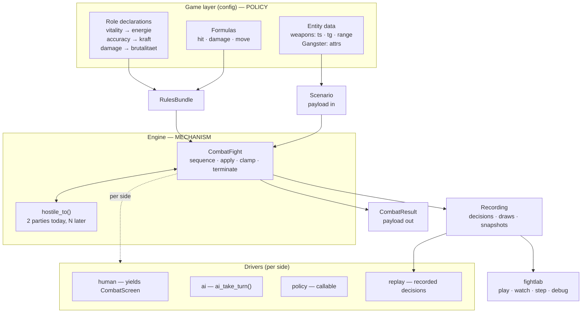

# Combat Engine Foundation — Plan

Make combat a real capability of the *genre* engine rather than of this one
game: the engine owns **mechanism**, the game supplies **policy**. On that
foundation, build scenario-driven fights, per-side control, full replay, and a
terminal debug tool.

---

## 1. Summary

Eight units in four pairs. Each pair leaves the tree green and nothing
half-built, but only three of the four produce something externally visible:

| Units | Delivers | Externally visible |
|---|---|---|
| U1–U2 | The genre engine is real — no game vocabulary in `engine/` | No — pure refactor |
| U3–U4 | #50 closed; a confirmed AI defect fixed | Yes |
| U5–U6 | Scenarios, per-side control, headless simulation | Yes |
| U6a | Encounters declared in data, not assembled in code | Yes |
| U7–U8 | Recording, replay, terminal debug tool | Yes |

**Read that first row honestly.** Stopping after U2 means two units spent with
no bug closed and nothing to demo. It is the *foundation*, not an increment.
If early interruption is likely, either run U3–U4 first (at the cost of touching
the same call sites twice) or do not start.

---

## 2. Problem Frame

### 2.1 The engine is not yet a genre engine

`CLAUDE.md` states the contract: a new game copies
`data/game_configs/mafia_1920s`, edits its data and handlers, and `engine/` is
untouched. That is currently false.

| Evidence | Location |
|---|---|
| `Gangster` — the *game's* entity — is defined in the engine | `engine/state/__init__.py:124` |
| `Fighter` hardcodes `energie`, `kraft`, `brutalitaet` | `engine/state/__init__.py:274` |
| `_STAT_NAMES` enumerates four German stat names | `engine/effects.py:43` |
| `is_hit(rng, *, ts, kraft)` names this game's stat | `engine/combat.py:319` |
| `damage_roll(rng, *, tg, brutalitaet)` names this game's stat | `engine/combat.py:347` |
| `shot_range` hardcodes this game's weapon ids | `engine/combat.py:348` |

39 references to game-specific stat names sit inside `engine/`. A game without
a stat called `kraft` cannot use this engine.

**The computational surface is small, though.** In `engine/combat.py` the
engine *computes* with a game stat in **three lines** (`:711`, `:715`, `:717`) —
the hit check, the damage roll, and the vitality subtraction. The rest of that
file is docstrings, construction, and pass-through.

**But combat is not the whole surface.** Two other modules read those fields,
and both are in U2's scope:

| Site | What it does |
|---|---|
| `engine/interactions.py:659,666,669,670` | `_finish` diffs pre/post energy to buffer `EnergyChange` |
| `engine/effects.py:695,702,749` | `StatChange`/`StatChangeCapped` read stats **by name string** via `getattr`; `EnergyChange` reads `g.energie` |

Nine lines across three modules, none of them algorithmically deep. Still
surgical — but "five lines in one file" would have sent an implementer looking
in the wrong place.

### 2.2 The blueprint boundary — what the engine actually uses

`Fighter` is the engine's **blueprint**: the minimum any implementation of a
combatant must have, plus a structure for the game to add its own. `Gangster` is
this game's **filling** of it.

The boundary is not "which fields do the two classes share" — it is **which
fields does the engine actually operate on**. Traced through
`engine/combat.py`:

| Field | Engine uses it? | Evidence | Verdict |
|---|---|---|---|
| `position` | **Structurally** — geometry, movement, projectile travel | `:460`, `:467`, `:657`, `:695`, `:702` | **Blueprint slot** |
| `down` | **Structurally** — activation cursor, win condition, occupancy | `:465`, `:564`, `:602`, `:622` | **Blueprint slot** |
| `energie` | **Only to subtract and clamp.** Never compared, never a threshold | `:717` | **Blueprint slot, renamed `vitality`** |
| `weapon` | **Only as an opaque key** into a stats lookup | `:692`, `:697` | **Opaque handle** |
| `kraft` | **Only to hand to a formula.** Never inspected | `:711` | **Game attribute** |
| `brutalitaet` | **Only to hand to a formula.** Never inspected | `:715` | **Game attribute** |
| `intelligenz` | **Never.** Zero references | — | **Game attribute** |
| `name` | Never in combat logic | — | **Opaque label** |

**`kraft` and `brutalitaet` are not engine concepts.** The engine's entire
involvement is plumbing them into a formula it does not own. Under a rules
bundle it stops touching them at all — the *formula* reads them from `attrs`,
and the formula is game code.

So the blueprint has **four slots, not six**:

```
Combatant                       # ENGINE — the blueprint
  position  : int | None        # geometry; None when off-grid
  down      : bool              # termination; derived from vitality == 0
  vitality  : int               # the depleting resource; engine subtracts and clamps
  attrs     : Mapping[str,int]  # OPAQUE — carried, handed to formulas, never read
  identity  : str               # opaque label
  equipment : Any               # opaque handle passed to equipment_stats

Gangster                        # GAME — the filling, defined in the config
  vitality  <- energie
  attrs     <- {kraft, brutalitaet, intelligenz}
  equipment <- weapon id
```

**Why these four and nothing else.** `position` and `down` are structural: the
engine cannot sequence activations, compute a line of fire, or detect a winner
without them. `vitality` is named because termination depends on it — the engine
must know when a combatant is out. `attrs` is the extension point: whatever the
game adds lands there, and the engine carries it without opinion.

**Adding a stat is a config-only change.** The engine never learns the name.

**The defect is location, not duplication.** Both class definitions live in
`engine/state/` (`:124`, `:274`), so the engine defines the game's entity
alongside its own blueprint. Two facts confirm the split is already right in
practice:

- **Each layer already builds its own.** `Gangster` is constructed by the game
  (`data/game_configs/mafia_1920s/handlers/pub.py:428`, `.../setup.py:291`);
  `Fighter` by the engine (`engine/combat.py:197`, `:229`).
- **`build_player_side(roster: Any)`** (`engine/combat.py:185`) types its
  parameter `Any` — already written as if the engine does not know what a
  `Gangster` is.

The fix is to move one definition across the boundary, not to merge or split.

### 2.2a A second violation the stat-name grep would miss

`engine/combat.py:779`:

```python
melee = self.active.weapon < 4
```

The engine hardcoding **this game's weapon taxonomy**, inside the AI's movement
logic. It contains no stat name, so a `kraft|brutalitaet|energie` grep guard
cannot catch it.

**And it is redundant.** Verified across all nine weapons: `weapon < 4` and
`range <= 2` agree exactly. The source tests the *same* boundary in both places
— `:30215` `ifw>3thenr=15` (range) and `:30415` `orgw(...)<4` (melee). Range is
primary; melee is derived.

So the engine should ask the equipment for its reach and treat "reaches only
adjacent cells" as the melee condition. **No `melee` field** — redundant data
that can drift out of sync with range. The adjacency threshold is grid geometry,
which the engine already owns.

### 2.2b How the layers interact

The call direction is **one-way: engine → game**. The engine invokes formulas
and gets values back; it never reaches into `attrs` itself.

```
ENGINE                                    GAME (config)
──────                                    ─────────────
sequences activations
computes geometry, line of fire
  │
  ├─ rules.hit(attacker, equip, rng) ───► reads attacker.attrs["kraft"]
  │  ◄─────────────────────────── bool     reads equip["ts"], rolls
  │
  ├─ rules.damage(attacker, equip, rng) ► reads attacker.attrs["brutalitaet"]
  │  ◄──────────────────────────── int     reads equip["tg"], rolls
  │
  ├─ applies: vitality -= damage, clamp 0
  ├─ sets down when vitality == 0
  └─ detects the winner
```

The engine passes the **whole combatant** to a formula rather than extracted
values, so adding an attribute never changes an engine signature.

### 2.2c Validation — three seams, three layers

Opaque `attrs` has a real cost: a typo fails late and vaguely. The mitigation
does not reintroduce coupling, because each seam validates something its own
layer legitimately knows.

| Seam | Who validates | What | Catches |
|---|---|---|---|
| Combatant construction | **Game** | Its declared attribute names are present | `iam` typo'd for `aim`, at construction |
| Fight construction | **Engine** | Every role the bundle declares resolves to a key the combatants actually carry | A role map pointing at a missing key — *before* the fight, not mid-formula |
| Equipment lookup | **Engine** | The handle is known | Today `weapon_stats` (`combat.py:569`) does `.get(weapon, (0, 0))` — an unknown id silently becomes a never-hits weapon, indistinguishable from bad tuning. **It should raise.** |

The engine's check is vocabulary-free: it compares *the bundle's own
declarations* against *the data it was handed*. It never needs to know a key is
spelled `kraft`. With per-capability roles (KTD-3) it also checks the *side*: a
`defender`-side role must resolve on the target, not the attacker.

**The declaration is the extension point — say so, and keep it the only one.**
Review raised the risk that `attrs` becomes an untyped `GameState 2.0`
(`aim`, `grit`, `morale`, `panic`, `bleeding`…). The declared-set check is what
prevents it: an attribute nobody declared **fails at construction**, so `attrs`
cannot accrete silently.

That is deliberately *not* a component system. `product-and-scope.md:76` — *"the
engine should remain untouched unless a second config proves a real shared
seam"* — rules out building typed `MovementComponent`/`MoraleComponent`
machinery for a config set of one. When a second game needs structured
extensions, they slot in **behind the same declaration**, which is why naming it
now matters: the door stays open without walking through it.

### 2.2d Value enforcement — the engine offers, the game opts in

The engine provides clamping **mechanism**; the game supplies the **bounds**.
This is already the established convention: `StatChangeCapped`
(`engine/effects.py:187`) takes `cap`/`floor` as required config-supplied
fields, and its docstring is explicit — *"the 99 stat ceiling is config-owned
game data, KTD-10, NOT hardcoded in the engine."*

| Tier | Who decides | Who enforces | Example |
|---|---|---|---|
| Engine invariant | Engine | Engine | `vitality >= 0` — required by "zero means down"; already at `combat.py:717` |
| Declared bound | **Game** | **Engine** | `kraft ∈ [0, 99]` — the engine clamps what it is told |
| Unbounded | Game, by omission | Nobody | a `morale` stat with no declaration |

A game declaring nothing gets no enforcement — unconstrained is a legitimate
choice. The engine never invents a bound.

**The engine does not validate attribute *values*** beyond the vitality
invariant. A game may legitimately want a negative modifier. Value rules live
where they are authored.

### 2.2e The same violations elsewhere — a codebase audit

The principles above were derived from combat, so they were run against the rest
of `engine/` to see what else breaks them. Game vocabulary by file:

| File | Hits | Assessment |
|---|---|---|
| `engine/effects.py` | 40 | **Worst offender.** Out of this plan's scope |
| `engine/combat.py` | 24 | In scope (U1–U2) |
| `engine/state/__init__.py` | 16 | Partly in scope (`Gangster`/`Fighter`); the rest is not |
| `engine/interactions.py` | 5 | In scope (U2's `_finish`) |
| `engine/types/__init__.py` | 2 | **Not in scope — see below** |
| `engine/persistence.py` | 2 | In scope (U2's two round-trip sites) |

**Finding 1 — the effect vocabulary is saturated with this game's domain.**
`RentAccrue`, `BarrelChange`, `TipSet`/`TipClear`, `DebtChange`/`DebtClear`,
`JobSet`/`JobClear`, `GangsterMarkHired`, `Jail`, `WantedChange`, `ShopChange`
are engine-level effect types encoding 1920s-Mafia mechanics. `BarrelChange`
(`engine/effects.py:421`) mutates `Contraband.alcohol_barrels` — alcohol
prohibition, in the genre engine. A game without pubs, rent, or debt inherits
all of it.

**Finding 2 — the state graph carries game entities the engine never reads.**
Applying §2.2's blueprint test (does the engine *operate* on it, or merely carry
it?) to `engine/state/`:

| Class | Engine reads outside `state`/`persistence` | Verdict |
|---|---|---|
| `Wanted`, `MapState`, `Clock` | **0** | Carried only — game data in the engine's graph |
| `Business`, `Contraband` | 1 | Construction only |
| `Debt`, `Job`, `Flags` | 2–4 | All in `effects.py`, constructing/mutating — never reasoning |

**Not one of these is operated on by the engine.** Every read is an effect
applying a change. By the blueprint test they belong in the game layer, with the
engine holding an opaque per-player extension slot — the same shape `attrs`
gives a combatant.

**Finding 3 — `engine/types` almost gets it right, then hardcodes stats.**
This module is the blueprint pattern done properly: it declares what a config
must provide and validates it at load. But `WeaponInstance`
(`engine/types/__init__.py:128-153`) requires `req_int`, `req_kraft`,
`req_brut` — the engine dictating that weapons gate on *this game's three
stats*. The right shape is an opaque requirements map the config validates
against its own declared attributes.

**Finding 4 — NPC stat defaults are engine constants.**
`ENEMY_KRAFT = 30` and `ENEMY_BRUTALITAET = 30` (`engine/combat.py:213-214`)
name this game's stats *and* fix their values. Ports `mf-prg.bas:30245`. These
belong in the enemy side of a `Scenario` (U5) or the rules bundle, not in
engine source.

**Finding 5 — one silent fallback masks an error; two do not.**
Three `.get(..., default)` lookups exist in `engine/`. Only one is a defect:

| Site | Fallback | Verdict |
|---|---|---|
| `engine/combat.py:569` `weapon_stats` | `(0, 0)` | **Defect** — an unknown weapon becomes a never-hits weapon, indistinguishable from bad tuning. Fixed in U2 (§2.2c) |
| `engine/conditions.py:86` `tenancy` | `0` | Legitimate — 0 *means* untenanted |
| `engine/movement.py:134` `special_cells` | `0` | Legitimate — an optional YAML field |

**Finding 6 — a second weapon-id comparison.** Besides the melee bug (§2.2a),
`engine/combat.py:312` (`if weapon > 3`) compares against a weapon id. It lives
inside `shot_range`, so U1 removes it — but it confirms the class is not a
one-off and justifies the structural guard over a name grep.

**Scope call.** Findings 1–3 are **out of scope** and deferred (§7.2). They are
recorded because they share one root cause with what this plan fixes: *the
engine names the game's domain instead of offering slots the game fills.* This
plan establishes that boundary on a contained surface and proves the pattern;
extending it to the effect vocabulary and the state graph is larger, separable
work that should reuse the same three-way rule (§2.3), blueprint test (§2.2),
and validation seams (§2.2c).

Findings 4–6 **are in scope** and fold into U1/U2.

**Two effect types the plan unavoidably touches.** The plan reaches
`engine/effects.py` in exactly two places, and both need handling because U2
changes the type they operate on:

| Effect | Why the plan touches it | What U2 must do |
|---|---|---|
| `EnergyChange` (`:285`) | Its name and docstring bind to `energie` and `roster[gangster]`. `_finish` buffers one per changed fighter (`interactions.py:668`) | Follow the `vitality` rename so the effect is not named for a field that no longer exists. **Do not** redesign it — its config-supplied `cap` already follows the KTD-10 shape correctly |
| `SpawnFighter` (`:348`) | Carries a fully-built `Fighter`, whose shape U2 changes | Its `_NESTED_EFFECT_FIELDS` reconstruction (`persistence.py:108`) must carry `attrs`. Already covered by U2's second round-trip test |

Everything else in the effect vocabulary stays untouched. Renaming
`EnergyChange` is a mechanical follow-on, not an invitation to start Finding 1.

### 2.2f Adding a new fight — the shape this plan produces

The plan changes every step of the "add an encounter" recipe without stating the
result. It is unchanged in *structure* — all three existing fights already
follow it (`jobs.py:138`, `kdh.py:354`, `upkeep.py:221`) — but each step's
mechanism moves.

**A new encounter at some location, after this plan:**

```
# 1. Describe the fight. Inline in the handler is fine and remains the
#    default — a scenario FILE is for standalone play (U8), not in-game
#    encounters, which need handler context (roster, params, backdrop).
scenario = Scenario.from_roster(
    active.roster,
    enemy_count=..., enemy_weapon=..., enemy_energie=..., enemy_name=...,
    grid=_backdrop("ks"),
    rules=_combat_rules(),          # the game's formulas + role map
)

# 2. Run it. One field, not four (U6).
result = yield StartCombat(scenario=scenario)

# 3. Narrate. Real per-side tallies (U3).
yield from narrate_combat_outcome(
    winner=result.winner, player_name=..., enemy_name=...,
    player_losses=result.losses[0], enemy_losses=result.losses[1],
)

# 4. Apply consequences — the HANDLER's job, never the scenario's (KTD-1).
if result.winner == 2:
    ctx.apply(<the loss consequence>)
```

**Where each piece comes from**

| Step | Owner | Note |
|---|---|---|
| Scenario | The handler, inline | Config tables supply the numbers (`formula_params`), as today |
| Rules bundle | The config, once | Shared by every fight in the game; not rebuilt per encounter |
| Driver assignment | Defaulted | Omitting `drivers` gives human-vs-AI, matching `cpu_sides`' current default |
| Consequences | **The handler** | KTD-1: the scenario describes the fight, never its rewards. This is why `Scenario` has no `on_win`/`on_loss` |

**Scenario files are for standalone play, not in-game encounters.** An in-game
fight needs the live roster and handler context; a file cannot supply those. U8
loads files for `fightlab`; handlers build scenarios in code. Both produce the
same `Scenario`, which is the point.

### 2.3 The three-way rule

Rules attach at three levels, and today the code flattens them:

| Rule | Level | Today |
|---|---|---|
| `ts` accuracy, `tg` damage rating | **entity attribute** — varies per weapon | already data ✓ |
| shot range | **entity attribute** — varies per weapon | hardcoded function ✗ |
| `int(draw + bt/10) + 1` | **game formula** — uniform across entities | engine function ✗ |
| damage reduces vitality, clamp 0, zero = down | **engine mechanism** — universal | engine ✓ |

**The rule: varies per entity → attribute. Uniform across entities → game
formula. True of any tactical fight → engine mechanism.**

`shot_range` is the instructive case — it looks like a rule but only ever reads
a weapon id, so it is a lookup table in disguise. Its real values:

```
{0: 2, 1: 2, 2: 2, 3: 2, 4: 15, 5: 15, 6: 20, 7: 20, 8: 15}
```

**Weapon 8 is 15, not 20** — `w>3` widens it but the `w=6 or w=7` test does not
fire. Exactly the entry a hand-written migration fumbles, which is why U1
demands differential proof.

### 2.4 Four functional blockers

1. **`_run_combat` returns a bare `int`** and discards `fight.losses` — issue
   #50. The collectors fight suppresses its losses block via `with_losses=False`
   because the narration helper's per-side count is a 1v1 shortcut.
2. **AI-vs-AI is broken.** Verified by probe (§9).
3. **Control is binary and global.** `cpu_sides` offers only "CPU" or "prompt".
4. **No recording.** Fights cannot be replayed, stepped, or observed after
   the fact.

### 2.5 What is already right — do not disturb it

`CombatFight` is documented as *"NOT a generator — this object owns the rules"*
(`engine/combat.py:490`). It never suspends: `shoot(direction)` resolves an
entire attack — travel, collision, hit check, damage, down flag, loss counter —
and returns a plain dict. The driver owns `yield`/`.send()`.

That separation is why everything here is a thin layer rather than a parallel
implementation. It stays.

### 2.5a What this engine is — an active-turn tactical engine

State it plainly, because the plan otherwise implies more genericity than the
code has: **one combatant acts at a time.** The activation cursor
(`active_side`/`active_fighter`) appears 35 times in `engine/combat.py`;
`advance_activation` mutates it in place; `_run_combat`'s loop is flat, one
iteration per activation.

That is faithful — the source is strictly sequential (`mf-prg.bas:30105-30110`:
`f=f+1`, side toggle, skip-if-down, no interrupt anywhere). It is also a real
boundary: simultaneous turns, reaction fire, overwatch, interrupts, and traps
all contradict it and would need the loop reworked.

Naming it does three things: it stops someone building overwatch on a loop that
cannot express it; it justifies `parent_index` in U7's schema (the one
pre-emptive concession, because only the *recording format* is expensive to
change after the fact); and it makes "tactical combat system" in
`product-and-scope.md:20` mean something checkable rather than aspirational.

### 2.6 Why now, and not just the two bug fixes

The honest counterfactual is **ship U3+U4 alone**: they close #50 and fix the AI
defect, introduce no abstraction, and cost a fraction of the effort. There is
one game in this repo and no second game scheduled.

It is rejected because the **simulator and custom-scenario play are the goal**,
not a side effect. R5/R6 (payload in/out, invented entities) and R14 (a debug
tool where every variable is observable) are unreachable while `Fighter`
hardcodes four German stat names — an invented entity must still fit that exact
shape, and a tool cannot show "every variable" when the engine decides which
variables exist.

So the layering work is a precondition, not purity. Doing it after U5–U8 would
mean designing `Scenario`, the recording format, and the tool twice.

**If R5/R6/R14 are not wanted, this plan is wrong and U3+U4 is the right
scope.** That is a product decision, not a technical one.

---

## 3. Requirements

**Layering**
- **R1** No game-specific attribute name appears in `engine/`.
- **R2** Combatants carry attributes as data; the game declares which attribute
  fills which engine role.
- **R3** The engine defines a combatant *blueprint*; the game defines its
  concrete combatant. `Gangster` moves out of `engine/state/`.
- **R4** Formulas are supplied by the game to engine operations.
- **R5** Per-entity rules are entity attributes, not functions — and no engine
  code compares against a game entity id.
- **R5a** Validation exists at three seams (§2.2c): the game validates its own
  vocabulary at construction; the engine validates that declared roles resolve
  against the data it was handed; the engine raises on an unknown equipment
  handle rather than falling back silently.
- **R5b** The engine offers clamping mechanism; the game supplies bounds
  (§2.2d). The engine's only self-imposed bound is `vitality >= 0`.

**Payload**
- **R6** Combat receives entities as a payload and returns a transformed
  payload; it never reads config assets.
- **R7** A scenario can invent weapons and combatants the game does not define.

**Correctness**
- **R8** A fight's result carries the winner and per-side losses.
- **R9** AI-vs-AI produces genuine hostile behavior on both sides.

**Control**
- **R10** Gang, controlling player, and driver are three distinct concepts.
- **R11** Control is assignable at setup and hand-off-able mid-fight.

**Observability**
- **R12** A fight is fully recordable and replayable, observable at every step.
- **R13** A terminal tool plays, watches, and replays fights with every
  variable visible.

**Discipline**
- **R14** All combat tests drive fights through the shared framework.
- **R15** Test determinism comes from tweaking inputs, never from rigging the
  RNG.
- **R16** Nothing built here blocks fights with more than two parties.
- **R17** No fidelity regression: in-game fights behave exactly as today.
  *Cross-cutting — traced to no single unit. Every unit carries a fidelity
  guard; §11 enforces it globally.*

---

## 4. Key Technical Decisions

> **Numbering.** KTD-1..KTD-10 below are plan-local. The codebase has its own
> KTD numbering in `engine/` docstrings (KTD-1 combat core, KTD-2
> non-cancellable prompts, KTD-3 frozen state graph). Codebase KTDs are cited
> with their file.

### KTD-1 — The engine owns concept slots and the machinery over them

The engine provides **concepts** (vitality, position, plus whatever the game
supplies) and **operations** over them. Each operation is called *with the
formula that shapes it*.

Engine owns *"damage reduces vitality, clamped at zero, and zero means down"*.
Game owns *"damage = `int(draw + bt/10) + 1`"*. Engine owns *"a move changes
position subject to obstruction"*. Game owns whether a move is one cell or a
jump.

### KTD-2 — One combatant type: a blueprint the game fills

```
Combatant                        # ENGINE — the blueprint
  position  : int | None         # geometry; None when off-grid
  down      : bool               # termination; derived from vitality == 0
  vitality  : int                # the depleting resource; subtract + clamp only
  attrs     : Mapping[str,int]   # OPAQUE extension point — never read by engine
  identity  : str                # opaque label
  equipment : Any                # opaque handle passed to equipment_stats

Gangster                         # GAME — the filling, defined in the config
```

**Four slots, justified by use** (§2.2): `position` and `down` are structural —
the engine cannot sequence activations, compute a line of fire, or find a winner
without them. `vitality` is named because termination depends on it. `attrs` is
the extension point the game fills.

**`kraft`/`brutalitaet`/`intelligenz` are not blueprint slots.** The engine
either hands them to a formula without inspecting them or never touches them at
all. They live in `attrs`, and adding another is a config-only change.

**Why `position` is nullable:** a combatant not in a fight has no cell. `None`
says that directly and lets one type serve both contexts without a conversion.

**Migration is by re-export, not a mass rename.** The config defines `Gangster`
in terms of `Combatant`, so 113 `Gangster` references in `tests/` and 6 in
`data/` keep resolving. Only the engine's 17 change.

### KTD-3 — A rules bundle passed at construction

```
RulesBundle
  vitality : "energie"                      # the one engine-named role
  hit      : {roles: {attacker: "kraft"},        fn: (attacker, equipment, rng) -> bool}
  damage   : {roles: {attacker: "brutalitaet"},  fn: (attacker, equipment, rng) -> int}
  move     : {roles: {},                         fn: (combatant, direction, grid) -> int|None}
  equipment_stats : (handle) -> Mapping[str, int]
```

Passed to `CombatFight.__init__` beside `rng`, exactly as `weapon_stats` is
today. No global registry — two differently-ruled fights must coexist for the
simulator. A scenario overrides one entry to build KTD-6's zero-variance weapon.

**Roles group per capability, not one flat map.** A flat
`{"accuracy": "kraft", "damage": "brutalitaet"}` cannot express *whose*
attribute a role reads. Mafia only ever reads the **attacker's** — verified: the
formulas take `kraft` and `brutalitaet` from `attacker` and nothing else
(`engine/combat.py:711`, `:715`). So a flat map works for this title and would
need a breaking change the first time a genre sibling wants a defender-side
`evasion` or a turn-order `initiative`.

Per-capability role sets cost one indirection now and avoid that rewrite. This
is a **genre-contract** decision, not a Mafia one
(`product-and-scope.md:20`) — and it is free because `roles` exists nowhere in
code yet; it is plan-only, so its shape is still open.

Two roles today. The structure, not the size, is what is being fixed.

### KTD-4 — Per-entity rules become entity data

`shot_range` stops being a function; weapons carry a `range` attribute beside
`ts` and `tg`. It varies per entity, so by §2.3 it is an attribute.

### KTD-5 — Gang, controlling player, and driver are three things

- **Gang** — the roster that wins or loses. Already `fight.sides[i]`.
- **Controlling player** — who owns that gang. A `GameState` concept that stays
  *outside* combat; `CombatFight` has no player field today and gains none.
- **Driver** — what decides each move right now: human input, AI policy, or a
  replay script. New, and **mutable during the fight** for R11.

A human-owned gang may be driven by AI; two human-owned gangs may both delegate
for one fight. Ownership and driving are independent.

### KTD-6 — Determinism from inputs, never from rigging the RNG

To force a testable outcome, tweak the *ingoing* values — a weapon whose damage
attribute admits no variance — rather than scripting RNG draws.

Scripted draw sequences encode assumptions about call ordering; when ordering
shifts, the script misaligns silently and the test stops reaching the code it
claims to cover. That is the documented cause of #49 and four other vacuous
tests (`docs/solutions/developer-experience/tests-that-cannot-fail.md`).

**Concretely:** a weapon with `tg` of 0 or 1 makes `rng.range(tg)`
single-valued, so damage is deterministic **without touching the RNG**. Tests
then use a real `Rng(seed)` and assert the same outcome across several seeds —
proving determinism comes from the data.

### KTD-7 — Recordings carry decisions and draws; calculations always recompute

A recording holds every decision, every RNG draw, and every calculation input —
never computed results as the source of truth. Replay re-runs the live formulas
against recorded inputs.

This makes replay a **fidelity-regression detector**: replay against changed
formulas and the divergence names the activation. Given this project found six
sign-inverted tests, that is a live safety net.

### KTD-8 — Snapshots are a cache; the decision log is the source of truth

Full state snapshots are also recorded, for instant seeking. Measured: ~90
activations per collectors fight, ~62 KB with snapshots vs. ~5 KB without.
Storage is not a constraint.

**The staleness rule:** a recording carries a shape version. On mismatch the
tool **discards snapshots and rebuilds them by replaying the decision log**.
Seeking gets slower for old recordings; nothing fails, nothing renders stale.
That is what makes carrying both principled rather than indecisive.

Reuse `SCHEMA_VERSION` (`engine/effects.py:40`) — it already exists for exactly
this ("bump when a shape change would matter to a replay of an old log").

### KTD-9 — Control handoff is a recorded event

A mid-fight control change is a log entry. Without it, replay reproduces the
moves but not who was driving — losing the distinction KTD-5 exists to make.

### KTD-10 — Hostility is a lookup, not a toggle

`_opposing(side) -> int` becomes `hostile_to(side) -> tuple[int, ...]`. Today it
returns exactly the other side, so behavior is bit-identical. Targeting and win
conditions then ask "who is hostile to me" rather than "the other side", so
N-party later is a data change (R16). This plan ships two-party behavior only.

---

## 5. High-Level Technical Design



The engine never sees the word `kraft`. It asks the bundle for the accuracy roll
and applies the result to vitality.

---

## 6. Implementation Units

### U1. Weapon range becomes entity data; melee derives from it

**Goal** `shot_range` stops being a function; weapons carry a `range` attribute.
The engine stops hardcoding this game's melee weapon ids.

**Requirements** R5 · **Dependencies** none

**Files**
- `data/game_configs/mafia_1920s/entities/weapons.yaml` (modify — add `range`)
- `engine/combat.py` (modify — delete `shot_range`, read the attribute)
- `data/game_configs/mafia_1920s/setup.py` (modify — carry `range` through the loader)
- `tests/test_weapons_data.py`, `tests/test_combat_loop.py` (modify)

**Approach** Add `range` to all nine weapon entries with the values the current
function produces, then delete the function.

**Also fix `melee` (§2.2a).** `engine/combat.py:779`'s `self.active.weapon < 4`
hardcodes this game's weapon taxonomy in the AI's movement branch. Replace it
with a reach test against the equipment's range. **Do not add a `melee` field**
— verified across all nine weapons that `weapon < 4` and `range <= 2` agree
exactly, and the source tests the same boundary in both places (`:30215`
`ifw>3thenr=15`, `:30415` `orgw(...)<4`). A separate flag is redundant data that
can drift from range.

**Execution note — differential proof, then delete.** Assert
`old_shot_range(w) == weapons[w]["range"]` for **every** id 0–8 *before*
removing the function. Weapon 8 is the trap: 15, not 20. Do the same for melee:
assert `(w < 4) == (range(w) <= 2)` for every id before deleting the comparison.

**Test scenarios**
- Differential: every weapon id 0–8 matches the old `shot_range`. Written and
  passing before deletion.
- Weapon 8 resolves to 15 (named regression guard for the widening edge).
- Differential: `(w < 4) == (range <= 2)` for every id 0–8.
- Shot travel distance is unchanged for every weapon in a real fight.
- The AI's close-distance branch fires for exactly the same weapons as before —
  a characterization test over the existing AI suite.
- A scenario supplying an invented weapon with arbitrary `range` fires that far,
  and is treated as melee iff its range is adjacent-only.

**Verification** `shot_range` no longer exists; no weapon-id comparison remains
in `engine/combat.py`; shot travel and AI movement unchanged.

---

### U2. Attribute-agnostic engine

**Goal** No game-specific attribute name in `engine/`. Combatants carry
attributes as data; the game declares roles and supplies formulas.

**Requirements** R1, R2, R3, R4, R6, R7 · **Dependencies** U1

**Blast radius (measured)** `Gangster`: 17 refs in `engine/`, 6 in `data/`,
**113 in `tests/`**. The re-export in step 6 is what keeps that 113 from
becoming a mass rewrite — do not substitute a global rename.

**Files**
- `engine/state/__init__.py` (modify — `Combatant` blueprint)
- `engine/combat.py` (modify — formulas move out; `shoot` calls the bundle)
- `engine/interactions.py` (modify — **`_finish` reads `f.energie` four times**
  at `:659`, `:666`, `:669`, `:670`. Renaming to `vitality` breaks these, and
  the driver is not otherwise part of this unit — easy to miss.)
- `engine/effects.py` (modify — `_STAT_NAMES` becomes config-declared)
- `engine/persistence.py` (modify — **both** reconstruction sites, see tests)
- `data/game_configs/mafia_1920s/setup.py` (modify — declare roles)
- `data/game_configs/mafia_1920s/combat_rules.py` (create — this game's formulas)
- `tests/test_combat_loop.py`, `tests/test_combat_ai.py`, `tests/test_state.py`,
  `tests/test_effects.py`, `tests/test_persistence.py` (modify)

**What moves where**

| Today | After |
|---|---|
| `engine/combat.py:319` `is_hit(rng, *, ts, kraft)` | `combat_rules.py` `hit(attacker, equipment, rng)` |
| `engine/combat.py:347` `damage_roll(rng, *, tg, brutalitaet)` | `combat_rules.py` `damage(...)` |
| `engine/combat.py:717` `max(0, target.energie - damage)` | stays — clamping vitality is mechanism |
| `engine/effects.py:43` `_STAT_NAMES` | config-declared attribute names |
| `engine/state/__init__.py:124` `Gangster` | moves to the config as the blueprint's filling |

**Internal ordering — eight steps, tree green throughout.** The unit-level gate
does not help mid-unit, and several of these break each other if reordered.

1. Create `combat_rules.py` with `hit`/`damage` **copied** (not moved), reading
   roles instead of named kwargs. Nothing calls them; green.
2. Write the differential tests — copied vs. original across the bounded domain.
   Equivalence is proven *before* anything moves.
3. Add `attrs` to `Gangster` and `Fighter` **alongside** existing named fields,
   both populated. Nothing reads `attrs` yet; green.

   **⚠ Dual-write hazard — this step is not as safe as it reads.**
   `_with_gangster` (`engine/effects.py:620`) rebuilds via
   `dataclasses.replace(g, **field_changes)`, so `replace(g, energie=5)` updates
   the **named field only** and leaves `attrs["energie"]` stale. Every effect
   applied during steps 3–5 silently desynchronises the two copies, and nothing
   fails until step 6 switches the reader.

   Do **not** hand-sync at call sites. Derive `attrs` in `__post_init__` from
   the named fields so `replace()` regenerates it on every rebuild and the two
   cannot drift by construction. The graph already runs a `_coerce_readonly`
   `__post_init__` (`engine/state/__init__.py`), so this extends an existing
   hook rather than adding one.
4. Update **both** persistence reconstruction sites for the new field; green.
5. Switch readers to the map: `shoot` (`combat.py:711,715,717`), `_finish`
   (`interactions.py:659,666,669,670`), **and the four `effects.py` branches
   below**; green.

   **`effects.py` mutates gangster stats by name — four branches, two shapes.**
   The plan elsewhere treats `EnergyChange` as a rename-only follow-on. It is
   not: `:749` reads `g.energie` and `:750` writes `energie=` through
   `_with_gangster`. Worse, `StatChange`/`StatChangeCapped` (`:695`, `:702`) use
   **`getattr(g, effect.stat)`** — attribute access by *name string* on a
   dataclass. Once stats live in `attrs`, `getattr` resolves nothing and both
   branches break.

   | Branch | Today | After |
   |---|---|---|
   | `StatChange` `:695-696` | `getattr(g, effect.stat)` + `replace(**{stat: v})` | read/write through `attrs` |
   | `StatChangeCapped` `:702-705` | same, plus `_clamp` | same, clamp unchanged |
   | `EnergyChange` `:749-750` | `g.energie`, `energie=` | vitality slot, not a named field |
   | `AssignWeapon` `:711` | `weapon=` | unchanged — equipment is a blueprint slot |

   `AssignWeapon` is the control: it stays as-is, which confirms the boundary is
   about *attributes*, not about every gangster field.
6. Move `Gangster` across the layer boundary. `Combatant` stays in
   `engine/state/`; `Gangster` moves to `data/game_configs/mafia_1920s/`,
   re-exported. `build_player_side` stops copying field-by-field and attaches
   `position`/`down` to the combatant the game already built; its `roster: Any`
   tightens to `roster: Sequence[Combatant]`.
7. Delete the engine-side formulas and now-unused named fields. Step 2's tests
   are the proof.
8. Generalize `_STAT_NAMES` to config-declared names; update affected tests.

Steps 1–4 are additive and individually committable. **Step 6 is the riskiest** —
land 1–5 and confirm green before starting it.

**Execution note — differential proof, then delete**, per formula. Relocate each
formula **verbatim with its BASIC citation intact**; the citation is the
fidelity trail.

**The differential domain, stated concretely** (the stats are typed `int` with
no enforced range, so "full domain" needs a bound): `ts`/`tg` take only the
values in `weapons.yaml` (~7 distinct each). `kraft`/`brutalitaet` are rolled
10–50 and capped at 99, so **0–99 inclusive** covers every reachable value with
margin. ~700 pairs per formula — exhaustible in milliseconds.

**Test scenarios**
- Differential: `is_hit` old vs. new across the full `ts` × `kraft` domain under
  a fixed seed, identical results.
- Differential: `damage_roll` across the full `tg` × `brutalitaet` domain.
- Grep guard: no `kraft`, `brutalitaet`, `energie`, `intelligenz`, or
  **`Gangster`** in `engine/**/*.py` outside docstrings citing the source.
- **Structural guard, not just a name grep.** The melee bug (§2.2a) contained no
  stat name, so a name grep could not catch it. Add a check that
  `engine/combat.py` contains **no bare comparison against a weapon id** —
  the class of defect a vocabulary grep misses. Any per-entity threshold must
  come from `equipment_stats`, never a literal.
- Role consistency (§2.2c): starting a fight whose rules bundle declares a role
  mapping to a key no combatant carries raises at fight construction, naming
  both the role and the missing key — **not** a `KeyError` mid-formula.
- Equipment lookup raises on an unknown handle instead of returning `(0, 0)`.
  A scenario with a typo'd weapon id fails loudly rather than producing a
  side that mysteriously never lands a shot.
- Declared bounds (§2.2d): a game declaring `kraft ∈ [0, 99]` has gains clamped
  by the engine; an undeclared attribute is left unbounded.
- `vitality` never goes below zero regardless of damage — the one engine
  invariant.
- Layer boundary: importing the engine with no game config succeeds and exposes
  `Combatant` but no `Gangster`.
- Round-trip via the **live** path (`persistence.py:214`, `Fighter(**f)`).
- Round-trip via the **nested-effect** path (`persistence.py:108`,
  `_NESTED_EFFECT_FIELDS`). **This is the path that broke in `9df2091`** — the
  live path worked while the nested one silently flattened `Fighter` to a dict,
  surfacing far from its cause as an `AttributeError`. Two sites, two tests.
- `intelligenz` survives a fight round-trip untouched — the map must not drop
  unread keys.
- **Dual-write coherence (steps 3–5):** after any `_with_gangster` rebuild, the
  named field and its `attrs` entry agree. Assert directly —
  `replace(g, energie=5)` yields `attrs["energie"] == 5`. This is the one
  failure that stays green until step 6 and then surfaces far from its cause.
- **`getattr`-by-name still resolves:** a `StatChange(stat="kraft", amount=+5)`
  raises the gangster's kraft by exactly 5, read back through whichever access
  path step 5 settled on. Same for `StatChangeCapped` including its clamp.
- `AssignWeapon` is unaffected — equipment is a blueprint slot, not an
  attribute. Included as the control case.
- **Finding 4:** `ENEMY_KRAFT`/`ENEMY_BRUTALITAET` (`engine/combat.py:213-214`)
  no longer exist. NPC stat defaults come from the scenario or the rules bundle,
  so the engine names neither the stat nor its value. A scenario inventing an
  enemy with `aim`/`grit` supplies its own defaults.
- **⚠ The wire shape changes — the client breaks silently.**
  `CombatScreen._active_fighter_panel` (`engine/interactions.py:215-220`) does
  `json_safe(fighter)`, dumping **whatever fields the dataclass has** onto the
  wire. `render_fighter_panel` (`clients/terminal/renderers.py:272-283`) reads
  `energy`, `kraft`, `brutalitaet` from that payload by name. After the rename
  the panel silently renders blanks — **and the plan's grep guard cannot catch
  it, because it only scans `engine/`.**
  Decide explicitly: either the panel flattens `attrs` back onto the payload so
  the wire contract is unchanged (smallest blast radius, recommended), or the
  renderer moves to reading `attrs` and the theme names the fields. **Assert the
  rendered panel is byte-identical before and after** — a test the plan would
  otherwise not have.
- Existing `Gangster` call sites in `data/` and `tests/` construct without edits.
- A **second, invented config** whose combatant has entirely different
  attributes (`aim`, `grit`, no `intelligenz`) fights correctly — the
  genre-engine claim, tested rather than asserted.
- All three in-game fights produce identical outcomes for the same seed.

**Verification** Grep guard passes; all three in-game fights bit-identical.

---

### U3. `CombatResult` — carry losses out of the fight

**Goal** `_run_combat` returns winner **and** per-side losses. Closes #50.

**Requirements** R8 · **Dependencies** U2

**Files**
- `engine/interactions.py` (modify — `_finish`, return annotation)
- `engine/combat.py` (modify — export the result type)
- `data/game_configs/mafia_1920s/handlers/jobs.py`, `kdh.py`, `upkeep.py` (modify)
- `data/game_configs/mafia_1920s/setup.py` (modify — `narrate_combat_outcome`)
- `tests/test_combat_loop.py`, `tests/test_upkeep.py`, `tests/test_kdh.py`,
  `tests/test_pub_jobs.py`, `tests/test_debt_default.py` (modify)
- **`tests/test_substate.py` (2 sites), `tests/test_client_loop.py` (1),
  `tests/test_driver.py` (1)** — these also `yield StartCombat` and consume its
  return. Easy to miss: they are driver/substate tests, not combat tests, so a
  search scoped to combat files skips them. **Seven** test files touch
  `StartCombat` in total; changing the return type breaks any that bind the
  yielded value.

**Approach** `CombatFight.losses` (`engine/combat.py:544`) already tracks real
`v(1)`/`v(2)` tallies, incremented at `:722`. **U3 does not touch `CombatFight`
at all** — the only engine change is `_finish`'s return value.

```
@dataclass(frozen=True)
class CombatResult:
    winner: int              # 1 or 2 — unchanged
    losses: tuple[int, int]  # (side1, side2) when the fight ended
```

Mirror `CommitResult` (`engine/effects.py:876`) and `EngineResult`
(`engine/actions.py:49`): flat, frozen, no methods. **Do not add `state` or
`sides`** — U5 owns payload-out; R8 is precisely winner and losses.

`_finish` (`engine/interactions.py:661`; `pre_energie` at `:659`) keeps its
energy-diff loop and returns `CombatResult(winner, fight.losses)` instead of a
bare int. Every call site already invokes it as `_finish(fight.finish(...))` or
`_finish(fight.surrender())` (`:680`, `:692`, `:711`, `:726`), so tallies are
final by then — no ordering change. `_run_combat`'s annotation (`:589`) becomes
`-> CombatResult`.

**Six call-site expressions; only three change.** `_fight`
(`jobs.py:146-163`) returns a bare `winner` at `:163`, so its three callers
(`jobs.py:194,204,218`) need **no edit** — the change is absorbed inside.

| Site | Change |
|---|---|
| `jobs.py:146` | `result = yield …`; narrate from `result.*`; still `return result.winner` |
| `jobs.py:194,204,218` | none |
| `kdh.py:362` | `result = yield …`; `:372` and `:375` read `result.winner` |
| `upkeep.py:230` | same, **plus** delete `with_losses=False` (`:251`) and the deviation comment (`:240-246`) |

**`narrate_combat_outcome`** (`setup.py:180`): replace `with_losses: bool` with
`player_losses: int, enemy_losses: int`; delete the `0 if side == winner else 1`
shortcut (`:213`) that is only correct for 1v1. `with_losses` is **deleted, not
defaulted and left dead** — the source prints the block unconditionally
(`mf-prg.bas:30510`, `:30515`).

**#49 guard — do not leave the collectors path unprotected.** U3 changes the
collectors narration, and the only tests nominally covering it are the vacuous
pair filed as #49. Add **one** new test so U3's own change is falsifiable.

**Write it outcome-agnostically, via the surrender path.** Whether a boss
survives five collectors is unverified until U6, so do not build the guard on a
win. Drive the fight with `_scripted("surrender")` (a pattern
`tests/test_debt_default.py` already uses at `:217`, `:225`, `:237`, `:281`) —
it resolves immediately and deterministically **regardless of winnability**,
with zero shots fired. Then assert the `combat.losses_line` messages carry
`count=0` for **both** sides.

That has teeth: the old shortcut would print `count=1` for the loser even on a
zero-shot surrender. Confirm by reverting `narrate_combat_outcome` and watching
it go red.

**Test scenarios**
- A won 1v1 job-shift fight yields `losses == (0, 1)` and narrates the block.
- A lost 1v1 fight yields `losses == (1, 0)`.
- The kdh ambush (1v1) narrates real tallies.
- A won collectors fight narrates a tally equal to the number actually downed —
  **not** a hardcoded 1.
- The #49 guard above.
- A surrender before any shot: `losses == (0, 0)`, no `EnergyChange` buffered.
- Grep: `with_losses` appears nowhere in the tree.

**Verification** Collectors fight prints a real losses block; `with_losses` gone.

---

### U4. Side-relative targeting and hostility lookup

**Goal** The AI hunts whoever is hostile to it, whichever side it drives.

**Requirements** R9, R16 · **Dependencies** U2

**Files** `engine/combat.py`, `tests/test_combat_ai.py` (modify)

> ### ⚠ Fidelity trap — read before touching `ai_target`
>
> `AI_HUNTS_SIDE = 1` (`engine/combat.py:378`) is **not simply a bug.** In the
> original the CPU genuinely always hunts side 1: `mf-prg.bas:30010`'s
> `pokefr+kp(i,j),2-4*(i=2)` paints side 1 with colour 2, and the `cr` routine
> scans for colour 2.
>
> `tests/test_combat_ai.py:128`
> (`test_the_ai_hunts_side_one_even_when_side_two_acts_second`) pins **correct,
> source-verified behavior — do not "fix" it.**
>
> The defect is narrower: **what happens when side 1 itself is CPU-driven** — a
> shape the original never produces (side 1 is always the human roster) but
> which `cpu_sides` already lets a caller request. Fix that; leave the
> side-2-hunts-side-1 path bit-identical.

**Approach** Replace `_opposing(side) -> int` (`engine/combat.py:572`) with
`hostile_to(side) -> tuple[int, ...]`, returning `(2,)` for side 1 and `(1,)`
for side 2 — identical behavior, N-party-shaped. `ai_target` derives its
candidate pool from `hostile_to(fight.active_side)` instead of the constant.

**Self-exclusion falls out of the derivation — do not bolt on an identity
check.** Once the hostile side is derived from `active_side`, the active
fighter's own side is never in the pool, because a side is never hostile to
itself. An identity check alone (`other is not fight.active`) would still allow
targeting a *teammate*. One change, two failure modes closed.

**`_opposing` has four call sites**

| Site | After |
|---|---|
| `:599` `advance_activation` | `self.hostile_to(self.active_side)[0]` |
| `:620` `winner()` | `other = self.hostile_to(side)[0]` |
| `:691` `shoot()` | `enemy_side = self.hostile_to(self.active_side)[0]` |
| `:915` `surrender()` | `self.hostile_to(self.active_side)[0]` |

`_opposing` is deleted once all four migrate — private, only internal callers,
so no re-export period is needed.

**Retire `AI_HUNTS_SIDE` but keep its docstring.** The comment block at
`:367-378` explaining the `cr` colour-2 hardcode is valuable fidelity
documentation; move it to `hostile_to`, noting that in the original "hostile"
reduces to the colour-2/side-1 hardcode because only two fixed sides exist —
that is *why* the two-party default is `(2,)`/`(1,)` and not a general graph.

**Execution note — the five-step characterization sequence**

1. Run the existing `tests/test_combat_ai.py` suite; confirm green. **That suite
   is the pin** — every case uses `active=(2,1)` (the `_fight` helper default at
   `:63`), the only side the original puts under AI control.
2. Add **one failing test first**: `active=(1,1)`, one side-1 fighter, one
   side-2 fighter at a distinct cell. Assert `ai_target(fight).side == 2` and
   `(x, y) != (0, 0)`. Confirm RED.
3. Make the change.
4. Re-run the existing suite **unedited**. *If any existing test needs an edit
   to stay green, the change altered side-2 behavior and is wrong.*
5. Confirm the new test passes.

**Test scenarios**
- Characterization: the existing suite passes unedited.
- A side-1 CPU fighter targets a side-2 fighter, not itself.
- A side-1 CPU fighter with a living teammate targets the enemy, not the
  teammate.
- The active fighter is never its own target, on either side.
- Downed fighters remain excluded on both sides.
- `hostile_to(1) == (2,)` and `hostile_to(2) == (1,)`.

**Verification** An AI-vs-AI fight resolves with both sides dealing damage; the
characterization suite is unedited.

---

### U5. `Scenario` — payload in, payload out

**Goal** One value type describes a fight, constructible without a `GameState`,
carrying invented entities if it wants.

**Requirements** R6, R7 · **Dependencies** U3, U4

**Files** `engine/scenario.py` (create); the three handlers (modify);
`tests/test_scenario.py` (create)

**Approach** Two construction paths converging on one shape.

```
@dataclass(frozen=True)
class Scenario:
    sides: tuple[tuple[Combatant, ...], tuple[Combatant, ...]] | None = None
    grid: tuple[int, ...] = ()
    rules: RulesBundle | None = None
    dir_memory: Mapping[int, int] | None = None
    seed: int | None = None

    @classmethod
    def from_roster(cls, roster, *, enemy_count, enemy_weapon, enemy_energie,
                    enemy_name="", grid=(), rules=None, seed=None) -> "Scenario":
        """The five-parameter procedural form the three handlers share."""
        # thin wrapper over the EXISTING setup_combat — do not reimplement
```

- **Explicit path** — precedent exists: `tests/test_driver.py:191-193`
  hand-builds fighter tuples with no `GameState` and no YAML.
- **Procedural path** — `from_roster` calls the existing `setup_combat`
  (`engine/combat.py:245`, unchanged), which already does `build_player_side` +
  `build_enemy_side` + `dir_memory` init. Do **not** duplicate that logic.

**Scope boundary — `StartCombat` is NOT changed here.** The handler still
unpacks the scenario into the same kwargs; only the intermediate value changes
from a bare `CombatState` to a `Scenario`. Widening `StartCombat` to accept a
`Scenario` belongs to U6, which already touches that dataclass — doing it here
means editing one signature twice.

**"Payload out" is U3's `CombatResult`, not `Scenario`.** What U5 adds is that
the payload-*in* half becomes a named, inspectable value. Today it is an
ephemeral set of kwargs passed straight from `setup_combat` into `StartCombat`
with nothing a test or tool can hold. After U5 a caller builds one `Scenario`
and can (a) yield it through a handler, (b) hand it to `CombatFight` directly
with no driver (as `tests/helpers.py:297` `build_fight` does by hand today), or
(c) hand it to U6's `simulate()`.

**Inventing entities needs no new machinery.** `CombatFight.weapon_stats()`
(`engine/combat.py:567`) is a plain dict lookup with a `(0,0)` fallback and no
awareness of the real config — "passed in rather than imported" by design
(`:507-510`). A scenario supplies `Combatant(weapon=250, …)` alongside its own
stats entry for 250, and the fight resolves. That is why stats live *on*
`Scenario` rather than being fetched.

**Test scenarios**
- `from_roster` produces `sides`/`grid`/`dir_memory` identical to today's
  `setup_combat` call, for each of the three in-game fights' real parameters.
- An explicit `Scenario` constructs with no `GameState`, roster, or YAML load.
- A scenario with an invented weapon (id 250, stats outside `weapons.yaml`)
  resolves a shot using the supplied stats — not a `(0,0)` fallback, not a
  `KeyError`.
- Round-trip: `Scenario` → fight → `CombatResult`, zero `GameState` constructed.
- Differential: each handler produces byte-identical `StartCombat` field values
  before and after migrating.

**Verification** All three handlers construct through `Scenario`; no in-game
fight behavior changes. (`setup_combat` is **not** deleted — `from_roster` calls
it.)

---

### U6. Per-side drivers and headless simulation

**Goal** Each side is driven by human, AI, or policy; fights run headlessly with
no client and no draw scripting.

**Requirements** R10, R11, R14, R15 · **Dependencies** U5

**Files** `engine/interactions.py`, `engine/combat.py` (split `ai_take_turn` →
`ai_decide`; add `CombatView`), `engine/scenario.py`, `tests/helpers.py`,
`tests/test_combat_loop.py`, `tests/test_combat_ai.py` (the AI suite calls
`ai_take_turn` directly — see the migration note), `tests/test_driver.py`,
`tests/test_simulation.py` (create)

**Approach** The dispatch site (`engine/interactions.py:682-694`) is already a
**two-way branch on `fight.active_side`**. U6 changes only what selects the
branch, without moving it out of the generator frame:

```
driver = drivers[fight.active_side]
if driver.kind == "human":
    screen = CombatScreen(...)
    raw = input_source(screen)          # the ONLY suspending path
    action, argument = _parse_combat_response(raw)
else:
    action, argument = driver.decide(view)    # ai / policy / replay — DECIDE ONLY
# the apply-action block below (:708-730) is UNCHANGED, and is now the
# single place any action is executed, whoever chose it
```

**⚠ Decide and execute must be split — this is a bug fix, not future-proofing.**
`ai_take_turn` (`engine/combat.py:732`) **already executes**: it calls
`self.shoot(direction)` and returns the result. Wiring it behind a `decide()`
that returns `(action, argument)` for the apply-block to run would execute the
action **twice**.

So U6 splits it:

- `ai_decide(view) -> (action, argument)` — the targeting/movement choice, no
  mutation. This is `ai_take_turn` minus its one `self.shoot(...)` call.
- The dispatcher executes, via the apply-block every other driver already uses.

One mutation site moves (`combat.py:~800`). Every driver kind then obeys the
same contract: **choose, return, and let one place apply.** That uniformity is
what lets `replay` be a driver at all — a replay driver *must not* execute,
since the recorded result is the thing being reproduced.

**The generator boundary — settled, not deferred.** `yield` cannot cross a plain
function call, so a "callable driver" cannot suspend. Dispatch therefore stays
*inside* `_run_combat`'s generator frame, and only the human driver's answer
arrives via `yield`/`.send()`. **"Headless" means no `yield` occurs on that
side's turns**, not that drivers run outside the generator.

**Four kinds, still a two-way branch.** `kind` discriminates suspend-vs-call:

| Kind | How it answers |
|---|---|
| `human` | *No callable.* Its presence tells the loop to yield a `CombatScreen`. |
| `ai` | `fight.ai_decide(view)` — the split-out chooser, no mutation |
| `policy` | `Callable[[CombatView], tuple[str, Any]]` |
| `replay` | Reserved here so **U7 need not touch this dispatch again** |

**`CombatView` — the read-only argument every non-human driver receives.** Once
`decide` cannot execute, handing it the mutable `CombatFight` is both
unnecessary and an invitation: a driver could call `shoot` directly and bypass
the single apply-block, breaking recording (U7) silently.

`CombatView` exposes what a decision needs and nothing else — `sides`, `grid`,
`active_side`, `active_fighter`, `hostile_to`, and the equipment-stats lookup.
No mutators. `ai_target` (`engine/combat.py:434`) already reads only these, so
it ports unchanged.

This is also the seam a second game's AI plugs into (`product-and-scope.md:76` —
a genre-level extension surface, not an internal argument).

**`StartCombat` accepts a `Scenario` — resolved here, as U5 defers.** U5 leaves
handlers unpacking a scenario into four kwargs to avoid editing this dataclass
twice. U6 edits it anyway (for drivers), so the widening lands here:

```
StartCombat
  scenario : Scenario | None = None    # NEW — the whole payload in one field
  drivers  : Mapping[int, Driver] | None = None
  # legacy fields retained, and still the path when scenario is None:
  sides · grid · weapon_stats · dir_memory · cpu_sides
```

When `scenario` is given it supplies `sides`/`grid`/`rules`/`dir_memory` and the
legacy fields are ignored; when absent, today's four-kwarg path is unchanged.
That keeps every existing call site working while making the intended form a
single field. Migrate the three handlers to `scenario=` in this unit — they
already build one after U5, so it is a mechanical simplification, not new work.

**`cpu_sides` compatibility** — it stays on `StartCombat` (`:146`); handlers are
untouched. `_run_combat` derives the map once:
`drivers = {s: AiDriver() if s in cpu_sides else HumanDriver() for s in (1, 2)}`.
A caller wanting a policy side passes a `drivers` field that **overrides**
`cpu_sides` rather than merging — two knobs on one axis must not both apply.

**Mid-fight handoff (R11)** is a control-plane change *between* activations, not
a `CombatScreen` response. U6's obligation is that reassigning `drivers[side]`
between activations works and is tested; a live in-game trigger is not required
(no current fight delegates). Structure it as a discrete, observable state
change so U7 can hang a `HandoffEvent` on it.

**`simulate()`**

```
def simulate(scenario: Scenario, drivers: Mapping[int, Driver], *,
             rng: Rng | None = None) -> CombatResult
```

Explicit driver map — no `cpu_sides` sugar, since this is the programmatic entry
point. Returns U3's `CombatResult`, so a caller cannot tell whether a fight ran
through a handler or headlessly. Raises loudly if any side carries a
`HumanDriver`. **Extract the shared activation loop** so `_run_combat` and
`simulate()` cannot drift.

**R14 — the shared test helper.** `tests/helpers.py:297`'s `build_fight` is
untouched (it serves direct `CombatFight` method tests). Add `run_fight(...)`
beside it as the single end-to-end entry point, and migrate the driver-level
combat tests in `tests/test_combat_loop.py:342-543`,
`tests/test_combat_ai.py:612-676`, and `tests/test_driver.py:181-199` onto it.
A second driving path is how suites drift.

**Test scenarios**
- Human-vs-AI behaves exactly as today — the fidelity guard.
- AI-vs-AI resolves with both sides acting (needs U4).
- Human-vs-human prompts for both sides (the hot-seat case
  `engine/combat.py:388`'s docstring already promises).
- Policy-vs-AI resolves headlessly with no `input_source`.
- A seeded simulation is reproducible.
- A zero-variance weapon (KTD-6, `tg` 0 or 1) forces a deterministic outcome
  across several seeds **with no scripted RNG draws**.
- An exhausted or invalid driver response fails loudly.
- `simulate()` raises a clear error when handed a `HumanDriver` — a distinct
  failure mode from an exhausted answer list.
- Surrender preserved: quit/EOF from a human driver still surrenders. (The
  *codebase's* KTD-2 — "Combat prompts are non-cancellable",
  `engine/interactions.py:171`.)
- **No double-execution:** an AI activation that shoots applies damage exactly
  once. Assert the target's vitality drops by one hit's worth, not two — the
  concrete regression the decide/execute split exists to prevent.
- `ai_decide` is **pure**: calling it twice on the same view returns the same
  choice and leaves the fight unchanged (no `down` flips, no vitality change).
- A driver handed a `CombatView` cannot mutate — `shoot`/`try_move`/
  `advance_activation` are absent from its surface.
- Characterization: for every existing `ai_take_turn` case, `ai_decide` +
  dispatcher execution produces an identical outcome.

**Migration note — 29 call sites.** `tests/test_combat_ai.py` calls
`ai_take_turn` 29 times (engine has 3). Keep `ai_take_turn` as a thin
`ai_decide` + execute wrapper so the AI suite migrates **without edits** — it is
the characterization pin for U4 and must stay untouched to prove side-2 behavior
is unchanged. Retire the wrapper only after the suite is green on the split.

**The boss-survival question is now bounded** (modelled during planning from the
real formulas and stats — see §9). Expected damage per activation:

| Side | P(hit) | avg damage | dmg/activation |
|---|---|---|---|
| Boss (weapon 6, `ts=5 tg=12`, kraft/brut 50) | 0.667 | 11.5 | **7.7** |
| One collector (weapon 3, `ts=4 tg=4`, 30/30) | 0.562 | 5.5 | 3.1 (**15.5** for five) |

**A lone boss loses reliably** — needs ~20 activations to clear 150 enemy HP
while taking 15.5/round against 99 HP (down in ~6.4). The crossover is around a
**four-fighter roster**; at five the player wins comfortably.

So the fight *is* winnable, but roster size decides it. Confirm empirically in
this unit rather than trusting the model — the model ignores positioning,
activation order, and the AI's move-vs-shoot choice, any of which shifts the
crossover. **Do not build a test that assumes a lone-boss win.**

**Verification** All four fight shapes resolve; every combat test drives fights
through the shared helper.

---

### U6a. Data-defined encounters

**Goal** A fight is declared in config data, not assembled in handler code.

**Requirements** R6, R7 · **Dependencies** U6

**Files**
- `data/game_configs/mafia_1920s/content/encounters/` (create — the declarations)
- `engine/scenario.py` (modify — `Scenario.from_encounter`)
- `data/game_configs/mafia_1920s/setup.py` (modify — encounter loader)
- `data/game_configs/mafia_1920s/handlers/kdh.py`, `upkeep.py`, `jobs.py` (modify)
- `tests/test_encounters.py` (create)

**What is already data.** The fight *parameters* live in `config.yaml` today —
`kdh_ambush_weapon/energie/loot_min/loot_max/score` (`:119-124`) and
`kdh_collectors_count/weapon/energie` (`:127-129`). What remains in Python is
the **assembly** (five kwargs into `setup_combat`) and the **consequence
application**. So the setup half is a regrouping of existing data, not new
authoring.

**The encounter declaration:**

```yaml
# content/encounters/kdh_ambush.yaml
key: kdh_ambush
enemies:
  count: 1
  weapon: 6           # gewehr — mf-prg.bas:15312
  vitality: 35
  name: schuldner
grid: ks
on_win:
  - money: {roll: [500, 1499]}   # p=int(rnd(1)*1000)+500 — :15320
  - score: 2.0                   # x=2:gosub1160 — :15321
  - message: locations.kdh.ambush_loot
on_loss: []                      # :15315 — silent return, no cost
```

`Scenario.from_encounter(key, roster, rules)` reads it and produces the same
`Scenario` the handler builds today. The handler becomes:

```
result = yield StartCombat(scenario=Scenario.from_encounter("kdh_ambush", ...))
yield from apply_outcome(ctx, encounter, result)   # config-layer helper
```

#### The consequence problem — and the honest boundary

**Every fight's *setup* is declarable. Only some *consequences* are.** Those are
separate questions, and the encounter format keeps them separate: `enemies`/
`grid` are always data; `on_win`/`on_loss` are optional.

**Where a fight is called from makes no difference** — only its parameters and
its outcomes. `_fight` (`jobs.py:133-163`) is already purely a fight: build,
yield, narrate. The job flow lives entirely in its *caller* (`won = winner == 1`
at `:195`, `:205`, `:219`, then the job decides what that means). Nothing about
the surrounding flow enters the encounter.

| Fight | Setup | Consequence | Consequence declarable? |
|---|---|---|---|
| kdh ambush | `{count 1, weapon 6, vitality 35, name schuldner, grid ks}` | random loot roll → money + score + message | **Yes** |
| upkeep collectors | `{count 5, weapon 3, vitality 30, name eintreiber, grid ks}` | `MoneyChange(-active.ka)` — seizes cash held **at that moment** | **No** — needs a live state reference |
| job bouncer ×3 | `{count 1, weapon 0/1/3, vitality 30/20/20, names…, grid kp}` | caller sets `won`; the job pays out | **No** — the outcome belongs to the job, not the fight |
| job croupier | `{count 1, weapon 1, vitality 10, name spieler, grid kp}` | as above | **No** |
| job killer | `{count 1, weapon 0, vitality 20, name opfer, grid km}` | as above | **No** |

**All five fights get declared.** The three job opponents are currently
hardcoded Python dicts (`_BOUNCER_BRAWLERS` at `jobs.py:78-82`,
`_CROUPIER_OPPONENT` at `:89`, `_KILLER_VICTIM` at `:93`) in exactly the shape
an encounter file wants — they are data pretending to be code. The bouncer's
three variants become one encounter with a `variants:` list the caller indexes
with its existing `ctx.rng.range(3)` roll, so the *selection* stays in Python
where the source puts it (`:25035`) while the *definitions* become data.

Fights whose consequence is not declarable simply omit `on_win`/`on_loss`; the
caller applies the outcome as it does today. That is a supported shape, not a
partial migration.

**The consequence vocabulary stops where the guard DSL stops.** Follow the
**guard DSL's** precedent (`engine/conditions.py`) — *pure data, deliberately
tiny, constraints as contract*, seven operators and nothing more. The outcome
vocabulary is the same kind of restrained list:

```
money   : int | {roll: [min, max]}
score   : float
message : <theme key>
clear   : <named effect with no arguments, e.g. debt>
```

**No state references, no conditionals, no arithmetic over live values.** An
encounter needing those keeps its consequence in Python — the declaration then
carries only the fight, and the handler applies the outcome. That is a supported
shape, not a failure: `on_win`/`on_loss` are optional.

**Migrate all five.** Every fight the game can start is declared:

| Encounter | Consequence lands where |
|---|---|
| `kdh_ambush` | fully in data (`on_win` roll + score + message) |
| `kdh_collectors` | setup in data; seizure stays in Python (live `ka`) |
| `job_bouncer` (3 variants) | setup in data; payout stays with the job |
| `job_croupier` | setup in data; payout stays with the job |
| `job_killer` | setup in data; payout stays with the job |

After this unit, **no fight setup is assembled inline in a handler.** The
`_BOUNCER_BRAWLERS`/`_CROUPIER_OPPONENT`/`_KILLER_VICTIM` literals are deleted;
`_fight` takes an encounter key instead of an opponent dict.

**Execution note** Differential proof, as U1/U2: assert the `Scenario` built
`from_encounter` is byte-identical to the one `from_roster` builds from the same
config params, before deleting the inline construction. The declaration is a
regrouping of existing data, so any divergence is a transcription error.

**Test scenarios**
- Differential, **all five encounters**: `from_encounter(key, …)` produces a
  `Scenario` equal to today's inline construction for the same roster and
  params — `kdh_ambush`, `kdh_collectors` (`count: 5`), `job_bouncer` (each of
  the three variants), `job_croupier`, `job_killer`.
- The bouncer's `ctx.rng.range(3)` roll selects the same variant as today for a
  fixed seed — selection stays in Python, definitions move to data.
- kdh's ambush win applies money within `[500, 1499]`, the score change, and the
  loot message — identical effects to the current handler for a fixed seed.
- kdh's ambush loss applies **nothing** (`:15315` is a silent return).
- upkeep's collectors declaration carries setup only; its seizure consequence
  still runs in Python and still reads live `ka`.
- Each job fight's `won = winner == 1` branch behaves identically; the job's
  payout is untouched by this unit.
- Grep: no opponent literal (`_BOUNCER_BRAWLERS`, `_CROUPIER_OPPONENT`,
  `_KILLER_VICTIM`) and no inline `setup_combat`/`Scenario.from_roster` call
  remains in any handler.
- An encounter declaring an unknown outcome key fails **at config load**, not at
  fight time — the guard DSL's validation posture.
- An encounter referencing a missing grid or weapon id fails at load.
- A scenario file (U8) and an encounter declaration produce the same `Scenario`
  type — one loader, two sources.

**Verification** All five of the game's fights are declared in data; no handler
assembles a fight setup inline; every fight's behavior is byte-identical for a
fixed seed.

---

### U7. Recording and replay

**Goal** A fight is fully recordable and replayable, observable at every step.

**Requirements** R12 · **Dependencies** U6

**Files** `engine/recording.py` (create), `engine/interactions.py`,
`engine/scenario.py` (modify), `tests/test_recording.py` (create)

**The event schema** — a tagged union sharing one monotonic `index`, which
doubles as the seek key:

```
ActivationEvent
  kind: "activation";  index: int;  side: int;  fighter_index: int
  parent_index: int | None   # None for a normal activation; set when this event
                             # happened INSIDE another (reaction fire, interrupt,
                             # overwatch, a trap firing on someone's move)
  driver_kind: str                # "human" | "ai" | "policy" | "replay"
  decision: {action, argument}
  draws: [{method, args, value}]  # every RNG call, IN ORDER
  calc_inputs: {...}              # named inputs each formula read
  result: {...}                   # what happened — replay recomputes and COMPARES
  snapshot: CombatStateJSON | None
  snapshot_shape_version: int | None

HandoffEvent
  kind: "handoff";  index: int;  side: int;  from_driver_kind;  to_driver_kind
```

**The open union is the extension point for non-player actors.** An
environmental effect becomes a third variant sharing the same index space and
snapshot fields; a dispatcher on `event.kind` gains a case and nothing else
changes. `index` and `snapshot` live on **every** variant, so seeking never
special-cases which kind sits at an index. Nothing uses this yet — but
retrofitting it later means rewriting every recording.

**`parent_index` reserves the same room for out-of-turn events.** The source's
activation loop is strictly sequential — `f=f+1`, side toggle, skip-if-down
(`mf-prg.bas:30105-30110`) — with **no interrupt or reaction anywhere in the
fidelity surface**. So nothing in this arc sets `parent_index`, and it stays
`None` on every recorded event.

It is reserved anyway because this is a **genre** engine
(`product-and-scope.md:20` names the tactical combat system as reusable core),
and reaction fire / overwatch / interrupts are the obvious genre-sibling
mechanics. A flat monotonic `index` cannot express "this happened *inside*
activation 7". Adding that later would invalidate every existing recording —
precisely the durability KTD-7/KTD-8 exist to protect. One nullable field now
makes reactions a **code** change later instead of a **format** change.

The engine's own loop obstructions (`advance_activation` mutating the cursor in
place, `_run_combat` being flat one-iteration-per-activation) are *code* and can
change any time. Only the recording format is expensive after the fact — so it
is the only thing pre-emptively shaped.

**Shape versioning** reuses `SCHEMA_VERSION` (`engine/effects.py:40`). On
mismatch, treat every snapshot as absent (discard, do not attempt-and-hope),
replay from index 0, re-snapshot at the current version. **That rebuild path is
the same function as live recording** — "replay with snapshotting on" — so build
one `_replay_and_snapshot()` used by both.

**Replay as fidelity detector** — the mechanism, made explicit:

- The replay RNG **plays back `event.draws` in order** rather than rolling fresh
  (structurally like `tests/helpers.py:270`'s `StubRng`, sourced from the
  recording).
- The *formula* is the **live** code, called fresh each activation.
- So a changed formula turns the same draw into a different hit/damage, and the
  comparison against the recorded `result` fails.

```
for event in recording.events:
    recomputed = <apply event.decision, consuming event.draws>
    if recomputed != event.result:
        return ReplayReport(diverged=True, at_index=event.index,
                            expected=event.result, got=recomputed)
```

`at_index` is a valid seek target, so U8 can jump to the board state before the
change. "Diverged" means the recomputed hit/damage/downed differs — **not** that
draws differ (impossible) and **not** that the winner differs (a formula change
may not flip the outcome; the per-activation check catches it either way).

**Serialization: JSON**, matching the codebase's existing commitment
(`CombatScreen.to_json()`, round-tripped in `tests/test_combat_loop.py:370`).
Use `engine.state.json_safe` for snapshots.

**Never hand-roll a second snapshot serializer.** A recording's snapshot must go
through the *same* `json_safe` path save/load uses. Two serializers for one
state graph drift silently, and the divergence surfaces far from its cause —
exactly the `SpawnFighter` failure (`9df2091`), where the live path worked while
a second reconstruction path flattened `Fighter` into a plain dict. If a
snapshot needs a field `json_safe` does not emit, fix `json_safe`. Recordings are run artifacts, not
versioned game content — **not** under `data/game_configs/`. U7 defines
`save(path)`/`load(path)` and stays agnostic; U8 picks the directory.

**Test scenarios** — all use **one shared fixture**: the kdh ambush (1v1,
`seed=42`), recorded once and reused. Without a named fixture each scenario
invents its own fight and the suite stops comparing like with like.

- A recorded fight replays to an identical `CombatResult` — same winner, same
  `losses` tuple.
- Replay reproduces every intermediate state, not just the outcome: assert the
  combatant vitalities at **every** activation index, not only the last.
- Every RNG draw is carried; replay consumes them in order. Assert the recorded
  draw count equals the live fight's draw count — an off-by-one here is exactly
  what silently desynchronises a replay.
- A mid-fight handoff appears as an event and replays correctly.
- **Fidelity detector:** replaying against a deliberately altered formula
  diverges, and `at_index` names the activation.
- **Shape drift (KTD-8):** a recording whose shape version does not match loads
  successfully, discards snapshots, rebuilds from the decision log, and yields
  identical state at every activation.
- A recording round-trips through serialization unchanged.
- Two recordings of the *same* fight (same scenario, same seed) — one via
  `simulate()`, one via a driven `_run_combat` whose human answers match the
  AI's — are **byte-identical except `driver_kind`**.

**Verification** A recorded fight replays identically; an altered formula is
detected.

---

### U8. Terminal debug tool

**Goal** Play, watch, and replay fights with every variable observable.

**Requirements** R13 · **Dependencies** U7

**Files** `clients/terminal/fightlab.py` (create),
`data/game_configs/mafia_1920s/content/scenarios/` (create — an example),
`tests/test_fightlab.py` (create)

**What already exists to reuse** — the tool is mostly assembly:

| Asset | Location | Use |
|---|---|---|
| `_render_combat_screen` / `_read_combat_action` | `clients/terminal/__init__.py:287-329` | Human-driver render + keypress loop, WASD/`f`/`p`/surrender already mapped |
| `render_combat_grid` / `_fighter_panel` / `_message` / `_losses` | `clients/terminal/renderers.py:220,269,300,334` | Pure `(payload_dict, out)` functions consuming the wire shape |
| `_read_key()` | `clients/terminal/__main__.py:79-102` | Raw-mode keypress with piped-stdin fallback |
| `Resolver.from_config(...)` | `engine/strings.py:51` | Same string resolution as the main client |

**Invocation** (`argparse`, mirroring `__main__.py:564`):

```
python -m clients.terminal.fightlab play  --scenario PATH [--seed N] [--debug]
python -m clients.terminal.fightlab watch --recording PATH      [--debug]
```

No `--player`, no config-dir, no save flags — that is the "no game, no save/load
UI" boundary. Step-through vs. autoplay are **runtime keypresses within
`watch`**, not subcommands.

**Debug output — the concrete target:**

```
=== activation 7 | side 1, fighter 1 (hero) -> shoot east ===
  weapon: revolver (ts=5, tg=10, range=15)
  hit check:
    draw = rng.range(ts=5)          -> 3
    accuracy attr (kraft)           -> 34
    both factors non-zero           -> HIT
  damage roll:
    draw = rng.range(tg=10)         -> 4
    damage attr (brutalitaet)       -> 28
    int(draw + attr/10) + 1         -> int(4 + 2.8) + 1 = 7
  target: side 2, fighter 2 (thug)  energie 20 -> 13
  result: hit, damage=7, downed=False
```

Under `watch --debug` the same block is prefixed `(replayed)` and its values
come from `event.draws`/`event.calc_inputs` — **not** a second computation path.
If U7's `replay()` reports `diverged=True`, the block also prints recorded vs.
recomputed side by side and halts autoplay.

**Controls.** `watch` starts stepped: space/enter advances one event; `b` steps
back (load the snapshot at `index-1` — no forward replay); `a` toggles autoplay,
which advances to the end and **stops** (no loop); any key pauses; `q`/EOF quits.

**Thinness, enforced by a review check (R13).** The tool renders and reads keys;
every decision, calculation, and state transition belongs to the engine.
Concretely: `fightlab.py` must have **zero imports of formula-level internals**
(`combat_rules`'s `hit`/`damage` or hand-rolled equivalents). Every number it
prints must already exist on `CombatScreen.to_json()`, an `ActivationEvent`, or
a `CombatResult`. **If the debug dump needs a value the schema does not carry,
that is a signal U7's event shape is incomplete — extend the schema, do not
compute it in the client.**

**Note a real gap to check:** `render_combat_losses`
(`clients/terminal/renderers.py:334`) currently labels sides `f"side {i}"`
rather than using real names. Verify whether U3's narration work fixes this
upstream; if not, do not let debug mode inherit the placeholder.

**Test scenarios** — the terminal tool has no fidelity oracle (no BASIC line
says what a debug dump prints), so these must name concrete values or they will
be written as "it didn't crash".

- Loading `content/scenarios/kdh_ambush.yaml` produces a `Scenario` whose
  `sides` equal `Scenario.from_encounter("kdh_ambush", …)` — the same
  differential shape U6a uses, so the file path and the in-game path cannot
  diverge.
- `play --scenario kdh_ambush --seed 42` over scripted stdin resolves to a
  winner and prints a losses block; the seed makes the outcome assertable, not
  merely "it ran".
- `watch --recording <fixture>` renders activation 0, and **one keypress
  advances to exactly activation 1** — assert the rendered activation index,
  not that output changed.
- `b` at activation 5 renders activation 4 with state identical to a forward
  replay to 4 (proves the snapshot seek matches the decision log — KTD-8's
  invariant, exercised through the tool).
- Autoplay from activation 0 on an N-activation recording stops at N-1 and
  **does not wrap** — assert the final index.
- `--debug` on a known shot prints every input the hit and damage rolls
  consumed: both draws with their bounds, the accuracy and damage attribute
  values, and the resulting damage. Assert the *values*, pinned to the seed —
  this is the unit's whole purpose (R13) and the one scenario most likely to
  degrade into "some text appeared".
- A `--debug` frame for an activation whose recording has `parent_index` set
  renders it as nested under its parent. **Skip until reactions exist** — noted
  so the renderer is not written assuming a flat list.
- A scenario fight constructs no `GameState` and writes no file — assert both,
  since "leaves no persistent state" is otherwise unfalsifiable.
- A scenario file with an unknown weapon id fails at load with a message naming
  the id — not a `KeyError` mid-fight (§2.2c's third seam, surfaced where a
  human meets it).

**Verification** A fight is playable, watchable, and steppable, with every
calculation visible in debug mode.

---

## 7. Scope Boundaries

### 7.1 Cut lines

Five points where the plan can stop with nothing half-built:

1. **After U2** — the genre engine is real. Highest architectural value; **no
   externally visible outcome** (see §1).
2. **After U4** — #50 closed, the AI defect fixed.
3. **After U6** — scenarios, per-side control, headless simulation. Where #49
   becomes trivial.
4. **After U6a** — encounters are data. Severable from U7–U8: it needs
   `Scenario` (U6) but nothing from recording or the tool.
5. **After U8** — the full arc.

**Do not cut mid-pair.** U1 without U2 leaves a half-migrated weapon table; U5
without U6 leaves a `Scenario` nothing drives.

**U6 earns KTD-3 on its own.** A headless policy-driven side-1 controller is a
real, non-speculative consumer of per-side drivers, so the abstraction is earned
whether or not U8 lands. **U8 is severable** — the only unit whose deliverable
is player-facing. If it grows (the invocation shape is still open), split it
into its own plan.

### 7.2 Deferred, with rationale

- **#49** — `test_debt_default`'s two vacuous "win" tests build a scripted RNG
  with zero values, so the fight never resolves and the assertions hold because
  nothing happened. **Trivial after U6.**
  **Stated plainly: the two named tests stay vacuous until U6.** U3's guard adds
  a *new* falsifiable test; it does not repair the broken pair, which keeps
  passing while asserting nothing through U3–U5. If the arc is cut before U6,
  #49 is as open as today. That is an accepted cost. If unacceptable, fix it
  directly in U3 using a zero-variance weapon (KTD-6) — smaller than it looks
  now that KTD-6 exists; the only reason it is not the default is that U6 makes
  it free.
- **#51** — `test_eof_during_sph_wager_prompt` never reaches sph; the EOF fires
  at the map loop, so the mid-handler path is uncovered. Unrelated to combat.
  **The issue body's hypothesis is disproven:** the EOF test and its passing
  sibling use the *identical* walk and the same `["", "0"]` prefix; only the
  trailing keys differ. Probe where input is actually consumed before editing
  keys.
- **#45** — no observation frame between AI activations. **Not a defect.** The
  original's `:30110` CPU path has no key read, so narrating nothing is
  faithful. U6's driver abstraction makes it easier later — an observation frame
  becomes a property of the AI driver.
- **#45 rider** — `dir_memory` is 0-based while the source's `ri(i)` is 1-based.
  Matters only if persistence serializes `dir_memory`.
- **Extending the blueprint boundary to effects and the state graph
  (audit findings 1–3, §2.2e).** The same root cause this plan fixes for combat
  breaks in three larger places:
  - **`engine/effects.py`** carries 40 game-vocabulary hits and an effect
    vocabulary encoding 1920s-Mafia mechanics (`RentAccrue`, `BarrelChange`,
    `TipSet`, `DebtClear`, `JobSet`, `GangsterMarkHired`, `Jail`,
    `WantedChange`, `ShopChange`). A game without pubs or prohibition inherits
    all of it.
  - **`engine/state/`** holds game entities the engine never operates on:
    `Wanted`, `MapState`, and `Clock` have **zero** engine reads outside
    `state`/`persistence`; `Business`, `Contraband`, `Debt`, `Job`, and `Flags`
    are only ever constructed or mutated by effects, never reasoned about. By
    §2.2's blueprint test they belong in the game layer, with the engine holding
    an opaque per-player extension slot — the same shape `attrs` gives a
    combatant.
  - **`engine/types/__init__.py:128-153`** — `WeaponInstance` requires
    `req_int`/`req_kraft`/`req_brut`, so the engine dictates that weapons gate
    on this game's three stats. The right shape is an opaque requirements map
    the config validates against its own declared attributes.

  Deferred deliberately: this is a larger, separable piece of work, and it
  should reuse the boundary this plan establishes and proves — the three-way
  rule (§2.3), the blueprint test (§2.2), and the validation seams (§2.2c).
  Doing it before combat proves the pattern would be designing against an
  untested boundary.

- **Triggering a PvP fight from the map or turn loop.** U6 makes human-vs-human
  *expressible* at the combat level (`drivers` with two human entries, the
  hot-seat case `engine/combat.py:388` already anticipates). What it does not
  do is define how such a fight is *initiated* — and that is deliberate, not an
  oversight: it needs decisions this plan has no basis for. How is a PvP
  encounter triggered from the map? What happens to the loser's roster? Do both
  players' effects commit atomically, and against which player's action?

  Those are turn-loop and game-rules questions, not combat-engine ones. Note
  also that `_run_combat` writes side-1 energy back to "the acting player's
  roster" **by convention only** — there is no player field in `CombatFight`,
  and §2.2b keeps it that way on purpose: player identity is a `GameState`
  concept. A PvP slice would need to decide where that binding lives before it
  could write back two rosters. Deferring keeps that decision with the layer
  that owns it.

- **More than two parties.** KTD-10 generalizes the seam so N-party is a data
  change; alliance and targeting policy for 3+ parties are their own design.
- **Environmental effects.** U7's schema accommodates non-player actors so they
  are not blocked, but none is implemented.
- **Persisting scenario outcomes.** Scenario fights are ephemeral. Making them
  affect a roster reopens the `SpawnFighter` save/load seam (`9df2091`).
- **Wiring `SpawnFighter` into the live driver.** Registered at
  `engine/persistence.py:108` and fully tested, but **never applied in
  production** — `GameState.combat` never evolves during real gameplay. Routing
  combat setup through effects for replay fidelity is a real option this plan
  does not take.

### 7.3 Standing design rules (beyond this plan)

Under a genre contract these surfaces are public to every future title, so two
rules outlive this arc:

- **`CombatFight` stays thin.** New responsibilities become *collaborators*, not
  methods. Currently 939 lines / 23 methods — no split now, and this plan adds
  only `hostile_to` plus the `ai_decide` extraction. But status effects,
  interrupts, reactions, and simultaneous events all land here by default, and
  each is a candidate scheduler/resolver of its own rather than another branch.
- **One place executes an action.** After U6 the apply-block in `_run_combat` is
  the single execution site; drivers choose and return. Any future actor —
  reaction, trap, environmental effect — routes through it rather than calling
  `shoot`/`try_move` directly. That is what keeps recording (U7) complete by
  construction.

### 7.4 Reviewed and deferred

An external architecture review (plan-only, no code access) raised eleven
points. Six are adopted above. The rest are deferred, each against the project's
own brake — `product-and-scope.md:76`: *"the engine should remain untouched
unless a second config proves a real shared seam."*

| Raised | Verdict | Why |
|---|---|---|
| Make `RulesBundle` declarative/inspectable so tooling can analyse formulas | **Deferred** | KTD-6 already bounds this: config supplies formulas as callables, recordings carry inputs+draws so replay recomputes. An expression language for `int(draw + bt/10) + 1` buys inspectability nothing has asked for and costs a mini-language with no stack trace. The guard DSL's restraint is the precedent |
| Introduce a `CombatAction` class hierarchy | **Deferred** | The abstraction exists as `(action, argument)` — `_parse_combat_response` (`engine/interactions.py:734`) already normalizes to it and the protocol specifies it. Four actions total. A class per action is more surface, not less |
| Split `Scenario` into Definition/Instance/Input/Settings | **Deferred** | The growth list (music, weather, spawn waves, rewards) is post-fidelity content. `Scenario` today is fight-only by KTD-1 — consequences are the caller's. Revisit if a second config needs it |
| Pass a narrowed `CombatContext` instead of the whole combatant to formulas | **Deferred** | Plausible, but the current shape was chosen so adding an attribute never changes an engine signature. Both are defensible; churning now buys nothing |
| Rename `CombatFight` for genre accuracy | **Deferred** | The naming concern is real; §2's active-turn boundary statement captures the substance without a rename touching 939 lines and 29 test call sites |

**Tripwires — what would flip a deferral.** A deferral nobody can test becomes
"never," and then the deferred thing is a rewrite. Each of the above has a
checkable trigger:

| Deferral | Adopt it when… |
|---|---|
| `attrs` → typed extension objects | a **second config** declares its own attribute set; **or** an attribute needs a non-`int` value; **or** two attributes must change together atomically (that is a component, not two keys) |
| `Scenario` splits into Definition / Instance / Settings | a field is needed by the **loader** but not the **fight** — rewards, music, difficulty, spawn waves. That is the responsibility boundary, and it is visible in code review |
| Rule models become inspectable alongside callbacks | a consumer needs a formula's **shape** without executing it — a balance tool, an AI planner, a combat editor. None exists; each is recognizable on arrival |
| `CombatAction` classes replace `(action, argument)` | the action set outgrows a flat tuple — an action carrying more than one argument, or a config adding actions the engine does not know |
| Split `CombatFight` into collaborators | a new mechanic (reactions, status effects, interrupts) needs its own state across activations, rather than one more branch in an existing method |

Recorded so a later reviewer sees the reasoning rather than re-deriving it.

**Review history.** Two passes of the same external review (plan-only, no code
access) have run. Pass 1 raised eleven points — six adopted, five deferred
above. Pass 2 re-raised four already-adopted items (`CombatView`, thin
`CombatFight`, `Scenario` split, inspectable rules) and asked for one new thing:
*criteria* for the deferrals rather than the deferrals themselves. That is the
tripwire table. `CombatAction` was raised in both passes and declined in both —
the action set is closed at four by the port's fidelity constraint
(`mf-prg.bas:30125-30155` has no reload, no skills, no wait beyond `pass`), and
the coupling it targets was removed by U6's decide/execute split instead.

### 7.5 Out of scope

Combat rule changes, new weapons or enemy types, balance tuning, network
transport, a scenario editor UI.

---

## 8. Risks

| Risk | Mitigation |
|---|---|
| Moving formulas transcribes one wrong | Differential proof across the bounded domain before deleting any old path; formulas relocate verbatim with BASIC citations |
| The weapon `range` migration mistypes an entry | U1's differential test covers ids 0–8; weapon 8 (15, not 20) has a named guard |
| `Combatant` shape change corrupts save/load | **Two** round-trip tests — live and nested-effect. The `9df2091` bug lived in the nested path |
| Existing save files become unreadable | **Already handled — add nothing.** `engine/persistence.py:257`'s `_check_version` raises on a schema version this build cannot read, so old saves fail loudly rather than silently mis-loading. Bump `SCHEMA_VERSION` with the shape change; do not build a migration path this slice |
| The wire shape changes and the client silently renders blanks | Explicit decision required in U2 (see its test scenarios): either flatten `attrs` back onto the panel payload, or move the renderer to `attrs`. Asserted by a before/after byte-identical panel test — the plan's grep guard scans only `engine/` and cannot catch this |
| U2's step 6 (the entity move) goes wrong | Steps 1–5 land and are green first; 1–4 are individually committable |
| **`attrs` and named fields drift during steps 3–5** | `dataclasses.replace` updates only the named field. Derive `attrs` in `__post_init__` so a rebuild regenerates it; assert coherence after every `_with_gangster`. This failure stays *green* until step 6, then surfaces far from its cause — the `9df2091` shape |
| **`getattr(g, effect.stat)` silently stops resolving** | `StatChange`/`StatChangeCapped` address stats by name string (`effects.py:695`, `:702`). Covered by an explicit test per branch, with `AssignWeapon` as the untouched control |
| The `ai_target` fix changes side-2 behavior | Characterization-first; any existing test needing an edit means the change is wrong |
| Driver abstraction breaks suspend semantics | The human driver stays a generator; the boundary is settled in U6, not deferred |
| A 1-vs-5 player win may be unreachable | Unverified. U6 determines it empirically; the #49 guard is written outcome-agnostically so it holds either way |
| Recording format needs rework once the tool exists | U7 lands before U8 deliberately, and the schema pre-empts the likeliest retrofit (non-player actors) |
| Eight units is a long arc | Four cut lines, each leaving a working tree |

---

## 9. Evidence

Verified against the tree at `9082262`.

**Code**
- `engine/state/__init__.py:124` (`Gangster`), `:274` (`Fighter`)
- `engine/combat.py:185` (`build_player_side(roster: Any)`), `:195-205` (the
  field-by-field copy), `:197`, `:229` (engine-side construction), `:245`
  (`setup_combat`), `:319` (`is_hit`), `:347` (`damage_roll`), `:348`
  (`shot_range`), `:378` (`AI_HUNTS_SIDE`), `:388` (`DEFAULT_CPU_SIDES` +
  hot-seat docstring), `:434-482` (`ai_target`), `:465` (`down`-only skip),
  `:490` (`CombatFight` "owns the rules"), `:544` (`losses`), `:567`
  (`weapon_stats`), `:572` (`_opposing`) with call sites `:599`, `:620`, `:691`,
  `:915`, `:663` (`shoot`), `:722` (`v(x)=v(x)+1`)
- `engine/interactions.py:101` (`StartCombat`), `:146` (`cpu_sides`), `:171`
  (codebase KTD-2, non-cancellable), `:589` (`_run_combat`), `:659`
  (`pre_energie`), `:661` (`_finish`), `:682-694` (the dispatch branch),
  `:708-730` (apply-action)
- `engine/effects.py:40` (`SCHEMA_VERSION`), `:43` (`_STAT_NAMES`), `:876`
  (`CommitResult`)
- `engine/actions.py:49`, `:67`, `:73` (result-object convention)
- `engine/persistence.py:108` (nested-effect `Fighter`), `:214` (live `Fighter`)
- `clients/terminal/__init__.py:287-329`, `renderers.py:220,269,300,334`,
  `__main__.py:79-102`, `engine/strings.py:51`
- `data/game_configs/mafia_1920s/handlers/pub.py:428`, `setup.py:291`
  (game-side construction); `jobs.py:138,146,163,194,204,218`;
  `kdh.py:354,362,372,375`; `upkeep.py:221,230,240-246,251`;
  `setup.py:180` (`narrate_combat_outcome`)
- `tests/test_combat_ai.py:63` (`active=(2,1)` default), `:128` (the fidelity
  pin); `tests/test_driver.py:191-193`; `tests/helpers.py:270` (`StubRng`),
  `:297` (`build_fight`); `tests/test_debt_default.py:217,225,237,281`

**Source (via oracle)**
- `mf-prg.bas:30010` — `pokefr+kp(i,j),2-4*(i=2)` paints side 1 colour 2; the
  basis for `AI_HUNTS_SIDE` being *correct*, not a bug
- `:30110` — the CPU path has no key read (the #45 basis)
- `:30200-30310` — the attack block; `:30247` miss factors; `:30255` damage
- `:30215-30216` — shot range
- `:30500-30515` — the losses block, printed unconditionally (the #50 basis)

**Probes run during planning**
- `ai_target` with side 1 active returns `dx=0, dy=0` (self-target); side 2
  returns `dx=0, dy=-40`.
- `shot_range` by weapon id: `{0-3: 2, 4-5: 15, 6-7: 20, 8: 15}`.
- Weapon 6 (`gewehr`) is `tg=12` → max damage **17**. Two hits clear a
  30-vitality collector.
- Recording cost: ~90 activations per collectors fight; ~62 KB with snapshots,
  ~5 KB without.
- The #51 EOF test and its passing sibling use the identical walk and prefix,
  yet only the sibling reaches the wager prompt.

**Prior art**
- Commit `9df2091` — the `SpawnFighter` save/load corruption
- `docs/solutions/developer-experience/tests-that-cannot-fail.md` — KTD-6's
  rationale and the break-it verification technique

---

## 10. Open Questions

Genuine unknowns only. Anything resolvable at planning time was resolved.

| # | Question | Owner | Why it cannot be settled now |
|---|---|---|---|
| Q1 | Exact policy-driver signature — `(fight) -> (action, argument)` is the presumed shape | U6 | Needs one real policy to exist before the shape is fixed. Guessing risks a signature no policy wants |
| Q2 | Where the roles/attribute declaration is validated — config wholesale, or the engine keeping a declared-attributes check | U2 | §2.2c settles *that* all three seams exist; this is the narrower question of which module owns seam 1. Both satisfy R1 |
| Q3 | Does the modelled crossover (~4-fighter roster) hold in a real fight? | U6 | The model ignores positioning, activation order, and the AI's move-vs-shoot choice |
| Q4 | Whether `simulate()` and `_run_combat` share one extracted loop or duplicate it with an assertion | U6 | Depends on how cleanly the human branch factors out once drivers exist |

**Resolved during planning — no longer open:**

- ~~Scenario file format~~ → **YAML under `content/`**. The precedent is
  established: `data/game_configs/mafia_1920s/content/combat/{ks,kp,km}.yaml`
  already hold pre-decoded combat data in exactly this shape.
- ~~Tool invocation shape~~ → **flat `argparse` with a positional mode**.
  `clients/terminal/__main__.py:564` uses a single `ArgumentParser` with
  `--seed`/`--player` and no subcommands; `fightlab` should match rather than
  introduce a subparser convention the codebase does not use.
- ~~Does the boss survive five collectors?~~ → **Bounded** (U6, §6): a lone boss
  loses reliably; the crossover is ~4 fighters. Confirm empirically, but no test
  should assume a lone-boss win.
- ~~Is `melee` an independent weapon property?~~ → **No.** Derived from range;
  verified across all nine weapons (§2.2a).
- ~~Should vitality be a named slot?~~ → **Yes** (KTD-2), because termination
  depends on it.
- ~~Do `kraft`/`brutalitaet` belong on the blueprint?~~ → **No** (§2.2). The
  engine only plumbs them into formulas.

---

## 11. Verification Contract

- `make check` green at every unit boundary — never dispatch or commit on red.
- The three in-game fights behave identically: same outcomes, narration, and
  effects, for the same seed.
- No game-specific attribute name — including `Gangster` — appears in
  `engine/**/*.py` outside docstrings citing the source.
- Every relocated formula has a differential test proving old/new equivalence
  across its bounded domain, passing **before** the old path is deleted.
- All four fight shapes resolve to a winner.
- A recorded fight replays to an identical result; an altered formula is
  detected as a divergence naming its activation.
- Every combat test drives fights through the shared helper (R14).
- No test achieves determinism by scripting RNG draws (R15).
- **No test asserts something that cannot fail.** Every new test is verified by
  breaking the feature and watching it go red.

---

## 12. Definition of Done

1. `engine/` contains no game-specific attribute or entity name.
2. The engine defines a combatant blueprint; the game defines its filling.
3. Per-entity rules are entity data; `shot_range` no longer exists.
4. The game supplies formulas via a rules bundle.
5. Combat takes a payload and returns a transformed payload; scenarios may
   invent entities.
6. `CombatResult` carries winner and losses; #50 closed and `with_losses` gone.
7. AI-vs-AI produces genuine hostile behavior on both sides.
8. Gang, controlling player, and driver are distinct; control is assignable at
   setup and hand-off-able mid-fight.
9. **Every** fight the game can start is declared in config data — no handler
   assembles a fight setup inline. Consequences that need live state or belong
   to a surrounding flow stay in Python; the fight itself is always data.
10. Fights are recordable, replayable, and observable at every step.
10. A terminal tool plays, watches, and steps through fights with every variable
    visible.
11. All combat tests drive fights through the shared framework.
12. Nothing blocks more than two parties.
13. No fidelity regression; `make check` green.
