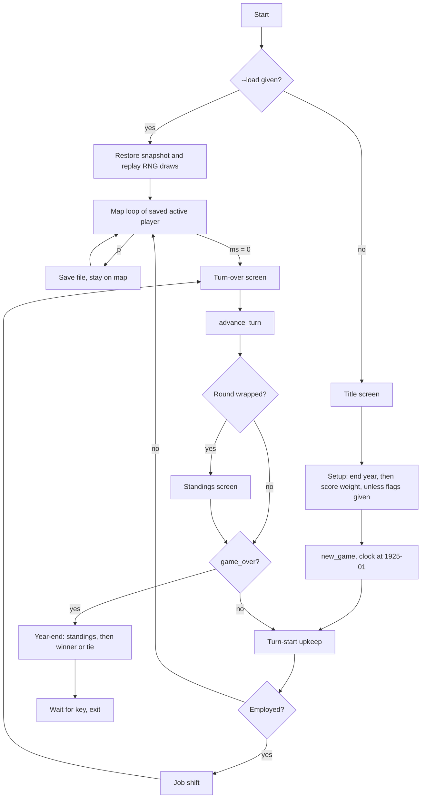

# Vertical Slice Completion - Plan

## Goal Capsule

- **Objective:** Make `feat/vertical-slice` mergeable to `main`: a game that runs from setup to a real, faithful ending, a save/load a player can use, the three open bug issues closed, and the hygiene a first merge needs.
- **Product authority:** `../research/` (the original's BASIC, via the `mafia-oracle` skill) for every game behavior; this contract for scope; `docs/design/` for architecture. Input dossier: `docs/plans/2026-07-21-001-slice-completion-brainstorm-basis.md`.
- **Execution profile:** `docs/AGENTS.md` — one orchestrator, one subagent per unit, serial; the orchestrator owns every commit and the authoritative `make check`. Units run in U-ID order (U1 → U12).
- **Stop conditions:** a unit whose port would need behavior the research does not document (stop and ask, never invent); a red tree that the unit's own scope cannot fix; any step that pushes, opens a PR, or tags (outward-facing, confirm with the user first).
- **Tail ownership:** the orchestrator closes out the plan per `docs/AGENTS.md` § "Closing out a plan" as part of U12.
- **Open blockers:** None.

---

## Product Contract

Product Contract preservation: changed — added R20-R23 and AE7 (per-round and ending standings, score-weight prompt and flag), confirmed by the user during planning; the former Outstanding Questions are resolved as Key Technical Decisions.

### Summary

A game gets a real ending: the player picks the end year and score weight at setup, plays through the five built locations and combat with a standings table after every round, and when the end year arrives sees the original's standings and winner (or tie) screen.
Save/load becomes something a player can use.
The three open bug issues get fixed, and the branch gains CI, a how-to-play README, a clean client error guard, and a `v0.1` tag on merge.

### Problem Frame

The branch plays end-to-end but never ends.
`advance_turn` reports when the end year is reached (`engine/movement.py:393`), and the terminal client discards that flag (`clients/terminal/__main__.py:549`).
No code ranks players by score or shows a winner.
The game length is hardcoded to 1930 (`clients/terminal/__main__.py:461`), and the clock starts at 1928 (`data/game_configs/mafia_1920s/setup.py:530`) where the original starts at 1925 (`mf-prg.bas:1000`), so every game is three years short.

A proven engine capability is stranded: save/load round-trips in `engine/persistence.py`, but the client never calls it.
Three bug issues (#45, #49, #51) sit open on the branch.
There is no CI, the README explains how to test but not how to play, and a bad config or save would reach the player as a raw traceback.
The branch is 134 commits ahead of `main`, never pushed.

The original has exactly two endings and no lose state (verified against source):

- **Early win** at turn start: rank 10 **and** both win flags `x5`/`x6` (`mf-prg.bas:1011`).
- **Year-end** when `int(ja)=x9`: the highest score `gf` wins; ties are listed together (`mf-prg.bas:1010`, `:40100-40166`).

### Key Decisions

- **Narrow slice DoD.** The slice is combat, the five built locations (`kdh`, `pub`, `slw`, `sph`, `waf`), a reachable ending, and usable save/load. Crime, wanted, arrest and jail are ratified as next-slice work rather than left looking unfinished. The design doc's Phase-1 slice promised only `slw` plus one guarded pub neighbor, so five locations exceed it.
- **Year-end is the only ending this slice.** Losing either win-flow fight leads to police capture and jail (`mf-prg.bas:23025`, `:24005`, `:24010` → `:26020`). Shipping the flows without jail would mean inventing a loss path. The cash-transport and mayor-hit flows, the rank-10 early win, and jail move to the next slice as one piece.
- **No lose condition.** The original has none, and inventing one breaks the "never invent game behavior" rule.
- **Game length and score weight are setup choices, as in the original.** The original asks both, in that order (`mf-prg.bas:170-176`). Flags let tests and smoke runs skip the prompts.
- **The clock start is fixed in this slice.** The 1925-vs-1928 deviation directly shortens the only ending the slice has, so it cannot wait.
- **Standings show after every round and at the end, as in the original.** In a score-decided game, the standings table (`mf-prg.bas:4500-4515`) is how hot-seat players follow the contest.
- **End of game exits the session.** The original waits for a key and then restarts the program (`mf-prg.bas:40165-40166`); in the client, a new game is a relaunch. The screen text and key-wait stay faithful.
- **#45 is fixed as an opt-in.** The original's CPU turns show no screen between activations (`mf-prg.bas:30110`), so an observation frame is off by default and must be switched on by the viewer.

### Requirements

**Setup**

- R1. Setup asks the player for the end year and accepts only 1928-1978, re-asking on invalid input as the original does.
- R2. A command-line end-year flag sets the end year without the prompt, with the same 1928-1978 validation.
- R22. Right after the end year, setup asks for the score weight and accepts only 0.1-2, re-asking on invalid input as the original does.
- R23. A command-line score-weight flag sets it without the prompt, with the same 0.1-2 validation.
- R3. The in-game clock starts in January 1925, matching the original.

**Standings and ending**

- R20. After every full round, every player sees the standings: the date and each player's name, cash and score.
- R4. When the round rotation reaches the end year, the game stops and shows the year-end result instead of starting another turn.
- R21. The year-end result opens with the standings table.
- R5. The year-end result names the single highest-scoring player as the winner, or lists every player tied for the top score.
- R6. After the result screen, the game waits for a keypress and ends the session cleanly.

**Save and load**

- R7. During a player's map turn, a save key writes the complete game state to a file and confirms it to the player.
- R8. A command-line load flag resumes a saved game at the saved turn, with the same state the save captured.
- R9. The save-then-load round trip is covered by a test that goes through the client, not only the engine.

**Open bug issues**

- R10. #49: both `test_debt_default` "win" tests resolve a real win, and each is shown failing when its win branch is broken.
- R11. #51: an EOF arriving mid-handler (at the `sph` wager prompt) is covered by a test that actually reaches that prompt.
- R12. #45: an opt-in observation frame shows the board between computer activations; with it off, behavior is unchanged.

**Hygiene and release**

- R13. CI runs `make check` on every push and pull request.
- R14. The truecolor ANSI tests pin their color support instead of reading the host's terminal environment.
- R15. The README tells a human how to launch and play the game, lists what works today, and links `clients/terminal/FIGHTLAB.md`.
- R16. A missing or malformed config or save file reaches the player as a short readable message, not a traceback.
- R17. The stale scratch doc `docs/plans/2026-07-20-003-NEXT-STEPS.md` is removed.
- R18. Before the PR, a seeded session driven through the terminal client goes from setup to the year-end result screen.
- R19. The merge to `main` is tagged `v0.1` with a short release note of what shipped.

### Acceptance Examples

- AE1. **Covers R5.** Given two players with scores 42 and 37 when the end year arrives, the result names the 42-point player as the winner.
- AE2. **Covers R5.** Given two of three players tied at the top score, the result lists both tied players and uses the shared-victory text, not a single winner.
- AE3. **Covers R5.** Given a single-player game, the result names that player as the winner. This matches the original: the winner search starts at player 1 (`mf-prg.bas:40100`).
- AE4. **Covers R1, R2.** Given end year 1927 at the prompt, setup re-asks. Given 1927 via the flag, the client stops with a readable message.
- AE5. **Covers R3, R4.** Given end year 1928, the game ends after the rotation that brings the clock from 1927 to 1928, which is roughly three in-game years of play.
- AE6. **Covers R8, R16.** Given a load path that does not exist or holds a corrupt file, the client prints a readable error and exits without a traceback.
- AE7. **Covers R22, R23.** Given score weight 0.05 or 2.5 at the prompt, setup re-asks. Given 0.5 via the flag, a score gain of 4 adds 2 points.

### Scope Boundaries

**Deferred to the next slice**

- The crime → wanted → arrest → jail flows, including the stubbed `WantedChange`/`Jail` effects and per-player `FlagSet` scopes.
- The cash-transport (`la=13`) and mayor-hit (`la=14`) map flows, their win flags, and the rank-10 early win. They depend on jail as their loss path.
- Locations beyond the five built ones.
- Moving game-specific names out of engine code (the engine-wide blueprint boundary).
- Starting a player-vs-player fight from the map.

**Not planned at all**

- A lose condition. The original has none.

### Dependencies / Assumptions

- The ending is only as meaningful as the score (`gf`) it ranks. With five locations the score can move, but the slice does not re-balance scoring.
- In solo play the ending is ceremonial: the only player always wins. The real contest lives in hot-seat games with 2-4 players.
- Saves happen only on the map turn, never mid-fight. The `dir_memory` 0-based vs original 1-based rider from #45 matters only if combat state is serialized; U8 confirms it is not.

### Sources / Research

- Input dossier with verified `file:line` evidence: `docs/plans/2026-07-21-001-slice-completion-brainstorm-basis.md`.
- Original setup and endings: `mf-prg.bas:170-176` (end year, score weight), `:1000` (clock start 1925), `:1010` (round wrap → standings → year-end check), `:1011` (early win), `:1165` (rank from score), `:4500-4515` (standings), `:40100-40166` (winner/tie screens).
- Win-flow loss path: `mf-prg.bas:23025`, `:24005`, `:24010` → `:26020-26080` (police capture, trial, jail).
- Engine seams: `engine/movement.py:300` (flow stub), `engine/movement.py:393` (`game_over`), `clients/terminal/__main__.py:461` (hardcoded end year), `clients/terminal/__main__.py:549` (discarded flag), `data/game_configs/mafia_1920s/setup.py:530` (clock start), `clients/terminal/palette.py:107` (env-detected color support).

---

## Planning Contract

### Key Technical Decisions

- KTD-1. **The ending reuses the upkeep pattern.** A new engine runner (`engine/game_end.py`) mirrors `engine/upkeep.py`: it looks up config-registered generators in `engine.locations.HANDLERS` and drives them through `engine.interactions.run`. The game config registers two display-only handlers, one for the standings and one for the year-end result. The ranking rule (highest `gf`, ties shared) is game code in the config, not engine code. This keeps the engine/game line where `docs/solutions/architecture-patterns/engineresult-action-spine-effects-only-mutation.md` and the handler-API boundary put it.
- KTD-2. **The engine owns when the ending fires, the client only renders it.** The client must call the runner whenever `advance_turn` reports `game_over`, and must not start another turn. The per-round standings run at the same seam, on a wrap, before the end check, matching `mf-prg.bas:1010`'s order. They receive the state from **before** `advance_turn`, because the original calls `gosub4500` before `ja=ja+1/12`, so the date shown is the round just finished. The year-end runner receives the post-advance state, as `:40100` does. How the client detects a wrap (the new active player is 0) is an implementation detail inside U7.
- KTD-3. **The start year is config data.** `config.yaml` gains a start year (1925) under `setup`. `new_game` reads it instead of reusing the end-year minimum. The `Clock` dataclass default and its `mf-prg.bas:170,172` comment are corrected to cite `:1000`.
- KTD-4. **Setup prompts live in `play()`, after the title, and only for values not supplied.** `main()` passes `None` when a flag is absent, and `play()` prompts for it. Test helpers (`run_play` in `tests/test_client_loop.py` and the direct `play(...)` callers) pass explicit values, so the 67 existing scripted call sites keep their key scripts. Prompt text comes from theme strings, like every other screen.
- KTD-5. **Load resumes the exact RNG stream.** A save records the session seed and the session `Rng.log`. Load builds a fresh `Rng(seed)` and re-issues every logged draw in order, so the continuation is the same as uninterrupted play. That is testable: save at turn k, load, feed the same remaining keys, compare to an uninterrupted run. The effect log is saved empty; the snapshot is authoritative (`replay` of an empty log returns the snapshot).
- KTD-6. **Load skips setup and the already-run upkeep.** A loaded game resumes on the map loop of the saved active player. That turn's upkeep ran before the save, so it must not run again. Combining `--load` with `--end-year`, `--score-weight`, `--player` or `--seed` is rejected with a readable message. A load always uses the seed from the save header. `--seed` therefore defaults to `None` (not given), and a new game resolves it to 42.
- KTD-7. **Save UX: one key, one file.** `p` on the map screen saves. The target is the `--save PATH` flag, else the file the game was loaded from, else `mafia-save.jsonl` in the working directory. The save overwrites without a prompt and confirms in the map's note line. `*.jsonl` saves are gitignored at the repo root.
- KTD-8. **The #45 observation frame is opted into by the input side.** `_drive_fight` delivers a display-only `CombatScreen` (a distinct `prompt` value, response ignored, no RNG draws) after each non-human activation only when the input source opts in. The terminal client opts in via a `--watch-ai` flag. With no opt-in, no frame is sent, so scripted test sources and recordings see no change. The exact opt-in mechanism (an attribute on the input source vs. a keyword threaded from the caller) is chosen in U10 against what `engine/interactions.py` and `engine/recording.py` already thread.
- KTD-9. **The client error guard sits in `main()`, not in `play()`.** It catches the known failure types (argument validation, missing file, `SchemaVersionError`, malformed JSON/YAML, config-load errors), prints one readable line to stderr, and exits non-zero. The `load_game` call is wrapped on its own so that any exception it raises becomes `cannot load <path>: <reason>`. A structurally corrupt save raises `ValueError`, `KeyError` or `TypeError`, so a narrow list of exception types would miss it. `KeyboardInterrupt` exits quietly. Unknown exceptions still raise, so real bugs keep their traceback.
- KTD-10. **CI is GitHub Actions running `make check` on Python 3.11.** Install with `pip install -e '.[dev]'`. `ruff` is pinned to the local version (`ruff==0.16.8`) in the `dev` extra, so the hard format gate can't drift between local runs and CI. No test reads `../research/`, so no second checkout is needed. The ANSI tests pass explicit `ColorSupport` instead of relying on `term_color_support()`'s fallback (`clients/terminal/palette.py:124`).
- KTD-12. **`play()` returns its final `(state, rng)` pair.** It returns them on every exit: quit, EOF or the ending. `main()` ignores them; tests compare them. This is the observation point for U8's equivalence test and U12's reload check, so no unit has to invent its own spy.
- KTD-11. **The release note is the annotated tag message plus a README "What works today" section.** No separate changelog file.

### High-Level Technical Design

Turn loop after this plan (U7 and U8). The standings runner runs on every wrap; the end check runs after it, matching `mf-prg.bas:1010`.

### Implementation Constraints

- Every new display string is a theme key; the engine and handlers emit `(key, params)` only. German source text comes from the research corpus (`mafia-oracle` for the exact lines).
- Handlers touch only `ctx.state`, `ctx.rng`, `yield <Interaction>`, `ctx.apply(<Effect>)` and named engine helpers. The standings and year-end handlers need no effects.
- `engine/` imports nothing from `clients/`.
- Every new or fixed test is shown failing when its feature is broken (`docs/solutions/developer-experience/tests-that-cannot-fail.md`). Commit before probing; restore with `git stash pop`, never `git checkout`.
- Scripted-stdin client tests prepend the title-dismiss line and walk the engine rather than hardcoding step counts (`docs/solutions/developer-experience/driving-terminal-play-loop-over-piped-stdin.md`). Setup prompts add lines after the title line only when a test omits the values.

### Sequencing

Serial, U1 → U12. U1 lands CI first so every later push is gated. U2 and U3 are independent test fixes. U4-U7 build the ending in dependency order. U8 and U9 depend on the setup flags from U5. U10 is independent. U11 documents the finished surface. U12 proves and ships it.

### Risks

| Risk | Mitigation |
|---|---|
| Save files grow with every RNG draw (combat draws heavily), so a long game's save could reach megabytes. | Acceptable for the slice. U12 measures the save size produced by its smoke run and records it in U12's commit message. Storing the generator state instead is the follow-up if the size is a problem. |
| The setup prompts shift the key scripts of existing client tests. | KTD-4: prompts fire only for values the caller did not supply, and the helpers supply them. |
| Adding the per-round standings screen adds one keypress per round, which shifts the scripts of multi-turn client tests. | U7 updates the shared walk helpers once; tests that cross a round boundary are found by running the suite, not by guessing. |
| The GitHub runner behaves differently from the local machine (terminal env, locale). | U1 pins color support; U1's verification is a real green run on the pushed branch. |
| Pushing the branch and opening the PR are outward-facing. | U1's first CI run and U12's PR each wait for explicit user confirmation. |

---

## Implementation Units

### U1. CI workflow and pinned ANSI tests

**Goal:** Every push and pull request runs `make check` on GitHub, and the truecolor tests stop depending on the host's terminal environment.

**Requirements:** R13, R14

**Dependencies:** None

**Files:**
- `.github/workflows/check.yml` (new)
- `pyproject.toml` (pin `ruff==0.16.8` in the `dev` extra, KTD-10)
- `tests/test_terminal_palette.py`
- `tests/test_terminal_renderers.py` (only where it asserts truecolor sequences without passing support)

**Approach:**
- One job on `ubuntu-latest`, Python 3.11, `pip install -e '.[dev]'`, then `make check`. Triggers: push and pull_request.
- In the ANSI tests, pass `ColorSupport.TRUECOLOR` (and the 256-color variant where a test targets it) explicitly to `fg()`/`bg()`. Tests of the detection function itself keep using `monkeypatch.setenv`.

**Patterns to follow:** `Makefile` (the gate is `make check`, not a bespoke command list).

**Test scenarios:**
- With `COLORTERM` unset and `TERM=xterm-256color` in the test environment (via `monkeypatch`), `test_fg_truecolor` still asserts the `\033[38;2;` sequence and passes. Before the fix it takes the 256-color branch and fails.
- The existing detection tests still cover `truecolor`, `24bit`, `256color` and the fallback branch.

**Verification:** `make check` is green locally. After the user confirms the push, the workflow's first run on `feat/vertical-slice` is green.

### U2. #49: debt-default "win" tests reach a real win

**Goal:** The two debt-default tests drive the collectors' fight to an actual player win and can fail if the win branch breaks.

**Requirements:** R10

**Dependencies:** U1

**Files:**
- `tests/test_debt_default.py`

**Approach:**
- Script real attacks: aimed shots (`("shoot", <direction>)`), not bare strings or passes. A pass-only player can never win (issue #49).
- Script the RNG so the fight resolves. Prefer the zero-variance weapon approach that U6/KTD-6 of the combat plan made available, so the RNG script stays short.
- Replace the file's permissive local `_StubRng` with the strict `tests.helpers.StubRng`.
- Assert `combat.winner_banner` fired for the player's side before asserting that cash, debt and the expiry counter are unchanged.

**Execution note:** Prove each test red by breaking the win branch in `data/game_configs/mafia_1920s/handlers/upkeep.py` (the `:4355` return-on-win) and confirming both tests fail, then restore.

**Patterns to follow:** `tests/helpers.py` `StubRng`; the aimed-shot fix recorded in `docs/solutions/developer-experience/tests-that-cannot-fail.md`.

**Test scenarios:**
- `test_win_changes_nothing_and_the_fight_recurs_next_turn`: the player wins; cash, debt and the expired counter are unchanged; the next turn's upkeep starts the fight again.
- `test_the_fight_actually_re_fires_on_the_following_turn`: after a win, the following turn's upkeep emits `upkeep.debt_collectors_intro` and a second `combat.winner_banner` or loss path.
- With the strict stub, an under-scripted RNG raises instead of passing quietly.

**Verification:** Both tests pass, fail when the win branch is broken, and the local `_StubRng` is gone. Close #49.

### U3. #51: EOF mid-handler at the sph wager prompt

**Goal:** A test proves that input running out at `sph`'s wager prompt exits cleanly without resolving the gamble.

**Requirements:** R11

**Dependencies:** U1

**Files:**
- `tests/test_client_loop.py`

**Approach:**
- First find out why the current walk ends on the map. The issue's hypothesis (the walk stops next to the door) is disproven; compare with `TestSphGambleThroughClient`, which does reach the prompt with `walk + ["", "0", "0", "100"]`.
- Rebuild the key script to stop right before the wager answer.

**Execution note:** Investigate before editing keys: capture the run's output and confirm the `dein einsatz` prompt renders.

**Test scenarios:**
- The output contains the wager prompt text (`dein einsatz`).
- The output then contains `bye.`, and neither `gewonnen` nor `verloren`.
- Cash is unchanged in the final status line.

**Verification:** The test fails if its key script is cut one line earlier, which would end on the map instead. Close #51.

### U4. Clock starts in 1925

**Goal:** New games start at January 1925, with the start year held in config data.

**Requirements:** R3

**Dependencies:** U1

**Files:**
- `data/game_configs/mafia_1920s/config.yaml`
- `data/game_configs/mafia_1920s/setup.py`
- `engine/state/__init__.py` (the `Clock.year` default and its comment)
- `tests/test_setup.py`
- `tests/test_movement.py` (only if an assertion encodes 1928 as the start)

**Approach:** Add the start year under `setup` in `config.yaml` (KTD-3). `new_game` builds the `Clock` from it. Confirm `ja=1925` through `mafia-oracle` before writing the value.

**Test scenarios:**
- `new_game(...)` returns `clock.year == 1925` and `clock.month == 0`.
- Covers AE5. With end year 1928 and one player, `advance_turn` reports `game_over` first on the 36th round wrap, not before.
- Changing the config's start year changes the new game's start year (the value is data, not code).

**Verification:** The suite is green, and no code path still reads the end-year minimum as the start year.

### U5. Setup prompts and flags for end year and score weight

**Goal:** The player chooses the game length and score weight at setup, or via flags.

**Requirements:** R1, R2, R22, R23

**Dependencies:** U4

**Files:**
- `clients/terminal/__main__.py`
- `data/game_configs/mafia_1920s/themes/classic/strings/setup.yaml` (new)
- `tests/test_client_loop.py`
- `tests/test_terminal_client.py`

**Approach:**
- Add `--end-year` and `--score-weight` to `main()`. Validate them against `input_ranges` in `config.yaml`, not hardcoded bounds.
- `play()` gains `end_year` and `score_weight` parameters. When one is `None`, `play()` prompts for it after the title, re-asking on out-of-range or non-numeric input (`mf-prg.bas:172`, `:176`). End year comes first, then score weight.
- Both accepted values go to `new_game(end_year=..., score_weight=...)`, which already validates them and stores the weight as `Config.score_mult`. Nothing sets the config directly.
- Update `run_play` and the other direct `play(...)` callers to pass explicit values (KTD-4).

**Patterns to follow:** The existing `input_ranges` validation in `data/game_configs/mafia_1920s/setup.py`; the title-screen read in `play()`.

**Test scenarios:**
- Covers AE4. Prompt input `1927`, then `1940`: setup re-asks once and the game's `end_year` is 1940.
- Prompt input `abc`: setup re-asks rather than crashing.
- Covers AE7. Score weight `0.05`, then `2.5`, then `0.5`: re-asks twice, and `config.score_mult == 0.5`.
- `--end-year 1950 --score-weight 1.5`: no setup prompt is shown and the state carries both values.
- Covers AE7. A game set up with score weight 0.5, then one committed score gain of 4 (through the existing score effect in `engine/effects.py`): `gf` rises by 2.
- `--end-year 1927`: `main()` rejects it (the readable message itself is asserted in U9).
- An existing scripted test (e.g. the sph gamble) still passes unchanged because the helper supplies both values.

**Verification:** Both prompts render from theme strings and the suite is green.

### U6. Standings and year-end handlers

**Goal:** The engine can show the standings table and the year-end result, with the ranking rule living in the game config.

**Requirements:** R5, R20, R21

**Dependencies:** U4

**Files:**
- `engine/game_end.py` (new)
- `data/game_configs/mafia_1920s/handlers/game_end.py` (new)
- `data/game_configs/mafia_1920s/handlers/__init__.py`
- `data/game_configs/mafia_1920s/themes/classic/strings/game_end.yaml` (new)
- `tests/test_game_end.py` (new)

**Approach:**
- `engine/game_end.py` exposes two runners mirroring `engine/upkeep.py` (KTD-1): one for the standings, one for the year-end result. Each has its own registry key constant, and each refuses anything but `ShowMessage`.
- The config's standings handler yields one `ShowMessage` with the date and every player's name, cash and score (`mf-prg.bas:4500-4510`).
- The config's year-end handler yields the standings, then either the single-winner screen (`:40115-40117`) or the tie screen listing every top scorer (`:40150-40160`). A player replaces the leader only on a strictly higher score; equal scores join the tie list (`:40105-40106`).

**Patterns to follow:** `engine/upkeep.py` (runner, registry key, refuse-input fallback); `data/game_configs/mafia_1920s/handlers/upkeep.py` (registration, `ShowMessage` with keys and params).

**Test scenarios:**
- Covers AE1. Scores 42 and 37: the winner message names the 42-point player; no tie message.
- Covers AE2. Scores 50, 50, 20: the tie message lists both 50-point players in player order; no single-winner message.
- Covers AE3. One player: the winner message names that player.
- Four players, all at 0: the tie message lists all four.
- The standings message carries every player's name, cash and score, plus the current year and month.
- Both runners raise if a handler yields a prompt instead of `ShowMessage`.
- Both runners commit no effects: the returned state equals the input state.

**Verification:** Removing the tie branch or flipping the comparison turns the corresponding test red.

### U7. Client wiring: round standings and the ending

**Goal:** The client shows the standings after every round and ends the game at the end year with the result screen.

**Requirements:** R4, R6, R20, R21

**Dependencies:** U5, U6

**Files:**
- `clients/terminal/__main__.py`
- `tests/test_client_loop.py`
- `tests/test_terminal_integration.py`

**Approach:**
- On a round wrap, run the standings runner on the state from before `advance_turn` (KTD-2), render it with the existing header/body helpers, then wait for a key.
- `play()` returns `(state, rng)` on every exit path (KTD-12). If `game_over`, run the year-end runner, render it, wait for a key, and return from `play()` without running upkeep (KTD-2).
- Update the shared walk helpers once for the extra keypress per round.

**Patterns to follow:** `_run_upkeep_screen` in `clients/terminal/__main__.py`.

**Test scenarios:**
- Two players, one full round: the standings screen appears once after the second player's turn-over, not after the first, and it shows the date of the round just played (1925-01), not the advanced date.
- Covers AE5. `play(end_year=1928, ...)` with a script that walks every turn to its turn-over: the output ends with the winner message and `advance_turn` is called exactly 36 times (spy per the piped-stdin learning).
- At the end, upkeep does not run again (spy on `run_upkeep`: its call count equals the number of turns started).
- EOF at the result screen's key wait still exits cleanly.

**Verification:** A seeded client run reaches the result screen and exits. Deleting the `game_over` branch makes the ending test red.

### U8. Save key and --load

**Goal:** A player can save during their map turn and resume that exact game later.

**Requirements:** R7, R8, R9

**Dependencies:** U5, U7

**Files:**
- `clients/terminal/__main__.py`
- `engine/rng.py` (a way to rebuild an `Rng` from a seed and a draw log)
- `.gitignore`
- `tests/test_client_loop.py`
- `tests/test_rng.py`
- `tests/test_persistence.py`

**Approach:**
- `p` on the map screen calls `save_game` with the current state, an empty effect log, the session RNG log and the seed. It confirms in the map's note line (KTD-7).
- `--load PATH` calls `load_game`, rebuilds the session RNG by re-issuing the logged draws (KTD-5), and enters the map loop for the saved active player without the title, setup or upkeep (KTD-6).
- Add `--save PATH`. Reject `--load` combined with the setup or player flags.
- Confirm no combat state is serialized in a map-turn save, which closes #45's `dir_memory` rider.

**Execution note:** Start with the equivalence test. It is the property the unit exists to deliver.

**Test scenarios:**
- Equivalence: run A plays keys K1, saves, then plays K2 to a turn-over. Run B loads that save and plays K2. Both final states compare equal, and so do their RNG logs after the save point.
- The rebuilt `Rng` produces the same next 100 draws as the original one continued (`tests/test_rng.py`).
- Loading does not run upkeep: a spy on `run_upkeep` is not called before the first map render.
- The saved file's snapshot has an empty or absent combat state.
- `--load x --end-year 1950` and `--load x --seed 7`: both rejected before any screen renders.
- The equivalence comparison uses `play()`'s returned `(state, rng)` (KTD-12).
- Pressing `p` twice overwrites the same file, and the second save's snapshot reflects moves made between the two presses.

**Verification:** The equivalence test fails if the RNG rebuild is replaced by a fresh `Rng(seed)`.

### U9. Client error guard

**Goal:** Known bad inputs reach the player as one readable line, not a traceback.

**Requirements:** R16

**Dependencies:** U5, U8

**Files:**
- `clients/terminal/__main__.py`
- `tests/test_terminal_client.py`

**Approach:** Wrap `main()`'s body per KTD-9. Messages name the file or flag and the problem in plain words. The exit code is non-zero.

**Test scenarios:**
- Covers AE6. `--load missing.jsonl` exits non-zero, and stderr names the file and says it was not found, with no `Traceback`.
- Covers AE6. A save file of invalid JSON, or with a wrong schema version, gives a readable message and a non-zero exit.
- Covers AE6. A save with a valid header line whose snapshot is missing a field gives `cannot load <path>: ...` and no traceback.
- Covers AE4. `--end-year 1927` names the allowed range.
- A `RuntimeError` raised deep inside `play()` still propagates with its traceback (the guard does not swallow unknown errors).
- `KeyboardInterrupt` exits quietly with the cursor restored.

**Verification:** Each known failure path prints one line to stderr; unknown errors are unchanged.

### U10. #45: opt-in observation frame

**Goal:** A viewer who opts in sees the board after each computer activation; by default nothing changes.

**Requirements:** R12

**Dependencies:** U1

**Files:**
- `engine/interactions.py`
- `clients/terminal/__init__.py` (`TerminalInput` renders the observation frame)
- `clients/terminal/__main__.py` (`--watch-ai` flag)
- `tests/test_combat_loop.py`
- `tests/test_terminal_client.py`

**Approach:** Implement KTD-8. The frame is display-only: its response is ignored and it draws nothing from the RNG. The terminal renders it like a combat screen with a "press a key" line.

**Patterns to follow:** `ShowMessage` delivery to the input source (issue #43's delivery/response split); `clients/terminal/fightlab.py`'s watch mode for pacing.

**Test scenarios:**
- A human-vs-AI fight with opt-in: the input source receives one observation frame per AI activation, and the fight's winner and RNG log equal the same fight without opt-in.
- Without opt-in: the input source never sees an observation frame (a scripted source that raises on unknown screens stays green across the existing suite).
- A recording of an opted-in fight replays with no divergence.

**Verification:** The existing combat and recording tests are unchanged and green. Close #45 with a note on the `dir_memory` finding from U8.

### U11. README and docs cleanup

**Goal:** A newcomer can install, play and debug from the README, and stale plan companions are gone.

**Requirements:** R15, R17

**Dependencies:** U8, U9, U10

**Files:**
- `README.md`
- `docs/plans/2026-07-20-003-NEXT-STEPS.md` (delete)
- `CLAUDE.md` (clarify that five locations is the slice target, so "12 menu locations" does not read as unfinished work)

**Approach:** Add "How to play" (launch command, setup prompts, keys including `p` save and `--load`, `--watch-ai`), "What works today", and a link to `clients/terminal/FIGHTLAB.md`.

**Test scenarios:** Test expectation: none — documentation only. Every command in the README is run once by hand and works.

**Verification:** The README's commands match `python -m clients.terminal --help`.

### U12. End-to-end smoke, release and plan close-out

**Goal:** Prove the full slice through the real client, then ship it and close out the plan.

**Requirements:** R18, R19

**Dependencies:** U1-U11

**Files:**
- `tests/test_slice_integration.py` (the client-level setup-to-ending smoke)
- `CLAUDE.md` (move this plan into the "Landed, do not re-open" ledger)
- `docs/plans/<date>-NNN-<next>-brainstorm-basis.md` (new; the forward pointer for the next slice)

**Approach:**
- The smoke test drives `main()` with `--seed 42 --end-year 1928 --score-weight 1 --player a:x --player b:y` over scripted stdin. It visits at least one location, saves and reloads once mid-game, and ends on the result screen.
- The next brainstorm-basis seeds the next slice from this plan's deferred scope (the jail chain with both win flows and the early win, the remaining locations, the engine-wide blueprint boundary, player-vs-player initiation).
- After the user confirms: push, open the PR `feat/vertical-slice` → `main` with the attribution footer, and after the merge, tag `v0.1` with the release note (KTD-11).

**Execution note:** Pushing, opening the PR and tagging each wait for explicit user confirmation.

**Test scenarios:**
- Covers AE1-AE3 and AE5 end to end: the smoke output contains the standings header, then a winner or tie message, then `bye.` or a clean exit.
- The reloaded half of the smoke run produces the same result screen as an uninterrupted run with the same keys.

**Verification:** `make check` is green locally and in CI on the PR; the smoke test fails if the year-end branch is removed.

---

## Verification Contract

| Gate | Command / check | When |
|---|---|---|
| Green tree | `make check` (pytest, then `ruff check` and `ruff format --check`) | Before every subagent dispatch and every commit |
| CI | The GitHub Actions `check` workflow is green | After U1's first push, and on the PR (U12) |
| Proof-first | Each new or fixed test is seen failing with its feature broken | Every feature-bearing unit (U1-U10, U12) |
| Fidelity | Every ported rule, bound and text line is gated through `mafia-oracle` (`conclude <lines> "<claim>"`) before it is stated in code | U4, U5, U6, U7 |
| Board | One GitHub issue per unit with `dep:U<N>` labels; each is closed when its commit lands green | Opened at the start of execution; closed per unit |
| Smoke | The U12 client-level run from setup to the ending | Before the PR |

## Definition of Done

- Every unit U1-U12 has landed as its own green commit on `feat/vertical-slice`, and its issue is closed.
- Issues #45, #49 and #51 are closed with the commits that fixed them.
- `make check` is green locally and in CI on the PR.
- A fresh `python -m clients.terminal` game can be set up, played, saved, loaded and brought to its year-end result.
- No abandoned-attempt code, stray debug output or leftover probe edits remain in the diff.
- The plan is closed out per `docs/AGENTS.md`: CLAUDE.md's ledger lists it, the next brainstorm-basis exists, and consumed companions are deleted.
- With the user's confirmation: the PR is merged to `main` and `v0.1` is tagged with its release note.
