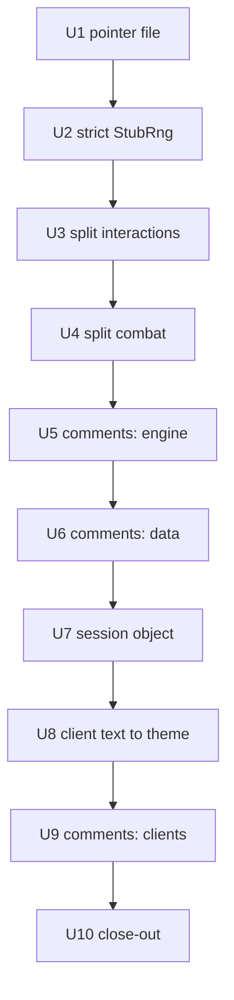

# Slice Polish - Plan

## Goal Capsule

- **Objective:** Make the landed first vertical slice easier to read and change before the next slice builds on it, without changing any behavior.
- **Product authority:** This contract for scope; `docs/design/` for architecture; `../research/` (via `mafia-oracle`) for any source citation kept in comments.
- **Execution profile:** `docs/AGENTS.md` — one orchestrator, one subagent per unit, serial; the orchestrator owns commits and the authoritative `make check`. Units run in U-ID order. Work lands on `chore/polish`, branched from `main` at the `v0.1` merge.
- **Stop conditions:** a change that alters observable behavior (game output, save format, recording format); a test that can only pass by changing production behavior (report it, do not fix silently); a red tree the unit cannot fix within its scope.
- **Tail ownership:** the orchestrator closes out per `docs/AGENTS.md` in U10, including a newer brainstorm-basis pointer so this plan does not read as active afterwards.
- **Open blockers:** None.

---

## Product Contract

### Summary

A behavior-preserving polish pass:
- Code comments stop carrying plan bookkeeping.
- `play()` becomes a small session object.
- The terminal client's display text moves into the theme.
- Stale pointers are retired, and test RNG stubs are made strict.
- The two largest engine modules are split along seams they already have.

### Problem Frame

The code works and its architecture holds, but the material around it has built up.
Production code carries 453 references to plan-local IDs (`U2`, `KTD-7`, `amendment A4`, …). Those IDs collide across plans: `KTD-3` in `engine/upkeep.py` and `KTD-3` in the completion plan mean different things.
Comments and docstrings make up 46% of non-blank lines in `engine/`, `clients/` and `data/`, and many of them narrate unit history rather than state a contract. Some are already stale, e.g. `engine/movement.py:300` "OUT OF SCOPE this unit".
`play()` in `clients/terminal/__main__.py` is 234 lines with seven keyword parameters, and it owns every screen.
The client's own text ("bye.", "(a wall)", the turn-over labels) is hardcoded English next to German game text from the theme.
`docs/plans/current-action-plan.md` still names itself "Current Action Plan".
Three test files keep their own local `_StubRng` instead of the strict shared one; a local copy is what hid the vacuous tests in #49.
`engine/combat.py` (1,256 lines) and `engine/interactions.py` (1,154) each hold several responsibilities.

### Requirements

**Comments and docs**

- R1. Code comments and docstrings in `engine/`, `clients/` and `data/` contain no plan-local IDs (`U#`, `T#`, `KTD-#`, `R#`, `AE#`, `amendment A#`).
- R2. Docstrings state the current contract (what it does, inputs, invariants, why when non-obvious), not how it evolved.
- R3. No comment claims a scope that is no longer true ("this unit", "a later unit", "OUT OF SCOPE this unit").
- R4. No document presents itself as the current plan; live references to the old pointer are updated.

**Client**

- R5. `play()` is a thin entry point over a session object whose methods each own one screen or phase.
- R6. Every piece of display text the play client prints (`clients/terminal/__main__.py`, `__init__.py`, `renderers.py`) comes from theme strings. The fight lab debug tool is out of scope.

**Engine structure**

- R7. `engine/interactions.py` holds the interaction protocol; the fight loop and drivers live in their own module.
- R8. `engine/combat.py` holds the fight core; setup and CPU targeting live in their own modules.

**Tests and behavior**

- R9. Every test RNG stub is the strict shared `tests.helpers.StubRng`.
- R10. Behavior is unchanged: `make check` is green on Python 3.11 and 3.14 after every unit. Save files, recordings and game output are unchanged. Existing tests change only in import paths, monkeypatch targets, the stub swap, and `rng.calls` assertions adjusted to the shared stub's `("range", n)` record shape.

### Scope Boundaries

**Deferred to the next slice**

- Moving game vocabulary out of `engine/` (`_STAT_NAMES`, `WeaponInstance.req_*`, game-named effects and state). That is the engine-boundary work in the next brainstorm-basis.
- Restructuring `play()`'s public keyword parameters. The session object absorbs them internally; the entry-point signature stays so callers and tests keep working.

**Not planned**

- Any gameplay or fidelity change.
- Translating the client's English text. It moves into the theme unchanged; a theme can translate it later.
- Plan-ID cleanup inside `tests/` (92 occurrences) and inside historical plan documents. Tests' issue references document regressions; plans are historical records.

---

## Planning Contract

### Key Technical Decisions

- KTD-1. **The comment rule.**
  - **Keep:** `mf-prg.bas` citations, research references, invariants, contracts, and the non-obvious why.
  - **Drop:** plan-local IDs and unit history. Where an ID stood for a decision, write the decision in plain words instead. For example, "(U3, KTD-3)" becomes "one registry for location handlers and upkeep".
  - **GitHub issue numbers:** keep them only where they point to a non-obvious constraint, e.g. "#47: C64 true is -1". They are durable links; plan IDs are not.
  - **Stale scope notes:** rewrite them in the present tense. For example, `movement.py:300` becomes "event cells la=13/14 are detected and skipped; the flows are not built".
- KTD-2. **Comment-only units prove themselves mechanically.** For each changed module, the AST with docstrings stripped must be identical before and after. A throwaway script (outside the repo) compares `ast.dump` of every changed file against the unit's parent commit, the HEAD just before the comment unit. The baseline is not `main`, because earlier units moved and restructured code. Together with a green `make check`, this proves no code changed.
- KTD-3. **The session object stays in `clients/terminal/__main__.py`.** Tests monkeypatch six module-level names there (`advance_turn`, `run_upkeep`, `render_map`, `save_game`, `_run_upkeep_screen`, `TerminalInput`), plus `play` itself through `main()`, and they patch `sys.stdin`/`sys.stdout`. The session must read the standard streams when `play()` is called, not at import time. The session reaches them through module globals, so those seams keep working. `play()` keeps its signature and return value `(state, rng)`, builds the session, and runs it.
- KTD-4. **Client text goes to a new theme file** `data/game_configs/mafia_1920s/themes/classic/strings/client.yaml`, under `client.*` keys, with the wording unchanged. Existing tests that assert these strings stay valid.
- KTD-5. **The interactions split.**
  - `engine/interactions.py` keeps the interaction catalog, response sentinels (including `_CANCEL_SIGNAL`), `Ctx`, `run`, `_resolve`, `_run_substate` and `_coerce_int`. Its `__all__` drops the driver classes and `simulate`; `fight_loop` gets its own `__all__`.
  - A new `engine/fight_loop.py` takes the per-side drivers, `_run_combat`, `_build_fight`, `_resolve_drivers`, `_drive_fight`, `simulate`, `_no_input_source` and `_parse_combat_response`.
  - `fight_loop` imports the catalog from `interactions`. `interactions.run` imports the fight entry lazily to avoid an import cycle, the same way `engine/recording.py` already imports from `interactions` lazily.
  - Every import site is updated; there are no compatibility re-exports and no renames.
- KTD-6. **The combat split.**
  - A new `engine/combat_setup.py` takes placement, side construction and `setup_combat`.
  - A new `engine/combat_ai.py` takes CPU targeting: `AiTarget`, `ai_target` and `DEFAULT_CPU_SIDES`.
  - `engine/combat.py` keeps grid constants, obstruction predicates, melee reach and rolls, `CombatResult`, `RulesBundle`, `CombatView` and `CombatFight`. That includes `hostile_to`: turn order, victory, shooting and surrender all call it.
  - **Cycle avoidance:** `combat_ai` imports `GRID_COLS` and the `STEP_*` constants from `engine.combat` at module level. `CombatFight.ai_decide` and `ai_take_turn` import `ai_target` lazily inside the method, and `AiTarget` is imported under `TYPE_CHECKING` only (`from __future__ import annotations` is already in effect).
  - The new modules line up with the existing `tests/test_combat_setup.py` and `tests/test_combat_ai.py`. Import sites are updated directly.
- KTD-7. **The pointer file gets its dated name.** `docs/plans/current-action-plan.md` is renamed with `git mv` to `docs/plans/2026-07-13-001-refactor-state-event-foundation-plan.md`, and its "Current Action Plan" title becomes the plan's name. Live references (`CLAUDE.md`, `engine/persistence.py`, `docs/solutions/architecture-patterns/engineresult-action-spine-effects-only-mutation.md`) are updated. Historical plans that mention the old path are left alone.
- KTD-8. **Strict stubs expose tests, not production.** Where swapping in `tests.helpers.StubRng` turns a test red, fix the test so it drives the code path it names. If the only way to go green is a production change, stop and report it.

### Sequencing

Serial, U1 → U10. Cheap, independent hygiene goes first (U1, U2). The engine splits (U3, U4) come before the engine comment pass (U5), so moved code only has its comments rewritten once. The client restructure and client text (U7, U8) come before the client comment pass (U9), for the same reason.

### Risks

| Risk | Mitigation |
|---|---|
| A comment pass edits code by accident. | KTD-2's docstring-stripped AST comparison is required for U5, U6 and U9. |
| The engine splits create an import cycle or break recordings. | KTD-5's lazy import. The recording and replay tests, including divergence checks, must stay green. |
| The session refactor changes screen order or key consumption. | The ~70 scripted-stdin client tests and the end-to-end smoke test are the safety net, and they are not edited except for monkeypatch targets. |
| A reworded docstring loses a real constraint. | KTD-1 keeps invariants and non-obvious whys. Reviewers check each removed ID was bookkeeping, not a constraint. |

---

## Implementation Units

### U1. Retire the current-plan pointer

**Goal:** No document presents itself as the current plan.

**Requirements:** R4, R10

**Dependencies:** None

**Files:**
- `docs/plans/current-action-plan.md` → `docs/plans/2026-07-13-001-refactor-state-event-foundation-plan.md` (rename, and retitle from "Current Action Plan")
- `CLAUDE.md`
- `engine/persistence.py` (one comment reference)
- `docs/solutions/architecture-patterns/engineresult-action-spine-effects-only-mutation.md`

**Approach:** Apply KTD-7 with `git mv`, so history follows the file.

**Test scenarios:** Test expectation: none, docs only. `grep -r current-action-plan` finds only historical plans.

**Verification:** `make check` is green. The CLAUDE.md ledger points at the dated file.

### U2. Strict RNG stubs everywhere

**Goal:** Every test uses the strict shared `StubRng`.

**Requirements:** R9, R10

**Dependencies:** U1

**Files:**
- `tests/test_sph.py`
- `tests/test_waf_train.py`
- `tests/test_waf_buy.py`
- Not `tests/test_pub_recruit.py`: its `_StubRng` already subclasses the strict shared stub and adds a stricter `hit()` guard, so it stays.
- `tests/helpers.py` (only if the shared stub needs an extra draw method a local copy supported)

**Approach:** Replace each local `_StubRng` with `tests.helpers.StubRng`, one file at a time. Follow KTD-8 for anything that turns red.

**Execution note:** Record every test that turns red when its stub is swapped. Each one is a test that could not fail, and the fix is a test that reaches the branch it names.

**Test scenarios:**
- Each converted file passes with the strict stub.
- An under-scripted run raises "stub rng exhausted" instead of passing quietly. Show this once per file by removing one scripted value.
- Note: the old local stubs already failed loudly (a bare `next()` inside a generator becomes `RuntimeError`), so few hidden vacuous tests are expected. The main gain is one call-log shape and a clear error.

**Verification:** The only remaining local stub is `test_pub_recruit`'s strict subclass; no local stub iterates scripted values with bare `next()`. The suite is green.

### U3. Split the fight loop out of `engine/interactions.py`

**Goal:** `engine/interactions.py` is the interaction protocol only.

**Requirements:** R7, R10

**Dependencies:** U2

**Files:**
- `engine/interactions.py`
- `engine/fight_loop.py` (new)
- `engine/recording.py`
- `clients/terminal/fightlab.py`
- `tests/test_recording.py`
- `tests/test_combat_loop.py`
- `tests/test_fightlab.py`
- `tests/test_simulation.py`, `tests/test_driver.py`, `tests/helpers.py`
- any other importer found by grep

**Approach:** Move the code as KTD-5 describes, unchanged. Imports are the only edits.

**Execution note:** Pure move. The unchanged existing suite is the proof, especially the recording and replay divergence tests.

**Test scenarios:** Test expectation: none new; the existing combat, recording, replay and fightlab tests pass unchanged apart from import paths.

**Verification:** `engine/interactions.py` has no driver or fight-loop code. `engine/` still imports nothing from `clients/`. `make check` is green on 3.11 and 3.14.

### U4. Split setup and CPU targeting out of `engine/combat.py`

**Goal:** `engine/combat.py` is the fight core only.

**Requirements:** R8, R10

**Dependencies:** U3

**Files:**
- `engine/combat.py`
- `engine/combat_setup.py` (new)
- `engine/combat_ai.py` (new)
- every importer of the moved names (`setup_combat`, `placement_positions`, `SIDE1_ANCHOR`, `SIDE2_ANCHOR`, `DEFAULT_CPU_SIDES`, `ai_target`, …), found by grep across `engine/`, `data/`, `clients/` and `tests/`

**Approach:** Move the code as KTD-6 describes, unchanged. Imports are the only edits.

**Execution note:** Pure move, same as U3.

**Test scenarios:** Test expectation: none new; `tests/test_combat_setup.py`, `tests/test_combat_ai.py`, `tests/test_combat_loop.py` and the scenario/encounter tests pass unchanged apart from imports.

**Verification:** Each of the three modules has one responsibility. `make check` is green on 3.11 and 3.14.

### U5. Comment pass: `engine/`

**Goal:** Engine comments state contracts and source citations only.

**Requirements:** R1, R2, R3, R10

**Dependencies:** U4

**Files:** every `.py` file under `engine/`

**Approach:** Apply KTD-1 file by file. Shorten docstrings that tell history to their contract. Keep every `mf-prg.bas` citation.

**Test scenarios:** Test expectation: none, comments only. Proven by KTD-2.

**Verification:**
- The KTD-2 AST check passes for every changed file.
- The plan-ID regex (`\b(U[0-9]+a?|T[0-9]+|KTD-[0-9]+|R[0-9]+|AE[0-9]+)\b|amendment A[0-9]`) finds no match in `engine/`.
- `make check` is green.

### U6. Comment pass: `data/`

**Goal:** The game config's comments follow the same rule.

**Requirements:** R1, R2, R3, R10

**Dependencies:** U5

**Files:** every `.py` and `.yaml` file under `data/game_configs/mafia_1920s/`

**Approach:** Apply KTD-1. YAML comments carry the same bookkeeping and follow the same rule. For YAML, KTD-2's check is `yaml.safe_load` equality before and after.

**Test scenarios:** Test expectation: none, comments only. Proven by KTD-2.

**Verification:** Same as U5, for `data/`.

### U7. Session object for the terminal client

**Goal:** `play()` is a thin entry point; each screen or phase is one method.

**Requirements:** R5, R10

**Dependencies:** U6

**Files:**
- `clients/terminal/__main__.py`
- `tests/test_client_loop.py` (new direct session tests only)

**Approach:**
- A `TerminalSession` class in `clients/terminal/__main__.py` (KTD-3) holds what `play()` builds today: config, resolver, city, vehicles, input, session RNG, state, save path and output.
- It has one method per phase: start a new game (title and setup), resume a load, run the turn loop, the map turn, turn-over, the round end (standings), and the ending.
- The job-shift branch and the resumed-free-turn rule move with the loop unchanged.
- `play()` keeps its signature and returns `(state, rng)`. It builds the session, runs it, and returns.

**Execution note:** The unchanged scripted-stdin client tests and the U12 smoke test in `tests/test_slice_integration.py` are the proof. Run them after every extracted method, not only at the end.

**Test scenarios:**
- The existing client, integration and smoke tests pass without edits.
- New: a session built from a loaded save starts on the map without running upkeep.
- New: the round-end method called on a round wrap renders the standings for the pre-advance state.

**Verification:** `play()` is at most about 30 lines. No session method spans more than one screen or phase. `make check` is green.

### U8. Client text into the theme

**Goal:** Everything the terminal client prints comes from theme strings.

**Requirements:** R6, R10

**Dependencies:** U7

**Files:**
- `clients/terminal/__main__.py`
- `clients/terminal/__init__.py`
- `clients/terminal/renderers.py` (e.g. the literal `player` fallback)
- `data/game_configs/mafia_1920s/themes/classic/strings/client.yaml` (new)
- `tests/test_terminal_client.py`

**Approach:**
- Apply KTD-4. Covered text includes the map hint and move notes, "(a wall)", "(edge of the city)", "bye.", "press any key...", the turn-over labels (cash, position, movement, rank, jail) and the screen header names.
- Find every string literal written to output by grepping the client, not by working from this list.
- Keep the wording unchanged.

**Test scenarios:**
- Every `client.*` key resolves through `Resolver.from_config`.
- A theme override of one `client.*` key changes the rendered text, which shows the text is not hardcoded.
- Existing tests that assert "bye." and the turn-over labels still pass.

**Verification:** A grep for quoted display literals passed to `out.write`/`render_*` in the client finds only theme lookups. `make check` is green.

### U9. Comment pass: `clients/`

**Goal:** Client comments follow KTD-1.

**Requirements:** R1, R2, R3, R10

**Dependencies:** U8

**Files:** every `.py` file under `clients/`

**Approach:** Same as U5.

**Test scenarios:** Test expectation: none, comments only. Proven by KTD-2.

**Verification:** The plan-ID regex finds nothing in `engine/`, `clients/` or `data/`. `make check` is green.

### U10. Close-out

**Goal:** Land the polish and leave the plan state unambiguous.

**Requirements:** R10

**Dependencies:** U1-U9

**Files:**
- `CLAUDE.md` (append this plan to the landed ledger)
- `docs/plans/2026-09-26-002-next-slice-brainstorm-basis.md` (new forward pointer)

**Approach:**
- Measure comment share and the largest file sizes again, and record them in the commit message.
- Add `docs/plans/2026-09-26-002-next-slice-brainstorm-basis.md`, pointing to `2026-09-25-002-next-slice-brainstorm-basis.md`, so the newest file in `docs/plans/` is a brainstorm-basis and CLAUDE.md's derivation reports no active plan.
- Push, PR and merge wait for user confirmation.

**Test scenarios:** Test expectation: none.

**Verification:** `make check` is green locally and in CI on 3.11 and 3.14.

---

## Verification Contract

| Gate | Check | When |
|---|---|---|
| Green tree | `make check` | Before every dispatch and every commit |
| Both Pythons | The suite under 3.11 (uv venv) and 3.14 | U3, U4, U7 and U10 |
| No code change | Docstring-stripped `ast.dump` equality per changed file; `yaml.safe_load` equality for YAML | U5, U6, U9 |
| No plan IDs | The plan-ID regex over `engine/`, `clients/` and `data/` returns nothing | After U9 |
| Board | One GitHub issue per unit (`plan:slice-polish`, `dep:SP-U<N>`), closed on its commit | Throughout |

## Definition of Done

- U1-U9 each landed as a green commit on `chore/polish`, and their issues are closed.
- R1-R10 hold, checked by the gates above.
- No temporary scripts, probes or abandoned edits remain in the diff.
- CLAUDE.md's ledger lists this plan; the next-slice brainstorm-basis remains the forward pointer.
- With the user's confirmation: the PR is merged to `main`.
