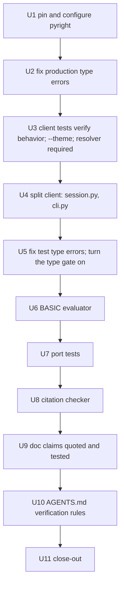

# Engine Quality Gates - Plan

## Goal Capsule

- **Objective:** Make four kinds of silent drift fail loudly in the engine: wrong types, ports that disagree with their BASIC line, unverified claims in learning docs, and tests that dictate the client's structure.
- **Product authority:** This contract for scope; `mf-prg.bas` (via `mafia-oracle`) for every game value a test or doc asserts; `docs/AGENTS.md` for process rules.
- **Execution profile:** `docs/AGENTS.md` — one orchestrator, one subagent per unit, serial, at most two subagents in parallel for review work; the orchestrator owns commits and the authoritative `make check`. Units run in U-ID order.
- **Stop conditions:** a test that can only pass by changing game behavior (report it); a client behavior that cannot be observed through standard input and output, returned state, files or `--theme` (surface it, do not add an injection seam); a red tree the unit cannot fix within its scope; any push (wait for the user).
- **Tail ownership:** the orchestrator closes out per `docs/AGENTS.md` in U11.
- **Open blockers:** None. Lands on `chore/polish` in the same PR as the slice polish plan; no push until the user says.

---

## Product Contract

Product Contract preservation: changed — added R15 (`--theme` option), confirmed by the user during planning so theme tests need no internal seam; the deferred Outstanding Questions are resolved as Key Technical Decisions.

### Summary

Every package is type-checked in the gate.
Every ported BASIC formula is tested against its own quoted line, evaluated the C64 way.
Learning docs quote the source for their claims, their load-bearing claims are tests, and a fresh-context check runs before a doc lands.
Client tests verify only what a player or caller can observe, and the client splits into a session module and a CLI module.

### Problem Frame

Four problems surfaced while finishing the slice.

The code is heavily annotated but nothing checks the annotations: pyright 1.1.412 reports 10 errors in `engine/`, 16 in `clients/`, 0 in `data/` and 163 in `tests/`, while `make check` runs only pytest and ruff.

Nothing ties an engine port to the BASIC line it ports. The #47 audit found inverted signs by hand, and the research repo carried 16 wrong readings of the same kind for two months.

Learning docs read as settled but were wrong in two ways: misreading the source ("7 = handgranaten"; it is 8) and reasoning wrongly from a correct quote (":30240's loop never runs" under true=+1; a C64 `FOR` loop still runs once).

Tests shape the client: 21 monkeypatches of module-level names in four test files pin `TerminalSession` inside the 1,040-line `clients/terminal/__main__.py`, and five client functions keep an optional `resolver=None` mainly for test fakes.

### Key Decisions

- **Tests verify; they do not shape.** Tests may use seams the design has for its own reasons (standard input and output, the input source, the RNG, the resolver, public entry points). They must not reach into internals such as module globals, private functions or call counts. This is the rule that decides item 4 and applies to new tests from now on.
- **Fix all type errors, including tests.** A clean slate and a gate with no exceptions, accepting test-fixture churn over a baseline file that tolerates known-wrong types.
- **Evidence is the quoted line, evaluated with C64 semantics.** A test evaluates the verbatim BASIC expression with true = -1 and bitwise `AND`/`OR` and compares it with the port. Real-C64 (VICE) fixtures are out of scope.
- **Citation checks run where the source is.** The check that quoted fragments match `mf-prg.bas` runs locally when `../research/` exists and is skipped in CI, which cannot see that repo.
- **Docs are checked three ways:** quoted citations (mechanical), load-bearing claims as tests (mechanical), and a fresh-context verifier before a doc lands (process). A one-line rule adds that factual claims from subagent reports are verified before they land in code or docs.
- **One PR.** This work lands on `chore/polish` with the slice polish plan.

### Requirements

**Type checking**

- R1. `make check` and CI run pyright over `engine/`, `clients/`, `data/` and `tests/`, and fail on any error.
- R2. All existing pyright errors are fixed, not suppressed. An inline ignore is allowed only with a one-line reason where the checker is demonstrably wrong.
- R3. The pyright version used by the gate is pinned, like ruff, so local runs and CI agree.

**Ports tied to their BASIC lines**

- R4. A test-side evaluator computes BASIC arithmetic the C64 way: `+ - * /`, `int()`, comparisons that yield -1 or 0, bitwise `and`/`or`, and variables.
- R5. Every engine function that ports a BASIC formula has a test that holds the verbatim expression with its `mf-prg.bas:NNNN` citation, evaluates it for the port's inputs, and compares the results with the port.
- R6. A local-only test checks that every quoted BASIC fragment cited next to `mf-prg.bas:NNNN` or a bare `:NNNN` in engine code, tests and docs matches that line of the source. It is skipped, with a visible reason, when `../research/` is absent.

**Verified docs**

- R7. A claim about game behavior in `docs/solutions/` cites `mf-prg.bas:NNNN` with the verbatim fragment it rests on; R6 checks those fragments.
- R8. Each existing learning doc's load-bearing game claims become tests in the R5 suite, and the doc links to them.
- R9. `docs/AGENTS.md` requires a fresh-context verification of every game claim before a new or changed learning doc is committed.
- R10. `docs/AGENTS.md` requires the orchestrator to verify factual claims from a subagent's report against the tree or the source before they land in code or docs.

**Client tests and structure**

- R11. No test monkeypatches a module-level name or private function of `clients/terminal/`; tests drive `play()`, `main()` or the session's public methods through standard input and output, and assert on printed output, returned state and files written.
- R12. Call-count assertions are replaced by observable equivalents (for example, the number of turn-over screens and the final clock instead of `advance_turn` calls).
- R13. Client functions that render text take a resolver as a required argument; tests pass the real classic theme or a complete theme.
- R14. After R11-R13, `clients/terminal/__main__.py` becomes a thin entry point, with the session in its own module and the command-line handling in another, and no test changes.
- R15. The terminal client accepts `--theme NAME` (a theme of the game config) or a path to a theme directory, defaulting to `classic`; an unknown theme is a readable one-line error.

### Acceptance Examples

- AE1. **Covers R5.** Given `x=3+3*(jo(sp)=2)` from `:25560`, the evaluator yields 0 for `jo=2` and 3 for `jo=1,3,4`, and the test fails if `_completion_score` returns 6 for the croupier.
- AE2. **Covers R6.** Given a comment quoting `deffnm(ln)=50-50*(ln=3orln=4)-100*(ln=1)` next to `mf-prg.bas:116`, the citation check fails because the line is 115.
- AE3. **Covers R11, R12.** The test that a loaded game skips upkeep asserts that no upkeep banner is printed and the returned state equals the saved state, without replacing `run_upkeep`.
- AE4. **Covers R1, R2.** After the work, `make check` fails if a function annotated to take a `GameState` is called with an optional value that may be `None`.

### Scope Boundaries

**Deferred**

- Real-C64 (VICE) fixtures for ported formulas.
- Any change in the research repo; those items are parked in `../research/todos/004-005`.

**Not planned**

- Gameplay changes and next-slice work.
- Typing strictness beyond pyright's default ("standard") mode.

### Dependencies / Assumptions

- The client test rewrite (R11-R13) happens before the type fixes in those same test files, so they are fixed once.
- The evaluator (R4) exists before load-bearing doc claims become tests (R8).
- Assumed: every observable client behavior the current spies check can be asserted through output, returned state or files. If one cannot, it is surfaced during planning rather than solved with a new injection seam.

### Sources / Research

- Measured this session: pyright 1.1.412 error counts by package; 21 monkeypatches of `clients.terminal` names across `tests/test_client_loop.py` (9), `tests/test_terminal_client.py` (8), `tests/test_terminal_integration.py` (2) and `tests/test_slice_integration.py` (1); five optional `resolver` parameters in `clients/terminal/`.
- The tests that monkeypatch `clients.terminal` names today: in `tests/test_client_loop.py`, `test_ae5_game_ends_after_36_rounds_with_the_winner`, `test_load_skips_title_setup_and_upkeep`, `test_second_save_overwrites_with_the_later_position`, `test_load_with_a_setup_flag_is_rejected_before_any_screen`, `test_load_alone_reaches_play_with_no_seed` and `test_a_session_from_a_loaded_save_starts_on_the_map_without_upkeep`; in `tests/test_terminal_client.py`, the `_spy`, `_main`, `_load_and_break_render`, `_Stop` and `_Themed` helpers and the tests using them; in `tests/test_terminal_integration.py`, the two turn-over tests that count `advance_turn` calls on `q`/EOF; in `tests/test_slice_integration.py`, `_drive_main`.
- Test type errors by family: 25 stat reads on `Combatant`, 24 attributes on the `scripted` function, 27 unnarrowed optionals, the rest argument-shape mismatches.
- The relational rule and its structural proofs: `docs/solutions/architecture-patterns/basic-relational-boolean-is-minus-one-when-porting.md`.
- Vacuous-test history and the break-to-prove discipline: `docs/solutions/developer-experience/tests-that-cannot-fail.md`.
- Research-side counterparts: `../research/todos/004-pending-p3-validate-pass-rewrites-completion-timestamp.md`, `../research/todos/005-pending-p2-interpreted-meanings-have-no-independent-check.md`.

---

## Planning Contract

### Key Technical Decisions

- KTD-1. **pyright is pinned in the dev extra and configured in `pyproject.toml`.** `pyright==1.1.412` (the version of the system pyright used for the measurements) joins `ruff` in `[project.optional-dependencies].dev`, and `[tool.pyright]` sets `typeCheckingMode = "standard"` (pyright's default, which reproduces the measured 189 errors), `pythonVersion = "3.11"` and the four checked paths. `make check` runs `python -m pyright` only after U5, and the step is hard: unlike ruff's skip-when-absent, a missing pyright fails the gate, because it is a pinned dev dependency. The PyPI wrapper downloads the pyright npm package on first run, so the first `make check` after install needs network; CI runners have Node and network.
- KTD-2. **Fix the error, not the checker.** An inline `# pyright: ignore[rule]` is allowed only with a reason on the same line and only where the checker is demonstrably wrong. Common fixes: narrow `Optional` before use; read stats through `attrs`/`vitality` in tests (the same load-safe form the handlers use); turn `tests/helpers.py`'s `scripted` into a small callable class so its `seen`/`messages` attributes are declared (removes 24 errors at their source).
- KTD-3. **Faults enter through standard input.** Ctrl-C and an unknown error inside `play()` are simulated with a standard-input object whose `readline` raises `KeyboardInterrupt` or `RuntimeError`. A failing input stream comes from outside the program, so this uses the public interface and needs no seam in the client.
- KTD-4. **Call counts become screen counts.** `advance_turn` called 36 times becomes 36 turn-over screens and a final clock of 1928-01; `run_upkeep` not called becomes no upkeep banner printed; a `save_game` spy becomes reading the save file after each `p`; a `play` spy behind `main()` becomes an end-to-end run whose output and save file are asserted.
- KTD-5. **`--theme` resolves a name or a path.** A value containing a path separator (`os.sep`/`os.altsep`), or starting with `.` or `~`, is a path; anything else is a theme name under the config's `themes/`. (The first wording also took any value naming an existing directory as a path, so a `classic/` folder in the working directory shadowed the default theme; issue #100 dropped that rule.) A path is loaded with a new `Resolver.from_directory(path)` in `engine/strings.py` (reusing `from_config`'s per-file deep-merge) and merged over the classic resolver via `with_override`. `main()` resolves the theme after argument parsing and passes the resolver into `play()` and `TerminalSession`, replacing the hardcoded `"classic"`. Tests ship a tiny theme under `tests/fixtures/themes/` that overrides a few `client.*` keys.
- KTD-6. **The client splits into three modules behind a stable public surface.** `clients/terminal/session.py` holds `TerminalSession` and its screen helpers, `clients/terminal/cli.py` holds `main()`, argument parsing, loading and the error guard, and `clients/terminal/__main__.py` keeps its `if __name__ == "__main__"` guard and only calls `cli.main()`. U3 makes the package `clients.terminal` the public surface: tests import `play`, `main` and the config directory only from there (re-exported in `clients/terminal/__init__.py`), and tests of private helpers (`_is_quit`, `_MOVE_KEYS`, `_CODE_TO_CHAR`, `_run_location`) become behavior tests through `play()`. After U3 no test depends on where a function lives, so U4 needs no test edits; U4 does update `clients/terminal/fightlab.py`, which imports `_read_key` from `__main__.py`.
- KTD-7. **The BASIC evaluator is a test helper, not engine code.** `tests/basic_eval.py` parses and evaluates the arithmetic subset of Commodore BASIC V2: numbers, variables and array references (`jo(sp)`), `+ - * /`, unary minus, `int()`, `rnd(1)` as a named input, comparisons returning -1 or 0, and 16-bit `and`/`or`/`not`. It follows the C64 rules that a conventional parser gets wrong: the lexer matches keywords (`and`, `or`, `not`, `int`, `rnd`) before identifiers, so crunched source like `ln=3orln=4` splits correctly; `int()` is floor (`int(-2.5)` is -3); variable names are significant to two characters; precedence is unary minus, `* /`, `+ -`, relational, `not`, `and`, `or`. It evaluates the right-hand side of one assignment. It never runs in the engine.
- KTD-8. **A "port" is a function that quotes an arithmetic BASIC expression.** The inventory is every engine or config function whose code or docstring quotes a BASIC assignment containing arithmetic, gathered by U7's first step into a list inside the port-test module. Each port test calls the real function over its full input range (or a representative grid for `rnd`-driven terms) and compares with the evaluator.
- KTD-9. **A citation holds if the fragment appears in the cited line.** A citation is `mf-prg.bas:NNNN`, a bare `:NNNN`, or a range `:NNNN-MMMM`; about half the tree's citations use the bare form, including the structural proofs. A quoted fragment is a double-backtick span (or a single-backtick span in `#` comments) directly following a citation on the same line; spans elsewhere on the line, which are often Python, are ignored. The checker normalizes case and whitespace and requires each fragment to be a substring of a line it cites (any line within a range). When a comment cites several lines, any of them may contain the fragment. A short allow-list with a reason per entry covers fragments that are paraphrases by design. It reads `../research/src/decompiled_basic/mf-prg.bas` and skips with a visible reason when that file is absent.
- KTD-10. **Doc claims point at tests by name.** A load-bearing claim in `docs/solutions/` ends with the test that proves it (for example "tested by `test_croupier_completion_score_is_zero`"), and R6's checker also verifies that each named test exists.

### High-Level Technical Design

Unit order and the dependencies the requirements set: client tests before test type fixes, evaluator before doc claims become tests, and the type gate switched on only when every package is clean.

### Sequencing

Serial, U1 → U11. U4 runs with no test edits, which is the proof that U3 decoupled the tests. U5 is the only unit that edits many test files, and it runs after the client tests have their final shape.

### Risks

| Risk | Mitigation |
|---|---|
| A client behavior turns out not to be observable from outside. | Stop condition in the Goal Capsule; surface it to the user instead of adding a seam. |
| Fixing 189 type errors changes behavior by accident. | Type fixes are narrowing and annotation changes; the full suite runs after each file, and U2/U5 report any fix that changed code paths. |
| The evaluator has its own bug and agrees with a wrong port. | The evaluator gets its own tests against hand-computed C64 results, including the three structural proofs (`:30015`, `:30010`, `:30108`). |
| The citation checker only runs locally. | It runs on every developer machine with `../research/` present; CI reports the skip visibly so it is never mistaken for a pass. |
| The PR grows large. | Accepted by the user; units stay one commit each so review can go commit by commit. |

---

## Implementation Units

### U1. Pin and configure pyright

**Goal:** One pinned type checker, configured in the repo, that anyone can run.

**Requirements:** R3

**Dependencies:** None

**Files:** `pyproject.toml`

**Approach:** KTD-1. Add `pyright==1.1.412` to the dev extra and a `[tool.pyright]` section. Do not add it to `make check` yet.

**Test scenarios:** Test expectation: none, configuration only. `python -m pyright engine clients data tests` runs from the dev install and reports today's 189 errors, matching the unconfigured count.

**Verification:** `make check` is unchanged and green; the configured pyright reproduces the known error counts.

### U2. Fix production type errors

**Goal:** `engine/`, `clients/` and `data/` type-check clean.

**Requirements:** R2, AE4

**Dependencies:** U1

**Files:** `engine/actions.py`, `engine/interactions.py`, `engine/persistence.py`, `engine/recording.py`, `engine/types/__init__.py`, `clients/terminal/__main__.py`, `clients/terminal/fightlab.py`

**Approach:** KTD-2. Most errors are `Optional` values used without narrowing. Investigate `engine/types/__init__.py:37` (an import of `Interaction` the checker cannot resolve) and `engine/recording.py:563` (a nested tuple passed to a differently shaped parameter) as possible real bugs before narrowing them.

**Test scenarios:**
- The full suite passes unchanged.
- If a fix exposes a real bug (a value that can really be `None` at runtime), add a test that shows the failing path before fixing it.

**Verification:** pyright reports 0 errors for `engine clients data`; `make check` green.

### U3. Client tests verify behavior; `--theme`; resolver required

**Goal:** No test reaches into the client's internals, and the client offers the seams a user would use.

**Requirements:** R11, R12, R13, R15, AE3

**Dependencies:** U2

**Files:**
- `clients/terminal/__main__.py`, `clients/terminal/__init__.py`, `clients/terminal/renderers.py`
- `engine/strings.py` (`Resolver.from_directory`)
- `tests/test_client_loop.py`, `tests/test_terminal_client.py`, `tests/test_terminal_integration.py`, `tests/test_slice_integration.py`, `tests/test_terminal_renderers.py`
- `tests/fixtures/themes/test/strings/client.yaml` (new)

**Approach:**
- Rewrite the tests that monkeypatch `clients.terminal` names (listed in Sources) per KTD-3 and KTD-4.
- Add `--theme` per KTD-5, with its readable error for an unknown theme.
- Make `resolver` a required argument of `client_text`, `render_result`, `render_map`, `render_status_bar` and `render_status_bar_from_state`; tests pass the real classic theme or a complete theme. `client_text` loses its fallback. The movement loop in `clients/terminal/__init__.py`, which calls `render_result` without a resolver, gains a required resolver parameter too.
- Re-export `play`, `main` and the config directory from `clients/terminal/__init__.py`; move every test import to the package; replace tests of private helpers with behavior tests (KTD-6).
- A fake standard input must be installed before `TerminalSession` is built, because the session captures `sys.stdin` at construction.

**Execution note:** Rewrite one test at a time and prove each new version red by breaking the behavior it names (the break-to-prove rule), since a behavior-only test is easier to make vacuous than a spy.

**Test scenarios:**
- Covers AE3. Loading a save shows no upkeep banner, starts on the map, and the returned state equals the saved state.
- The 36-round game prints 36 turn-over screens, the year-end result, and returns clock 1928-01.
- Pressing `p` twice leaves one save file whose position is the later one.
- `--load` with `--end-year` prints the clash message and exits 2; `--load` alone resumes the saved game.
- Ctrl-C at a prompt (standard input raising `KeyboardInterrupt`) exits 130 quietly with the cursor restored; a `RuntimeError` from standard input keeps its traceback.
- `--watch-ai` in a real fight prints the observation frame; without it, none is printed. `test_employed_turn_shows_job_screen_not_the_map` already scripts seed 5 into a bouncer-shift fight through `play()`; the script may need extra combat keys so a CPU activation happens before input runs out.
- `--theme tests/fixtures/themes/test` changes `bye.` and the turn-over labels; `--theme nosuch` prints one error line and exits non-zero.

**Verification:** `grep` finds no `monkeypatch.setattr` on a `clients.terminal` module name in `tests/`, and no test imports from `clients.terminal.__main__`; the suite is green.

### U4. Split the client into session and CLI modules

**Goal:** `clients/terminal/__main__.py` is a thin entry point.

**Requirements:** R14

**Dependencies:** U3

**Files:** `clients/terminal/__main__.py`, `clients/terminal/session.py` (new), `clients/terminal/cli.py` (new), `clients/terminal/__init__.py` (re-exports now point at the new modules), `clients/terminal/fightlab.py` (its `_read_key` import)

**Approach:** KTD-6. A pure move, proven the same way as the engine splits: every moved function and class has an identical syntax tree. No test file changes.

**Test scenarios:** Test expectation: none new; the suite passes with zero test edits, which is the unit's proof.

**Verification:** `git diff tests/` is empty; `__main__.py` is a few lines; the suite is green on 3.11 and 3.14.

### U5. Fix test type errors; turn the type gate on

**Goal:** Every package type-checks, and the gate enforces it.

**Requirements:** R1, R2

**Dependencies:** U4

**Files:** `tests/helpers.py` and the test files pyright reports; `Makefile`; `.github/workflows/check.yml` (only if the Makefile change does not cover it)

**Approach:** KTD-2. Start with `tests/helpers.py` (`scripted` as a callable class), which clears the largest family. Then add `python -m pyright` to `make check`, after ruff.

**Test scenarios:**
- The full suite passes; no test assertion changes meaning.
- Covers AE4. Temporarily passing an optional `GameState` into a function typed `GameState` makes `make check` fail on pyright; restore.

**Verification:** pyright reports 0 errors for all four paths; `make check` green locally; CI green on 3.11 and 3.14 once pushed.

### U6. BASIC expression evaluator

**Goal:** Tests can evaluate a quoted BASIC expression the way a C64 does.

**Requirements:** R4

**Dependencies:** U5

**Files:** `tests/basic_eval.py` (new), `tests/test_basic_eval.py` (new)

**Approach:** KTD-7. Input is the verbatim assignment text and a mapping of variable values, including `rnd(1)`; output is the value of the right-hand side.

**Execution note:** Test-first: write the evaluator's tests from hand-computed C64 results before the evaluator.

**Test scenarios:**
- `3+3*(jo(sp)=2)` gives 0 for `jo(sp)=2` and 3 otherwise.
- `50-50*(ln=3orln=4)-100*(ln=1)` gives 150, 50, 100, 100, 50 for `ln=1..5`.
- `-20*(i=2)` gives 20 for `i=2`; `2-4*(i=2)` gives 6; `1-(s=1)` maps 1 to 2 and 2 to 1.
- `int(rnd(1)*tg(w)+bt/10)+1` with `rnd(1)=0.5`, `tg(w)=10`, `bt=35` gives 9.
- `(la=10andln=1)` gives -1 when both hold, 0 otherwise.
- `int(-2.5)` gives -3 (floor, not truncation); `-1and5` gives 5; two variables sharing their first two characters are the same variable.
- Unsupported syntax (a string expression, `peek`) raises a clear error instead of guessing.

**Verification:** The evaluator's tests pass; they fail if comparisons return +1.

### U7. Port tests

**Goal:** Every engine port of a BASIC formula is tested against its quoted line.

**Requirements:** R5, AE1

**Dependencies:** U6

**Files:** `tests/test_ports.py` (new), plus code comments where a port's quoted formula is missing or inexact

**Approach:** KTD-8. Build the inventory first, as a list in the test module: each entry has the line number, the verbatim expression, the engine callable and its input grid. Expected ports include `fnm`, `_completion_score`, the range and camp training gains and prices, the weapon-buy score, the upkeep energy regen, score-and-rank, the combat damage roll and the side anchors. A port whose quoted expression is missing from its code gets the quote added.

**Test scenarios:**
- Covers AE1. `_completion_score` matches `:25560` for `jo = 1..4`; changing it to return 6 for the croupier fails the test.
- Each inventoried port matches the evaluator over its input grid.
- Break-to-prove: flip one relational sign in two different ports and see each test fail; restore.

**Verification:** Every inventory entry has a passing test; the suite is green.

### U8. Citation checker

**Goal:** Quoted BASIC fragments in code, tests and docs match the lines they cite.

**Requirements:** R6, AE2

**Dependencies:** U7

**Files:** `tests/test_citations.py` (new), plus fixes to any misquoted comment or doc it finds

**Approach:** KTD-9. It scans `engine/`, `clients/`, `data/`, `tests/` and `docs/solutions/` for quoted fragments next to a line citation, and also checks that tests named in docs exist (KTD-10). Every misquote it finds is fixed in the source comment, not allow-listed, unless the fragment is a deliberate paraphrase.

**Test scenarios:**
- Covers AE2. A fragment of line 115 cited as `:116` fails with both line numbers in the message.
- A bare `:30108` citation followed by ``s=1-(s=1)`` is checked the same way as a `mf-prg.bas:` citation; a backticked Python span elsewhere on the line is ignored.
- A correct citation passes; a multi-line citation passes when any cited line contains the fragment.
- Without `../research/` the test is skipped with a reason, never passed silently.
- A doc naming a test that does not exist fails.

**Verification:** The checker passes locally with `../research/` present; CI shows it as skipped.

### U9. Doc claims quoted and tested

**Goal:** Learning docs rest on quotes and tests, not assertion.

**Requirements:** R7, R8

**Dependencies:** U8

**Files:** `docs/solutions/**/*.md` with game claims; `tests/test_ports.py` (claims not already covered)

**Approach:** KTD-10. For each doc, list its game claims, attach the quoted fragment to each, and point the load-bearing ones at a test (adding it to U7's module when missing). The relational doc's structural proofs and the weapon order (`:121`, DATA `50100`-`50115`) are the first candidates.

**Test scenarios:**
- Each newly added claim test fails when its claimed value is changed.
- U8's checker passes over the edited docs.

**Verification:** Every game claim in `docs/solutions/` carries a quote; load-bearing ones name a passing test.

### U10. Verification rules in `docs/AGENTS.md`

**Goal:** The two process rules are written where every agent reads them.

**Requirements:** R9, R10

**Dependencies:** U9

**Files:** `docs/AGENTS.md`

**Approach:** Add R9 (a fresh-context verification of every game claim before a learning doc is committed) and R10 (the orchestrator verifies factual claims from subagent reports before they land) under the existing conventions, with a pointer to the oracle's `conclude` command and U8's checker.

**Test scenarios:** Test expectation: none, process documentation.

**Verification:** Both rules are present and reference the checker and `conclude`.

### U11. Close-out

**Goal:** Land the work and leave the plan state unambiguous.

**Requirements:** R1-R15

**Dependencies:** U1-U10

**Files:** `CLAUDE.md`, `docs/plans/<date>-NNN-next-slice-brainstorm-basis.md` (new pointer)

**Approach:** Add this plan to CLAUDE.md's landed ledger and a dated brainstorm-basis pointer so the newest `docs/plans` file is a basis again. Push and PR wait for the user.

**Test scenarios:** Test expectation: none.

**Verification:** `make check` green on 3.11 and 3.14.

---

## Verification Contract

| Gate | Check | When |
|---|---|---|
| Green tree | `make check` (pytest, ruff, and pyright from U5 on) | Before every dispatch and commit |
| Both Pythons | Suite on 3.11 (uv venv) and 3.14 | U2, U4, U5, U11 |
| Pure move | Identical syntax trees for every moved function and class; zero test edits | U4 |
| Break-to-prove | Each new or rewritten test fails with its feature broken; probes run with `PYTHONDONTWRITEBYTECODE=1` | U3, U5, U6, U7, U8, U9 |
| No internal seams | No `monkeypatch.setattr` on a `clients.terminal` module name in `tests/` | After U3 |
| Fidelity | Every value asserted about the game is gated through `mafia-oracle` (`conclude`) | U6, U7, U9 |

## Definition of Done

- U1-U11 each landed as a green commit on `chore/polish`.
- R1-R15 hold, checked by the gates above.
- No temporary scripts, probes or abandoned edits remain in the diff.
- CLAUDE.md lists this plan as landed and a brainstorm-basis is the newest file in `docs/plans/`.
- Nothing is pushed until the user says so.
