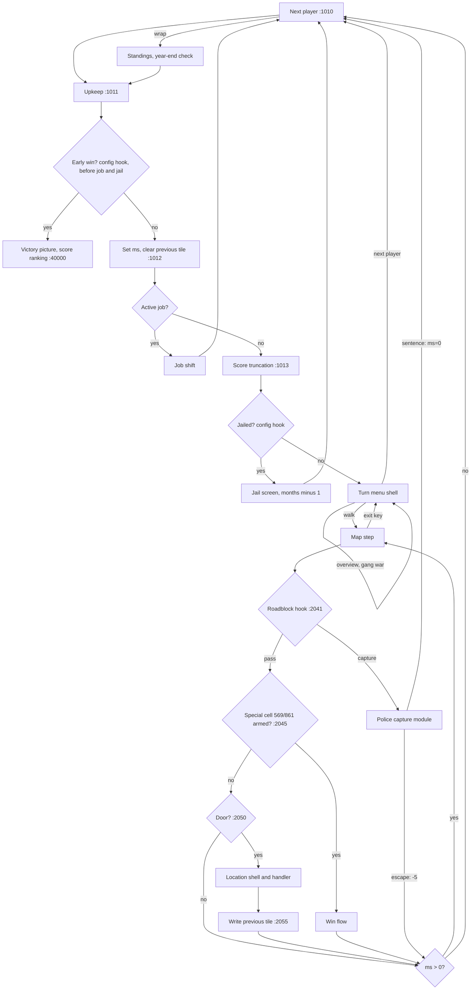
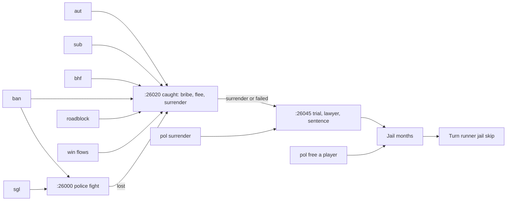

# Full Game - Plan

## Goal Capsule

- **Objective:** finish the port of the 1986 game. After this plan, every feature of the original is playable in the terminal client: all 12 menu locations, the gang war, the police chain, both map win flows and both endings.
- **Product authority:** `../research/` (the decompiled BASIC `mf-prg.bas` wins over every secondary research file) for game behavior; `docs/design/` for architecture. Per-topic behavior dossiers live in `docs/dossiers/full-game/`.
- **Execution profile:** `docs/AGENTS.md`: one orchestrator, one subagent per unit, serial in the order `### Sequencing` lists. Review work uses at most two subagents in parallel. The orchestrator owns commits, the authoritative `make check` (through uv on 3.14 and 3.11), and the board: one GitHub issue per unit with `dep:U<N>` labels, created before U1.
- **Stop conditions:**
  - The frozen oracle (U1) diverges after a seam unit and the cause is not a documented oracle limitation.
  - A dossier claim does not match the BASIC when re-read (the BASIC wins; fix the dossier and report).
  - A requirement can only be met by changing the Product Contract. Amend the plan first.
  - A red tree the unit cannot fix within its scope.
  - Any push. Wait for the user.
- **Tail ownership:** the orchestrator closes out per `docs/AGENTS.md` in U31.
- **Open blockers:** none. Each dossier's open questions are settled by KTD-11 (faithful by default) or deferred to the unit that ports them.
- **Product Contract preservation:** changed R15, R16 and R19. R15 swaps "armed map events" for the previous tile: the armed cell is derived from the tip (`:2002-2003`), so storing it would make two sources for one fact. R16 is narrowed to the fight lab, because research showed the map hint, turn-over and save notes are already theme strings. R19 now names the tests that use `map_repl()`.

---

## Product Contract

### Summary

One plan finishes the game. It opens with a `docs/design/` amendment and a config-registered typed-effect seam, so none of the new game vocabulary lands in `engine/`. On that seam it builds the seven remaining locations, the gang war, the police chain, both map win flows and the early win. It also clears the leftover items listed in R16-R19. The plan is done when a coverage ledger accounts for every line block of `mf-prg.bas`, and a seeded end-to-end run reaches the early-win ending.

### Problem Frame

The first slice and four follow-up plans built five of twelve locations, combat, the year-end ending, save/load and the quality gates. What remains is not a set of independent features. Five of the seven unbuilt locations lead into police capture (`:26000`/`:26020`), and `pol` is the police station itself: its surrender goes straight to the sentence at `:26045`. The map roadblock (`:6000`) and both win flows also lose into capture. The early win (`:1011`) needs both win flags. So none of the remaining content can be ported faithfully piece by piece without the police chain. `WantedChange`, `Jail` and non-global `FlagSet` still raise `NotImplementedError`, and upkeep treats the jail gate as always passing.

At the same time, `engine/` already holds game vocabulary (`_STAT_NAMES` in `engine/effects.py`, `WeaponInstance.req_*` in `engine/types/__init__.py`). Game state for these already sits in `engine/state` (the `Contraband` and `Wanted` entities hold the marks, jail months, bribe months and win flags), unused. Building the police chain on the current pattern would grow that leak.

### Key Decisions

- **Everything in one plan.** The user chose one long plan over phased plans. There is one active plan until the end. A course change mid-plan is made as an amendment, not as a new plan.
- **Seam first.** The engine-boundary amendment and the typed-effect seam are the first units. All new effects are config-registered. The existing leaks (`_STAT_NAMES`, `WeaponInstance.req_*`, game-vocabulary effects and state entities) move behind the seam in the same pass, so nothing is left to migrate later.
- **Old saves and recordings are not supported.** The save schema version (`SCHEMA_VERSION`, already checked strictly on load) is bumped. An old save fails with a one-line "made by an older version" message, not a traceback. Recording fixtures that matter are re-recorded.
- **The leftover tail rides along.** Client English moves to themes, the `:1013` C64 rounding is ported, PRINT spacing and the combat panel are ported, and the theme/CLI robustness fixes are made. None of these is deferred again.
- **Quirks are faithful by default, and each one has a house-rules switch.** Source bugs and exploits are ported literally. Examples: the stale-`p` auto-bribe, seat-indexed flight odds, the gang-war score, the brawl's energy target, the negative-month payout at `pol`, and an empty INPUT reusing an old value. Each quirk whose intent is clear has its own switch that plays that intent instead. The others stay faithful-only. The switches are chosen once at new-game setup and are fixed for that game. This covers rule quirks ported by earlier plans too. Display quirks, such as the rank screen's lost minus, stay a theme choice.
- **Done means a ledger and a win.** Per-feature tests are not enough. The final bar is a line-block coverage ledger plus a seeded end-to-end early win.

### Requirements

**Engine boundary**

- R1. A `docs/design/` amendment defines how a game config registers its own typed effects and state. The engine applies them without knowing their names. The amendment lists every existing effect class and state entity in `engine/`. For each one it says whether it stays in the engine or moves to the config, and names the rule that decides. It also settles two related questions. First, how saves and the recording/replay path serialize and rebuild config-registered effects and state. Second, where the turn-start sequence (`:1010-1013`) and the map-step sequence (`:2035-2060`) live, so that the client drives them without owning their order. It also decides where the house-rule switches and the quirk catalogue live (R20-R22), so that switches for quirks in engine code do not bring game vocabulary back into `engine/`.
- R2. After the plan, `engine/` holds no game-stat names and no game-specific effects or state entities, as judged against R1's list. This covers the existing `_STAT_NAMES` and `WeaponInstance.req_*`, and every effect this plan adds.
- R3. The existing five locations, combat, upkeep and the year-end ending behave the same after the seam refactor.
- R3c. Before the seam refactor starts, a frozen behavior oracle is captured: the existing fight recordings plus seeded multi-turn transcripts over the five locations and upkeep. It is stored as data and does not import effect classes. After the seam, the oracle must reproduce unchanged. Only after that check passes are fixtures re-recorded and old recordings dropped.
- R3d. Every interaction answered by someone other than the active player names that player in the protocol. Examples: the freed player's thank-you payment at `pol`, and the defender's or jailed player's side in the gang war and prison brawl. The terminal client uses this for its whose-turn announcement. Network transport stays out of scope, but the protocol is ready for it.

**Turn menu**

- R3a. Each turn opens the source's turn menu (`:1015-1050`): overview, walk, gang war and next player. The menu is shown again while movement points remain, and the map's exit key (`:2019`) returns to it.
- R3b. The overview screen (`:1200-1245`) shows the player's state, including the passport and counterfeit marks (`:1221-1225`).

**Locations**

- R4. The seven remaining locations are playable from the city map with their original menus, guards and outcomes: `aut` (car dealer), `sgl` (shop / protection racket, including its two fights, on the `ksgl` backdrop), `sub` (subway), `bhf` (railway station, including the mail-train robbery from pub tip 1, on the `kpzug` backdrop), `ban` (bank, including the bank robbery from pub tip 2, on the `kb` backdrop, and the interactive safe-cracking step), `pol` (police HQ: surrender, bribe the chief, free a jailed player), `ble` (Blüten-Eddie: forged passport, counterfeit money).
- R5. Each location's tile index `ln` changes behavior wherever the source says it does.
- R6. All displayed text comes from theme strings ported verbatim from `location-dialogue.yaml` / `game-text.yaml`.
- R6a. Choosing "leave" in any location costs 5 more movement points, on top of the entry cost (`:3045`). This fixes the five existing locations too, which treat leaving as free.
- R6b. The `bhf` station pub opens the pub menu on tile 5 (`:19010`), so the pub's alcohol-buy branch for `ln=5` (`:12010`) is ported. The existing pub handler calls that branch dead code.
- R6c. `sgl` and `ban` call the police when the player's previous location this turn was the same tile (`ll(sp)`, set at `:2055` after the handler returns). This needs the previous tile as it was *before* entry. The port's current last-location fields are overwritten on entry.

**Police chain**

- R7. Each player carries the source's two marks: a forged passport (protects at the roadblock) and counterfeit money (gets the player caught). Both are cleared at random at upkeep (`:4055-4056`).
- R8. The map roadblock (`:2041` → `:6000-6036`) fires during map movement (the port's existing gate is never called today) and runs its full outcome: a clean pass, capture for counterfeit money, capture for smuggled alcohol, a pass with a passport, or capture on a wanted poster.
- R9. Police capture (`:26000-26080`, all three entries) offers bribe, flee and surrender, then trial, lawyer and sentence, with the source's consequences for money, gang and score.
- R10. A jailed player's turns are skipped with the jail screen until the sentence is served (`:1013`, `:1500-1515`). `pol` can free a jailed player.
- R11. The months bought by bribing the police chief (`pol`) count down each upkeep (`:4050`). While they last, capture has a 1-in-2 chance of skipping the menu and paying whatever amount `p` last held (`:26021` → `:26037`). This is not immunity. The stale `p` is a house-rules quirk (R20).

**Win flows, endings and gang war**

- R12. Pub tips 3 and 5 arm the cash-transport (cell 569, `:23000-23030`) and mayor-hit (cell 861, `:24000-24020`) map events. Winning either one sets that player's win flag, and losing it leads into capture. Cells 569 and 861 are checked as special cells before the street check, so the flows can actually be reached (the port currently checks the street first).
- R13. The early win (`:1011`: rank 10 and both win flags at turn start) shows the victory picture and ends the game with the normal score ranking (`:40000-40166`). The triggering player can therefore lose on score. The year-end ending keeps working.
- R14. The gang war (turn menu option 3, `:27000-27150`) is available with the source's gates (refused in a solo game, allowed only from 4/1925). It duels two players through the combat engine, with the source's consequences. When the opponent is in jail, the prison brawl runs instead (`:27100-27150`): the attacker pays for a fellow inmate who fights the jailed player's boss, and if the boss wins, the sentence gets longer.

**Save, replay and robustness**

- R15. Saves round-trip all new per-player state (marks, jail, protection, win flags, the previous tile). A pre-plan save fails with one clear line.
- R16. The fight lab's text becomes theme strings, and the fight lab accepts `--theme`. (The map hint, turn-over and save notes already are theme strings.)
- R17. Per-turn score truncation (`:1013`) rounds as the C64's 40-bit arithmetic does.
- R18. Numbers in templates get C64 `PRINT` spacing, and the combat panel shows the source's zero-padded `ge$` fields (`:1315`, `:1365-1385`).
- R19. A broken classic theme no longer breaks `--help`. A literal `%` in help text is safe. A strings YAML whose top level is a list gives one line, not a traceback. `map_repl()`, which has no production caller, is removed, and the tests that use it drive the real map loop instead.

**House rules**

- R20. New-game setup has an optional house-rules step. It lists every rule quirk that has a switch, each with a one-line description, and all of them default to faithful.
- R21. Each switch changes exactly one quirk. The choices cannot be changed during a game. They are stored in the save and in every artifact that replays rules: fight recordings and scenarios. Replay refuses to run when the stored choices are missing or differ from the ones supplied.
- R22. A quirk catalogue records each rule quirk with its BASIC citation, its faithful behavior and, where it is clear, its intended behavior. It holds the quirks named in `docs/dossiers/full-game/`, plus the quirks in earlier-plan code that one bounded audit of the landed handlers and `docs/solutions/` finds. A quirk found after that audit is added as a plan amendment. Each switchable quirk has a test for both settings. A faithful-only quirk records why it has no switch and has a test of the faithful behavior.

**Coverage ledger**

- R23. A coverage ledger lists every line block of `mf-prg.bas`: each GOSUB/GOTO target range, or the DATA/setup range it belongs to. Each block is marked as ported (with the port's citation) or as a named exception with its reason. A checker keeps the ledger in sync with the code's citations.
- R24. A gap the ledger finds in code landed before this plan is either fixed in a named unit, or recorded as an exception with a follow-up issue. Only an unexplained gap blocks done.

### Acceptance Examples

- AE1. **Covers R8, R7.** Given a player with rank 4 and a forged passport and no counterfeit money or alcohol, when the roadblock fires and the 1-in-3 clean-pass roll misses, then the officer finds nothing and the turn continues.
- AE2. **Covers R8.** Given the same player with counterfeit money, when the roadblock fires and the clean-pass roll misses, then the player is caught for counterfeit money even though they hold a passport, because the source checks counterfeit money first.
- AE3. **Covers R10.** Given a player sentenced to 3 months, when the next three rounds reach that player, then each round shows the jail screen with the months left and skips the turn. In the fourth round the player moves normally.
- AE4. **Covers R12, R13.** Given a rank-10 player who has won both the cash transport and the mayor hit, when their next turn starts, then the victory picture shows and the game ends before the turn menu, with the winner decided by score as at year end.
- AE5. **Covers R14.** Given a solo game, or a date before 4/1925, when the player picks gang war, then it is refused with the source's message and no fight starts.
- AE6. **Covers R15.** Given a save written before this plan, when it is loaded, then the client prints one line saying the save was made by an older version and exits cleanly.
- AE7. **Covers R20, R21.** Given a new game where the player accepts the setup defaults, when a player with chief-bribe months left is caught after a roadblock and the 1-in-2 auto-pay roll hits, then the auto-bribe asks for the leftover `p`: the last map-step value, about 52224 plus the cell. The player cannot pay it and is sentenced, as the source does. Given the same game with the stale-`p` switch set to intent, the auto-bribe charges the normal bribe (`500+500*rank`).

### Success Criteria

- The coverage ledger (R23) has no unexplained gaps. Typical exceptions are C64 hardware setup, disk loading and sprite pokes.
- A seeded end-to-end test drives one player through the pub tips, both win flows and rank 10 to the early-win ending. It may start from a scenario, but that scenario sets no tip and no win flag, so the run actually goes through the pub tips and both flows. It runs with every house rule at its faithful default.
- A second seeded end-to-end run goes through a roadblock capture, trial and sentence, the skipped jail turns, and release, with upkeep running across them.
- `make check` is green on the final commit, with CI on Python 3.11 and 3.14.

### Scope Boundaries

- Network and server transport are out of scope. They stay behind the proven in-process driver.
- Byte-exact RNG draw order is out of scope. The fidelity bar stays behavioral.
- Leftovers from the consumed brainstorm-basis docs that are not taken, and move to the next basis doc:
  - `play()`'s seven keyword parameters and the size of `engine/interactions.py`, which are refactor-only.
  - The `game_end`/`upkeep` runner merge, which was declined before.
  - A loaded save ignoring `pending_action`, which is still unreachable.
  - The load time of `Rng.replayed`, which has not been measured as a problem.
  - `q` or EOF at the standings screen ending the session, which is by design.
  - The comment volume.
- Replaying a recording made before this plan is not supported. From U38 on, such a recording is refused, because it carries no house-rules map.
- The genre-engine goal is not tested with a second game config in this plan. The seam only has to keep game vocabulary out of `engine/`.

### Dependencies / Assumptions

- The seam (R1-R3) blocks every content requirement.
- The win flows fire only while the matching tip is armed: the source re-pokes cells 569/861 as non-street at `:2002-2003`. The port's cells are plain street, so the special-cell check must depend on the armed tip. It must also run before the door lookup, as `:2045-2050` does.
- `:1013` truncates the score before the jail check, so a jailed player's score is still truncated on each skipped turn.
- The police chain (R7-R11) blocks the six locations that lead into it (the five that enter capture, plus `pol`), the roadblock and both win flows. `ble` is the only location that can land before it.
- Pub tips 3 and 5 are already ported (`data/game_configs/mafia_1920s/handlers/pub.py`). The win flows only need to read them.
- The combat engine supports a two-player duel shape (`engine/interactions.py`, `engine/combat_ai.py`). However, `fight_loop` saves energy damage only for side 1 and writes it to the active player. The gang war needs both sides saved to their owners, and in the prison-brawl branch side 1 is a player who is not active.
- The BASIC has no wanted-level variable. The `WantedChange` stub has nothing to port and is removed. The passport and counterfeit marks and the wanted-poster fallback at the roadblock take its place.

### Outstanding Questions

**Deferred to Implementation**

- Which month the gang-war date gate opens on. C64 float accumulation of `1/12` may make the first allowed month display as 5 or 6. U24 checks this in VICE before porting the gate.
- Each dossier's per-option open questions (see `docs/dossiers/full-game/`). The owning unit settles them from the BASIC under KTD-11.

### Sources / Research

- Behavior dossiers, one per location and per cross-cutting topic: `docs/dossiers/full-game/`.
- Brainstorm-basis docs this plan consumes: `docs/plans/2026-09-25-002-next-slice-brainstorm-basis.md`, `2026-09-26-002-…`, `2026-09-26-004-…`, `2026-09-27-002-…`.
- Location dispatch: `mf-prg.bas:3105-3110`; map events `:2002-2003`, `:2045-2046`; roadblock gate already ported in `engine/movement.py`.
- Deferred effects: `engine/effects.py` (`WantedChange`/`Jail` apply, non-global `FlagSet`); save versioning: `engine/persistence.py` (`_check_version`).
- Upkeep lines not yet ported, listed in `data/game_configs/mafia_1920s/handlers/upkeep.py`.

---

## Planning Contract

### Key Technical Decisions

- KTD-1. **Game effects carry their own apply; the engine keeps only the mechanism.** An effect is a frozen dataclass with an `apply(state) -> state` method, registered under a tag by a decorator. This mirrors how `HANDLERS`/`@register` and `SUBSTATES` are filled by the config's import. The engine's `commit()` folds `effect.apply` and no longer has an isinstance chain. Generic effects stay in `engine/effects.py`, and game effects move to a config module. Registration replaces the four hand-kept lists a new effect needs today: the `_apply` chain, `__all__`, `_NESTED_EFFECT_FIELDS` and `consequences.EFFECT_TYPES`.

  The registry must survive config reloads. `load_game_config` re-executes the config package on every call, and the client reloads it mid-game (`clients/terminal/session.py:486`). Three rules follow:
  - The registry is returned on `LoadedConfig`, like `handlers`, and passed to `load_game`/`replay`.
  - Re-registering a tag replaces the old entry.
  - `commit()` dispatches through `effect.apply`, never by type lookup.

  Config `apply` code composes a small public set of state-update helpers (for example, set one player's value), which becomes part of the handler API under `engine_api` 2. It never rebuilds the state graph itself. The rejected alternative is effects as bare data with a tag-to-reducer registry. It needs two artifacts per effect that can drift apart, and a registry keyed by type breaks on reload.
- KTD-2. **Game state is declared data, not config classes.** Per-player game state becomes a frozen, namespaced value map on `Player`. The config declares its schema (names, types, defaults), the same way gangster stats live in `Combatant.attrs`. Saved state never holds a config class. That answers the objection recorded in `docs/solutions/architecture-patterns/subclass-across-a-layer-boundary-needs-cross-class-eq.md`. The map goes through the existing freeze coercion, and `run_pure`'s `_shape()` fingerprint must see it. `Player` keeps the genre-level fields (position, movement points, roster, vehicle, cash, score, rank). U2 fixes the final keep/move line. On load, the schema fills the declared default for a missing key and refuses an unknown key. This lets later units add keys without another version bump. The rejected alternative is config state classes that the engine rebuilds through a registry. The cross-layer learning already rejected it, and saved state would hold classes that change identity on every reload.
- KTD-3. **The rule that decides keep or move** is the one in `engine-blueprint-vs-game-filling`. The engine owns mechanism: sequencing, geometry, applying, clamping and termination. A fact that varies per entity is an attribute. A fact that is uniform across entities is a game formula, and it belongs to the config. U2's table applies this rule to every effect class and state entity. It also covers the guard variables hardcoded in `engine/conditions.py` (`rank`, `ka`, `gf`, `tenancy`), which become config-registered guard variables, and the runner's own writes (`start_free_turn`, `advance_turn`).
- KTD-4. **Save loading and replay take the loaded config.** `load_game` and `replay` in `engine/persistence.py` take the loaded config's registries. They rebuild effects by tag through the registry and state through the declared schema. `_NESTED_EFFECT_FIELDS` and the hard-coded `state_from_dict` class list go away. Recording `load`/`replay` keep their current `rules=` signature: a recording holds only combat scenarios and draws, with no effects or player state. The save header also records the config's id and a config-owned content version. A save loaded under a different config, or a different content version, is refused with one line on the same path as AE6.
- KTD-5. **One version bump, taken once.** `SCHEMA_VERSION` goes from 1 to 2 in U7, after the seam and before any new content. Saves and recordings keep sharing the number. A mismatch on load becomes a one-line client message (AE6), and the `LEGACY_FIELD_DEFAULTS` backfill is removed. Recording snapshots are rebuilt from the draws, as today. `ENGINE_API` and the config's `engine_api` go to 2 in the same unit. Fields added after U7 ride on version 2 without a further bump, since no version-2 artifact exists outside this branch before they land. New declared keys are covered by KTD-2's default-filling. The house-rules map (U10) is the exception: a save without it is refused, never default-filled.
- KTD-6. **The engine owns turn order.** A new engine turn runner drives the source's order:
  - `:1010`: next player; on wrap, round standings and the year-end check.
  - `:1011`: upkeep, then the config's turn-start check (early win).
  - `:1012`: movement points and the job skip.
  - `:1013`: score truncation and the jail skip.
  - The turn menu.
  - The map-step sequence (`:2035-2060`): step, roadblock hook, special-cell hook (569/861), door entry.

  The config supplies each rule as a handler under a fixed key, the way `upkeep.turn_start` works today.

  The runner is an engine generator that yields interactions to its driver, like a handler does, so the future transport can hold one runner per session. It commits each step separately, because one commit per turn would hide the map between steps. Today's driver `run()` is pull-style: it asks an input callback for each answer, so a generator above it could not pass prompts upward. U5 therefore adds a generator form of the driver, `step(handler, state, rng)`, which yields every interaction (including those from sub-states and fights) and returns the same result `run()` returns. `run()` becomes a thin loop over `step()`, so its current callers are unchanged. The runner uses `yield from step(...)` for each hook and handler. The runner's own writes are generic engine effects: advancing the turn, setting movement points, the previous tile and the turn phase. It records a turn phase (menu, walking) in state. Saving is offered only at the turn menu and the map-move prompt, and a resumed save re-enters that phase without re-running turn start. `:1013` score truncation is a game formula, so it becomes a config hook. The rejected alternative is one generator per whole turn with a single commit, which would hide the map between steps. It needs three new interaction types, since today much of a turn is raw key reads in the client:
  - a map-move prompt, which carries the save and quit keys;
  - the location menu, as a choice prompt;
  - acknowledgement screens for upkeep, turn-over and standings.

  Two flow rules hold. When movement points reach 0 on the map, the turn ends with no menu (`:2060`, `:2065`, `:1050`); the menu reappears only when the player leaves the map with points left. After each location handler and each capture, the runner re-reads movement points from state, because a handler can raise them (the car purchase, `:14050`) or zero them (a sentence).

  The loaded config exposes the location shells, so the client no longer finds them by path. `TerminalSession.run_turns`, `map_turn` and `next_turn` become thin loops that render the runner's interactions.
- KTD-7. **The turn menu is a declarative shell.** It is a YAML menu with guards, loaded by the same code as location shells, with one handler per option (overview, walk, gang war, next player). This follows the architecture rule that menus and guards are data. Guards read config-registered guard variables, which cover the gang-war gates (player count, date) and the new value maps. The rejected alternative is a hardcoded menu in the runner.
- KTD-8. **Interactions name who answers them.** The interaction base type gains an optional player index, which defaults to the active player. The gang war and prison brawl mark each combat side's controller. The terminal client prints the whose-turn line from this field.
- KTD-9. **House rules are data in the game config.**
  - The quirk catalogue is one YAML file in the config. Each entry has an id, a citation, the faithful behavior, the intent behavior (or a reason there is none), and whether it has a switch.
  - The switches live on `state.config` as a frozen map, and no effect may write it. Handlers read them through `ctx.state`.
  - `RulesBundle` gains a frozen `house_rules` data field, and `build_rules` takes the map. Recordings serialize the field, and recording `load(rules=)` compares it, so KTD-4's signature holds.
  - The engine never reads a switch by its id. A quirk in engine code, such as the shared direction memory, gets a neutral mechanism setting that the config sets from the map.
  - Setup shows the switchable entries. The map is stored in the save and in recordings and scenarios. Replay compares it and refuses on a mismatch.
- KTD-10. **Police capture is one shared config module with a fixed contract.** U13 defines it once, and every later caller uses it unchanged.
  - **Entry.** Callers enter with `yield from` at the source's three entries: fight first (`:26000`), caught (`:26020`), sentence (`:26045`).
  - **Entry record.** The caller passes the `p` the source would hold at that point (combat's last `p` after a fight, `52224+cell` after a map step), so the faithful stale-`p` auto-bribe is exact per path. The intent switch uses `500+500*rank` instead. The record also carries every value the caller changed before the call (cash, barrels, gang size), because `ctx.state` does not show a handler's own buffered effects.
  - **Capture never returns into the caller's logic.** Every source entry is a `goto`, so after capture the calling handler ends.
  - **Outcomes.** Every path into the trial clears the tip and gives +2 score (`:26045`). An acquittal ends the turn (`ms=0`) and keeps the job (`:26070`). A sentence ends the turn, clears the job, costs 10 score, sets the jail months and moves the player to cell 911 (`:26080`). A bribe, an escape or a won police fight lets the turn continue. It costs 5 movement points once, which a location entry has already paid; after the roadblock or a win flow the runner charges it.
  - **Cancellation.** Prompts inside capture are not cancellable.
  - **Rejected alternative:** capture as a `LoadSubState`, which would not be atomic with the caller's arrest and cannot start combat.
- KTD-11. **Faithful by default settles the dossiers' open questions.** Each dossier question is settled by porting what the BASIC does. Where the BASIC is buggy and the intent is clear, the unit adds a catalogue entry with a switch. Input holes (a negative, fractional or empty number) are ported faithfully after a VICE check of what C64 `INPUT` does, with an intent switch.
- KTD-12. **The frozen oracle is screen transcripts.** Seeded `play()` sessions are driven through piped stdin over the five locations, upkeep, a fight and a year end. The oracle is their stdout, stored as text files, plus the existing fight recordings. It imports no effect class, so the seam refactor cannot rewrite it. U1 proves it goes red on an injected rule change. It is retired in U7 after its last pass, because content units change behavior on purpose.
- KTD-13. **The revisit trap reads a dedicated previous-tile field.** `ll(sp)` is a new genre-level `Player` field owned by the engine, like position, because it records map sequencing (KTD-3). The runner writes it after each location handler returns (`:2055`) and clears it at turn start (`:1012`). It is separate from the entry context the handlers read. It is saved, so a save between two visits cannot dodge the trap. It is also written after a capture from a location and after leaving (`:2055`).
- KTD-14. **Combat writes energy back to each side's owner.** `Fighter` gains an `owner` field: the owning player's index, or none for NPCs. Combat setup sets it. `_run_combat` saves energy for both sides, setting `EnergyChange.player` from `owner` instead of defaulting to the active player. It still writes nothing back for NPC sides.
- KTD-15. **The coverage ledger is a YAML file with a checker.** A block is a line range that starts at line 0 or at any GOTO/GOSUB/ON target and runs to the next such start. The ledger commits its block boundaries, so the checker runs in CI, where `../research/` is absent. Only the check that the boundaries match the source skips without the research tree. Each block is `ported` or `exception` with a reason; the checker derives the citations. The checker reuses `tests/test_citations.py`'s parser. It fails on:
  - a block with no citation in code and no exception;
  - an exception that code does cite;
  - a block missing from the ledger.
- KTD-16. **C64 float emulation is a pure engine helper.** It lives next to `engine/c64_numbers.py` and rounds a Python float through the C64's 5-byte format (32-bit mantissa). It is checked against a new VICE capture fixture, the way `c64_str` was. Its caller is the config's `:1013` truncation hook (KTD-6).

- KTD-17. **Shared config helpers are defined once, by the first unit that needs them.**
  - **One fight helper (U13):** it runs a declared encounter with optional runtime overrides for enemy count, weapon and vitality, and returns the result. The police fight needs all three (`:26000-26010`). U24 and U36 extend it with player-owned sides (feeding `Fighter.owner` and the interaction player field) and a per-fight roster view for a player side, which applies only inside the fight setup. The three existing fight sites (`kdh.py`, `jobs.py`, `upkeep.py`) move onto it, and `test_no_handler_assembles_a_fight_inline` widens to every handler file.
  - **One gangster picker (U17):** it ports `:1130`, with a cancellable parameter.
  - **Encounter files are named `<owner>_<name>`.** Two sequential fights need two files, not variants.
  - **Prices and rolls live in `formula_params`.**
  - **Text reuse and key prefixes:** broke text reuses `system.not_enough_money`. Non-location theme keys use `turn.*`, `police.*`, `roadblock.*`, `win_flows.*` and `gang_war.*`, each in the matching file.
- KTD-18. **Generated files stay generated.** The new combat backdrops (`ksgl`, `kpzug`, `kb`, `kg`, `kgtp`) come from extending `tools/decode_combat_backdrops.py`, never from hand-written YAML. U13 generates all five at once.

### High-Level Technical Design

Turn and map-step order after U5. The engine runner owns the order; the config supplies the rules at each hook.

Police capture is the hub the new content feeds into:

### Sequencing

Units run serially. Deepening split some units, so the serial order is not the U-ID order. It is:

U1, U2, U3, U4, U32, U33, U5, U34, U6, U7, U8, U9, U10, U38, U11, U12, U13, U14, U15, U16, U17, U18, U19, U20, U21, U37, U22, U23, U35, U24, U36, U25, U26, U27, U28, U29, U30, U31.

The phases are:

1. **Oracle and seam** (U1-U4, U32, U33, U5, U34): behavior is unchanged, and the oracle proves it after each unit.
2. **Save and protocol** (U6-U7): ends with the version bump and retires the oracle.
3. **Turn menu, divergences, house rules** (U8-U10, U38, U11).
4. **Police chain** (U12-U16). `ble` lands first, because only it needs no capture.
5. **Locations** (U17-U21, U37).
6. **Win flows, early win, gang war** (U22, U23, U35, U24, U36).
7. **Leftovers** (U25-U28).
8. **Closure** (U29-U31): the ledger, the end-to-end runs, and close-out.

Quirk catalogue entries land with the unit that ports each quirk. U11 audits only the quirks already in earlier code.

### Risks

| Risk | Mitigation |
|---|---|
| The seam refactor changes behavior without anyone noticing, because it rewrites the tests that would catch it. | The U1 oracle is screen text, so the refactor cannot rewrite it. It is proven red on an injected change and must pass unchanged after each unit from U3 to U6 (including U32, U33, U34). |
| Declared state maps make handler code harder to read than dataclass fields. | Config-side typed accessor helpers wrap the map. U4 moves one entity end to end before the rest follow. |
| The turn-runner lift changes the order of RNG draws and breaks seeded tests. | U5 is a pure move with no behavior change; the oracle and the full suite must pass unchanged. |
| Quirk switches multiply the tests that need writing. | A switch only exists where the intent is clear. Each switch has two tests, and each test is shown to fail when the switch is ignored (`docs/solutions/developer-experience/tests-that-cannot-fail.md`). |
| Dossier claims are wrong. They are model output, and the brainstorm already found inverted research claims. | Each unit re-reads its BASIC lines through `mafia-oracle` `conclude` before porting, and the citation checker holds every new quote to its line. |
| The early-win end-to-end test breaks whenever a unit adds an RNG draw. | It is seeded but scripted by outcome: the run picks inputs from the screens, as `make_walk_script` walks the engine, not by fixed key counts. |
| The plan is long, and a course change mid-way strands later units. | Amendments go into this file (resolved in place), and the board issue for each affected unit is updated. |
| A config reload mid-game breaks save or replay equality. | KTD-1's reload rules, plus a U3 test that loads the config twice and round-trips a save. |

### System-Wide Impact

**Affected interfaces**
- **Handler API** (`engine_api` 1 to 2, bumped in U7): config-registered effects and state-update helpers, value-map state, config guard variables, the interaction player field, and the runner's hook keys (turn start, jail, truncation, roadblock, special cell). Owners: U2 (the contract), then U3, U4, U32, U33, U5, U34 and U6.
- **Interaction protocol:** the three runner interaction types (U5, U34) and the player field (U6). The combat screen names the owner of the moving fighter (U24, U36). This is the future network message set; no transport is built.
- **Persistence:**
  - U3: `load_game`/`replay` take the config.
  - U5/U7: `SCHEMA_VERSION` 2, the config id and content version, and the turn phase.
  - U10: the house-rules map.
  - U3/U7: `LEGACY_FIELD_DEFAULTS` and `_NESTED_EFFECT_FIELDS` are removed.
- **Recordings, scenarios and `RulesBundle`:** the house-rules field is serialized and fixtures re-recorded in U7 and again in U38. `Fighter.owner` is serialized from U35 on, defaulting to none for older fixtures. Every `build_rules` caller changes, including the fight lab.
- **Client:** `session.py` shrinks to rendering (U5, U34), and its `RankCommit` import and shell-path lookup go away. `make_walk_script` changes (U9). `cli.py` gets the load-error line (U7) and the robustness fixes (U28). `map_repl` is removed (U28).
- **Docs and CI:** `docs/design/*` (U2), `CONCEPTS.md`, the `CLAUDE.md` ledger (U31). The ledger checker runs in CI without the research tree (U29), and the oracle pins the terminal environment (U1).

**Failure propagation**
- An unknown effect tag, an unknown state key, a config mismatch or a version mismatch in a save is refused with one line on the load-error path, never a traceback (U3, U7).
- A house-rules mismatch, or a missing map in a recording or scenario, makes replay refuse and name the entry (U38). The fight lab shows this as one line (U25).
- A config hook or location handler that raises commits none of its buffered effects and leaves the phase unchanged. The exception propagates to a traceback, as the vertical-slice plan's error-guard decision keeps for real bugs; only known bad inputs become one line (U5).

**State lifecycle and data integrity**
- Saves are taken only at the turn menu or the map-move prompt. Resume re-enters that phase and never re-runs turn start (U5, U9).
- Saves written between U7 and U10 have no house-rules map, and KTD-2's default filling must not invent one. U10 refuses a save with no map and pins that with a test.
- Only value maps and engine types live in state, so a config reload keeps save and replay equality (U3).
- Every `content/scenarios/*.yaml` gets an all-faithful map (U38). The end-to-end scenario sets no tip or flag (U30).

**Integration coverage added**
- Save and resume at each runner save point (turn menu, map-move prompt), including a save taken while another player is jailed (U5, U9, U14).
- The config loaded twice, then save/load equality (U3).
- Capture entered after the caller changed cash or the roster (U13, U15, U21).
- Gang-war energy written to both owners across a save/load (U35, U24).
- A two-player `play()` run where a non-active player answers a prompt (U16, U24).
- The ledger checker green in CI without the research tree (U29).

---

## Implementation Units

### Unit Index

| U-ID | Title | Key files | Depends on |
|---|---|---|---|
| U1 | Frozen behavior oracle | `tests/test_oracle.py`, `tests/oracle/` | none |
| U2 | Seam design amendment | `docs/design/engine-architecture.md`, `docs/design/config-and-content-contract.md` | U1 |
| U3 | Effect and state registries | `engine/effects.py`, `engine/state/__init__.py`, `engine/persistence.py`, `engine/consequences.py`, `engine/config_loader.py` | U2 |
| U4 | Game effects move to the config | `engine/effects.py`, `data/game_configs/mafia_1920s/effects.py`, handlers | U3 |
| U32 | Game state becomes declared value maps | `engine/state/__init__.py`, `data/game_configs/mafia_1920s/state_schema.yaml`, `engine/conditions.py` | U4 |
| U33 | Stat vocabulary moves to the config | `engine/effects.py`, `engine/types/__init__.py` | U32 |
| U5 | Engine turn runner: turn level | `engine/turns.py`, `engine/interactions.py`, `clients/terminal/session.py`, `engine/movement.py` | U33 |
| U34 | Engine turn runner: map step and location menu | `engine/turns.py`, `engine/interactions.py`, `engine/config_loader.py`, `engine/locations.py`, `clients/terminal/session.py` | U5 |
| U6 | Interactions name their player | `engine/interactions.py`, `clients/terminal/session.py` | U34 |
| U7 | Version bump; oracle retired | `engine/effects.py`, `engine/persistence.py`, `engine/config_loader.py`, `clients/terminal/cli.py` | U6 |
| U8 | Leaving costs 5 movement points | `engine/turns.py`, location shells | U7 |
| U9 | Turn menu and overview | `content/menus/turn.yaml`, `handlers/turn.py` | U8 |
| U10 | House-rules framework | `content/house_rules.yaml`, `setup.py`, `engine/state/__init__.py` | U9 |
| U38 | House rules in recordings, scenarios and the rules bundle | `engine/recording.py`, `engine/combat.py`, `combat_rules.py`, `recordings/`, `content/scenarios/` | U10 |
| U11 | Audit of earlier quirks | `content/house_rules.yaml`, handlers, `combat_rules.py` | U38 |
| U12 | Marks, their decay, and `ble` | `handlers/ble.py`, `handlers/upkeep.py` | U11 |
| U13 | Police capture and trial; shared fight helper; backdrops | `handlers/police.py`, `setup.py`, `tools/decode_combat_backdrops.py` | U12 |
| U14 | Jail skip | `handlers/turn.py`, `engine/turns.py` | U13 |
| U15 | Roadblock | `handlers/roadblock.py`, `engine/movement.py` | U14 |
| U16 | `pol` and chief-bribe aging | `handlers/pol.py`, `handlers/upkeep.py` | U15 |
| U17 | `aut` | `handlers/aut.py` | U16 |
| U18 | `sgl` and the revisit trap | `handlers/sgl.py`, `engine/turns.py` | U17 |
| U19 | `sub` | `handlers/sub.py` | U18 |
| U20 | `bhf` and the station pub | `handlers/bhf.py`, `handlers/pub.py` | U19 |
| U21 | `ban` hold-up | `handlers/ban.py` | U20 |
| U37 | `ban` night safe-crack | `handlers/ban.py` | U21 |
| U22 | Win flows | `handlers/win_flows.py`, `engine/movement.py` | U37 |
| U23 | Early win | `handlers/turn.py`, `handlers/game_end.py` | U22 |
| U35 | Combat energy written back to each owner | `engine/fight_loop.py`, `engine/combat_setup.py`, `engine/state/__init__.py` | U23 |
| U24 | Gang war duel | `handlers/gang_war.py`, `content/menus/turn.yaml` | U35 |
| U36 | Prison brawl | `handlers/gang_war.py` | U24 |
| U25 | Fight lab text into the theme | `clients/terminal/fightlab.py` | U36 |
| U26 | C64 40-bit rounding at `:1013` | `engine/c64_numbers.py` | U25 |
| U27 | PRINT spacing and combat panel | theme strings, `clients/terminal/session.py` | U26 |
| U28 | Theme and CLI robustness | `clients/terminal/cli.py`, `clients/terminal/__init__.py` | U27 |
| U29 | Coverage ledger | `docs/coverage-ledger.yaml`, `tests/test_coverage_ledger.py` | U28 |
| U30 | End-to-end seeded runs | `tests/test_full_game_e2e.py` | U29 |
| U31 | Close-out | `CLAUDE.md`, next brainstorm-basis | U30 |

Paths under `handlers/`, `content/`, `setup.py` and `combat_rules.py` are relative to `data/game_configs/mafia_1920s/`. The table is in serial order.

Every location unit (U12, U16-U21, U37) follows one shape, taken from `kdh` and `slw`:
- a shell YAML whose options have no guards, with refusals inside the handler (`content/locations/kdh.yaml`);
- the handler registered in `handlers/__init__.py`;
- theme strings in `themes/classic/strings/<key>.yaml`;
- handler tests through `run_pure` that assert the exact effect list and no state change on every refusal (`tests/test_slw.py`);
- the four-check shell test from `tests/test_kdh_shell.py`: handlers resolve, menu strings exist, emitted keys resolve with their params, and the text is verbatim;
- the error idioms already in use: zero input is a quiet abort, a broke player gets `system.not_enough_money` with no state change, a declined confirm changes nothing, and a cancelled picker commits nothing.

Each location unit also adds its door glyph to `clients/terminal/layout.yaml` and its entry art to `clients/terminal/ascii_art.py` (from `../research/src/<key>-pic` where one exists).

### U1. Frozen behavior oracle

**Goal:** A record of today's behavior that the seam refactor cannot rewrite.

**Requirements:** R3, R3c

**Dependencies:** none

**Files:** `tests/test_oracle.py`, `tests/oracle/*.txt` (new), `tools/capture_oracle.py` (new)

**Approach:** KTD-12. The capture tool runs seeded `play()` sessions from scripted stdin and writes their stdout. Cover these five sessions:
- a two-player game that visits all five locations;
- a debt default with the collectors' fight;
- a pub job shift;
- a save and resume;
- one short game that runs to its year end.

The test re-runs each script and compares the text exactly. It also replays the existing recordings under `recordings/` through `engine.recording` with the config's rules bundle through `load(rules=)`, whose signature does not change in this plan (KTD-4). The oracle imports no effect class. Transcripts pin `COLUMNS`, `LINES` and the colour environment variables, so they match on every machine.

**Execution note:** Prove the oracle can fail before trusting it. Change one rule on purpose, such as a price in `slw`, and see the test go red. Then restore the rule with a scratch copy, not `git checkout`.

**Patterns to follow:** `tests/test_client_loop.py`, which drives `play()` over piped stdin; `tests/helpers.py` `make_walk_script`.

**Test scenarios:**
- Each transcript reproduces exactly on 3.11 and 3.14.
- The oracle runs unchanged after every unit from U3 to U6, including U32, U33 and U34.
- An injected one-line rule change turns the matching transcript red.
- The replayed recordings report no divergence.

**Verification:** the oracle is green on the current tree and red under the injected change.

### U2. Seam design amendment

**Goal:** The design docs say where game vocabulary lives and how the engine applies things it does not name.

**Requirements:** R1, R2

**Dependencies:** U1

**Files:** `docs/design/engine-architecture.md`, `docs/design/config-and-content-contract.md`, `docs/design/product-and-scope.md`

**Approach:** Write down KTD-1 to KTD-9, and edit the statements the learnings research listed:
- the two effect catalogues (`engine-architecture.md:79-88`, `config-and-content-contract.md:105-116`), which drop `wanted_change` and move `jail` and the other game effects to the config;
- the config-import rule (`:181`) and the abstract-schemas rule (`:173`);
- the GameState overview (`engine-architecture.md:157-170`) and the FSM (`:24-31`);
- the `engine_api` bump (`:60-67`).

Add the keep/move table that covers all 29 effect classes and every state entity (KTD-3). Explain why the engine changes without a second config (`product-and-scope.md:76`): the leak is growing, and this plan would triple it.

**Test scenarios:** Test expectation: none, design text only. U3 and U4 are checked against its table.

**Verification:** the table names every class in `engine/effects.py` and every entity in `engine/state/__init__.py`, each with a verdict and the rule behind it.

### U3. Effect and state registries

**Goal:** The engine can apply, save and replay effects and state it does not name.

**Requirements:** R1, R15

**Dependencies:** U2

**Files:** `engine/effects.py`, `engine/state/__init__.py`, `engine/persistence.py`, `engine/consequences.py`, `engine/config_loader.py`, `tests/test_effect_registry.py` (new), `tests/test_persistence.py`

**Approach:** KTD-1, KTD-2, KTD-4. This unit adds the registry decorator, `apply` on each effect, the declared per-player value map with its freeze coercion, and schema loading in the config loader. Save loading then resolves effects and state through the loaded config. Recordings are untouched. Existing effects move onto `apply` in place and stay in `engine/effects.py`, so this unit changes no names.

**Execution note:** Pure mechanism; the oracle and the full suite must pass unchanged.

**Patterns to follow:** `engine/locations.py` `HANDLERS`/`register`; `engine/substates.py`; `docs/solutions/architecture-patterns/freezing-a-mutable-dataclass-graph.md`.

**Test scenarios:**
- A test-only effect registered from a fixture config applies, saves and reloads with an equal state.
- An unregistered tag in a save fails with a clear error naming the tag.
- A value map declared in the schema freezes on construction.
- Mutating the map in place raises.
- `run_pure`'s `_shape()` detects a type change inside the map.
- Loading a save without the config registry is a type error at the call site.
- A save missing a declared key loads with the declared default.
- A save with an unknown key is refused, naming the key.
- Loading the config twice, then saving under the first load and loading under the second, gives an equal state.
- Re-registering a tag replaces the old entry without raising.

**Verification:** the oracle and suite pass unchanged; `commit()` has no isinstance chain.

### U4. Game effects move to the config

**Goal:** `engine/` holds no game-specific effect class.

**Requirements:** R2, R3

**Dependencies:** U3

**Files:**
- `engine/effects.py`, `data/game_configs/mafia_1920s/effects.py` (new)
- every handler in `data/game_configs/mafia_1920s/handlers/`, `data/game_configs/mafia_1920s/setup.py`, `engine/consequences.py`
- `clients/terminal/session.py`
- the tests that import moved classes (18 test files name a game effect)

**Approach:** Apply U2's table to the effect classes only. Two changes are fixed in advance:
- `WantedChange` is deleted, since there is no BASIC variable for it.
- `Jail` becomes a config effect that sets the months.

The client stops importing `RankCommit` and reads the rank through the state. The state entities stay engine classes for now; config effects may import `engine.state` until U32 lands.

**Execution note:** Behavior-preserving; the oracle must pass unchanged.

**Patterns to follow:** `docs/solutions/architecture-patterns/two-sources-for-one-fact-remove-dont-reconcile.md`.

**Test scenarios:**
- A grep test finds no config effect name in `engine/`.
- The existing handler tests pass with imports switched to the config module.
- A save holding moved effects round-trips.

**Verification:** the oracle is unchanged, and `engine/effects.py` holds only generic effects.

### U32. Game state becomes declared value maps

**Goal:** `engine/state` holds no game entity or game field.

**Requirements:** R2, R3, R15

**Dependencies:** U4

**Files:** `engine/state/__init__.py`, `engine/conditions.py`, `engine/persistence.py`, `data/game_configs/mafia_1920s/state_schema.yaml` (new), `data/game_configs/mafia_1920s/state.py` (new, typed accessors), every handler and `setup.py`, the tests that build state (15 test files name a game entity)

**Approach:** KTD-2 and KTD-3. `Debt`, `Job`, `Business`, `Contraband` and `Wanted`, the game fields on `Player` and `Flags` and `Config` (as U2's table lists), and the guard variables in `engine/conditions.py` all move. They become declared value maps and config-registered guard variables. Move `Debt` end to end first and run the oracle, then the rest one entity at a time. Config-side typed accessors wrap the maps so handler code stays readable.

**Execution note:** Behavior-preserving; the oracle must pass after each entity moves.

**Patterns to follow:** `Combatant.attrs` in `engine/state/__init__.py`; `docs/solutions/architecture-patterns/freezing-a-mutable-dataclass-graph.md`.

**Test scenarios:**
- One parametrized save round-trip over every declared schema key. It covers each key a later unit declares without a new test.
- A guard reading a config-registered variable filters a menu option as before.
- `run_pure`'s shape check sees a type change inside a value map.

**Verification:** the oracle is unchanged, and `engine/state/__init__.py` names no game entity.

### U33. Stat vocabulary moves to the config

**Goal:** `engine/` names no gangster stat.

**Requirements:** R2

**Dependencies:** U32

**Files:** `engine/effects.py`, `engine/types/__init__.py`, `data/game_configs/mafia_1920s/setup.py`, `data/game_configs/mafia_1920s/handlers/waf.py`, `tests/test_engine_stat_agnostic.py`

**Approach:** `_STAT_NAMES` goes: stat validation reads the config's declared stat names. `WeaponInstance.req_*` becomes a config-declared requirement map, read by `waf.py`.

**Test scenarios:**
- `test_engine_stat_agnostic` passes with its `effects.py` and `types` allow-list entries removed.
- A weapon whose requirement map names an undeclared stat is refused at config load.

**Verification:** the oracle is unchanged, and the allow-list is empty.

### U5. Engine turn runner: turn level

**Goal:** The engine owns the order of a turn. The client only renders it.

**Requirements:** R1, R3

**Dependencies:** U33

**Files:** `engine/turns.py` (new), `engine/interactions.py` (the `step()` driver; `run()`, `_run_substate` and `_run_combat` rewritten over it), `engine/fight_loop.py`, `engine/effects.py`, `engine/movement.py`, `clients/terminal/session.py`, `data/game_configs/mafia_1920s/handlers/turn.py` (new), `tests/test_turn_runner.py` (new), `tests/test_driver.py`

**Approach:** KTD-6, turn level only (`:1010-1013`). First add the generator driver `step()` and rewrite `run()` over it; the ~20 files that call `run()` must pass unchanged. Then lift the order out of `run_turns` and `next_turn`: next player, round standings, the year-end check, upkeep, the job shift or free turn, turn-over. The acknowledgement-screen interaction type is added here. The runner's writes (`advance_turn`, `start_free_turn`) become generic engine effects. `:1013` truncation becomes a config hook. The early-win and jail hooks are added as no-ops, and the turn phase is recorded in state. The runner's error guard covers hooks the way it covers location handlers.

**Execution note:** Behavior-preserving but not a pure code move: the driver internals are rewritten. The oracle and the full suite must pass unchanged, and they are the safety net for the driver rewrite.

**Patterns to follow:** `engine/upkeep.py` (a runner over a fixed handler key); `engine/game_end.py`.

**Test scenarios:**
- A two-player round through the runner produces the same state as today's client loop, for the same seed and inputs.
- Wrapping the last player runs the standings before upkeep for player 1.
- The year-end check fires at `int(ja)=x9`.
- `step()` driven by a scripted sender gives the same result as `run()` for a handler with a prompt, a sub-state and a fight.
- A hook that raises commits none of its buffered effects, leaves the phase unchanged, and the exception propagates (the existing policy: bugs keep their traceback).
- A save at the map resumes to the same screen without re-running upkeep or turn start.

**Verification:** the oracle is unchanged, and `session.py` holds no turn-level order.

### U34. Engine turn runner: map step and location menu

**Goal:** The engine owns the order of a map step and the location visit.

**Requirements:** R1, R3

**Dependencies:** U5

**Files:** `engine/turns.py`, `engine/interactions.py`, `engine/config_loader.py`, `engine/locations.py`, `engine/movement.py`, `clients/terminal/session.py`, `tests/test_turn_runner.py`

**Approach:** KTD-6, map level (`:2035-2060`). Add the map-move prompt and the location-menu choice interactions. The loaded config exposes its shells, which replaces `_shell_path`, `_shell_exists`, `_run_location` and `map_turn` in the client. Add the no-op roadblock and special-cell hooks. After each location handler, re-read movement points from state instead of trusting the entry result.

**Execution note:** Pure move; the oracle and the full suite must pass unchanged.

**Test scenarios:**
- Walking until movement points reach 0 ends the turn with no menu.
- A location handler that raises movement points (a test handler) continues the map.
- A config hook that forces `ms=0` ends the turn.
- Save and quit keys work at the map-move prompt.

**Verification:** the oracle is unchanged, and `session.py` holds no map-step order.

### U6. Interactions name their player

**Goal:** Each interaction says who answers it.

**Requirements:** R3d

**Dependencies:** U34

**Files:** `engine/interactions.py`, `engine/fight_loop.py`, `clients/terminal/session.py`, `tests/test_driver.py`

**Approach:** KTD-8. The field defaults to the active player. The client prints a whose-turn line (a new theme key) only when the player differs from the active one.

**Test scenarios:**
- Default interactions carry the active player index.
- An interaction naming another player makes the client print the whose-turn line before the prompt.
- The oracle is unchanged, since no current interaction names another player.

**Verification:** the oracle passes.

### U7. Version bump; oracle retired

**Goal:** Pre-plan saves are refused cleanly, the recording fixtures are re-recorded, and the oracle has served its purpose.

**Requirements:** R15, R3c

**Dependencies:** U6

**Files:**
- `engine/effects.py`, `engine/persistence.py`, `engine/config_loader.py`, `data/game_configs/mafia_1920s/config.yaml`
- `clients/terminal/cli.py`, the theme strings under `data/game_configs/mafia_1920s/themes/classic/strings/`
- `recordings/`
- `tests/test_persistence.py`, `tests/test_client_loop.py`
- `tests/test_oracle.py`, `tests/oracle/` and `tools/capture_oracle.py`, which are deleted

**Approach:** KTD-5. Run the oracle one last time, then:
1. Bump the version and the config API version. Add the config id and content version to the save header (KTD-4).
2. Remove `LEGACY_FIELD_DEFAULTS`.
3. Re-record the recording fixtures.
4. Delete the oracle and its capture tool, and note in the commit message which commit held the last green oracle.

**Test scenarios:**
- Covers AE6. A save with version 1 prints the one-line older-version message through the existing load-error path, and exits with status 1, without a traceback.
- A config declaring `engine_api: 1` is refused with a clear message.
- A save written under another config id or content version is refused with one line.
- The re-recorded fixtures replay without divergence.

**Verification:** `make check` green; the oracle's last green run is named in the commit message.

### U8. Leaving costs 5 movement points

**Goal:** Leaving a location costs what the source charges.

**Requirements:** R6a

**Dependencies:** U7

**Files:** `engine/turns.py`, `data/game_configs/mafia_1920s/content/locations/*.yaml`, `tests/test_turn_runner.py`

**Approach:** `:3045` `ifw=awthenms=ms-5:return`. The runner runs the leave option's consequences instead of skipping them, and each shell's `leave` charges `ms_change: -5`. `pub.yaml` has no `leave` option today, so it gets one. The client also leaves on an empty or invalid choice (`clients/terminal/session.py:437-441`). The source ignores an empty or out-of-range key and keeps waiting (`:3040` `ifw<1orw>awgoto3040`), so such a key never leaves for free.

**Test scenarios:**
- Entering a location and leaving at once costs 10 movement points in total.
- With `ms=3`, entering and leaving gives `ms=-7` and ends the turn; the next turn resets it.
- The pub charges for leaving like every other location.
- An empty or out-of-range key at the location menu is ignored and the menu keeps waiting.

**Verification:** the existing location tests change only where they asserted a free leave.

### U9. Turn menu and overview

**Goal:** Each turn opens the source's menu, and the overview shows the player's state.

**Requirements:** R3a, R3b

**Dependencies:** U8

**Files:**
- `data/game_configs/mafia_1920s/content/menus/turn.yaml` (new)
- `data/game_configs/mafia_1920s/handlers/turn.py`
- `data/game_configs/mafia_1920s/themes/classic/strings/turn.yaml` (new)
- `engine/turns.py`, `tests/helpers.py`, `tests/test_turn_menu.py` (new)

**Approach:** KTD-7. The turn menu has three options in this unit: 1 overview (`:1200-1245`, including the marks at `:1221-1225`), 2 walk and 4 next player. U24 adds option 3. The runner re-shows the menu while `ms>0` (`:1045`). The map's exit key (`:2019`) returns to the menu. The F1 graphics toggle (`:1032`) is a ledger exception. Update `make_walk_script` for the extra reads. Saving is offered at the menu too.

**Test scenarios:**
- Picking next player ends the turn with movement points unspent.
- Walking and returning with the exit key re-shows the menu while `ms>0`.
- The overview shows cash, score, rank, gang and both marks for a player holding both.
- An out-of-range key is ignored, as `:1030` does.
- A save at the menu resumes to the menu with the same movement points.

**Verification:** client tests drive `play()` through the menu.

### U10. House-rules framework

**Goal:** Setup can switch rule quirks to their intent, and the choice is fixed for the game.

**Requirements:** R20, R21

**Dependencies:** U9

**Files:**
- `data/game_configs/mafia_1920s/content/house_rules.yaml` (new), `data/game_configs/mafia_1920s/setup.py`
- `engine/state/__init__.py`, `engine/persistence.py`
- `clients/terminal/session.py`, the theme strings
- `tests/test_house_rules.py` (new)

**Approach:** KTD-9. The catalogue has a schema check. Setup gets an optional step that is skipped by default, lists the entries with a switch, and starts every entry at faithful. The map lives on `state.config`; no effect may write it. A save with no map is refused; KTD-2's default filling does not apply to it.

**Test scenarios:**
- Accepting the defaults stores an all-faithful map in the save.
- Switching one entry stores exactly that change.
- A solo game goes through the house-rules step and stores the map.
- A save with no map is refused with one line.
- A catalogue entry that has a switch but no intent text fails the schema check.
- No registered effect writes the map.

**Verification:** a round trip of setup, then save, then load keeps the map.

### U38. House rules in recordings, scenarios and the rules bundle

**Goal:** Every artifact that replays rules carries the house-rules map, and replay refuses a mismatch.

**Requirements:** R21

**Dependencies:** U10

**Files:** `engine/combat.py` (`RulesBundle`), `engine/recording.py`, `engine/scenario.py`, `data/game_configs/mafia_1920s/combat_rules.py`, every `build_rules` caller including `clients/terminal/fightlab.py`, `recordings/`, `data/game_configs/mafia_1920s/content/scenarios/`, `tests/test_recording.py`, `tests/test_house_rules.py`

**Approach:** KTD-9's rules-bundle rules. `RulesBundle` gains the frozen `house_rules` field and `build_rules` takes the map. Recordings and scenarios store it, and `load(rules=)` compares it. Re-record the fixtures from U7 under the all-faithful map, and add an all-faithful map to each scenario file.

**Test scenarios:**
- A recording made under one map refuses to replay under another, naming the differing entry.
- A recording with no map is refused.
- Each scenario file loads with its all-faithful map.
- The re-recorded fixtures replay without divergence.

**Verification:** the recording and fight-lab tests pass.

### U11. Audit of earlier quirks

**Goal:** The rule quirks already in the code are catalogued and, where the intent is clear, switchable.

**Requirements:** R22

**Dependencies:** U38

**Files:** `data/game_configs/mafia_1920s/content/house_rules.yaml`, the affected handlers and `combat_rules.py`, `engine/combat_ai.py` and `engine/combat.py` (a neutral direction-memory setting, set from the map by the config), `tests/test_house_rules.py`

**Approach:** Start from the learnings seed of 23 items:
- The rule quirks become entries. Candidates with a switch: `:311` intelligence `OR 30`, `:4355` the collectors' fight won without debt relief, `:25560` the zero croupier completion score, and the `ri(f)` shared direction memory.
- Display quirks stay theme choices.
- Deliberate departures are recorded as notes, not switches.
- The reversed `true=+1` rent quirk is left out.

Re-read each item with `mafia-oracle` `conclude`. The audit is bounded to the landed handlers, `engine/`, and `docs/solutions/`. Anything found later becomes a plan amendment.

**Test scenarios:**
- Each switch has a faithful-setting test and an intent-setting test.
- Each test fails when its switch is ignored.
- Each faithful-only entry has a faithful test.

**Verification:** every catalogue entry cites a line, and the citation checker holds it to that line.

### U12. Marks, their decay, and `ble`

**Goal:** Players can buy a passport and counterfeit money, and both marks fade at random.

**Requirements:** R4 (`ble`), R5, R6, R7, R15, R22

**Dependencies:** U11

**Files:**
- `data/game_configs/mafia_1920s/handlers/ble.py`, `data/game_configs/mafia_1920s/content/locations/ble.yaml`, `data/game_configs/mafia_1920s/themes/classic/strings/ble.yaml` (all new)
- `data/game_configs/mafia_1920s/handlers/upkeep.py`, `data/game_configs/mafia_1920s/handlers/__init__.py`
- `data/game_configs/mafia_1920s/content/house_rules.yaml`
- `tests/test_ble.py`, `tests/test_ble_shell.py` (new), `tests/test_upkeep.py`

**Approach:** Port from `docs/dossiers/full-game/ble.md` and `roadblock-and-marks.md`:
- the passport price is `1000*` roster size (`:22010`);
- counterfeit money is bought with an investment (`:22100-22130`), including the INPUT quirk (KTD-11);
- the marks decay 1 in 8 each at `:4055-4056`.

The overview from U9 shows both marks. Pattern: `slw.rent` (`handlers/slw.py`, `tests/test_slw.py`) for price and afford; `tests/test_upkeep.py` for the decay.

**Test scenarios:**
- The passport price scales with gang size, and buying it sets the passport mark.
- A player who cannot pay is refused with the source's text.
- The counterfeit purchase follows the dossier's formula over its input range.
- The marks decay with probability 1/8 each under `StubRng`.
- A port test entry covers each arithmetic line.
- Both marks survive a save and a load.
- Error paths: an investment of 0 is a quiet abort; the bounds are 0-5000 (`:22105`); an investment above the player's cash is refused; buying a passport while holding one follows the source.
- Each new switch has a faithful test and an intent test, each failing when the switch is ignored.

**Verification:** the handler, shell and upkeep tests pass.

### U13. Police capture and trial; shared fight helper; backdrops

**Goal:** One module handles everything from arrest to sentence, faithfully for every entry. The helpers every later fight needs exist.

**Requirements:** R9, R11 (the auto-bribe path), R20-R22 (capture quirks)

**Dependencies:** U12

**Files:**
- `data/game_configs/mafia_1920s/handlers/police.py`, `data/game_configs/mafia_1920s/content/encounters/police_fight.yaml`, `data/game_configs/mafia_1920s/themes/classic/strings/police.yaml` (all new)
- `data/game_configs/mafia_1920s/setup.py` (the fight helper), `handlers/kdh.py`, `handlers/jobs.py`, `handlers/upkeep.py` (moved onto it)
- `tools/decode_combat_backdrops.py`, `content/combat/ksgl.yaml`, `content/combat/kpzug.yaml`, `content/combat/kb.yaml`, `content/combat/kg.yaml`, `content/combat/kgtp.yaml` (generated)
- `content/house_rules.yaml`
- `tests/test_police_capture.py` (new), `tests/test_encounters.py`

**Approach:** First the shared pieces (KTD-17, KTD-18):
- The fight helper supports runtime overrides for enemy count, weapon and vitality, since `EnemySpec` fields are fixed today and the police values depend on rank and RNG (`:26000-26010`).
- The three existing fight sites move onto the helper.
- `test_no_handler_assembles_a_fight_inline` widens to every handler.
- The backdrop tool is extended and all five backdrops are generated.

Then port `:26000-26080` from `docs/dossiers/full-game/police-capture-and-jail.md` under the KTD-10 contract:
- **fight first** with the runtime count, weapon `5-2*(ra>5)` and energy `20+2*(ra-1)-int(rnd*21)`;
- **arrest:** bribe `500+500*ra`, flee `int(rnd*tr(sp)/11)=0` and surrender;
- **trial:** the tip is cleared on entry (`:26045`); then lawyer and verdict. A sentence sets the jail months (the `Jail` config effect), moves the player to cell 911 and clears the job; an acquittal keeps the job.

Catalogue entries:
- the stale `p` (switch);
- seat-indexed flight odds (switch: use the vehicle's `tr`);
- the lawyer amount above 10000 (faithful-only unless the intent is clear).

**Patterns to follow:** `handlers/upkeep.py` (the collectors' fight) and `tests/test_debt_default.py` for a fight outside a location.

**Test scenarios:**
- Covers AE7. With chief-bribe months and the auto-pay roll hit, the faithful setting asks for the caller's `p`. After a roadblock the player cannot pay it and is sentenced. With intent set, the bribe is `500+500*rank`.
- A stale `p` of 0 with no cash walks free 4 times in 5 under the faithful setting.
- A bribe accepted at the right price lets the player go 4 times in 5. A declined bribe goes to the sentence (`:26036`), and an unaffordable one too (`:26037`).
- The flight odds follow the seat index when faithful and the vehicle's `tr` under intent.
- The lawyer prompt re-prompts above the player's cash; 0 or empty means no lawyer (`:26060-26061`).
- A sentence sets the months, `ms=0`, cell 911, no job and no tip, and costs 10 score. The next screen is the next player's.
- An escape or a won police fight leaves the turn running.
- An invalid menu key is ignored (`:26025`).
- A caller that changed cash before capture sees its own change through the entry record.
- The score change per path matches one table test.
- The police weapon is 5 up to rank 5 and 7 above, and the police energy stays within `:26010`'s range for each rank.
- An acquittal clears the tip and keeps the job.
- Each switch has a faithful test and an intent test, each failing when the switch is ignored.

**Verification:** the port tests cover every arithmetic line in `:26000-26080`, and the widened no-inline-fight test is green.

### U14. Jail skip

**Goal:** A jailed player's turns are skipped until the sentence is served, and upkeep treats them as the source does.

**Requirements:** R10 (skip), R15

**Dependencies:** U13

**Files:** `data/game_configs/mafia_1920s/handlers/turn.py`, `data/game_configs/mafia_1920s/handlers/upkeep.py`, `engine/turns.py`, the theme strings, `tests/test_jail.py` (new)

**Approach:** The jail hook runs after score truncation (`:1013`): it lowers the months by one and shows `:1510-1515`. Upkeep runs in full for a jailed player (`:1011` comes before `:1013`), except the debt check, which `:4040` skips while jailed. That flips the gate `handlers/upkeep.py` hard-codes as passing today.

**Test scenarios:**
- Covers AE3. A 3-month sentence skips three turns showing 3, 2 and 1 months left, and the player moves on the fourth.
- A jailed player's score is still truncated each skipped turn.
- A jailed debtor keeps the debt countdown frozen and meets no collectors; after release it resumes.
- A sentence's score loss shows the demotion screen at the next, jailed, turn, and rent still ages.
- An acquittal keeps the job, and the next turn runs the job shift.
- A jailed player with the top score wins at year end.
- A save at 2 months left for another player resumes to show 2, then 1.

**Verification:** the client test shows the jail screen through `play()`.

### U15. Roadblock

**Goal:** The police stop players on the map, as the source does.

**Requirements:** R8, R7

**Dependencies:** U14

**Files:** `data/game_configs/mafia_1920s/handlers/roadblock.py` (new), `engine/movement.py`, `engine/turns.py`, the theme strings, `tests/test_roadblock.py` (new)

**Approach:** The gate at `:2041` moves into the roadblock hook, and `police_interrupt_would_fire` is wired in or replaced by it. The body follows `:6000-6036` in the source's order:
1. a clean pass 1 time in 3;
2. counterfeit money, then capture;
3. alcohol, which clears the barrels, then capture;
4. a passport, which passes;
5. otherwise a wanted poster, then capture.

The capture calls U13's module with the map-step `p` (`52224+cell`). A clean pass still costs 5 movement points (`:2060`). The hook runs before the turn ends, so it can fire on the step that reaches 0 movement points. It runs only on street steps, never inside a location or on an armed event cell. Pattern: the upkeep collectors' fight and `tests/test_debt_default.py`.

**Test scenarios:**
- Covers AE1. A passport holder with nothing else passes.
- Covers AE2. Counterfeit money is caught even with a passport.
- Alcohol is found, the barrels go to 0, and the player is captured.
- With no marks and no alcohol, the player is caught on a wanted poster.
- The gate never fires at rank 3 or lower, nor when `ms` is not divisible by 20.
- A clean pass costs 5 movement points, and a pass that takes them to 0 ends the turn.
- A passport holder with alcohol is still caught, because alcohol is checked before the passport.
- The step that reaches 0 movement points can still trigger the roadblock.
- An unarmed cell 569 is a street and can trigger the roadblock; an armed one never draws the gate.
- An escape continues the map after one 5-point charge.

**Verification:** a seeded client run shows a roadblock screen.

### U16. `pol` and chief-bribe aging

**Goal:** The police station works: surrender, bribe the chief, free a jailed player.

**Requirements:** R4 (`pol`), R10 (free), R11, R3d, R15, R22

**Dependencies:** U15

**Files:**
- `data/game_configs/mafia_1920s/handlers/pol.py`, `data/game_configs/mafia_1920s/content/locations/pol.yaml`, `data/game_configs/mafia_1920s/themes/classic/strings/pol.yaml` (all new)
- `data/game_configs/mafia_1920s/handlers/upkeep.py`, `data/game_configs/mafia_1920s/content/house_rules.yaml`
- `tests/test_pol.py`, `tests/test_pol_shell.py` (new)

**Approach:** Port from `docs/dossiers/full-game/pol.md`:
- **surrender** enters U13 at `:26045`;
- **the chief bribe** buys months (`:21010-21020`), with the negative-month payout and empty-INPUT quirks (switches, KTD-11), and the months age at `:4050`;
- **freeing a player** costs 3000-5000 $, adds the phantom inmate, and the freed player answers a thank-you payment prompt addressed to them (R3d). Only jailed players are listed (`:21100`). The freed player keeps position 911 and plays their next turn normally;
- **the chief bribe** also moves the player to cell 911 mid-turn (`:21030`), and the turn goes on.

Pattern: `kdh` (a multi-option location with no guards), `tests/test_kdh.py`.

**Test scenarios:**
- Surrender sentences the player.
- Bought months age by one each upkeep and stop at 0.
- A negative month count pays out under the faithful setting and is refused under intent.
- Freeing a jailed player clears their months, and the freed player's prompt names them.
- The phantom-inmate roll adds no score.
- With no inmates and the phantom roll missed, the source's "nobody jailed" text shows (`:21110`).
- A key of 0 or a non-digit in the free list returns with no pause (`:21125`).
- An unaffordable release is refused with no state change.
- A thank-you amount above the freed player's cash, or negative, follows the source.
- After the chief bribe, the next map step starts from cell 911.
- The chief-bribe months survive a save and a load.
- Each new switch has a faithful test and an intent test, each failing when the switch is ignored.

**Verification:** the handler and shell tests pass, and the port entries cover the arithmetic.

### U17. `aut`

**Goal:** The car dealer sells and lets you steal cars.

**Requirements:** R4 (`aut`), R5, R6

**Dependencies:** U16

**Files:** `data/game_configs/mafia_1920s/handlers/aut.py`, `data/game_configs/mafia_1920s/content/locations/aut.yaml`, `content/encounters/aut_owner.yaml` (new), `themes/classic/strings/aut.yaml`, `data/game_configs/mafia_1920s/effects.py` (vehicle effect), `tests/test_aut.py`, `tests/test_aut_shell.py`

**Approach:** Port from `docs/dossiers/full-game/aut.md`:
- the cash check ignores the trade-in (`:14035`);
- declining the trade-in loops back to the showroom;
- the steal at `:14110` means *caught* when its roll is 0. The owner then fights (`:14125`, on `ks`); losing leads to capture at `:26020`, and winning means fleeing without the car (`:14130`);
- a purchase raises movement points (`:14050`), and the map continues with the new total;
- the gangster picker (`:1130`) is extracted here as the shared helper (KTD-17);
- stealing gives no movement-point change;
- no barrel clamp on a smaller tank.

Pattern: `waf.buy` (showroom, trade-in, picker), `tests/test_waf_buy.py`.

**Test scenarios:**
- Buying requires the full price in cash even with a trade-in.
- Declining the trade-in returns to the showroom without buying.
- A steal roll of 0 then a lost owner fight leads to capture; a won owner fight gives no car, no cash and no score; any other roll gives the car with movement points unchanged.
- With `ms=3`, buying a faster car continues the map with the new total.
- A player who cannot afford the car goes back to the showroom (`:14035`), not to the map.
- The crowd refuses 2 times in 3 on any tile but 4 (`:14100`); the fourth model shows only on tile 2.
- The picker with 0 or an empty gang returns; out of range re-prompts.
- A smaller tank keeps the barrel count.

**Verification:** the handler, shell and port tests pass.

### U18. `sgl` and the revisit trap

**Goal:** The protection-racket shop works, with its three fights and the police trap for coming back to the same tile.

**Requirements:** R4 (`sgl`), R5, R6, R6c, R22

**Dependencies:** U17

**Files:**
- `data/game_configs/mafia_1920s/handlers/sgl.py`, `content/locations/sgl.yaml`, `content/encounters/sgl_*.yaml` (the `ksgl` backdrop comes from U13), the theme strings
- `engine/turns.py`, `engine/state/__init__.py`, `data/game_configs/mafia_1920s/content/house_rules.yaml`
- `tests/test_sgl.py`, `tests/test_sgl_shell.py`

**Approach:** Port from `docs/dossiers/full-game/sgl.md`, with KTD-13 for `ll(sp)`:
- the rank gate (`:17005`) comes before the trap;
- the trap goes to `:26000`;
- Jack's gang (`:17210`), the thugs (`:17572`) and the shop owner (`:17587`, tiles 1 and 4) fight on `ksgl`;
- after a won fight, the killing gangster's weapon (`:30215`) picks the reply text and the `+600*(w=2)` term, which is −600 for a club kill (C64 true is −1; amended in U18). This is a faithful quirk with no switch, because its intent is unclear;
- money is credited before the fight (`:17550`).

**Test scenarios:**
- Entering the same tile twice in one turn triggers the police.
- Entering A, then B, then A is safe.
- The previous tile clears at the next turn start.
- A won Jack's-gang fight with a club kill pays 600 less (amended in U18: `+600*(w=2)` is −600).
- The thugs appear only on tiles 2, 6, 7 and 8.
- A rank-1 revisit shows the rank refusal, not the police.
- Choosing leave on a revisit escapes the trap.
- A save between two visits to the same tile still triggers the trap after the load.
- After bribing the police free, re-entering the same tile triggers the trap again.
- A lost Jack's-gang or thug fight follows the source; a lost owner fight returns (`:17588`); an empty gang is refused.

**Verification:** the handler, shell and port tests pass.

### U19. `sub`

**Goal:** Pickpocketing in the subway works.

**Requirements:** R4 (`sub`), R5, R6

**Dependencies:** U18

**Files:** `data/game_configs/mafia_1920s/handlers/sub.py`, `content/locations/sub.yaml`, the theme strings, `data/game_configs/mafia_1920s/effects.py` (safecracker bonus), `tests/test_sub.py`, `tests/test_sub_shell.py`

**Approach:** Port from `docs/dossiers/full-game/sub.md`:
- the score is paid before the outcome (`:18039`);
- the ticket is lost on a cancel (`:18030`), so the picker is not cancellable after paying;
- the safecracker manual is a separate 1-in-15 roll that sets `s9=5`;
- being caught goes to `:26020`.

**Test scenarios:**
- A caught pickpocket still keeps the score.
- Cancelling the picker loses the ticket.
- The manual roll sets the bonus to 5 and a second manual does not stack.
- The loot follows the menu option's formula.
- A player with less than 50 $ is refused with no ticket charged (`:18025` comes before `:18030`).
- The picker with an empty gang returns; out of range re-prompts.

**Verification:** the handler, shell and port tests pass.

### U20. `bhf` and the station pub

**Goal:** The railway station works, including the pub on tile 5 and the mail-train robbery.

**Requirements:** R4 (`bhf`), R5, R6, R6b

**Dependencies:** U19

**Files:** `data/game_configs/mafia_1920s/handlers/bhf.py`, `data/game_configs/mafia_1920s/handlers/pub.py`, `content/locations/bhf.yaml`, `content/encounters/bhf_*.yaml`, `themes/classic/strings/bhf.yaml`, `tests/test_bhf.py`, `tests/test_bhf_shell.py` (new), `tests/test_pub_trade.py`

**Approach:** Port from `docs/dossiers/full-game/bhf.md`:
- **the station pub (`:19010`):** option 1 is a `goto` into the pub's menu with `ln=5`, inside the same visit and with no second entry cost. Leaving the pub goes back to the map, not the station, and the previous tile becomes (pub, 5). `pub.drink` ports the `ln=4 or ln=5` branch (`:12010`), and the "dead code" note is removed.
- **the mail train:** it needs tip 1, and too few gangsters destroys the tip (`:19016`). The fight is on `kpzug`.
- **being caught** goes to `:26020`.

**Test scenarios:**
- The station pub sells alcohol on tile 5.
- Leaving the station pub lands on the map, 10 movement points in total, with the previous tile (pub, 5).
- A pub action from the station ends the visit.
- A gang of exactly 3 can rob the mail train.
- A lost mail-train fight leads to capture.
- Without tip 1, the mail train is refused with the source's text.
- With tip 1 and fewer than 3 gangsters, the tip is cleared.
- A won mail-train fight pays the dossier's reward.

**Verification:** the handler, pub and port tests pass.

### U21. `ban` hold-up

**Goal:** The bank hold-up works.

**Requirements:** R4 (`ban`), R5, R6, R6c

**Dependencies:** U20

**Files:** `data/game_configs/mafia_1920s/handlers/ban.py`, `content/locations/ban.yaml`, `content/encounters/ban_*.yaml`, `themes/classic/strings/ban.yaml`, `tests/test_ban.py`, `tests/test_ban_shell.py`

**Approach:** Port option 1 from `docs/dossiers/full-game/ban.md`:
- the hold-up leads to a fight 2 times in 3, on `kb`;
- at `ln=1` the bank pays +500, and the bank tip only pays at `ln=2`;
- the revisit trap and rank gate, as in U18.

Option 2 stays closed until U37.

**Test scenarios:**
- The hold-up fight chance is 2/3 under `StubRng`, and the no-fight third pays as the dossier says.
- The tile 1 and tile 2 rules follow the dossier.
- The rank refusal comes before the trap.
- A lost fight leads to capture, and the capture sees the cash the hold-up already took.

**Verification:** the handler, shell and port tests pass.

### U37. `ban` night safe-crack

**Goal:** The night safe-crack works as the source's interactive minigame.

**Requirements:** R4 (`ban`), R5, R6

**Dependencies:** U21

**Files:** `data/game_configs/mafia_1920s/handlers/ban.py`, `content/locations/ban.yaml`, `themes/classic/strings/ban.yaml`, `tests/test_ban.py`

**Approach:** An interactive sub-state, the second after `waf`'s weapon spec (`handlers/waf.py`). It runs only the minigame (`:20110-20135`): it checks the boss's stats, gives only the source's per-press feedback, never reveals a match before the end, and returns an outcome, cracked or failed. Sub-states may not start fights, so the top-level `ban` handler acts on the outcome. Cracked takes the score dip and the loot path (`:20150` → `:20050`) as two score effects in the source's order. Failed shows `:20141-20142` and enters capture at `:26000` on `kb` with `yield from`, passing the `p` the source holds at that point (settled from the BASIC while porting).

**Patterns to follow:** `@register_substate("weapon_spec")` in `handlers/waf.py`, and `tests/test_substate.py`.

**Test scenarios:**
- The safe-crack uses the boss's stats.
- No press reveals a match before the end.
- Aborting or a wrong input mid-sub-state follows the source.
- A failed crack reaches the police fight on `kb`.
- The score clamp at 0 and 100 changes the net as the two-effect order predicts.

**Verification:** the handler and sub-state tests pass.

### U22. Win flows

**Goal:** Holding tip 3 or 5 and stepping onto cell 569 or 861 starts the cash transport or the mayor hit.

**Requirements:** R12, R15

**Dependencies:** U37

**Files:** `data/game_configs/mafia_1920s/handlers/win_flows.py`, `content/encounters/win_escort.yaml`, `content/encounters/win_mayor_1.yaml`, `content/encounters/win_mayor_2.yaml`, the theme strings, `engine/movement.py`, `clients/terminal/layout.yaml`, `tests/test_win_flows.py`

**Approach:** Port from `docs/dossiers/full-game/win-flows-and-early-win.md`. The special-cell hook runs before the door lookup, only while the tip is armed (`:2002-2003`, `:2045-2050`). An unarmed player walks over the cell as a street. The flows lose into `:26020`:
- **the cash transport:** winning sets `x5`, pays 7000-9999 $ and +8 score, and can be repeated;
- **the mayor hit:** two fights; winning sets `x6`, gives a passport and pays +7000 $, with no score.

The map shows the armed cell only to the active player. The armed state is derived from the tip each time, never stored. An escape from capture keeps the tip, so the flow can be retried the same turn. Losing the first mayor fight skips the second. Pattern: the upkeep collectors' fight and `tests/test_debt_default.py`.

**Test scenarios:**
- Without the tip, the cell is a street.
- With tip 3, stepping on 569 starts the transport.
- Winning sets `x5` and pays within range.
- The second mayor fight sees the first fight's energy loss.
- Losing either flow leads to capture.
- The win flags and the tip survive a save and a load, and the cell is armed again after the load.
- Buying a different tip disarms the old cell.
- The wrong tip (5 on 569, 3 on 861) walks as a street.
- A lost transport, then an escape with movement points left, lets the player step on 569 again and restart.

**Verification:** the handler tests and a seeded client run pass.

### U23. Early win

**Goal:** The game can end early, as `:1011` says.

**Requirements:** R13

**Dependencies:** U22

**Files:** `data/game_configs/mafia_1920s/handlers/turn.py`, `data/game_configs/mafia_1920s/handlers/game_end.py`, the theme strings, `tests/test_early_win.py`

**Approach:** The turn-start hook checks, after upkeep, for rank 10 and both flags. It shows the victory picture text, then runs the same ranking as the year-end ending (`:40100-40166`).

**Test scenarios:**
- Covers AE4. A rank-10 player with both flags ends the game at their turn start.
- When a rival has a higher score, the rival is named winner.
- Rank 9 with both flags does not end the game.
- A score tie lists all tied players.
- A jailed or employed player who is eligible still triggers the early win, before the jail screen or the job shift.
- At the round wrap that reaches the end year, the year-end ending wins over an eligible player 1.
- Rank 10 with one flag does not end the game.
- Flags won mid-turn count only at the next turn start.

**Verification:** the handler and client tests pass.

### U35. Combat energy written back to each owner

**Goal:** A fight writes energy damage back to whoever owns each fighter.

**Requirements:** R14

**Dependencies:** U23

**Files:** `engine/state/__init__.py` (`Fighter.owner`), `engine/combat_setup.py`, `engine/fight_loop.py`, `engine/recording.py`, `recordings/` (only if a fixture has a player-owned side), `tests/test_combat_loop.py`, `tests/test_recording.py`

**Approach:** KTD-14. Pure mechanism, with no gang-war content yet. Recordings serialize `owner`, defaulting to none when a recording lacks it; every existing fixture is active player against NPCs, so it needs no stored owner. Any fixture with a player-owned side is re-recorded.

**Test scenarios:**
- A fight between two players' rosters writes each side's damage to its owner.
- An NPC side writes nothing back.
- The existing single-player fights write to the active player as before.
- Energy survives a save and a load after a two-owner fight.
- The existing recording fixture, which has no `owner`, still replays unchanged.

**Verification:** the combat and recording tests pass.

### U24. Gang war duel

**Goal:** Players can fight each other from the turn menu.

**Requirements:** R14, R3d, R22

**Dependencies:** U35

**Files:**
- `data/game_configs/mafia_1920s/handlers/gang_war.py` (new), `content/menus/turn.yaml`, `content/house_rules.yaml`, `themes/classic/strings/gang_war.yaml`
- `tests/test_gang_war.py`

**Approach:** Port `:27000-27045` from `docs/dossiers/full-game/gang-war.md`:
- **the menu gates:** option 3 refuses a solo game; the date gate is checked in VICE first (Outstanding Questions);
- **the duel:** the defender moves first, and each side names its controller (KTD-8);
- **the consequences:** the +3 always goes to the attacker (switch), then the alcohol transfer and the vehicle swap. The winner answers the vehicle prompt, and the winner may be the defender;
- **movement points:** a duel costs 10, and a refusal costs nothing.

**Patterns to follow:** `tests/test_combat_loop.py`; the fight helper from U13, extended here with player-owned sides (KTD-17). The widened no-inline-fight test covers `gang_war.py` with no exemption.

**Test scenarios:**
- Covers AE5. A solo game and a date before the gate both refuse with the source's text, and the menu returns with movement points unchanged.
- A duel with `ms=8` ends the turn.
- The attacker gets +3 even when losing under the faithful setting; under intent the winner does.
- When the defender wins, the vehicle prompt names the defender.
- A winner over tank capacity loses barrels to the loser (`:27040`).
- An employed defender fights a normal duel and keeps the job.
- A target pick of 0 or an invalid key cancels, and the attacker is not listed.
- Each new switch has a faithful test and an intent test, each failing when the switch is ignored.

**Verification:** the handler and client tests pass.

### U36. Prison brawl

**Goal:** A jailed rival can be attacked in prison.

**Requirements:** R14, R3d, R22

**Dependencies:** U24

**Files:** `data/game_configs/mafia_1920s/handlers/gang_war.py`, `content/house_rules.yaml`, `themes/classic/strings/gang_war.yaml`, `tests/test_gang_war.py`

**Approach:** Port `:27100-27150`. The fight goes through the shared helper, extended here with a per-fight roster view: the jailed player's boss fights alone and unarmed (`:27130`), and the real roster is never changed, which covers the source's restore at `:27135`. Any jailed defender routes here, including one in their last month. The attacker pays 3000 $ for a fellow inmate, who fights the jailed player's boss on `kg`. The jailed player controls that side (KTD-8). If the boss wins, the sentence grows by 1-2 months. The attacker's boss energy zeroing (`:27146`) is a switch. The brawl costs 10 movement points.

**Test scenarios:**
- A defender with 1 month left, whose boss wins, still sees the jail screen next turn.
- After the brawl the jailed player's roster has its weapons and gang size unchanged.
- An attacker with less than 3000 $ is refused at no cost.
- The whose-turn line appears when the jailed player's side moves.
- The energy switch has a faithful test and an intent test, each failing when the switch is ignored.

**Verification:** the handler tests pass.

### U25. Fight lab text into the theme

**Goal:** The fight lab has no hardcoded English and accepts `--theme`.

**Requirements:** R16

**Dependencies:** U36

**Files:** `clients/terminal/fightlab.py`, `data/game_configs/mafia_1920s/themes/classic/strings/fightlab.yaml` (new), `tests/test_fightlab.py`

**Approach:** The strings at `fightlab.py:304-376`, `:487`, `:549` and the argparse help at `:619-637` move to theme keys. The `kraft` stat named at `:348` comes from the rules bundle's role name.

**Test scenarios:**
- A test theme overriding a fight-lab key changes its output.
- `--theme` loads that theme.
- A grep test finds no English literals in `fightlab.py`.

**Verification:** fight lab tests pass.

### U26. C64 40-bit rounding at `:1013`

**Goal:** Score truncation matches the C64.

**Requirements:** R17

**Dependencies:** U25

**Files:** `engine/c64_numbers.py`, `tests/fixtures/c64_float/` (new VICE capture), `tests/test_c64_float.py`, `data/game_configs/mafia_1920s/handlers/turn.py` (the `:1013` truncation hook from U5)

**Approach:** KTD-16. Capture `int(x*100)/100` for a range of scores in VICE (the memory note `vice-headless-basic-oracle`). Build the helper and use it at `:1013`.

**Test scenarios:**
- 25.4 truncates to 25.39, as captured.
- Every value in the fixture matches.
- Whole scores are unchanged.
- A job turn leaves the score untruncated.

**Verification:** the fixture test passes, and the port test for `:1013` uses the helper.

### U27. PRINT spacing and combat panel

**Goal:** Numbers print with the C64's spacing, and the combat panel matches the source.

**Requirements:** R18

**Dependencies:** U26

**Files:** `engine/c64_numbers.py`, `engine/strings.py`, the theme strings, `clients/terminal/session.py`, `tests/test_c64_numbers.py`, `tests/test_terminal_renderers.py`

**Approach:** Under the `c64` number style, a number placeholder prints with the sign space and a trailing cursor-right. Templates drop their hand-written spaces where they doubled them. The combat panel prints the zero-padded `ge$` fields built at `:1365-1385` under the classic theme.

**Test scenarios:**
- `-500` prints without a doubled space.
- A positive number gets the sign space.
- The panel shows the zero-padded fields for a sample fighter.
- The plain number style is unchanged.

**Verification:** render tests pass.

### U28. Theme and CLI robustness

**Goal:** A broken theme or odd help text can't crash the CLI, and the dead REPL is gone.

**Requirements:** R19

**Dependencies:** U27

**Files:** `clients/terminal/cli.py`, `engine/strings.py`, `clients/terminal/__init__.py`, `tests/test_terminal_client.py`, `tests/test_client_loop.py`

**Approach:**
- Help falls back to built-in text when the classic theme fails to load.
- `%` in help strings is escaped.
- A list-topped strings YAML raises a one-line error.
- `map_repl()` is removed. Its test use in `tests/test_terminal_client.py` (the import and the test near `:309`) moves to `play()`.

**Test scenarios:**
- A corrupt classic theme still prints `--help`.
- A help string containing `%` prints.
- A list-topped YAML gives one line naming the file.
- The migrated tests still cover movement rendering.

**Verification:** the client tests pass.

### U29. Coverage ledger

**Goal:** Every line block of the source is accounted for.

**Requirements:** R23, R24

**Dependencies:** U28

**Files:** `docs/coverage-ledger.yaml` (new), `tests/test_coverage_ledger.py` (new), `tests/test_citations.py`

**Approach:** KTD-15. Generate the block list from `mf-prg.bas`, mark each block, and fix or except every gap. A gap in earlier code is fixed in this unit if it is small. Otherwise it gets an exception with a follow-up issue. Expected exceptions: hardware setup, disk loading, sprite pokes, and the F1 graphics toggle.

**Test scenarios:**
- A block with no citation and no exception fails.
- An exception that code cites fails.
- A new block missing from the ledger fails.
- Without `../research/`, only the boundaries-match-source check skips visibly; the citation checks still run and pass.

**Verification:** the ledger test passes with no unexplained gaps.

### U30. End-to-end seeded runs

**Goal:** Two whole-game paths run end to end.

**Requirements:** the Success Criteria; AE4

**Dependencies:** U29

**Files:** `tests/test_full_game_e2e.py` (new). The start states are built in the test, not stored as fixtures.

**Approach:** Both runs use all-faithful house rules and drive `play()` by reading screens. The first starts from a rank-10-capable scenario with no tip and no flag: it buys tips until 3 and 5 come up, wins both flows, and reaches the early win. The second covers a roadblock capture, surrender, the sentence, the skipped turns and release, with upkeep across them.

**Test scenarios:**
- Covers AE4. The first run ends at the early-win ending, with the ranking shown.
- The second run shows the jail screen for exactly the sentence length and then a normal turn.

**Verification:** both runs pass on 3.11 and 3.14.

### U31. Close-out

**Goal:** The plan state is unambiguous, and the next session starts clean.

**Requirements:** all

**Dependencies:** U30

**Files:** `CLAUDE.md`, `docs/plans/<date>-NNN-next-slice-brainstorm-basis.md` (new), `docs/dossiers/full-game/`

**Approach:** Per `docs/AGENTS.md` closing-out:
- Add this plan to CLAUDE.md's landed ledger.
- Drop a brainstorm-basis pointer listing the deferred leftovers from Scope Boundaries.
- Keep the dossiers as research records.

Push and the PR wait for the user.

**Test scenarios:** Test expectation: none.

**Verification:** `make check` green on 3.11 and 3.14.

---

## Verification Contract

| Gate | Check | When |
|---|---|---|
| Green tree | `make check` (pytest, ruff, pyright), through uv on 3.14 and 3.11 | Before every dispatch and every commit |
| Oracle | `tests/test_oracle.py` unchanged and green; proven red on an injected change | U1, and after each of U3, U4, U32, U33, U5, U34, U6 |
| Fidelity | Every ported line re-read with `mafia-oracle` `conclude`; citation checker green; a `PORTS` entry for each arithmetic line | Every content unit |
| Break-to-prove | Each new test fails with its feature broken (scratch-copy restore, never `git checkout`) | Every feature unit |
| Switch pairs | Each house-rule switch has two tests that each fail when the switch is ignored | U10, U11, and every unit adding a switch |
| Engine boundary | `tests/test_engine_stat_agnostic.py` has an empty allow-list; no config effect name appears in `engine/` | From U4 |
| Client surface | Client tests drive `play()`/`main()` only | Every client-touching unit |
| Ledger | `tests/test_coverage_ledger.py` green with no unexplained gaps, in CI too | U29 onward |
| Registration and strings | Each new handler module is imported and its shell resolves; every emitted key resolves in classic with its params | Every content unit |
| Declared fights only | The widened `test_no_handler_assembles_a_fight_inline` is green | From U13 |
| Generated files | Backdrops and the city map come only from `tools/decode_*.py`, header intact | Every unit touching them |
| Handler purity | Every new handler test runs through `run_pure` with an exact effect list, and every refusal asserts no state change | Every content unit |
| Error paths | Each content unit tests broke, zero or empty input, cancel and refusal wherever the source has them | Every content unit |
| Board | Every unit, including the split ones, has its own issue before dispatch | Before each dispatch |

---

## Definition of Done

- U1-U38 each landed as a green commit on `feat/full-game` in the serial order, and each unit's issue is closed.
- R1-R24 (with R3a-R3d and R6a-R6c) hold, and AE1-AE7 each have a named test.
- The Success Criteria hold: the ledger has no unexplained gaps and both end-to-end runs pass.
- The house-rules catalogue lists every known rule quirk, each with its tests.
- No temporary scripts, probes or abandoned attempts remain in the diff (the oracle capture tool is deleted in U7).
- CLAUDE.md lists this plan as landed, and a brainstorm-basis is the newest file in `docs/plans/`.
- Nothing is pushed until the user says so.
