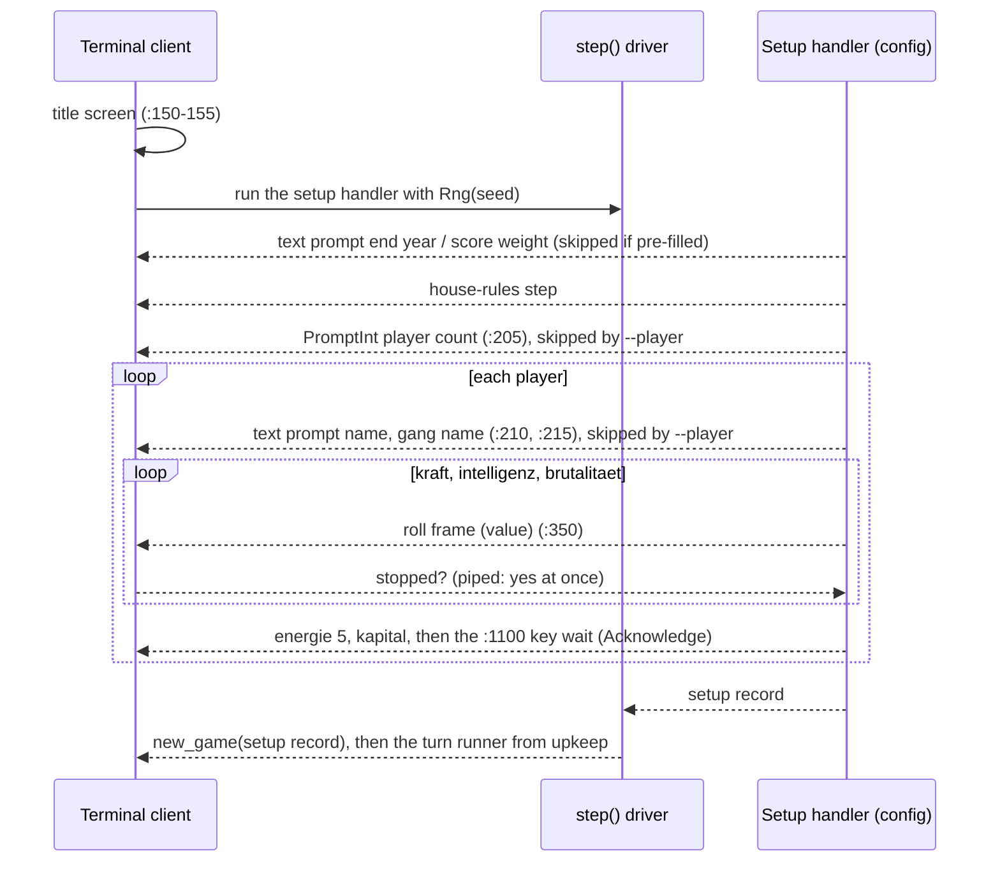

# Multiplayer Setup - Plan

## Goal Capsule

- **Objective:** starting the terminal client sets up a game the way the 1986 original does. It asks how many players (1–4), each player's name and gang name, and lets each player stop their own stat rolls on the eigenschaften screen. A user can start a hot-seat game without command-line flags.
- **Product authority:** `../research/` for game behavior. The BASIC (`mf-prg.bas`) wins over secondary research files. `docs/design/` governs architecture.
- **Execution profile:** `docs/AGENTS.md`: one orchestrator, one subagent per unit, serial in U-ID order. The orchestrator owns commits, the authoritative `make check` (through uv on 3.14 and 3.11) and the board: one GitHub issue per unit with `dep:` labels, created before U1.
- **Stop conditions:** a dossier or plan claim does not match the BASIC when re-read (the BASIC wins; fix and report); a red tree a unit cannot fix within its scope; any push (wait for the user).
- **Open blockers:** none.
- **Product Contract preservation:** changed: Summary, Success Criteria and two Key Decisions (the roll protocol, `:315`) — clarified to match the planning decisions below; no scope change. The deferred questions are resolved in the Key Technical Decisions.

---

## Product Contract

### Summary

The new-game setup ports `:200-316` as screens the player sees, and takes over the existing end-year, score-weight (`:170-176`) and house-rules steps: the player count (`:205`), then for each player their name (`:210`), gang name (`:215`) and the eigenschaften screen (`:300-316`), where each stat cycles until the player presses a key. Setup becomes a game handler over the interaction protocol, so the client only draws it. The same work audits every ledger block whose screen, prompt or key wait never reaches the player, fixes the small ones, and tightens the ledger so this kind of gap cannot pass as "ported" again.

### Problem Frame

Multiplayer already works once a game has more than one player: hot-seat rotation, the gang war, the prison brawl and the whose-turn line all run. But the only way to get a second player is the `--player NAME:GANG` command-line flag. A plain start drops the user into a solo game as "alcapone". The original asks for the player count, the names and the gang names, and lets each player stop their own stat rolls. None of those screens exist in the port: `new_game` rolls the stats silently.

The coverage ledger counts `:200-220` and `:300-316` as ported, because `setup.py` cites them for their logic. The ledger's citation rule cannot tell ported logic from a ported screen, so other blocks may have lost their user-facing parts the same way.

### Key Decisions

- **Faithful setup flow.** The screens follow the source's order, text and per-player interleaving: name, gang name, then eigenschaften, then the next player.
- **Stat rolls stop on real timing.** As on the C64 (`:350`/`:355`), the number re-rolls continuously and the value on screen at the keypress is kept. A live player's starting stats therefore no longer follow from the seed alone.
- **Piped input stops each roll on its first draw.** When input is not a terminal (tests, scripts, the end-to-end runs), each roll stops on its first frame without reading any input. Piped and seeded runs stay reproducible.
- **Setup is a handler, not client code.** The setup flow is a game-config handler that yields interactions like every other handler. Stopping a roll is a protocol interaction: the engine yields each draw as a roll frame, and the client answers whether a key stopped it. Game rules and RNG draws stay out of the client.
- **`--player` stays as a shortcut.** Given `--player` flags, the count and name prompts are skipped (as `--end-year` skips its prompt), but every player still sees their eigenschaften screen and stops their own rolls.
- **`:315`'s cash cheat is not ported.** `ifpeek(53247)=1thenka(i)=500000` gives 500,000 cash when a memory flag is set; the omission is recorded at the code, as `:1208`'s identical debug switch is.

### Requirements

**Setup flow**

- R1. A new game asks for the player count after the end year and score weight (`:205`). Only 1 to 4 is accepted; anything else asks again (`:206`).
- R2. For each player in turn, the setup asks the name (`:210`) and the gang name (`:215`), each 1–13 characters (`:291`), with the source's text.
- R3. After each player's names, that player's eigenschaften screen runs (`:300-316`): kraft, intelligenz and brutalitaet each roll until a keypress, then energie 5 and the starting kapital show, and the screen waits for a key.
- R4. The rolled values follow the source's formulas, including the `intelligence_or_30` house rule (`:311`), and the screen shows each roll as the source prints it.
- R5. Piped or otherwise non-terminal input stops every roll on its first draw.
- R6. `--player` flags skip the count and name prompts and keep the eigenschaften screens.
- R7. Setup runs through the interaction protocol. The terminal client renders it and holds no setup rules or RNG draws.
- R8. A game whose setup was interactive saves, loads and replays like any other game.

**Missing screens audit**

- R9. Every ledger block marked ported is checked for user-facing output or input the client never shows: a `PRINT`ed screen, an `INPUT` prompt, or a key wait.
- R10. Small missing screens are ported in this work. The rest get a follow-up issue each, and the ledger records them as deferred with that issue's number.
- R11. The ledger checker tightens so that a block with user-facing lines cannot pass as ported on a logic-only citation.

### Acceptance Examples

- AE1. **Covers R1, R2, R3.** Given a plain `python -m clients.terminal` start, when the user enters 2 players, two names and gang names, and stops each roll, then both players appear in the first turn's rotation with the stats they stopped on.
- AE2. **Covers R5.** Given a scripted start over piped stdin with a fixed seed, when the run is repeated, then both runs produce identical starting stats.
- AE3. **Covers R6.** Given `--player a:x --player b:y`, when the game starts, then no count or name prompt appears, and each player's eigenschaften screen does.
- AE4. **Covers R11.** Given a block whose only citation is in game logic while its `PRINT` never reaches the client, when the ledger check runs, then it fails, naming the block.

### Success Criteria

- A user starts the terminal client with no flags and sets up a 1–4 player hot-seat game entirely through the source's screens.
- Seeded piped runs, including the existing end-to-end runs, stay reproducible.
- After the audit, no player-facing ported block lacks a player-facing citation, unless it is excepted or deferred with an issue.

### Scope Boundaries

- Saving or quitting mid-setup is out of scope; saving starts at the first turn, as today.
- Network play stays out of scope. This is hot-seat setup only.
- Byte-exact RNG timing parity with the C64 is out of scope. The fidelity bar stays behavioral.
- The visible demo of the end-to-end runs (`2026-10-04-001-next-slice-brainstorm-basis.md`) is a separate effort.

### Dependencies / Assumptions

- The end year, score weight and house-rules steps already exist and keep their order before the player count.
- The existing name validation (`:291`, ported in U29) is reused for the new prompts.
- Assumption: animating a roll is possible in the terminal client's raw-key mode. Piped input falls back to stopping at once.

### Outstanding Questions

**Deferred to Implementation**

- Whether each of the three remaining audit blocks (U4) is a missing screen or only a missing citation; U5 settles it from the BASIC.
- The animation's frame pace in the terminal; it is presentation and needs no source parity.

### Sources / Research

- `../research/src/decompiled_basic/mf-prg.bas` `:200-316` (setup), `:350-360` (the stop-the-roll routine), `:290-292` (name input).
- `clients/terminal/session.py` `start_new_game`: the current setup, which skips the player prompts.
- `data/game_configs/mafia_1920s/setup.py` `new_game`: the silent stat roll (`_roll_stat`).
- `docs/coverage-ledger.yaml`, `tests/test_coverage_ledger.py`: the ledger and its citation rule.

---

## Planning Contract

### Key Technical Decisions

- KTD-1. **One setup handler owns the whole new-game setup.** A config handler runs everything after the title screen: the end year (`:170`), the score weight (`:175`), the house-rules step, the player count (`:205`), and per player the names (`:210`, `:215`) and the eigenschaften screen (`:300-316`). It returns a setup record; `new_game` builds the state from it. The client's own setup prompts (`_prompt_setup_value`, `_ask_house_rules` in `clients/terminal/session.py`) move into the handler, so the client only renders. CLI values (`--end-year`, `--score-weight`, `--player`) pre-fill answers and skip their prompts, as today. The end year and score weight are asked through the text prompt and parsed with today's rules (`_parse_setup_number`, moved into the config): `int(val())` for `:170`, `val()` for `:175`, finite only, asked again when out of range. The client finds the handler under a fixed handler key, as the turn runner finds its hooks, so another game config can supply its own setup without client changes.
- KTD-2. **Setup rolls from its own seeded RNG, the one `new_game` uses today.** The handler runs with `Rng(seed)` as its `ctx.rng`, not the session RNG. A run whose rolls all stop on the first frame draws exactly what `new_game` draws today, in the same order (kraft, intelligenz, brutalitaet, cash per player). Seeded piped runs therefore keep their current starting stats, and the session RNG stream that every seeded test depends on is unchanged.
- KTD-3. **A roll is a sequence of real frames.** For each stat the handler yields one roll-frame interaction per draw, carrying the drawn value; the client shows it and answers whether a key was pressed. The value on screen at the keypress is the value kept, so the cycling numbers are the real `:350` draws. On non-terminal input the client answers "stopped" to the first frame without reading any input (R5). Rules and draws stay in the config, and the protocol stays transport-clean. Replay needs nothing extra: the setup record, and so the saved state, holds the stats the player stopped on.
- KTD-4. **Names come through a generic text prompt.** The engine gains a text-prompt interaction; the handler checks the 1–13 character rule (`input_ranges.name_length`, `:291`) and asks again on a bad answer, as `:291` re-asks. The client holds no name rule.
- KTD-5. **The house-rules step stays after the score weight and before the player count.** The source has no such step, so any place is faithful; this keeps today's order.
- KTD-6. **The tightened ledger rule produces the audit list.** A block whose code (outside string literals and `rem`) holds `print`, `input`, `get` or `wait198` is player-facing. Each ledger block commits a `player_facing` flag, checked against the source when `../research/` is present, so the rule also runs in CI. A player-facing ported block needs a citation where the player-facing text lives (a theme string file or `clients/`), or an exception or deferral with a reason. Run on today's tree, the rule fails six blocks: `:205-220`, `:300-316`, `:350-360`, `:1125`, `:3015-3035` and `:3045-3105`. U2 and U3 close the first three; U5 settles the other three. Between U4 and U5 those three are `deferred` citing U5's board issue.
- KTD-7. **`:315`'s cash cheat is a code note.** `ifpeek(53247)=1thenka(i)=500000` sits inside the ported block `:300-316`, so it cannot be a ledger exception of its own. A comment at the cash roll in `setup.py` records the omission, following `handlers/turn.py`'s note on `:1208`'s `peek(53247)` debug switch.

### High-Level Technical Design

The new-game setup after U3:

### Risks

| Risk | Mitigation |
|---|---|
| Many test scripts start a new game over piped stdin and break on the new prompts. | They pass players, end year and score weight through `play()` arguments or the shared helpers in `tests/helpers.py`; the helpers gain the new answers once. Piped rolls stop at once, so no script needs timing. |
| Seeded tests shift because setup now draws differently. | KTD-2: piped setup draws exactly today's sequence from the same private `Rng(seed)`. A characterization test pins today's starting stats before U2 changes anything. |
| The raw-key frame loop misbehaves in a non-terminal. | The client detects a non-terminal the way `_read_key` does (`termios.tcgetattr` failing) but does not call its `readline` fallback for roll frames: it answers "stopped" with no read. A test drives the roll over piped stdin. |
| Tests relying on today's solo "alcapone" default break once `play(players=None)` prompts. | Hand-built scripts outside the helpers (e.g. `tests/test_early_win.py`, `tests/test_house_rules.py`, `tests/test_turn_menu.py`) are updated in U3, or pass `players=` explicitly. |
| The audit finds more gaps than one plan can fix. | KTD-6 lets the rest land as `deferred` with an issue each; only unexplained gaps fail. |

---

## Implementation Units

### Unit Index

| U-ID | Title | Depends on |
|---|---|---|
| U1 | Text prompt and roll-frame interactions | none |
| U2 | The setup handler | U1 |
| U3 | The client drives and renders setup | U2 |
| U4 | Ledger rule for player-facing lines | U3 |
| U5 | Port the small missing screens | U4 |
| U6 | Close-out | U5 |

### U1. Text prompt and roll-frame interactions

**Goal:** the protocol can ask for a line of text and can run a roll the player stops.

**Requirements:** R2, R3, R5, R7

**Dependencies:** none

**Files:** `engine/interactions.py`, `tests/test_driver.py`

**Approach:** KTD-3, KTD-4. Add a text-prompt interaction (key, params, player) whose answer is a string, and a roll-frame interaction (key, params including the value, player) whose answer is a bool, "stopped". Both are generic: no name rules, no stat names. `step()` passes them through like other prompts, and `run()`'s scripted callers can answer them. A cancelled text prompt follows the existing cancel rule for non-cancellable prompts.

**Patterns to follow:** `PromptInt` and `Confirm` in `engine/interactions.py`; their tests in `tests/test_driver.py`.

**Test scenarios:**
- A handler yielding a text prompt receives the scripted string.
- A handler yielding roll frames until the answer is true receives each answer in order.
- Both interactions carry the active player by default (full-game plan U6, commit fbc9a9e).
- A roll frame is not cancellable; end of input on a roll frame answers "stopped".
- No game vocabulary appears in the new types (`tests/test_engine_stat_agnostic.py` stays green).

**Verification:** driver tests pass; the engine still names no game stat.

### U2. The setup handler

**Goal:** the whole new-game setup runs as a config handler, faithfully.

**Requirements:** R1, R2, R3, R4, R5, R6, R8

**Dependencies:** U1

**Files:** `data/game_configs/mafia_1920s/setup.py`, `data/game_configs/mafia_1920s/handlers/new_game.py` (new), `data/game_configs/mafia_1920s/handlers/__init__.py`, `data/game_configs/mafia_1920s/themes/classic/strings/setup.yaml`, `docs/coverage-ledger.yaml`, `tests/test_setup_handler.py` (new), `tests/test_setup.py`, `tests/test_ports.py`

**Approach:** KTD-1, KTD-2, KTD-5, KTD-7. The handler asks, in source order, for whatever was not pre-filled: end year (`:170-172`), score weight (`:175-176`), house rules, player count (`:205-206`, 1 to 4, asked again otherwise), then per player the name and gang name (`:210`, `:215`, `:290-292`) and the eigenschaften screen: kraft, intelligenz and brutalitaet each roll frame by frame (`:310-312`, `:350-360`), then energie 5 (`:313`) and the starting kapital (`:315-316`), then `:1100`'s key wait as an Acknowledge. The roll formulas and the `intelligence_or_30` house rule stay as `new_game` applies them today. The screen shows the `:350` roll, not the stored `OR 30` value. Screen text is verbatim from the research corpus. `new_game` gains a path that builds the state from the setup record and keeps its current keyword path for existing callers. Record `:315`'s cheat as a code note (KTD-7). Register the handler under the fixed setup key (KTD-1).

**Execution note:** characterize first. Pin today's starting stats for a seeded game before changing `new_game`, so KTD-2's claim is proven, not assumed.

**Patterns to follow:** handler generators and `run_pure` tests (`tests/test_slw.py`); the house-rules step in `clients/terminal/session.py` `_ask_house_rules`; `_roll_stat` in `setup.py`.

**Test scenarios:**
- Covers AE2. A setup whose rolls all stop on the first frame produces the same players as today's `new_game` for the same seed.
- A player count of 0 or 5 is asked again; 1 to 4 is accepted.
- An empty name or one over 13 characters is asked again (`:291`).
- Stopping a roll on its third frame keeps the third draw, and the screen showed that value.
- With intelligence `OR 30` faithful, the screen shows the roll and the state stores the roll OR 30; under intent both are the roll.
- Pre-filled players skip the count and name prompts but still yield the roll frames (R6).
- The kapital screen shows the rolled cash and waits for a key.
- A port entry covers `:205-206` and the `:350` roll.

**Verification:** setup handler and port tests pass; the seeded characterization holds.

### U3. The client drives and renders setup

**Goal:** a plain start of the terminal client sets up a multiplayer game through the source's screens.

**Requirements:** R1, R2, R3, R5, R6, R7, R8

**Dependencies:** U2

**Files:** `clients/terminal/session.py`, `clients/terminal/__init__.py`, `clients/terminal/cli.py`, `data/game_configs/mafia_1920s/themes/classic/strings/client.yaml`, `tests/helpers.py`, `tests/test_terminal_client.py`, `tests/test_client_loop.py`, the other client test files whose new-game scripts change

**Approach:** KTD-1, KTD-3. `start_new_game` shows the title, then drives the setup handler through `step()` with the private `Rng(seed)`, and builds the game from the returned record. It renders the text prompt as a visible line read and the roll frame as a number redrawn in place. In a terminal the client enters raw mode once for the whole roll; for each frame it redraws the value and waits up to one frame delay for a key with `select`. A key read answers "stopped". Afterwards it restores the terminal and discards pending input, so the stop key does not also satisfy the `:1100` wait (as `:1100`'s `poke198,0` clears the buffer). On a non-terminal it answers "stopped" with no read. The client's own setup prompts go. `--player` flags pre-fill the players, and `play(players=...)` keeps working for tests. The test helpers' new-game answers change once in `tests/helpers.py`.

**Patterns to follow:** `_read_key`'s non-TTY fallback and the map prompt's raw-key reads in `clients/terminal/session.py`; `play()`-driven client tests in `tests/test_client_loop.py`.

**Test scenarios:**
- Covers AE1. A `main()` run over piped stdin answers 2 players with names and gang names, and both players appear in the first round's rotation.
- Covers AE2. Two piped runs with the same seed produce identical starting stats.
- Covers AE3. `--player a:x --player b:y` shows no count or name prompt, and shows both eigenschaften screens.
- A save taken in the first turn of an interactively set-up game loads and plays on (R8).
- A game whose rolls stopped on later frames (a test-driven roll source) saves and loads with those stats, and a replay of the save reaches the same starting stats (R8).
- Covers AE1. The stats each player stopped on are the ones the overview shows.
- The client source holds no name-length rule and no roll formula (a grep test).

**Verification:** client tests drive `play()`/`main()` only and pass; a manual terminal start shows the rolls cycling and stopping on a key.

### U4. Ledger rule for player-facing lines

**Goal:** a block cannot pass as ported when its screen or prompt never reaches the player.

**Requirements:** R9, R11

**Dependencies:** U3

**Files:** `tests/test_coverage_ledger.py`, `docs/coverage-ledger.yaml`

**Approach:** KTD-6. Add the committed `player_facing` flag to every block, checked against the source when the research tree is present. A player-facing ported block needs at least one citation from a theme string file or `clients/`, or an exception or deferral with a reason. After U2 and U3, the expected remaining failures are `:1125`, `:3015-3035` and `:3045-3105`: record them as `deferred` citing U5's board issue.

**Test scenarios:**
- Covers AE4. A synthetic ledger with a player-facing block cited only from game logic fails, naming the block.
- The same block passes once a theme string cites it.
- A deferred block without an issue number fails.
- A block whose only player-facing line is `wait198` counts as player-facing.
- Without `../research/`, only the flag-versus-source check skips; the player-facing citation rule runs from the committed flags.

**Verification:** the ledger test passes with every player-facing block cited, excepted or deferred.

### U5. Port the small missing screens

**Goal:** the audit's small gaps are closed.

**Requirements:** R10

**Dependencies:** U4

**Files:** the handlers, theme strings and client code each gap touches; their tests; `docs/coverage-ledger.yaml`

**Approach:** for each of `:1125`, `:3015-3035` and `:3045-3105`, read the BASIC and decide: a missing screen, prompt or key wait is ported with verbatim text and a test; a screen the client already shows only gains its citation. Move each block from `deferred` to ported. Any gap too large for this unit gets its own follow-up issue and stays `deferred` with that number.

**Test scenarios:**
- Each ported screen has a test that fails without it.
- The ledger test still passes after each block moves to ported.

**Verification:** the ledger lists no small gap as deferred.

### U6. Close-out

**Goal:** the plan state is unambiguous for the next session.

**Requirements:** all

**Dependencies:** U5

**Files:** `CLAUDE.md`, `README.md`, a new `docs/plans/<date>-NNN-next-slice-brainstorm-basis.md`

**Approach:** per `docs/AGENTS.md` closing-out: add this plan to CLAUDE.md's landed ledger and drop a brainstorm-basis pointer that carries forward the earlier basis's open items plus any deferred audit issues. Update `README.md` to describe the made changes: what is playable now (the full game, from the full-game plan, and the new multiplayer setup), how to start a 1-4 player game interactively or with `--player`, and the other client options. Check every claim in the README against the code.

**Test expectation:** none -- documentation only.

**Verification:** `make check` green on 3.11 and 3.14.

---

## Verification Contract

| Gate | Check | When |
|---|---|---|
| Green tree | `make check` (pytest, ruff, pyright), through uv on 3.14 and 3.11 | Before every dispatch and every commit |
| Fidelity | Every ported line re-read with `mafia-oracle` `conclude`; citation checker green | U2, U5 |
| Break-to-prove | Each new test fails with its feature broken (scratch-copy restore, probe runs with a timeout) | Every feature unit |
| Reproducibility | Seeded piped runs keep today's starting stats | U2, U3 |
| Client surface | Client tests drive `play()`/`main()` only | U3, U5 |
| Ledger | `tests/test_coverage_ledger.py` green, in CI too | U4 onward |
| Board | Every unit has its own issue before dispatch | Before each dispatch |

---

## Definition of Done

- U1-U6 each landed as a green commit on `feat/multiplayer-setup`, and each unit's issue is closed.
- R1-R11 hold, and AE1-AE4 each have a named test.
- A plain terminal start sets up a 1-4 player game through the source's screens.
- No player-facing ported block lacks a player-facing citation, unless it is excepted or deferred with an issue.
- `README.md` describes the playable game and the multiplayer setup.
- CLAUDE.md lists this plan as landed, and a brainstorm-basis is the newest file in `docs/plans/`.
- Nothing is pushed until the user says so.
