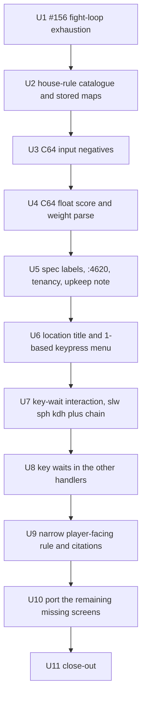
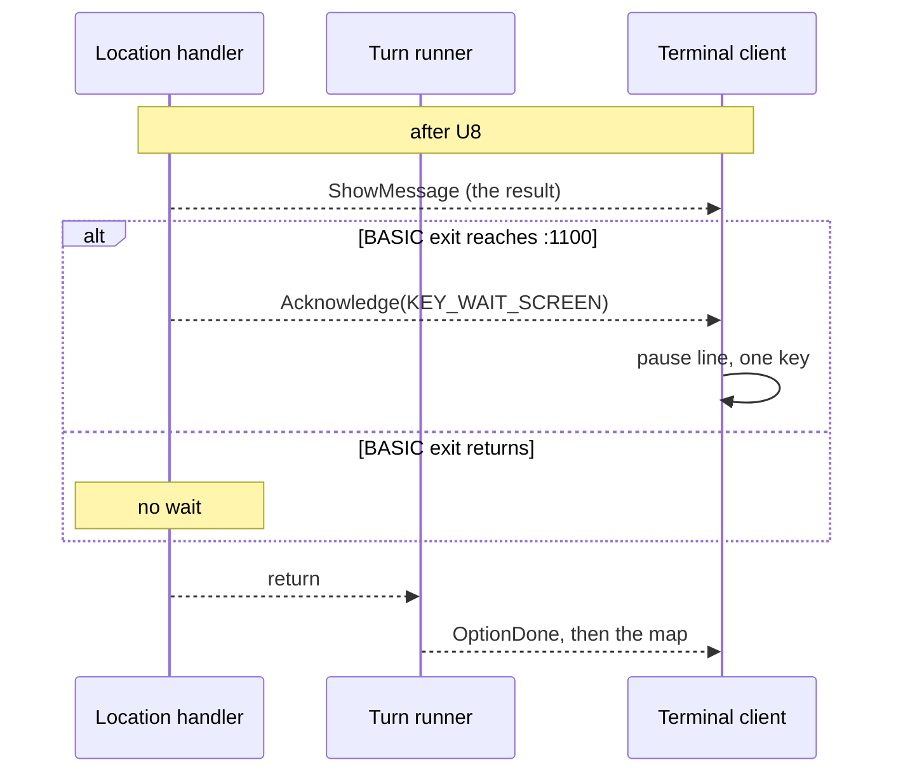

# Open Issues Fidelity - Plan

## Goal Capsule

- **Objective:** close the six open issues #146, #147, #155, #156, #159 and #160 fully, so the port plays, paces and scores as the 1986 original does wherever these issues found it diverging.
- **Product authority:** `../research/` for game behavior; the BASIC (`mf-prg.bas`) wins over secondary research files, and VICE (headless `x64sc`) is the authority for C64 ROM behavior (`INPUT`, float arithmetic, `val`). `docs/design/` governs architecture.
- **Execution profile:** `docs/AGENTS.md`: one orchestrator, one subagent per unit, serial in the order of the Unit Index. The orchestrator owns commits, the authoritative `make check` (through uv on 3.14 and 3.11) and the board: one GitHub issue per unit with `dep:` labels, created before U1. Work lands on `fix/open-issues-fidelity`, branched from `main` after PR #161 merges (or from `feat/multiplayer-setup` if it has not).
- **Stop conditions:** a plan or issue claim does not match the BASIC or VICE when re-read (the source wins; fix and report); a red tree a unit cannot fix within its scope; any push (wait for the user).
- **Out of this slice:** the two review reports #157 and #158.
- **Open blockers:** none.
- **Product Contract preservation:** changed: Key Decisions and Dependencies/Assumptions name the umbrella rule's sites (pub buy, pub sell, the chief bribe) and fold the existing `chief_bribe_negative_months` switch into it; R2 and R13 say so; R13 names the `:15120` → `:15200` loan-business chain and counts `gosub1100` and inline `wait198` as key waits; R10 ports only the C64 parser's precision for a clean-number weight; Scope Boundaries record the location splash's Enter. Clarifications from planning-time source checks, the document review and user decisions; no other scope change.

---

## Product Contract

### Summary

This slice fixes the combat-recording bug (#156) and brings the port's remaining divergences in line with the source. Landed handlers take C64 input faithfully (#146), the score can match the C64 to the cent (#147), and the location screen matches `:3025-3040` (#159). Key waits after location results follow each BASIC path (#160). The ledger's player-facing rule tightens to narrow citations, and every missing screen that tightening finds is ported (#155).

### Problem Frame

The full game and the multiplayer setup have landed, and the open board now holds what those plans found but left aside: correctness and fidelity gaps that a player meets every session.

A scripted fight whose input runs out returns as a finished recording with no activation in it (#156), so a test can pass on a fight that never happened. Some prompts refuse negative numbers that the C64 accepts and trades on. The weapon shop prints numbers where the source prints labels. The score drifts a cent from the C64 on some sequences (#146, #147).

On screen, the location menu numbers its options from 0, needs Enter, and has no title (#159). The key wait after a location result is one generic client rule, not the source's per-path behavior (#160).

The coverage ledger counts a screen as shown when any theme comment's range covers it. Narrowing that rule fails 91 blocks today, so further missing screens may hide under a file-header range (#155).

### Key Decisions

- **One umbrella "C64 input" house rule for the negative-input holes.** Faithful lets a negative through where the C64 does; intent refuses it. A check of every numeric `INPUT` in the BASIC finds three such holes: the pub's buy count (`:12027`), its sell count (`:12060`) and the police chief's bribe months (`:21011`). The existing `chief_bribe_negative_months` switch folds into the umbrella, so one switch covers every negative hole.
- **The umbrella covers negatives only.** Fractional answers, empty answers and `val()` prefix parsing (`"2a"` reads 2) stay recorded departures for a later slice, at every prompt. The score weight takes only the C64 parser's precision under the float rule (R10); its text must still be a clean number. That includes the casino's fractional game choice (`:16015`: `2.5` passes the 1–3 check and changes odds and payout), and `chief_bribe_empty_answer` stays its own switch.
- **C64 float arithmetic sits behind a house rule.** Faithful computes the score as the C64's float add and multiply do; intent computes it in exact decimal. Under either setting a score can differ from today's doubles.
- **Location results wait per source path; upkeep stays merged.** Each location exit waits for a key where the BASIC has `:1100` and nowhere else. The turn-start upkeep messages keep one combined screen and one key, recorded as a departure; the source gives each message its own screen and key.
- **The location menu takes a single keypress.** As `:3040`'s `getx$` does, a number key picks the option without Enter. Piped input keeps one key per line.
- **Every gap the narrowed ledger rule finds is ported in this slice.** None is deferred to a later issue. The slice's size therefore depends on what the audit finds.
- **Saves from before this slice are refused.** Their house-rules map no longer matches the catalogue, and loading reports the mismatch clearly, as it does today. No migration is offered.

### Requirements

**Combat recording (#156)**

- R1. A fight whose scripted input runs out before the fight ends surfaces the exhaustion to its caller instead of returning a result or a recording.

**C64 input (#146)**

- R2. A new "C64 input" house rule, faithful by default, governs the prompts where the C64 accepts a negative number the port refuses: the pub's buy and sell counts and the police chief's bribe months, which leaves the catalogue's `chief_bribe_negative_months` switch.
- R3. Each such prompt is confirmed against the BASIC and a VICE run of C64 `INPUT` before it is changed; under faithful its negative answer has the source's effect.
- R4. Under intent, those prompts refuse a negative answer and ask again.

**Handler fidelity (#146)**

- R5. The weapon shop's spec sheet shows the accuracy and effect labels the source prints (`:13515-13520`), not bucket numbers.
- R6. The rent-seizure message shows its amount where `:4620`'s `{left}` places it.
- R7. The `tenancy` item of #146 is resolved: either confirmed already fixed and closed with that evidence, or fixed.

**Score arithmetic (#147)**

- R8. A new house rule, faithful by default, chooses how the score accumulates at `:1160`: C64 float arithmetic under faithful, exact decimal under intent.
- R9. Under faithful, the score sums match the existing VICE capture to the cent in every captured series.
- R10. Under faithful, a typed score weight that is a clean number takes the exact value the C64's number parser gives it; text that is not a clean number is asked again, as today.

**Location screen (#159)**

- R11. A location's screen shows its title from the location's data, as `:3025` prints it.
- R12. Options are numbered from 1 in the source's form (`:3030`), and a pick is one keypress of 1 to the option count (`:3040`).

**Key waits (#160)**

- R13. After a location option, the game waits for a key exactly where that option's BASIC path reaches a key wait (`:1100`, `gosub1100`, or an inline `wait198` such as the spec sheet's `:13525`) and does not wait where the path returns without one; a path that continues to another screen continues there, as buying a loan business continues to its capital screen (`:15120` → `:15200`).
- R14. The turn-start upkeep keeps its one combined screen and one key, recorded as a departure with the source lines it merges.

**Ledger (#155)**

- R15. A ported player-facing block passes the ledger only on a narrow citation where its text is shown, held to the same width limit code citations meet.
- R16. Every block the narrowed rule fails is resolved in this slice: its shown text gains its own citation, or its missing screen is ported.

**Saves**

- R17. Loading a save made before this slice's house rules existed is refused with the existing house-rules mismatch message.

### Acceptance Examples

- AE1. **Covers R2, R3.** Given the C64 input rule at faithful, when the player enters a negative barrel count at the pub, then the trade runs as the source runs it.
- AE2. **Covers R4.** Given the C64 input rule at intent, when the player enters a negative barrel count, then the prompt asks again.
- AE3. **Covers R3.** Given a prompt whose BASIC already discards a non-positive answer (the motel's months, `:10030` `ifx=0orx<0 thennm=1:return`), then the umbrella rule does not change it.
- AE4. **Covers R8, R9.** Given the float rule at faithful, when the captured `:1160` series are replayed, then every sum matches the C64 to the cent; at intent, every sum is the exact decimal.
- AE5. **Covers R12.** Given a location menu with three options, when the player presses `2`, then the second option runs without Enter; when the player presses `0` or `4`, then nothing happens.
- AE6. **Covers R13.** Given the casino, when the player plays a hand, then the result waits for a key (`:16035`/`:16040`); when the player chooses nothing (`:16015` `ifx=0thenreturn`), then the map returns with no key wait.
- AE7. **Covers R17.** Given a save written before this slice, when it is loaded, then the load is refused, naming the house-rules mismatch.

### Success Criteria

- Each of #146, #147, #155, #156, #159 and #160 is closed by a commit that cites its evidence.
- Every ported player-facing block in the ledger has a narrow citation where it is shown, with no deferral left.
- Seeded scripted runs, including the two end-to-end runs, still pass after their scripts gain the new key waits and keypress picks.

### Scope Boundaries

- C64 `INPUT`'s fractional answers, empty answers and `val()` prefix parsing stay recorded departures, the casino's fractional game choice and the score weight's text included (R10 ports only the parser's precision).
- The location art splash (`:3007`'s picture, drawn as text) and its Enter stay before the `:3025` menu, as a recorded port addition.
- Upkeep's per-message screens stay merged (R14).
- The review reports #157 and #158 are out of scope.
- The visible demo of the end-to-end runs, carried in `docs/plans/2026-10-04-003-next-slice-brainstorm-basis.md`, is a separate effort.
- The multiplayer setup leftovers are out of scope: no whose-turn line on the eigenschaften screens, and a fifth `--player` refused only after the title.
- No save migration.

### Dependencies / Assumptions

- The C64 input and float behavior is checked in headless VICE, as earlier units did; the research tree and VICE are available locally. CI never runs VICE: captures are committed fixtures.
- Verified against the BASIC at planning time: the loan shark refuses negatives (`:15021`, `:15055`), the motel discards them (`:10030`), the casino re-asks or returns (`:16016`, `:16020`), the weapon shop re-asks (`:13021`), the counterfeiter returns (`:22105`). The gangster picker (`:1145`) lets a negative reach an array index, a C64 error rather than an exploit, and stays a recorded departure.
- #146's `tenancy` item appears already fixed: a vacant room is stored as -1 (`state_schema.yaml`), and no location shell reads the variable.
- Assumption: "exact decimal" under the float rule's intent means decimal arithmetic with no binary rounding, not today's doubles.

### Sources / Research

- Issues #146, #147, #155, #156, #159, #160 on `jdamboeck/mafia-engine`.
- `docs/plans/2026-10-04-003-next-slice-brainstorm-basis.md`: the carried-forward open items.
- `docs/solutions/developer-experience/tests-that-cannot-fail.md`, `docs/solutions/developer-experience/driving-terminal-play-loop-over-piped-stdin.md`, `docs/solutions/architecture-patterns/basic-relational-boolean-is-minus-one-when-porting.md`.

---

## Planning Contract

### Key Technical Decisions

- KTD-1. **#156: the input source is called outside the completion catch.** `_drive_fight` (`engine/fight_loop.py`) catches `StopIteration` only around advancing the fight generator, as `run()` in `engine/interactions.py` already separates the input source's exhaustion. An exhausted input source's `StopIteration` reaches the caller unchanged.
- KTD-2. **House rules stay config data; the engine reads none.** The two new switches are catalogue entries in `content/house_rules.yaml` with theme lines under `house_rules.<id>`. Handlers and the score effect branch on `house_rules.intent(state, ID)` as `handlers/police.py` does. The engine gains only neutral helpers (C64 float add/multiply, C64 `val`), never a switch id.
- KTD-3. **The umbrella replaces `chief_bribe_negative_months`.** Its catalogue entry, constant and theme line go; `handlers/pol.py` reads the umbrella instead. The catalogue header's "deliberate departures" notes are rewritten so negatives, fractions and empty answers each have exactly one source (`docs/solutions/` "two sources for one fact").
- KTD-4. **Every stored switch map grows in one unit.** `check_stored_map` requires exactly the catalogue's switches, so U2 updates every committed map at once: `content/scenarios/*.yaml`, the literal maps in `tests/test_setup_handler.py`, `tests/test_house_rules.py`, `tests/test_fightlab.py` and the location test modules that build states with a full map (`test_sgl`, `test_bhf`, `test_aut`, `test_sub`, `test_ban`, `test_police_capture`, `test_pol`), and any recording fixture. Old saves then fail the existing check (R17), with no new code path.
- KTD-5. **C64 float is an engine helper on top of `engine/c64_numbers.py`.** FADD and FMULT (40-bit mantissa: align, add or multiply, truncate below the window, then store rounding) join `c64_float`/`c64_divide`, held to the existing capture `tests/fixtures/c64_float/vice_capture.txt` (`S<i>-<n>` rows of `:1160` sums). `tests/test_c64_float.py`'s `FIRST_DIVERGENCE` pin flips to exact agreement for the faithful path and stays as the record of what doubles do.
- KTD-6. **The score effect chooses the arithmetic from the switch.** `ScoreAndRank.apply` (`data/game_configs/mafia_1920s/effects.py`) computes `gf + x*x8`, then the `:1160-1161` clamps, with the C64 helper under faithful and `Decimal` under intent. Intent works from the decimal form of the stored score and weight, which round-trips because both are short decimals; the stored score stays a number, so the save schema is unchanged.
- KTD-7. **The typed score weight is parsed after the house-rules step.** Setup asks the weight before the house rules, so the setup record keeps the weight's typed text and the parse happens when the state is built: today's clean-number check first, then the C64 decimal parser's value under faithful and today's `float` under intent (precision only; no prefix parsing). `--score-weight` gives its text the same path, and the keyword `new_game(score_weight=<float>)` path turns the float into its shortest text form (`repr`) and feeds the same parse, so its 83 callers keep passing floats and reach the same weight. A fixture captures VICE's parse of the weights the setup accepts.
- KTD-8. **Location titles are theme strings.** Each location gains `locations.<key>.title` verbatim from `research-data/pass-2/location-dialogue.yaml`, cited at `:3025`. The client draws it where it draws the header today; the art splash and its Enter stay as they are (a port addition before the menu).
- KTD-9. **The menu's pick goes through `_read_key`.** One keypress on a terminal; one key per line on piped input; The menu quits only on `q`, which `_read_key` also returns at EOF on a pipe; it does not use `_is_quit`, so a blank line is ignored. Only the digits 1..n act (`:3040`); anything else, blank included, is ignored. The `LocationMenu` protocol answer stays a 0-based index, so engine-level tests do not change.
- KTD-10. **A key wait is an explicit handler interaction.** A handler yields `Acknowledge` under a reserved `KEY_WAIT_SCREEN` key, defined beside the turn runner's screen keys, at each exit where the BASIC reaches `:1100` (or `gosub1100`, or `wait198`). The client draws only the pause line under what is on screen, as it does for the eigenschaften wait. The generic rule in `TerminalSession.render` is deleted once every handler yields its own waits.
- KTD-11. **The narrowed ledger rule reuses `check_narrow`'s widths.** `check_player_facing` filters player-facing citations to those spanning at most `NARROW` blocks. About a third of the 91 failing blocks are theme strings commented `# 13100` (waf, aut, sgl, ban, ble, pol), which the citation parser does not read; they become `# :13100` only where the string is that line's text. Most of the rest (about 55, in pub, kdh, sph and slw) are cited only by section-range comments and need a new narrow citation on each string. What remains is missing screens for U10.

### High-Level Technical Design

The units run serially in Unit Index order; each unit's commit lands green before the next starts, and the ledger runs last because it measures every screen the earlier units add.

The key wait after a location result, before (one generic client rule) and after (per BASIC exit):

### Assumptions

- PR #161 merges before this branch starts; if it has not, the branch starts from `feat/multiplayer-setup`.
- The untracked local `recordings/kdh_ambush.json` is stale already and is not a committed fixture; KTD-4 regenerates only committed recordings.

### Risks

| Risk | Mitigation |
|---|---|
| Key waits and keypress picks shift every scripted client test. | Change `tests/helpers.py` and the e2e `ScreenPlayer` once per unit; about 20 `test_client_loop.py` picks shift by one in U6. Engine-level `LocationMenu` answers are 0-based protocol and stay. |
| The per-exit audit misses a path and a test still passes on the generic rule. | U8 deletes the generic rule, so a missed wait shows as a missing pause in a test that asserts the pause line. |
| The C64 FMULT/FADD port agrees with the capture by accident. | The capture's divergent series (3, 6, 9) are the proof: the faithful path must match exactly where doubles do not. |
| The ledger audit turns out larger than one unit. | U10 is scoped by the audit's list; each gap gets its own commit inside the unit, and the orchestrator may split U10 by location if it grows. |
| Removing `chief_bribe_negative_months` breaks references. | U2 greps the id across code, theme, tests and docs, and the catalogue's own completeness tests fail on any leftover. |

---

## Implementation Units

### Unit Index

| U-ID | Title | Files touched | Depends on |
|---|---|---|---|
| U1 | Fight-loop input exhaustion (#156) | `engine/fight_loop.py`, `tests/test_recording.py` | none |
| U2 | House-rule catalogue and stored maps | `content/house_rules.yaml`, `themes/classic/strings/house_rules.yaml`, `handlers/pol.py`, `content/scenarios/`, catalogue tests | U1 |
| U3 | C64 input negatives at the pub and the chief | `handlers/pub.py`, `handlers/pol.py`, `tests/test_pub*.py`, `tests/test_pol.py` | U2 |
| U4 | C64 float score and weight parse (#147) | `engine/c64_numbers.py`, `effects.py`, `setup.py`, `handlers/new_game.py`, `tests/test_c64_float.py` | U2 |
| U5 | Spec labels, `:4620`, tenancy, upkeep note | `handlers/waf.py`, `strings/waf.yaml`, `strings/upkeep.yaml` | U4 |
| U6 | Location title and keypress menu (#159) | `clients/terminal/session.py`, location theme strings, client tests | U5 |
| U7 | Key-wait interaction and the first handlers | `engine/turns.py`, `clients/terminal/session.py`, `handlers/slw.py`, `sph.py`, `kdh.py` | U6 |
| U8 | Key waits in the other handlers (#160) | the remaining location handlers, client tests, e2e players | U7 |
| U9 | Narrow player-facing rule (#155) | `tests/test_coverage_ledger.py`, theme strings, `docs/coverage-ledger.yaml` | U8 |
| U10 | Port the remaining missing screens | per gap | U9 |
| U11 | Close-out | `CLAUDE.md`, `README.md`, a new brainstorm basis | U10 |

Paths under `content/`, `themes/` and `handlers/` are relative to `data/game_configs/mafia_1920s/`.

### U1. Fight-loop input exhaustion (#156)

**Goal:** an exhausted scripted combat input can no longer pass as a finished fight.

**Requirements:** R1

**Dependencies:** none

**Files:** `engine/fight_loop.py`, `tests/test_recording.py` (or the fight-loop test module that owns `_drive_fight`)

**Approach:** KTD-1. Move the `input_source(screen)` call out of the `try` whose `except StopIteration` reads the fight's return value.

**Execution note:** reproduce first. Turn the issue's reproduction (`record_fight` on the kdh ambush scenario with an empty answer iterator) into a failing test before touching the loop.

**Patterns to follow:** `run()` in `engine/interactions.py`, which separates the input source's `StopIteration` from the handler's.

**Test scenarios:**
- An empty scripted answer iterator raises out of `record_fight`; no result and no recording are returned.
- An answer list that runs dry mid-fight raises too, after at least one activation.
- A fight scripted to completion still returns its winner and a recording that replays without divergence.

**Verification:** the regression test fails with the fix removed and passes with it.

### U2. House-rule catalogue and stored maps

**Goal:** the catalogue holds the two new switches and no longer holds `chief_bribe_negative_months`, and every committed switch map matches it.

**Requirements:** R2 (catalogue part), R8 (catalogue part), R17

**Dependencies:** U1

**Files:** `data/game_configs/mafia_1920s/content/house_rules.yaml`, `data/game_configs/mafia_1920s/themes/classic/strings/house_rules.yaml`, `data/game_configs/mafia_1920s/handlers/pol.py` (constant rename only), `data/game_configs/mafia_1920s/content/scenarios/*.yaml`, `tests/test_house_rules.py`, `tests/test_setup_handler.py`, `tests/test_fightlab.py`, `tests/test_persistence.py`, `tests/test_sgl.py`, `tests/test_bhf.py`, `tests/test_aut.py`, `tests/test_sub.py`, `tests/test_ban.py`, `tests/test_police_capture.py`, `tests/test_pol.py`, and any other test with a literal switch map (grep the old id)

**Approach:** KTD-2, KTD-3, KTD-4. Add the umbrella entry (citing `:12027`, `:12060`, `:21011` with quotes) and the float entry (citing `:1160`), both switchable, faithful by default. Remove `chief_bribe_negative_months` and point `pol.py` at the umbrella's id, keeping its current behavior per setting. Rewrite the header's departure notes. Grow every committed map.

**Patterns to follow:** the `chief_bribe_*` entries and their tests; `check_stored_map` in `data/game_configs/mafia_1920s/house_rules.py`.

**Test scenarios:**
- The catalogue offers the two new switches and not `chief_bribe_negative_months`; each quote matches its cited line (`tests/test_citations.py`).
- A new game's map holds every switch at faithful.
- Covers AE7. A save whose map lacks the new switches is refused with the house-rules mismatch reason (built from today's map shape).
- The chief bribe's existing negative-months tests pass under the umbrella's id, faithful and intent.
- Every scenario file loads.

**Verification:** catalogue, setup and fight-lab tests pass; a grep finds no `chief_bribe_negative_months` outside the git history.

### U3. C64 input negatives at the pub and the chief

**Goal:** under faithful, the pub's buy and sell counts take a negative answer with the source's effect; under intent, they refuse it.

**Requirements:** R2, R3, R4

**Dependencies:** U2

**Files:** `data/game_configs/mafia_1920s/handlers/pub.py`, `tests/test_pub_recruit.py` or the pub trade test module, `tests/test_ports.py`, `tests/fixtures/c64_input/` (new VICE capture)

**Approach:** KTD-2. Capture in VICE what `INPUT y` stores for `-3`, `-0`, `- 3` and `-3.5` (the driver's `_coerce_int` already reads `-3`). Under faithful, the buy prompt's minimum drops below zero and the trade runs `:12030-12035` as written (the cost check `ka<y*p` passes, barrels fall, cash rises, the score still gains 2); the sell prompt runs `:12075`. Barrels may go negative as in the source. The chief bribe already ported its negative path in an earlier unit; U3 only confirms it under the umbrella.

**Execution note:** VICE first; port second.

**Patterns to follow:** the chief bribe's faithful/intent branches in `handlers/pol.py`; the `tests/fixtures/c64_float/` capture layout.

**Test scenarios:**
- Covers AE1. Faithful: buying -5 barrels at price p adds 5p cash, removes 5 barrels and adds the score's +2.
- Faithful: selling -5 barrels takes cash and adds barrels as `:12075` does.
- Covers AE2. Intent: -5 at either prompt asks again; 0 still returns.
- Covers AE3. The motel's months and the loan shark's amounts behave the same under both settings.
- A port entry pins `:12030-12035` with a negative `y`.

**Verification:** pub and port tests pass; each new test is seen red with the switch ignored.

### U4. C64 float score and weight parse (#147)

**Goal:** under faithful, the score matches the C64 to the cent; under intent, it is exact decimal.

**Requirements:** R8, R9, R10

**Dependencies:** U2

**Files:** `engine/c64_numbers.py`, `tests/test_c64_float.py`, `tests/fixtures/c64_float/` (a new weight-parse capture), `data/game_configs/mafia_1920s/effects.py`, `data/game_configs/mafia_1920s/setup.py`, `data/game_configs/mafia_1920s/handlers/new_game.py`, `clients/terminal/cli.py`, `tests/test_setup_handler.py`, `tests/test_house_rules.py`

**Approach:** KTD-5, KTD-6, KTD-7. Port FADD and FMULT over the existing 5-byte representation and the C64 decimal parser's value for a clean-number weight. Thread the switch through the score effect and the setup record. The `:1013` truncation (`handlers/turn.py`) already follows the C64; check it composes with both arithmetics.

**Execution note:** characterize first. Pin the capture's `S<i>-<n>` rows as expected values before writing FADD/FMULT, so the port is proven against VICE, not against itself.

**Patterns to follow:** `c64_float`, `c64_divide` and their tests; `INTELLIGENCE_OR_30` handling in `setup.py`.

**Test scenarios:**
- Covers AE4. Faithful: every captured `:1160` series matches the capture to the last byte, including series 3, 6 and 9 where doubles diverge.
- Intent: the same series equal the exact decimal sums.
- The 100 cap and 0 floor apply after the sum under both settings.
- Faithful: typed weights `.01`, `0.1`, `1.5`, `2` take the captured C64 value; intent takes `float`; `1.5x` is asked again under both.
- A keyword `new_game(score_weight=0.1)` reaches the same weight as typing `0.1`.
- `--score-weight` and the setup prompt reach the same weight for the same text.
- A seeded game's score after a scripted sequence differs between the settings exactly where the capture says it should.

**Verification:** `tests/test_c64_float.py` passes with the faithful series exact; the score effect's tests pass under both settings.

### U5. Spec labels, `:4620`, tenancy, upkeep note

**Goal:** the remaining handler divergences of #146 are closed and the upkeep departure is recorded.

**Requirements:** R5, R6, R7, R14

**Dependencies:** U4

**Files:** `data/game_configs/mafia_1920s/handlers/waf.py`, `data/game_configs/mafia_1920s/themes/classic/strings/waf.yaml`, `data/game_configs/mafia_1920s/themes/classic/strings/upkeep.yaml`, `data/game_configs/mafia_1920s/handlers/upkeep.py` (docstring), `tests/test_waf_buy.py`, `tests/test_upkeep.py`

**Approach:** the spec sheet passes the label (composed key or text, as `sub.py`'s loot key does) instead of the bucket; the labels already exist unused in `waf.yaml` (`accuracy_labels`, `effect_labels`, from `:50500-50505`). Check `ts$(0)` (an empty string when `int(ts/2)` is 0) against the weapon table. Split the seizure string at `:4615`/`:4620` so the amount lands where `{left}` puts it. Confirm the tenancy item with a test that a vacant room reads -1, then close the item. Record the merged upkeep screen in `upkeep.py`'s docstring with `:4200`, `:4309`, `:4420`, `:4620`, `:31010`.

**Test scenarios:**
- Each weapon's spec sheet shows the `ts$`/`tg$` label the source indexes, including any index 0.
- The seizure message renders its amount at the start of its line, as `{down}{left}` places it.
- A vacant room reads -1 and player 0's room reads 0.

**Verification:** waf and upkeep tests pass; the citation checker holds the new citations.

### U6. Location title and keypress menu (#159)

**Goal:** a location screen shows its title, numbers options from 1, and picks on one keypress.

**Requirements:** R11, R12

**Dependencies:** U5

**Files:** `clients/terminal/session.py`, `clients/terminal/renderers.py`, the twelve location theme string files under `data/game_configs/mafia_1920s/themes/classic/strings/`, `docs/coverage-ledger.yaml` (`:3015-3035` deferral), `tests/test_client_loop.py`, `tests/test_terminal_integration.py`, `tests/test_terminal_client.py`, `tests/test_full_game_e2e.py`, `tests/helpers.py`

**Approach:** KTD-8, KTD-9. Draw the title, number options 1..n, read with `_read_key`. Drop the ledger's `:3015-3035` deferral and cite the block where the client draws the screen. Shift every client-level scripted pick by one.

**Patterns to follow:** the map prompt's `_read_key` use; the U3 client tests of the multiplayer plan.

**Test scenarios:**
- The slw screen shows "SCHLUPFWINKEL (MOTEL, MIETSKASERNE)" and options "1 ...", "2 ...", "3 ..." in the source's form.
- Covers AE5. `2` runs the second option; `0`, `4`, a letter other than `q` and a blank are ignored and the menu waits.
- EOF at the menu ends the session (no spin), under a deadline.
- The e2e runs still reach their endings.

**Verification:** client tests drive `play()`/`main()` only and pass; a manual terminal run picks an option without Enter.

### U7. Key-wait interaction and the first handlers

**Goal:** handlers can yield the `:1100` wait, and slw, sph and kdh yield it exactly where their BASIC exits do.

**Requirements:** R13

**Dependencies:** U6

**Files:** `engine/turns.py` (the `KEY_WAIT_SCREEN` key), `clients/terminal/session.py`, `tests/helpers.py`, `data/game_configs/mafia_1920s/handlers/slw.py`, `data/game_configs/mafia_1920s/handlers/sph.py`, `data/game_configs/mafia_1920s/handlers/kdh.py`, `tests/test_slw.py`, `tests/test_sph.py`, `tests/test_kdh*.py`, `tests/test_client_loop.py`

**Approach:** KTD-10. Add the key; the client draws the pause line without clearing. For slw, sph and kdh, map each exit to its BASIC line (the exit list built per the execution note, read from the BASIC) and yield the wait where it reaches `:1100`. Port the purchase chain: after the purchase's wait (`:15120` `gosub1100`), the handler continues into the capital screen (`:15125` `goto15200`). While other handlers still rely on it, the generic client rule stays, skipping an option whose handler already waited. `tests/helpers.py` `scripted` records a key-wait `Acknowledge` as delivered without spending a scripted answer, as it does a `ShowMessage` and as the driver's `_DISPLAY_ONLY` does, so existing handler scripts stay valid; per-exit tests assert on `seen`.

**Execution note:** list each handler's exits with their BASIC lines before editing; the list becomes the test table.

**Test scenarios:**
- Covers AE6. A casino hand ends in the wait; choosing nothing returns without one; a wager of 0 returns without one.
- slw: no room, not resident, too poor and success each end in the wait; months 0 returns without one.
- kdh: each `goto1100` exit waits; each `return` exit does not; buying a business waits once, then shows the capital screen.
- Through `play()`: a sph hand's result stays on screen until a key, and exactly one key is consumed.

**Verification:** handler tests assert the wait per exit; client tests pass.

### U8. Key waits in the other handlers (#160)

**Goal:** every location handler waits exactly where its BASIC does, and the generic client rule is gone.

**Requirements:** R13

**Dependencies:** U7

**Files:** `data/game_configs/mafia_1920s/handlers/` (pub, waf, aut, sgl, sub, bhf, ban, pol, ble, police, jobs, and any handler run as a location option), their tests, `clients/terminal/session.py`, `tests/helpers.py`, `tests/test_full_game_e2e.py`, `tests/test_slice_integration.py`, `tests/test_client_loop.py`

**Approach:** KTD-10. Repeat U7's exit audit for each remaining handler, then delete the generic rule and its tests, replacing them with the per-exit ones. Update the e2e `ScreenPlayer` to answer the explicit wait.

**Test scenarios:**
- One exit-table test per handler: every `:1100` exit yields the wait, every return exit does not.
- With the generic rule deleted, the U5 `:1125` refusal and `:10045` success tests of the multiplayer plan still see their pause.
- The e2e runs and the slice smoke runs reach their endings.

**Verification:** a grep finds no generic wait in the client; all client tests pass.

### U9. Narrow player-facing rule (#155)

**Goal:** a player-facing block passes only on a narrow citation where it is shown, and every block whose text is shown says so.

**Requirements:** R15, R16 (citation part)

**Dependencies:** U8

**Files:** `tests/test_coverage_ledger.py`, theme string files under `data/game_configs/mafia_1920s/themes/classic/strings/`, `clients/terminal/`, `docs/coverage-ledger.yaml`

**Approach:** KTD-11. Tighten `check_player_facing`, run it, and list the failing blocks. For each, find the string or client code that is that line's output and give it a narrow citation (`# :NNNN`), quoting the line where the checker allows: convert the bare comments (about a third), and write new per-string citations where only a section range cites the block (about 55, in pub, kdh, sph and slw). Blocks with no shown text form U10's list.

**Execution note:** start from the failing list; do not convert a comment unless the string is that line's text.

**Test scenarios:**
- A synthetic ledger whose player-facing block is cited only by a wide theme range fails, naming the block.
- The same block passes with a narrow theme citation.
- A bare `# 13100` comment does not count; `# :13100` does.

**Verification:** the ledger test reports only the blocks U10 will port, recorded in the unit's commit message.

### U10. Port the remaining missing screens

**Goal:** every player-facing block reaches the player.

**Requirements:** R16

**Dependencies:** U9

**Files:** per gap: the handler, its theme strings, the client when needed, their tests, `docs/coverage-ledger.yaml`

**Approach:** for each block on U9's list, read the BASIC and port the missing screen, prompt or key wait with verbatim text, as the multiplayer plan's U5 did. One commit per gap or per location.

**Execution note:** each port is proof-first: a test that fails without the screen.

**Test scenarios:**
- Each ported screen has a test that fails without it.
- The ledger test passes with no player-facing deferral left.

**Verification:** the ledger lists no deferral; `make check` is green.

### U11. Close-out

**Goal:** the plan state is unambiguous for the next session.

**Requirements:** all

**Dependencies:** U10

**Files:** `CLAUDE.md`, `README.md`, `data/game_configs/mafia_1920s/content/house_rules.yaml` (departure notes, if U2 left any), a new `docs/plans/<date>-NNN-next-slice-brainstorm-basis.md`

**Approach:** per `docs/AGENTS.md` closing-out: add this plan to CLAUDE.md's landed ledger, drop a brainstorm-basis pointer carrying forward the open items (the review reports, the e2e demo, the fraction, empty-answer and prefix-parse departures, the location splash's Enter, the merged upkeep screen, the setup leftovers). Update the README's house-rules and location-menu lines and check every claim against the code.

**Test expectation:** none -- documentation only.

**Verification:** `make check` green on 3.11 and 3.14.

---

## Verification Contract

| Gate | Check | When |
|---|---|---|
| Green tree | `make check` (pytest, ruff, pyright) through `uv run --python 3.14 --with-editable '.[dev]' --isolated make check`, and again with `--python 3.11` | Before every dispatch and every commit |
| Fidelity | Every ported line re-read with `mafia-oracle` `conclude`; `tests/test_citations.py` green | U3, U4, U5, U7, U8, U10 |
| C64 ROM | VICE captures committed as fixtures under `tests/fixtures/`; tests parse them; CI never runs VICE | U3, U4 |
| Break-to-prove | Each new test fails with its feature broken: scratch-copy restore, `PYTHONDONTWRITEBYTECODE=1`, probe runs with a timeout counting as red | Every feature unit |
| Client surface | Client tests drive `play()`/`main()` only | U6, U7, U8 |
| Ledger | `tests/test_coverage_ledger.py` green, in CI too | Every unit; tightened in U9 |
| Board | Every unit has its own issue before dispatch; the six source issues close with the unit that resolves them | Before each dispatch |

---

## Definition of Done

- U1-U11 each landed as a green commit on `fix/open-issues-fidelity`, and each unit's issue is closed.
- #146, #147, #155, #156, #159 and #160 are closed, each citing its commits.
- R1-R17 hold, and AE1-AE7 each have a named test.
- The ledger has no player-facing deferral, and every player-facing block has a narrow citation where it is shown.
- The terminal client has no generic post-option key wait.
- No dead or experimental code from abandoned approaches remains in the diff.
- CLAUDE.md lists this plan as landed, and a brainstorm-basis is the newest file in `docs/plans/`.
- Nothing is pushed until the user says so.
